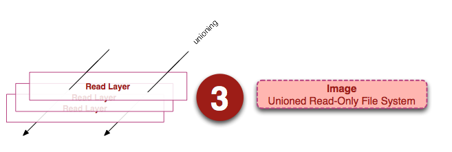

* [Docker](#docker)
  * [容器和虚拟机](#%E5%AE%B9%E5%99%A8%E5%92%8C%E8%99%9A%E6%8B%9F%E6%9C%BA)
  * [优势](#%E4%BC%98%E5%8A%BF)
  * [三个概念](#%E4%B8%89%E4%B8%AA%E6%A6%82%E5%BF%B5)
    * [镜像](#%E9%95%9C%E5%83%8F)
    * [容器](#%E5%AE%B9%E5%99%A8)
    * [仓库](#%E4%BB%93%E5%BA%93)
  * [dockerfile](#dockerfile)
    * [RUN，CMD和ENTRYPOINT指令差异对比](#runcmd%E5%92%8Centrypoint%E6%8C%87%E4%BB%A4%E5%B7%AE%E5%BC%82%E5%AF%B9%E6%AF%94)

# Docker

Docker 是一个开源的应用容器引擎，让开发者可以打包他们的应用以及依赖包到一个可移植的镜像中，然后发布到任何流行的 Linux或Windows 机器上，也可以实现虚拟化。容器是完全使用沙箱机制，相互之间不会有任何接口。

## 容器和虚拟机

我们用的传统虚拟机如 `VMware` ， `VisualBox` 之类的需要模拟整台机器包括硬件，每台虚拟机都需要有自己的操作系统，虚拟机一旦被开启，预分配给它的资源将全部被占用。每一台虚拟机包括应用，必要的二进制和库，以及一个完整的用户操作系统。

而容器技术是和我们的宿主机**共享硬件资源及操作系统**，可以实现资源的动态分配。容器包含应用和其所有的依赖包，但是与其他容器共享内核。容器在宿主机操作系统中，在用户空间以分离的进程运行。

**容器技术是实现操作系统虚拟化的一种途径**，可以让您在资源受到隔离的进程中运行应用程序及其依赖关系。通过使用容器，我们可以轻松打包应用程序的代码、配置和依赖关系，将其变成容易使用的构建块，从而实现环境一致性、运营效率、开发人员生产力和版本控制等诸多目标。容器可以帮助保证应用程序快速、可靠、一致地部署，其间不受部署环境的影响。容器还赋予我们对资源更多的精细化控制能力，让我们的基础设施效率更高。通过下面这幅图我们可以很直观的反映出这两者的区别所在。

## 优势

- `docker` 启动快速属于秒级别。虚拟机通常需要几分钟去启动
- `docker` 需要的资源更少， `docker` 在操作系统级别进行虚拟化， `docker` 容器和内核交互，几乎没有性能损耗，性能优于通过 `Hypervisor` 层与内核层的虚拟化
- `docker` 更轻量， `docker` 的架构可以共用一个内核与共享应用程序库，所占内存极小。同样的硬件环境， `Docker` 运行的镜像数远多于虚拟机数量，对系统的利用率非常高
- 与虚拟机相比， `docker` 隔离性更弱， `docker` 属于进程之间的隔离，虚拟机可实现系统级别隔离
- 安全性： `docker` 的安全性也更弱。 `Docker` 的租户 `root` 和宿主机 `root` 等同，一旦容器内的用户从普通用户权限提升为root权限，它就直接具备了宿主机的root权限，进而可进行无限制的操作。虚拟机租户 `root` 权限和宿主机的 `root` 虚拟机权限是分离的，并且虚拟机利用如 `Intel` 的 `VT-d` 和 `VT-x` 的 `ring-1` 硬件隔离技术，这种隔离技术可以防止虚拟机突破和彼此交互，而容器至今还没有任何形式的硬件隔离，这使得容器容易受到攻击
- 可管理性： `docker` 的集中化管理工具还不算成熟。各种虚拟化技术都有成熟的管理工具，例如 `VMware vCenter` 提供完备的虚拟机管理能力
- 高可用和可恢复性： `docker` 对业务的高可用支持是通过快速重新部署实现的。虚拟化具备负载均衡，高可用，容错，迁移和数据保护等经过生产实践检验的成熟保障机制， `VMware` 可承诺虚拟机 `99.999%` 高可用，保证业务连续性
- 快速创建、删除：虚拟化创建是分钟级别的， `Docker` 容器创建是秒级别的， `Docker` 的快速迭代性，决定了无论是开发、测试、部署都可以节约大量时间
- 交付、部署：虚拟机可以通过镜像实现环境交付的一致性，但镜像分发无法体系化。 `Docker` 在 `Dockerfile` 中记录了容器构建过程，可在集群中实现快速分发和快速部署

## 三个概念

### 镜像

`Docker` 镜像可以看作是一个特殊的文件系统，除了提供容器运行时所需的程序、库、资源、配置等文件外，还包含了一些为运行时准备的一些配置参数（如匿名卷、环境变量、用户等）。镜像不包含任何动态数据，其内容在构建之后也不会被改变。

镜像`（Image）`就是一堆只读层`（read-only layer）`的统一视角

从左边我们看到了多个只读层，它们重叠在一起。除了最下面一层，其它层都会有一个指针指向下一层。这些层是`Docker` 内部的实现细节，并且能够在主机的文件系统上访问到。统一文件系统 `(union file system)` 技术能够将不同的层整合成一个文件系统，为这些层提供了一个统一的视角，这样就隐藏了多层的存在，在用户的角度看来，只存在一个文件系统。我们可以在图片的右边看到这个视角的形式。

### 容器

镜像运行时的实体

容器的实质是进程，但与直接在宿主执行的进程不同，容器进程运行于属于自己的独立的命名空间。前面讲过镜像使用的是分层存储，容器也是如此。

容器 `(container)` 的定义和镜像 `(image)` 几乎一模一样，也是一堆层的统一视角，唯一区别在于容器的最上面那一层是可读可写的。

### 仓库

Docker 仓库是集中存放镜像文件的场所。镜像构建完成后，可以很容易的在当前宿主上运行，但是， 如果需要在其它服务器上使用这个镜像，我们就需要一个集中的存储、分发镜像的服务，Docker Registry (仓库注册服务器)就是这样的服务。有时候会把仓库 (Repository) 和仓库注册服务器 (Registry) 混为一谈，并不严格区分。Docker 仓库的概念跟 Git 类似，注册服务器可以理解为 GitHub 这样的托管服务。实际上，一个 Docker Registry 中可以包含多个仓库 (Repository) ，每个仓库可以包含多个标签 (Tag)，每个标签对应着一个镜像。所以说，镜像仓库是 Docker 用来集中存放镜像文件的地方类似于我们之前常用的代码仓库。

通常，一个仓库会包含同一个软件不同版本的镜像，而标签就常用于对应该软件的各个版本 。我们可以通过<仓库名>:<标签>的格式来指定具体是这个软件哪个版本的镜像。如果不给出标签，将以 latest 作为默认标签.。

## dockerfile

~~~cmd
[root@docker docker_demo]# cat Dockerfile 
# base image
FROM centos

# MAINTAINER
MAINTAINER json_hc@163.com

# put nginx-1.12.2.tar.gz into /usr/local/src and unpack nginx
ADD nginx-1.12.2.tar.gz /usr/local/src

# running required command
RUN yum install -y gcc gcc-c++ glibc make autoconf openssl openssl-devel 
RUN yum install -y libxslt-devel -y gd gd-devel GeoIP GeoIP-devel pcre pcre-devel
RUN useradd -M -s /sbin/nologin nginx

# change dir to /usr/local/src/nginx-1.12.2
WORKDIR /usr/local/src/nginx-1.12.2

# execute command to compile nginx
RUN ./configure --user=nginx --group=nginx --prefix=/usr/local/nginx --with-file-aio --with-http_ssl_module --with-http_realip_module --with-http_addition_module --with-http_xslt_module --with-http_image_filter_module --with-http_geoip_module --with-http_sub_module --with-http_dav_module --with-http_flv_module --with-http_mp4_module --with-http_gunzip_module --with-http_gzip_static_module --with-http_auth_request_module --with-http_random_index_module --with-http_secure_link_module --with-http_degradation_module --with-http_stub_status_module && make && make install

EXPOSE 80
~~~

### RUN，CMD和ENTRYPOINT指令差异对比

RUN命令执行命令并创建新的镜像层，通常用于**安装软件包**

CMD命令设置容器启动后默认执行的命令及其参数，但CMD设置的命令能够被`docker run`命令后面的命令行参数**替换**

ENTRYPOINT配置容器启动时的执行命令（不会被忽略，**一定会被执行**，即使运行 `docker run`时指定了其他命令）

