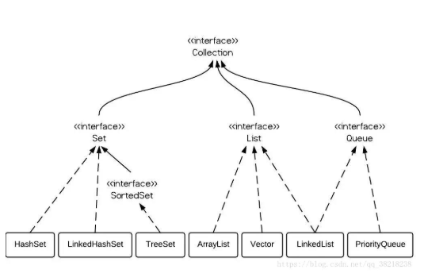

* [JavaSE](#javase)
    * [Static关键字](#static%E5%85%B3%E9%94%AE%E5%AD%97)
    * [final关键字](#final%E5%85%B3%E9%94%AE%E5%AD%97)
    * [基本类型以及所占字节](#%E5%9F%BA%E6%9C%AC%E7%B1%BB%E5%9E%8B%E4%BB%A5%E5%8F%8A%E6%89%80%E5%8D%A0%E5%AD%97%E8%8A%82)
        * [汉字](#%E6%B1%89%E5%AD%97)
    * [多态的实现机制](#%E5%A4%9A%E6%80%81%E7%9A%84%E5%AE%9E%E7%8E%B0%E6%9C%BA%E5%88%B6)
        * [静态绑定与动态绑定](#%E9%9D%99%E6%80%81%E7%BB%91%E5%AE%9A%E4%B8%8E%E5%8A%A8%E6%80%81%E7%BB%91%E5%AE%9A)
    * [java创建对象的方式](#java%E5%88%9B%E5%BB%BA%E5%AF%B9%E8%B1%A1%E7%9A%84%E6%96%B9%E5%BC%8F)
* [java IO](#java-io)
    * [同步，异步，阻塞，非阻塞](#%E5%90%8C%E6%AD%A5%E5%BC%82%E6%AD%A5%E9%98%BB%E5%A1%9E%E9%9D%9E%E9%98%BB%E5%A1%9E)
    * [Nio下的三种轮询方式](#nio%E4%B8%8B%E7%9A%84%E4%B8%89%E7%A7%8D%E8%BD%AE%E8%AF%A2%E6%96%B9%E5%BC%8F)
      * [忙查询](#%E5%BF%99%E6%9F%A5%E8%AF%A2)
      * [无差别轮询（poll/select）](#%E6%97%A0%E5%B7%AE%E5%88%AB%E8%BD%AE%E8%AF%A2pollselect)
      * [epoll](#epoll)
      * [三种方式区别](#%E4%B8%89%E7%A7%8D%E6%96%B9%E5%BC%8F%E5%8C%BA%E5%88%AB)
        * [select的几大缺点：](#select%E7%9A%84%E5%87%A0%E5%A4%A7%E7%BC%BA%E7%82%B9)
        * [poll实现](#poll%E5%AE%9E%E7%8E%B0)
        * [epoll（reference Link）](#epollreference-link)
      * [Epoll具体实现](#epoll%E5%85%B7%E4%BD%93%E5%AE%9E%E7%8E%B0)
      * [epoll和select的区别：](#epoll%E5%92%8Cselect%E7%9A%84%E5%8C%BA%E5%88%AB)
      * [nio：构建多路复用的，同步非阻塞的io操作](#nio%E6%9E%84%E5%BB%BA%E5%A4%9A%E8%B7%AF%E5%A4%8D%E7%94%A8%E7%9A%84%E5%90%8C%E6%AD%A5%E9%9D%9E%E9%98%BB%E5%A1%9E%E7%9A%84io%E6%93%8D%E4%BD%9C)
        * [nio核心组成](#nio%E6%A0%B8%E5%BF%83%E7%BB%84%E6%88%90)
        * [Channels](#channels)
      * [io多路复用：调用系统级别的Select/poll/epoll](#io%E5%A4%9A%E8%B7%AF%E5%A4%8D%E7%94%A8%E8%B0%83%E7%94%A8%E7%B3%BB%E7%BB%9F%E7%BA%A7%E5%88%AB%E7%9A%84selectpollepoll)
    * [AIO 异步io  基于事件和回调](#aio-%E5%BC%82%E6%AD%A5io--%E5%9F%BA%E4%BA%8E%E4%BA%8B%E4%BB%B6%E5%92%8C%E5%9B%9E%E8%B0%83)
        * [AIO如何进一步加工处理结果](#aio%E5%A6%82%E4%BD%95%E8%BF%9B%E4%B8%80%E6%AD%A5%E5%8A%A0%E5%B7%A5%E5%A4%84%E7%90%86%E7%BB%93%E6%9E%9C)
    * [Java对BIO、NIO、AIO的支持](#java%E5%AF%B9bionioaio%E7%9A%84%E6%94%AF%E6%8C%81)
    * [BIO、NIO、AIO的使用场景](#bionioaio%E7%9A%84%E4%BD%BF%E7%94%A8%E5%9C%BA%E6%99%AF)
* [Collection](#collection)
  * [快速失败和安全失败](#%E5%BF%AB%E9%80%9F%E5%A4%B1%E8%B4%A5%E5%92%8C%E5%AE%89%E5%85%A8%E5%A4%B1%E8%B4%A5)
        * [fail\-fast原理](#fail-fast%E5%8E%9F%E7%90%86)
        * [在foreach中修改元素会抛出ConcurrentModificationException异常，属于快速失败](#%E5%9C%A8foreach%E4%B8%AD%E4%BF%AE%E6%94%B9%E5%85%83%E7%B4%A0%E4%BC%9A%E6%8A%9B%E5%87%BAconcurrentmodificationexception%E5%BC%82%E5%B8%B8%E5%B1%9E%E4%BA%8E%E5%BF%AB%E9%80%9F%E5%A4%B1%E8%B4%A5)
  * [List](#list)
    * [ArrayList](#arraylist)
      * [构造方法](#%E6%9E%84%E9%80%A0%E6%96%B9%E6%B3%95)
      * [添加](#%E6%B7%BB%E5%8A%A0)
      * [删除](#%E5%88%A0%E9%99%A4)
  * [Map](#map)
    * [HashMap](#hashmap)
      * [put方法的逻辑](#put%E6%96%B9%E6%B3%95%E7%9A%84%E9%80%BB%E8%BE%91)
      * [如何有效减少碰撞](#%E5%A6%82%E4%BD%95%E6%9C%89%E6%95%88%E5%87%8F%E5%B0%91%E7%A2%B0%E6%92%9E)
      * [为什么hashMap的长度是2的指数倍](#%E4%B8%BA%E4%BB%80%E4%B9%88hashmap%E7%9A%84%E9%95%BF%E5%BA%A6%E6%98%AF2%E7%9A%84%E6%8C%87%E6%95%B0%E5%80%8D)
      * [HashMap扩容的问题](#hashmap%E6%89%A9%E5%AE%B9%E7%9A%84%E9%97%AE%E9%A2%98)
      * [解决hash碰撞](#%E8%A7%A3%E5%86%B3hash%E7%A2%B0%E6%92%9E)
    * [TreeMap](#treemap)
    * [ConcurrentHashMap](#concurrenthashmap)
      * [1\.7](#17)
        * [get方法：](#get%E6%96%B9%E6%B3%95)
        * [put方法：](#put%E6%96%B9%E6%B3%95)
        * [size方法如何保证一致性](#size%E6%96%B9%E6%B3%95%E5%A6%82%E4%BD%95%E4%BF%9D%E8%AF%81%E4%B8%80%E8%87%B4%E6%80%A7)
      * [1\.8](#18)
        * [put方法的逻辑](#put%E6%96%B9%E6%B3%95%E7%9A%84%E9%80%BB%E8%BE%91-1)
        * [比起1\.7的优化：](#%E6%AF%94%E8%B5%B717%E7%9A%84%E4%BC%98%E5%8C%96)
  * [hashMap/table concurrentHashMap三者区别](#hashmaptable-concurrenthashmap%E4%B8%89%E8%80%85%E5%8C%BA%E5%88%AB)
  * [遍历Map](#%E9%81%8D%E5%8E%86map)
* [JavaEE](#javaee)
    * [Tomcat的启动过程](#tomcat%E7%9A%84%E5%90%AF%E5%8A%A8%E8%BF%87%E7%A8%8B)
    * [jsp九大内置对象和其作用详解](#jsp%E4%B9%9D%E5%A4%A7%E5%86%85%E7%BD%AE%E5%AF%B9%E8%B1%A1%E5%92%8C%E5%85%B6%E4%BD%9C%E7%94%A8%E8%AF%A6%E8%A7%A3)
    * [servlet生命周期](#servlet%E7%94%9F%E5%91%BD%E5%91%A8%E6%9C%9F)
        * [1、加载和实例化](#1%E5%8A%A0%E8%BD%BD%E5%92%8C%E5%AE%9E%E4%BE%8B%E5%8C%96)
        * [2、初始化](#2%E5%88%9D%E5%A7%8B%E5%8C%96)
        * [3、服务](#3%E6%9C%8D%E5%8A%A1)
        * [4、销毁](#4%E9%94%80%E6%AF%81)

# JavaSE

### Static关键字

static变量放在jvm内存的方法区

1. **修饰方法**

static方法一般称作静态方法，由于静态方法不依赖于任何对象就可以进行访问；

在静态方法中不能访问类的非静态成员变量和非静态成员方法，因为非静态成员方法/变量都是必须依赖具体的对象才能够被调用；

可以直接通过类名.直接调用。

2. **修饰变量**

static变量也称作静态变量，静态变量和非静态变量的区别是：静态变量被所有的对象所共享，在内存中只有一个副本，它当且仅当在类初次加载时会被初始化。而非静态变量是对象所拥有的，在创建对象的时候被初始化，存在多个副本，各个对象拥有的副本互不影响。

static成员变量的初始化顺序按照定义的顺序进行初始化。

3. **静态代码块**

static关键字还有一个比较关键的作用就是 用来形成静态代码块以优化程序性能。static块可以置于类中的任何地方，类中可以有多个static块。在类初次被加载的时候，会按照static块的顺序来执行每个static块，并且只会执行一次。

为什么说static块可以用来优化程序性能，是因为它的特性:只会在类加载的时候执行一次。

> 静态代码块会优先于构造方法加载，不论是否是继承关系
>
> 顺序：
>
> 父类静态代码
>
> 子类静态代码
>
> 父类构造函数
>
> 子类构造函数


### final关键字

1. 修饰类

   类不能被继承

2. 修饰方法

   方法不能被重写

3. 修饰变量

   变量不能被修改，并且必须要**初始化**

### 基本类型以及所占字节

| byte    | 1            |
| ------- | ------------ |
| short   | 2            |
| int     | 4            |
| long    | 8            |
| char    | 2 可以存汉字 |
| float   | 4            |
| double  | 8            |
| boolean | 2            |

##### 汉字

```
public class Main {

	public static void main(String[] args) throws Exception {

		char a = '汉';
		String aa = "汉";
		System.out.println(a);
		System.out.println("utf-8 :" + aa.getBytes("UTF-8").length);
		System.out.println("GBK :" + aa.getBytes("GBK").length);
		System.out.println("unicode :" + aa.getBytes("unicode").length);

	}

}
```

汉 utf-8 :3 GBK :2 unicode :4

一个char可以存放汉字

### 多态的实现机制

多态的底层实现是动态绑定，即在运行时才把方法调用与方法实现关联起来。

##### 静态绑定与动态绑定

静态绑定在编译期就已经确定，这是因为静态方法、构造器方法、私有方法和父类方法可以唯一确定。这些方法的符号引用在类加载的解析阶段就会解析成直接引用。

动态绑定方法的方法调用与方法实现的关联（也就是分派）有两种，一种是在编译期确定，被称为静态分派，比如方法的重载；一种是在运行时确定，被称为动态分派，比如方法的覆盖。对象方法基本上都是虚方法。

### java创建对象的方式

1、new关键字

可以调用任意的构造函数

2、Class类的newInstance方法

newInstance方法调用无参的构造函数创建对象

3、Constructor类的newInstance方法

 java.lang.reflect.Constructor类里也有一个newInstance方法可以创建对象。我们可以通过这个newInstance方法调用有参数的和私有的构造函数。

4、clone

无论何时我们调用一个对象的clone方法，jvm就会创建一个新的对象，将前面对象的内容全部拷贝进去。用clone方法创建对象并不会调用任何构造函数。

要使用clone方法，我们需要先实现Cloneable接口并实现其定义的clone方法。

5、使用反序列化

当我们序列化和反序列化一个对象，jvm会给我们创建一个单独的对象。在反序列化时，jvm创建对象并不会调用任何构造函数。
为了反序列化一个对象，我们需要让我们的类实现Serializable接口

### 抽象类和接口

接口比抽象类更加抽象，因为抽象类中可以定义构造器，可以有抽象方法和具体方法，而接口中不能定义构造器而且其中的方法全部都是抽象方法。抽象类中的成员可以是private、默认、protected、public的，而接口中的成员全都是public的。抽象类中可以定义成员变量，而接口中定义的成员变量实际上都是常量。有抽象方法的类必须被声明为抽象类，而抽象类未必要有抽象方法。

### 编译型语言和解释型语言

**编译型语言**

只须编译一次就可以把源代码编译成机器语言，后面的执行无须重新编译，直接使用之前的编译结果就可以；因此其执行的效率比较高；

源代码—>机器语言

编译性语言代表：C、C++、Pascal/Object Pascal（Delphi）；

**解释型语言**

源代码不能直接翻译成机器语言，而是先翻译成中间代码，再由解释器对中间代码进行解释运行；

源代码—>中间代码—>机器语言

解释性语言代表：Python、JavaScript、Shell、Ruby、MATLAB等；

> java语言应是编译性-解释性语言，因为其同时具备编译性和解释性两种特性；
>
> java文件先编译成与平台无关的.class的字节码文件，然后.class的字节码文件既可以在Windows平台上的java虚拟机（JVM）上进行解释运行，也可以在Linux平台上的JVM上解释运行；而JVM的翻译过程时解释性的，JVM从.class的字节码文件中读出一条指令，翻译一条指令，然后执行一条指令，这个过程就称为java的解释执行；

### clone一个对象

有两种方式：

1). 实现Cloneable接口并重写Object类中的clone()方法;

2). 实现Serializable接口，通过对象的序列化和反序列化实现克隆，可以实现真正的深度克隆，代码如下。

# java IO

### 同步，异步，阻塞，非阻塞

同步	指的是用户进程触发IO操作并等待或者轮询的去查看IO操作是否就绪 

异步	异步是指用户进程触发IO操作以后便开始做自己的事情，而当IO操作已经完成的时候会得到IO完成的通知（异步的特点就是通知） 

**同步和异步的最大区别是，同步是用户方主动去查询IO操作是否完成，异步是IO操作主动通知用户方**

阻塞	所谓阻塞方式的意思是指, 当试图对该文件描述符进行读写时, 如果当时没有东西可读,或者暂时不可写, 程序就进入等待 状态, 直到有东西可读或者可写为止 

非阻塞	非阻塞状态下, 如果没有东西可读, 或者不可写, 读写函数马上返回, 而不会等待 

### Nio下的三种轮询方式

 NIO的最重要的地方是当一个连接创建后，不需要对应一个线程，这个连接会被注册到多路复用器上面，所以所有的连接只需要一个线程就可以搞定，当这个线程中的多路复用器进行轮询的时候，发现连接上有请求的话，才开启一个线程进行处理，也就是一个请求一个线程模式。 

#### 忙查询

不停的把所有流从头到尾问一遍，又从头开始。这样就可以处理多个流了，但这样的做法显然不好，因为如果所有的流都没有数据，那么只会白白浪费CPU。 

#### 无差别轮询（poll/select） 

为了避免CPU空转，可以引进了一个代理（一开始有一位叫做select的代理，后来又有一位叫做poll的代理，不过两者的本质是一样的）。这个代理比较厉害，可以同时观察许多流的I/O事件，在空闲的时候，会把当前线程阻塞掉，当有一个或多个流有I/O事件时，就从阻塞态中醒来，于是我们的程序就会轮询一遍所有的流。

于是，如果没有I/O事件产生，我们的程序就会阻塞在select处。但是依然有个问题，我们从select那里仅仅知道了，有I/O事件发生了，但却并不知道是那几个流（可能有一个，多个，甚至全部），我们只能无差别轮询所有流，找出能读出数据，或者写入数据的流，对他们进行操作。

但是使用select，我们有O(n)的无差别轮询复杂度，同时处理的流越多，没一次无差别轮询时间就越长。

#### epoll

epoll可以理解为event poll，不同于忙轮询和无差别轮询，**epoll之会把哪个流发生了怎样的I/O事件通知我们**。此时我们对这些流的操作都是有意义的。（复杂度降低到了O(1)） 

> epoll_create 创建一个epoll对象，一般epollfd = epoll_create()
>
> epoll_ctl （epoll_add/epoll_del的合体），往epoll对象中增加/删除某一个流的某一个事件
>
> epoll_wait(epollfd,…)等待直到注册的事件发生

#### 三种方式区别

##### select的几大缺点：

（1）每次调用select，都需要把fd集合从用户态拷贝到内核态，这个开销在fd很多时会很大

（2）同时每次调用select都需要在内核遍历传递进来的所有fd，这个开销在fd很多时也很大

（3）select支持的文件描述符数量太小了，默认是1024

##### poll实现

poll的实现和select非常相似，只是描述fd集合的方式不同，poll使用pollfd结构而不是select的fd_set结构.

##### epoll（reference Link）

　　epoll既然是对select和poll的改进，就应该能避免上述的三个缺点。那epoll都是怎么解决的呢？在此之前，我们先看一下epoll和select和poll的调用接口上的不同，select和poll都只提供了一个函数——select或者poll函数。而epoll提供了三个函数，epoll_create,epoll_ctl和epoll_wait，epoll_create是创建一个epoll句柄；epoll_ctl是注册要监听的事件类型；epoll_wait则是等待事件的产生。

　　对于第一个缺点，epoll的解决方案在epoll_ctl函数中。每次注册新的事件到epoll句柄中时（在epoll_ctl中指定EPOLL_CTL_ADD），会把所有的fd拷贝进内核，而不是在epoll_wait的时候重复拷贝。epoll保证了每个fd在整个过程中只会拷贝一次。

　　对于第二个缺点，epoll的解决方案不像select或poll一样每次都把current轮流加入fd对应的设备等待队列中，而只在epoll_ctl时把current挂一遍（这一遍必不可少）并为每个fd指定一个回调函数，当设备就绪，唤醒等待队列上的等待者时，就会调用这个回调函数，而这个回调函数会把就绪的fd加入一个就绪链表）。epoll_wait的工作实际上就是在这个就绪链表中查看有没有就绪的fd（利用schedule_timeout()实现睡一会，判断一会的效果，和select实现中的第7步是类似的）。

　　对于第三个缺点，epoll没有这个限制，它所支持的FD上限是最大可以打开文件的数目，这个数字一般远大于2048,举个例子,在1GB内存的机器上大约是10万左右，具体数目可以cat /proc/sys/fs/file-max察看,一般来说这个数目和系统内存关系很大。 

#### Epoll具体实现

在内核的最底层是中断，类似系统回调的机制。网卡设备对应一个中断号, 当网卡收到网络端的消息的时候会向CPU发起中断请求, 然后CPU处理该请求. 通过驱动程序进而操作系统得到通知, 系统然后通知epoll, epoll通知用户代码。它能显著提高程序在大量并发连接中只有少量活跃的情况下的系统CPU利用率，因为它会复用文件描述符集合来传递结果而不用迫使开发者每次等待事件之前都必须重新准备要被侦听的文件描述符集合，另一点原因就是获取事件的时候，它无须遍历整个被侦听的描述符集，只要遍历那些被内核IO事件异步唤醒而加入Ready队列的描述符集合就行了。

epoll在被内核初始化时（操作系统启动），同时会开辟出epoll自己的内核高速cache区，用于安置每一个我们想监控的socket，这些socket会以红黑树的形式保存在内核cache里，以支持快速的查找、插入、删除。这个内核高速cache区，就是建立连续的物理内存页，然后在之上建立slab层，简单的说，就是物理上分配好你想要的size的内存对象，每次使用时都是使用空闲的已分配好的对象。

#### epoll和select的区别：

进程通过将一个或多个fd传递给select或poll系统调用，阻塞在select;这样select/poll可以帮我们侦测许多fd是否就绪；但是select/poll是顺序扫描fd是否就绪，而且支持的fd数量有限。linux还提供了一个epoll系统调用，epoll是基于事件驱动方式，而不是顺序扫描,当有fd就绪时，立即回调函数rollback

#### nio：构建多路复用的，同步非阻塞的io操作

##### nio核心组成    

channels

Buffers

Selectors

##### Channels

1、fileChannel

note：

transferTo：把fileChannel中的数据拷贝到另外一个channel

transferFrom：把另外一个channel中的数据拷贝到fileChannel

避免两次用户态和内核态间的上下文切换，即零靠别，效率高

2、DatagramChannel

3、SocketChannel

4、ServerSocketChannel

#### io多路复用：调用系统级别的Select/poll/epoll

区别

1、支持一个进程能打开的最大连接数

select  上限比较小

poll  无限

epoll  上限大

2、文件剧增带来的效率问题

select  poll  线性下降

epoll  性能比较好

3、消息传递

select 和 poll 需要将消息传递到用户空间，需要内存的拷贝动作

epoll 通过内存和用户空间共享一块内存来实现，性能较高

### AIO 异步io  基于事件和回调

##### AIO如何进一步加工处理结果

1、基于回调，实现CompletionHandle接口，调用时触发回调函数

2、返回future，通过isDone查看是否准备好，通过get等待返回数据


### Java对BIO、NIO、AIO的支持

Java BIO ： 同步并阻塞，服务器实现模式为一个连接一个线程，即客户端有连接请求时服务器端就需要启动一个线程进行处理，如果这个连接不做任何事情会造成不必要的线程开销，当然可以通过线程池机制改善。

Java NIO ： 同步非阻塞，服务器实现模式为一个请求一个线程，即客户端发送的连接请求都会注册到多路复用器上，多路复用器轮询到连接有I/O请求时才启动一个线程进行处理。

Java AIO(NIO.2) ： 异步非阻塞，服务器实现模式为一个有效请求一个线程，客户端的I/O请求都是由OS先完成了再通知服务器应用去启动线程进行处理，

### BIO、NIO、AIO的使用场景

BIO方式适用于连接数目比较小且固定的架构，这种方式对服务器资源要求比较高，并发局限于应用中，JDK1.4以前的唯一选择，但程序直观简单易理解。

NIO方式适用于连接数目多且连接比较短（轻操作）的架构，比如聊天服务器，并发局限于应用中，编程比较复杂，JDK1.4开始支持。

AIO方式使用于连接数目多且连接比较长（重操作）的架构，比如相册服务器，充分调用OS参与并发操作，编程比较复杂，JDK7开始支持。

# Collection




## 快速失败和安全失败

> ```
> fast-fail事件产生的条件：当多个线程对Collection进行操作时，若其中某一个线程通过iterator去遍历集合时，该集合的内容被其他线程所改变；则会抛出ConcurrentModificationException异常。
> fast-fail解决办法：通过util.concurrent集合包下的相应类去处理，则不会产生fast-fail事件。
> ```

Iterator的安全失败是基于对底层集合做拷贝，因此，它不受源集合上修改的影响。**java.util包下面的所有的集合类都是快速失败的，而java.util.concurrent包下面的所有的类都是安全失败的**。**快速失败的迭代器会抛出ConcurrentModificationException异常**，而安全失败的迭代器永远不会抛出这样的异常。

##### fail-fast原理

fail-fast机制，是一种错误检测机制。它只能被用来检测错误，因为JDK并不保证fail-fast机制一定会发生**。**

ConcurrentModificationException是在操作Iterator时抛出的异常。

从中，我们可以发现在调用 next() 和 remove()时，都会执行 **checkForComodification()**。若 “**modCount 不等于 expectedModCount**”，则抛出ConcurrentModificationException异常，产生fail-fast事件。

要搞明白 fail-fast机制，我们就要需要理解什么时候“modCount 不等于 expectedModCount”！
从Itr类中，我们知道 expectedModCount 在创建Itr对象时，被赋值为 modCount。通过Itr，我们知道：expectedModCount不可能被修改为不等于 modCount。所以，需要考证的就是modCount何时会被修改。

我们发现：无论是add()、remove()，还是clear()，只要涉及到修改集合中的元素个数时，都会改变modCount的值。

##### 在foreach中修改元素会抛出ConcurrentModificationException异常，属于快速失败

## List

### ArrayList

#### 构造方法

​	ArrayList提供了三种方式的构造器，可以构造一个默认初始容量为10的空列表、构造一个指定初始容量的空列表以及构造一个包含指定collection的元素的列表，这些元素按照该collection的迭代器返回它们的顺序排列的。

#### 添加

先调用了ensureCapacity(size+1)方法，判断数组容量是否足够，如果不够就扩容。

~~~java
    public boolean add(E e) {
        ensureCapacityInternal(size + 1);  // Increments modCount!!
        elementData[size++] = e;
        return true;
    }
~~~

#### 删除

~~~java
    public E remove(int index) {
        rangeCheck(index);

        modCount++;
        E oldValue = elementData(index);

        int numMoved = size - index - 1;
        if (numMoved > 0)
            System.arraycopy(elementData, index+1, elementData, index,
                             numMoved);
        elementData[--size] = null; // clear to let GC do its work

        return oldValue;
    }
~~~


## Map

### HashMap

1、数组加链表的实现方式

2、**容量大小**是2的幂次方的原因

可以用按位与的操作来计算余数，比求模快

3、并发读写会有什么风险

在容量超过填充因子时，进行rehash，因为hashMap为了避免尾部遍历，在链表的插入时，使用的是头插法，多线程场景下，可能会产生死循环

#### put方法的逻辑

1、如果HashMap未被初始化过，则初始化

2、对Key求Hash值，然后再计算下标

3、如果没有碰撞，直接放入桶中

4、如果碰撞了，以链表的方式链接到后面

5、如果链表长度超过阈值，就把链表转成红黑树

6、如果链表长度低于6，就把红黑树转回链表

7、如果节点已经存在就替换旧值

8、如果桶满了（容量16*负载因子0.75），就需要resize（扩容2倍后重排）

#### 如何有效减少碰撞

1、扰动函数：促使元素位置分布均匀，减少碰撞机会

2、使用final对象，并采用合适的equals和hashCode方法

#### 为什么hashMap的长度是2的指数倍

HashMap存取时，都需要计算当前key应该对应Entry[]数组哪个元素，即计算数组下标；算法如下：

**static** **int** indexFor(**int** h, **int** length) {

​        **return** h & (length-1);

​    }

hash%length==hash&(length-1)的前提是length是2的n次方； 

让取模运算更高效

#### HashMap扩容的问题

1、多线程环境下，调整大小会存在条件竞争，容易造成死锁

2、rehashing是一个比较耗时的过程

hashTable

早期java类库提供的哈希表的实现

线程安全：涉及到修改HashTable的方法，使用synchronized修饰

串行化的方式运行，性能较差

**note**

使用Collections.sychronizedMap可以将hashmap转化为线程安全的map，不过效率也很低

#### 解决hash碰撞

​     1.开放地址法：容易产生堆积问题；不适于大规模的数据存储；散列函数的设计对冲突会有很大的影响；插入时可能会出现多次冲突的现象，删除的元素是多个冲突元素中的一个，需要对后面的元素作处理，实现较复杂；结点规模很大时会浪费很多空间；

​     2.链地址法：处理冲突简单，且无堆积现象，平均查找长度短；链表中的结点是动态申请的，适合构造表不能确定长度的情况；相对而言，拉链法的指针域可以忽略不计，因此较开放地址法更加节省空间。插入结点应该在链首，删除结点比较方便，只需调整指针而不需要对其他冲突元素作调整。

> 开放地址法 
>
> 这个方法的基本思想是：当发生地址冲突时，按照某种方法继续探测哈希表中的其他存储单元，直到找到空位置为止。这个过程可用下式描述： 
> H i ( key ) = ( H ( key )+ d i ) mod m ( i = 1,2,…… ， k ( k ≤ m – 1)) 
> 其中： H ( key ) 为关键字 key 的直接哈希地址， m 为哈希表的长度， di 为每次再探测时的地址增量。 
> 采用这种方法时，首先计算出元素的直接哈希地址 H ( key ) ，如果该存储单元已被其他元素占用，则继续查看地址为 H ( key ) + d 2 的存储单元，如此重复直至找到某个存储单元为空时，将关键字为 key 的数据元素存放到该单元。 

### TreeMap

TreeMap 是一个有序的key-value集合，它是通过红黑树实现的。

~~~java
public class TreeMap<K,V>
    extends AbstractMap<K,V>
    implements NavigableMap<K,V>, Cloneable, java.io.Serializable
~~~

实现了NavigableMap接口，可以有一些HashMap不具有的方法

> **tailMap(K fromKey)** 方法用于返回此映射，其键大于或等于fromKey的部分视图。返回的映射受此映射支持，因此改变返回映射反映在此映射中，反之亦然。
>
> **headMap(K fromKey)** 与之相反
>
> **firstKey** 返回第一个key

### ConcurrentHashMap

1、并发控制与分段锁思想

2、1.8中的CAS自旋锁

3、红黑树的启用条件

#### 1.7

ConCurrentHashMap其实就是一个segment数组，而每一个segment又类似一个hashMap，因此ConCurrentHashMap可以说是一个二级hash表，在一个总的hash表下面，有若干个子hash表。

优势就是，采用了分段锁的技术，segment之间相互不影响。

每个segment中都有一把锁，相当于降低了锁的粒度，让并发效率更高。

##### get方法：

1、为输入的key做hash运算，得到hash值

2、通过hash值，定位到segment对象

3、再次通过hash值，定位到segment当中数组的具体位置。

##### put方法：

1、为输入的key做hash运算，得到hash值

2、通过hash值，定位到segment对象

3、获得可重入锁

4、再次通过hash值，定位到segment当中数组的具体位置。

5、插入数据

6、释放锁

##### size方法如何保证一致性

类似于乐观锁转悲观锁

先假定size过程中不会有修改，当尝试一定次数，才转为悲观锁，锁住所有segment保证一致性。

#### 1.8

使用CAS+synchronized使锁更细化

数据结构  数组+链表+红黑树

ConcurrentHashMap的JDK8与JDK7版本的并发实现相比，最大的区别在于JDK8的锁粒度更细，理想情况下talbe数组元素的大小就是其支持并发的最大个数，在JDK7里面最大并发个数就是Segment的个数，默认值是16

##### put方法的逻辑

1、判断node[]数组是否初始化，没有则进行初始化操作

2、通过hash定位数组的索引坐标，是否有node节点，如果没有则使用cas进行添加，添加失败则进入下一次循环

3、检测到内部正在扩容，就帮助它一块扩容

4、如果头节点不为空 f!=null，则使用synchronized锁住f元素（链表/红黑树的头元素）

5、判断链表长度是否达到8，做树化

##### 比起1.7的优化：

比起segment ，锁拆得更细

1、首先使用无锁操作cas插入头节点，失败则循环重试

2、若头节点已存在，则尝试获取头节点的同步锁，再进行操作

## hashMap/table concurrentHashMap三者区别

1、hashMap线程不安全，数组+链表+红黑树

2、HashTable线程安全，锁住整个对象，数组+链表

3、concurrentHashMap线程安全，CAS+同步锁，数组+链表+红黑树

4、HashMap的key，value均可以为null，而其他的两个类不支持

## 遍历Map

```java
HashMap<String, String> map = new HashMap<>();
for (Map.Entry<String, String> entry : map.entrySet()) {
    entry.getKey();
    entry.getValue();
}
```
# JavaEE

### Tomcat的启动过程

1、初始化守护线程，其实就是初始化类加载器

先是 bootstrapClassLoader，CommonClassLoader，ServerClassLoader，SharedClassLoader

2、加载相关的配置文件，初始化几个主要的顶层接口实例，就是服务器的初始化

初始化一些重要的接口，server，engine，host，context，wrapper，servlet等

3、启动那些有生命周期的顶层实例，就是启动服务器

对ContainerBase容器初始化

### jsp九大内置对象和其作用详解

1、**request**

2、**response**

3、**session**

4、**application**

application对象可将信息保存在服务器中，直到服务器关闭。

类似于“全局变量”

5、**out**

6、**pageContext**

7、**config**

8、**page**

代表jsp本身

9、**exception**

### servlet生命周期

##### 1、加载和实例化

当servlet容器启动或客户端发送一个请求时，servlet容器会查找内存中是否存在该servlet实例，若存在，则直接读取该实例相应请求，如果不存在，就创建一个servlet实例

##### 2、初始化

实例化后，servlet容器将调用servlet的init方法进行初始化

##### 3、服务

初始化后，servlet处于能相应请求的就绪状态。当接收到客户端请求时，调用service方法处理客户端请求，HttpServlet的service方法会根据不同的请求，转调不同的doXXX的方法

##### 4、销毁

当servlet容器关闭时，servlet实例也会销毁，期间，servlet容器会调用servlet的destroy方法去判断servlet是否应当被释放。