[TOC]
* [jvm](#jvm)
* [概念图](#%E6%A6%82%E5%BF%B5%E5%9B%BE)
    * [Compile Once ， Run Anywhere 如何实现](#compile-once--run-anywhere-%E5%A6%82%E4%BD%95%E5%AE%9E%E7%8E%B0)
    * [jvm 大致解释 架构图](#jvm-%E5%A4%A7%E8%87%B4%E8%A7%A3%E9%87%8A-%E6%9E%B6%E6%9E%84%E5%9B%BE)
    * [类从编译到执行的过程](#%E7%B1%BB%E4%BB%8E%E7%BC%96%E8%AF%91%E5%88%B0%E6%89%A7%E8%A1%8C%E7%9A%84%E8%BF%87%E7%A8%8B)
    * [谈谈ClassLoader](#%E8%B0%88%E8%B0%88classloader)
    * [ClassLoader种类](#classloader%E7%A7%8D%E7%B1%BB)
    * [双亲委派机制](#%E5%8F%8C%E4%BA%B2%E5%A7%94%E6%B4%BE%E6%9C%BA%E5%88%B6)
    * [双亲委派机制优势](#%E5%8F%8C%E4%BA%B2%E5%A7%94%E6%B4%BE%E6%9C%BA%E5%88%B6%E4%BC%98%E5%8A%BF)
    * [类的加载方式](#%E7%B1%BB%E7%9A%84%E5%8A%A0%E8%BD%BD%E6%96%B9%E5%BC%8F)
    * [LoadClass和forName的区别](#loadclass%E5%92%8Cforname%E7%9A%84%E5%8C%BA%E5%88%AB)
      * [类的装载过载](#%E7%B1%BB%E7%9A%84%E8%A3%85%E8%BD%BD%E8%BF%87%E8%BD%BD)
        * [1、加载](#1%E5%8A%A0%E8%BD%BD)
        * [2、链接：](#2%E9%93%BE%E6%8E%A5)
        * [3、初始化](#3%E5%88%9D%E5%A7%8B%E5%8C%96)
      * [区别](#%E5%8C%BA%E5%88%AB)
        * [作用](#%E4%BD%9C%E7%94%A8)
    * [java内存模型  jdk8](#java%E5%86%85%E5%AD%98%E6%A8%A1%E5%9E%8B--jdk8)
      * [线程的角度](#%E7%BA%BF%E7%A8%8B%E7%9A%84%E8%A7%92%E5%BA%A6)
        * [程序计数器](#%E7%A8%8B%E5%BA%8F%E8%AE%A1%E6%95%B0%E5%99%A8)
        * [栈](#%E6%A0%88)
        * [本地方法栈](#%E6%9C%AC%E5%9C%B0%E6%96%B9%E6%B3%95%E6%A0%88)
        * [元空间](#%E5%85%83%E7%A9%BA%E9%97%B4)
        * [java堆（heap）](#java%E5%A0%86heap)
    * [jvm三大性能调优参数 \-Xms \-Xmx \-Xss 的含义](#jvm%E4%B8%89%E5%A4%A7%E6%80%A7%E8%83%BD%E8%B0%83%E4%BC%98%E5%8F%82%E6%95%B0--xms--xmx--xss-%E7%9A%84%E5%90%AB%E4%B9%89)
    * [java内存模型的堆和栈的区别，内存分配策略](#java%E5%86%85%E5%AD%98%E6%A8%A1%E5%9E%8B%E7%9A%84%E5%A0%86%E5%92%8C%E6%A0%88%E7%9A%84%E5%8C%BA%E5%88%AB%E5%86%85%E5%AD%98%E5%88%86%E9%85%8D%E7%AD%96%E7%95%A5)
      * [联系](#%E8%81%94%E7%B3%BB)
      * [区别](#%E5%8C%BA%E5%88%AB-1)
    * [字符串的intern方法jdk6和jdk6以后](#%E5%AD%97%E7%AC%A6%E4%B8%B2%E7%9A%84intern%E6%96%B9%E6%B3%95jdk6%E5%92%8Cjdk6%E4%BB%A5%E5%90%8E)
    * [直接内存](#%E7%9B%B4%E6%8E%A5%E5%86%85%E5%AD%98)
* [jvm监控](#jvm%E7%9B%91%E6%8E%A7)
  * [一、jps（JVM Process Status Tools）](#%E4%B8%80jpsjvm-process-status-tools)
  * [二、jstat（JVM Statistics Monitoring Tools）](#%E4%BA%8Cjstatjvm-statistics-monitoring-tools)
  * [三、jinfo（JVM configuration Info for Java）](#%E4%B8%89jinfojvm-configuration-info-for-java)
  * [四、jmap（JVM Memory Map for Java）](#%E5%9B%9Bjmapjvm-memory-map-for-java)
  * [五、jhat（JVM Heap Analysis Tool）](#%E4%BA%94jhatjvm-heap-analysis-tool)
    * [六、jstack（JVM Stack Trace for java）](#%E5%85%ADjstackjvm-stack-trace-for-java)
  * [六、jmc](#%E5%85%ADjmc)
    * [七、btrace](#%E4%B8%83btrace)
      * [总结](#%E6%80%BB%E7%BB%93)
* [GC](#gc)
    * [对象被判定为垃圾的标志](#%E5%AF%B9%E8%B1%A1%E8%A2%AB%E5%88%A4%E5%AE%9A%E4%B8%BA%E5%9E%83%E5%9C%BE%E7%9A%84%E6%A0%87%E5%BF%97)
    * [判定对象是否为垃圾的算法](#%E5%88%A4%E5%AE%9A%E5%AF%B9%E8%B1%A1%E6%98%AF%E5%90%A6%E4%B8%BA%E5%9E%83%E5%9C%BE%E7%9A%84%E7%AE%97%E6%B3%95)
      * [引用计数算法](#%E5%BC%95%E7%94%A8%E8%AE%A1%E6%95%B0%E7%AE%97%E6%B3%95)
      * [可达性分析算法（主流）](#%E5%8F%AF%E8%BE%BE%E6%80%A7%E5%88%86%E6%9E%90%E7%AE%97%E6%B3%95%E4%B8%BB%E6%B5%81)
    * [谈谈你了解的垃圾回收算法](#%E8%B0%88%E8%B0%88%E4%BD%A0%E4%BA%86%E8%A7%A3%E7%9A%84%E5%9E%83%E5%9C%BE%E5%9B%9E%E6%94%B6%E7%AE%97%E6%B3%95)
      * [1、标记清除算法](#1%E6%A0%87%E8%AE%B0%E6%B8%85%E9%99%A4%E7%AE%97%E6%B3%95)
      * [2、复制算法](#2%E5%A4%8D%E5%88%B6%E7%AE%97%E6%B3%95)
      * [3、标记整理算法](#3%E6%A0%87%E8%AE%B0%E6%95%B4%E7%90%86%E7%AE%97%E6%B3%95)
      * [4、分代收集算法](#4%E5%88%86%E4%BB%A3%E6%94%B6%E9%9B%86%E7%AE%97%E6%B3%95)
    * [常见的垃圾收集器](#%E5%B8%B8%E8%A7%81%E7%9A%84%E5%9E%83%E5%9C%BE%E6%94%B6%E9%9B%86%E5%99%A8)
      * [jvm运行模式](#jvm%E8%BF%90%E8%A1%8C%E6%A8%A1%E5%BC%8F)
      * [垃圾收集器之间的关系](#%E5%9E%83%E5%9C%BE%E6%94%B6%E9%9B%86%E5%99%A8%E4%B9%8B%E9%97%B4%E7%9A%84%E5%85%B3%E7%B3%BB)
        * [年轻代常见的垃圾收集器](#%E5%B9%B4%E8%BD%BB%E4%BB%A3%E5%B8%B8%E8%A7%81%E7%9A%84%E5%9E%83%E5%9C%BE%E6%94%B6%E9%9B%86%E5%99%A8)
        * [老年代常见收集器](#%E8%80%81%E5%B9%B4%E4%BB%A3%E5%B8%B8%E8%A7%81%E6%94%B6%E9%9B%86%E5%99%A8)
        * [<strong>Garbage Firsl收集器 复制\+标记整理算法</strong>](#garbage-firsl%E6%94%B6%E9%9B%86%E5%99%A8-%E5%A4%8D%E5%88%B6%E6%A0%87%E8%AE%B0%E6%95%B4%E7%90%86%E7%AE%97%E6%B3%95)
        * [jdk11 ZGC 和 Epsilon GC （新的gc）](#jdk11-zgc-%E5%92%8C-epsilon-gc-%E6%96%B0%E7%9A%84gc)
    * [GC 触发时间](#gc-%E8%A7%A6%E5%8F%91%E6%97%B6%E9%97%B4)
    * [GC的对象](#gc%E7%9A%84%E5%AF%B9%E8%B1%A1)
    * [GC做了什么](#gc%E5%81%9A%E4%BA%86%E4%BB%80%E4%B9%88)
    * [谈谈CMS收集器](#%E8%B0%88%E8%B0%88cms%E6%94%B6%E9%9B%86%E5%99%A8)
    * [G1收集器](#g1%E6%94%B6%E9%9B%86%E5%99%A8)
* [面试题](#%E9%9D%A2%E8%AF%95%E9%A2%98)
    * [object的finalize方法的作用是否与c\+\+的析构函数作用相同](#object%E7%9A%84finalize%E6%96%B9%E6%B3%95%E7%9A%84%E4%BD%9C%E7%94%A8%E6%98%AF%E5%90%A6%E4%B8%8Ec%E7%9A%84%E6%9E%90%E6%9E%84%E5%87%BD%E6%95%B0%E4%BD%9C%E7%94%A8%E7%9B%B8%E5%90%8C)
    * [java中的强引用，软引用，弱引用和虚引用有什么用](#java%E4%B8%AD%E7%9A%84%E5%BC%BA%E5%BC%95%E7%94%A8%E8%BD%AF%E5%BC%95%E7%94%A8%E5%BC%B1%E5%BC%95%E7%94%A8%E5%92%8C%E8%99%9A%E5%BC%95%E7%94%A8%E6%9C%89%E4%BB%80%E4%B9%88%E7%94%A8)
      * [1、强引用](#1%E5%BC%BA%E5%BC%95%E7%94%A8)
      * [2、软引用](#2%E8%BD%AF%E5%BC%95%E7%94%A8)
      * [3、弱引用](#3%E5%BC%B1%E5%BC%95%E7%94%A8)
      * [4、虚引用](#4%E8%99%9A%E5%BC%95%E7%94%A8)


# jvm

# 概念图

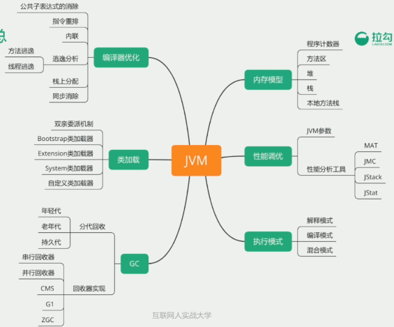

metaSpace和永久代都是方法区的实现

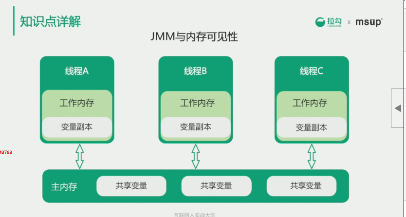

jmm的主要目标是定义程序中变量的访问规则

由于指令重排序的存在，这个写读的顺序可能会被打乱，所有jmm需要提供可见性，原子性，有序性

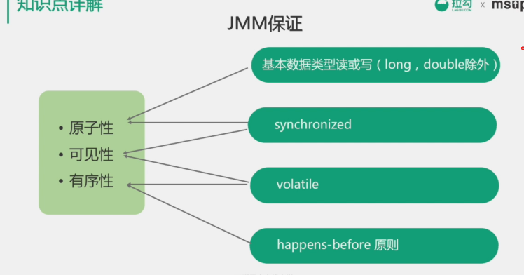

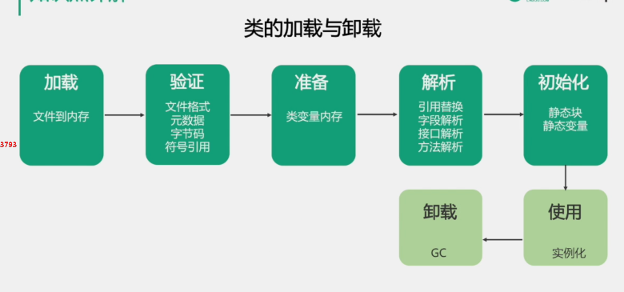


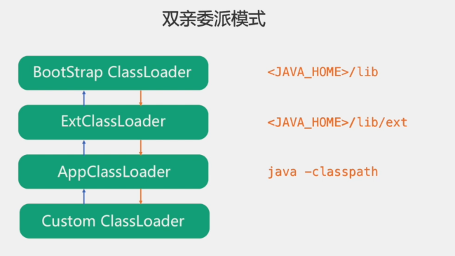

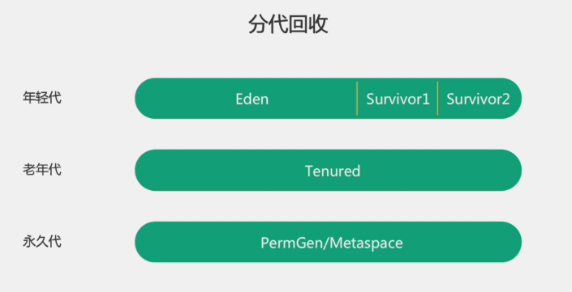

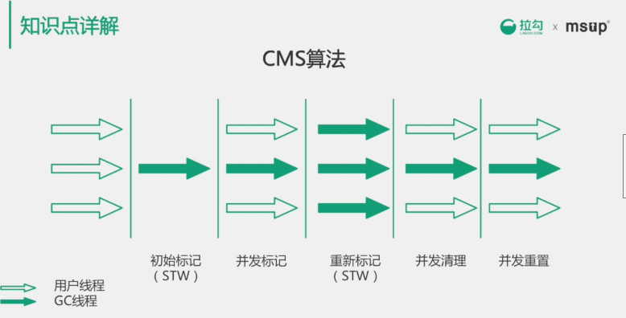

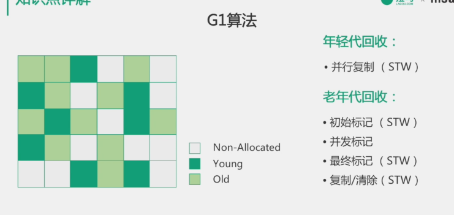

G1算法，减少高并发的同时，减少停顿

取消了年轻代和老年代的物理划分，采集**逻辑分带**，但依然是分带收集

把内存分为若干个区域，称为region

年轻代采用复制算法，老年代标记清除算法

每次只清除一部分的增量式清理，保证短停顿，所以叫做garbage first

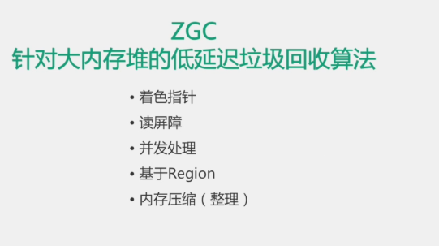

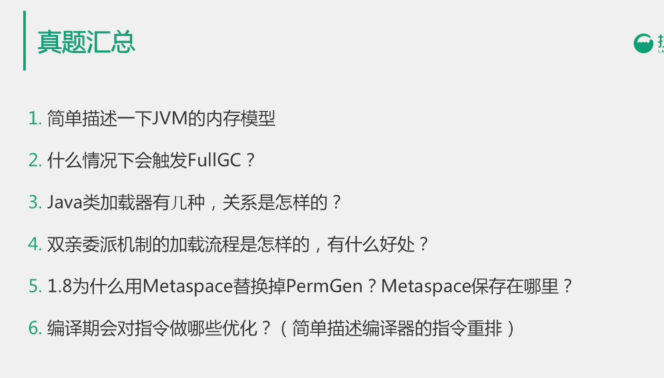

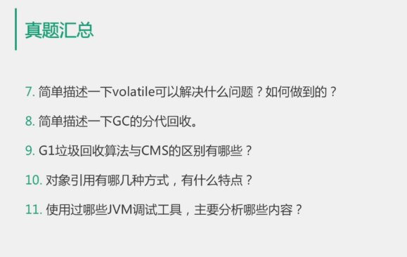


7、

保证可见性、不保证原子性
禁止指令重排序

> **观察加入volatile关键字和没有加入volatile关键字时所生成的汇编代码发现，加入volatile关键字时，会多出一个lock前缀指令**。lock前缀指令其实就相当于一个内存屏障。内存屏障是**一组处理指令，用来实现对内存操作的顺序限制**。volatile的底层就是通过内存屏障来实现的。


### Compile Once ， Run Anywhere 如何实现

java源码首先被编译成字节码（class），再由不同平台的jvm进行解析，java语言在不同的平台运行时不需要进行重新编译，java虚拟机在执行字节码的时候，把字节码抓换成具体的机器指令。

### jvm 大致解释 架构图

jvm主要加载.class文件，主有由四个部分组成

classloader，runtime data area，execution engine 和 native interface组成

**class loader** 加载class文件到内存

**execution engine**对命令进行解析

**native interface** 融合不同开发语言的原生库为java所用

**runtime data area** （java内存模型）里包括stack，heap，method area


### 类从编译到执行的过程

1、编译器将.java源文件编译为.class字节码文件

2、classLoader将字节码转换为JVM中的Class对象

3、jvm利用Class对象实例化对象

### 谈谈ClassLoader

主要工作是在Class装载的加载阶段，主要作用是从系统外部获得Class二进制数据流，它是java的核心组件，所有的Class都是由ClassLoader进行加载的，ClassLoader负责通过Class文件里的二进制数据流装载进系统，然后交给java虚拟机进行连接，初始化。

### ClassLoader种类

1、bootstrapClassLoader ： 由c++编写  jre\lib\rt.jar

2、ExtClassLoader：java编写 加载javax.*    jre\lib\ext\*.jar

3、AppClassLoader：加载程序所在目录

4、自定义ClassLoader：java编写，定制化加载

### 双亲委派机制

自下而上，每个ClassLoader有个parent成员变量

1、自底向上检查是否加载了类是否被加载

2、自顶向下尝试加载类

### 双亲委派机制优势

避免多份同样字节码的加载

### 类的加载方式

1、隐式加载：new

2、显示加载：loadClass，forName

### LoadClass和forName的区别

#### 类的装载过载

##### 1、加载

通过classloader加载class文件字节码，生成class对象

##### 2、链接：

2.1 校验:检查安全性

2.2 准备：为类变量（static）分配存储空间，并设置类变量初始值

2.3 解析:

##### 3、初始化

类变量赋值和静态代码快

#### 区别

class.forName得到的class是已经完成初始化的

ClassLoader.loaderClass得到的class还没有链接

##### 作用

jdbc  一般用forname来完成静态代码，初始化

spring ioc  多使用classloader完成lazy load 加快效率


### java内存模型  jdk8

#### 线程的角度

线程私有：程序计数器  虚拟机栈  方法栈

线程共享：元空间metaSpace  堆

##### 程序计数器

记录所执行的字节码的行号，和线程一对一

对java方法计数，如果是对native方法计数，为undefined

不会内存泄漏

##### 栈

主要包含单个线程每个方法执行的栈帧。

栈帧用于存储局部变量表，操作数，动态链接，返回地址。

局部变量表：方法执行的所有变量

操作数栈：类似与原生CPU寄存器  入栈，出栈等

**递归为什么会引发stackoverflow** 

方法执行时会创建对应的栈帧，并压入虚拟机的栈中，每次递归会生成一个栈帧，如果递归过深会超出虚拟机栈深度。解决思路，限制递归次数。

**栈过多引发outofmenory异常**

无法申请足够多的异常     比如死循环一直创新的线程

##### 本地方法栈

与虚拟机栈类型，主要用于native方法

##### 元空间

都是用来存储class的相关信息，比如method和filed，name。

jdk1.8 元空间替代了**永久代**

元空间使用本地内存，永久代使用是jvm的内存

字符串常量池存在永久带，容易溢出，元空间没有字符串常量池，字符串常量池移动到了堆中。

metaSpace便于GC

##### java堆（heap）

对象实例的分配区域

GC管理的主要区域  可以分为新生代和老年代

### jvm三大性能调优参数 -Xms -Xmx -Xss 的含义

比如java -Xms128m -Xmx128m -Xss256k -jar xxx.jar

-Xss 规定了栈的大小

-Xms 堆的初始值

-Xmx 堆能达到的最大值

一般-Xms -Xmx 设置为一样的，因为扩容会影响程序稳定性

### java内存模型的堆和栈的区别，内存分配策略

静态存储 ：编译时确定每个数据目标在运行时的存储空间需求 

要求代码中不允许有可变数据存在，或是递归存在

栈式存储：数据区需求在编译时未知，运行时确定

堆式存储：数据区在编译时和运行时都无法确定

#### 联系

引用对象、数组时，栈里面定义变量保存堆中目标的首地址

#### 区别

联系：引用对象时，栈中定义变量保存堆中目标的首地址

区别：

1、管理方式，栈自动释放，堆需要GC

2、空间大小，栈比较小

3、碎片相关，栈产生的碎片远小于堆

4、分配方式，栈支持静态和动态分配，堆仅仅支持动态分配

5、效率，栈的效率更高

> 内存的静态分配和动态分配的区别主要是两个：
>
> ​      一是时间不同。静态分配发生在程序编译和连接的时候。动态分配则发生在程序调入和执行的时候。
>
> ​      二是空间不同。堆都是动态分配的，没有静态分配的堆。

### 字符串的intern方法jdk6和jdk6以后

jdk6 intern 将字符串放入常量池

jdk6 以后，不但将字符串放入常量池，还在堆中创建该字符串，

​		如果已经堆中已经有了，就把字符串的引用放入常量池中

### 直接内存

　　直接内存(Direct Memory)并不是虚拟机运行时数据区的一部分，也不是Java虚拟机规范中定义的内存区域，但是这部分内存也被频繁地使用，而且也可能导致OutOfMemoryError异常出现。

　　JDK1.4加的NIO中，ByteBuffer有个方法是allocateDirect(int capacity) ，这是一种基于通道(Channel)与缓冲区(Buffer)的I/O方式，**它可以使用Native函数库直接分配堆外内存**，然后通过一个存储在 Java堆里面的**DirectByteBuffer**对象作为这块内存的引用进行操作。这样能在一些场景中显著提高性能，因为避免了在Java堆和 Native堆中来回复制数据。

　　显然，本机直接内存的分配不会受到Java堆大小的限制，但是，既然是内存，则肯定还是会受到本机总内存(包括RAM及SWAP区或者分页文件)的大小及处理器寻址空间的限制。服务器管理员配置虚拟机参数时，一般会根据实际内存设置-Xmx等参数信息，但经常会忽略掉直接内存，使得各个内存区域的总和大于物理内存限制(包括物理上的和操作系统级的限制)，从而导致动态扩展时出现OutOfMemoryError异常。


# jvm监控


## 一、jps（JVM Process Status Tools）
jps是参照Unix系统的取名规则命名的，而他的功能和ps的功能类似，可以列举正在运行的饿虚拟机进程并显示虚拟机执行的主类以及这
些进程的唯一ID（LVMID，对应本机来说和PID相同），他的用法如下：


jps [option] [hostid]


其中hostid默认为本机，而option选项包含以下选项  


Option
Function


-q
只输出LVMID


-m
输出JVM启动时传给主类的方法


-l
输出主类的全名，如果是Jar则输出jar的路径


-v
输出JVM的启动参数


## 二、jstat（JVM Statistics Monitoring Tools）
jstat主要用于监控虚拟机的各种运行状态信息，如类的装载、内存、垃圾回收、JIT编译器等，在没有GUI的服务器上，这款工具是首选
的一款监控工具。其用法如下：


jstat [option vmid [interval [s|ms] [vount] ] ]


参数interval和count分别表示查询间隔和查询次数，如每1毫秒查询一次进程20445的垃圾回收情况，监控20次，命令如下所示：


jstat –gc 20445 1 20


选项option代表用户需要查询的虚拟机的信息，主要分为3类：类装载、垃圾回收和运行期的编译情况，具体如下表所示：


Option
Function


-class
监视类的装载、卸载数量以及类的装载总空间和耗费时间等


-gc
监视Java堆，包含eden、2个survivor区、old区和永久带区域的容量、已用空间、GC时间合计等信息


-gccapcity
监视内容与-gc相同，但输出主要关注Java区域用到的最大和最小空间


-gcutil
监视内容与-gc相同，但输出主要关注已使用空间占总空间的百分比


-gccause
与-gcutil输出信息相同，额外输出导致上次GC产生的原因


-gcnew
监控新生代的GC情况


-gcnewcapacity
与-gcnew监控信息相同，输出主要关注使用到的最大和最小空间


-gcold
监控老生代的GC情况


-gcoldcapacity
与-gcold监控信息相同，输出主要关注使用到的最大和最小空间


-gcpermcapacity
输出永久带用到的最大和最小空间


-compiler
输出JIT编译器编译过的方法、耗时信息


-printcompilation
输出已经被JIT编译的方法


## 三、jinfo（JVM configuration Info for Java）

Jinfo的作用是实时查看虚拟机的各项参数信息jps –v可以查看虚拟机在启动时被显式指定的参数信息，但是如果你想知道默认的一些
参数信息呢？除了去查询对应的资料以外，jinfo就显得很重要了。jinfo的用法如下：


Jinfo [option] pid

如 jinfo –sysprops {pid}

## 四、jmap（JVM Memory Map for Java）

jmap用于生成堆快照（heapdump）。当然我们有很多方法可以取到对应的dump信息，如我们通过JVM启动时加入启动参数 
–XX:HeapDumpOnOutOfMemoryError参数，可以让JVM在出现内存溢出错误的时候自动生成dump文件，亦可以通过
-XX:HeapDumpOnCtrlBreak参数，在运行时使用ctrl+break按键生成dump文件，当然我们也可以使用kill -3 pid
的方式去恐吓JVM生成dump文件。jmap的作用不仅仅是为了获取dump文件，还可以用于查询finalize执行队列、Java堆和永久
带的详细信息，如空间使用率、垃圾回收器等。其运行格式如下：


jmap [option] vmip


Option的信息如下表所示


Option
Function


-dump
生成对应的dump信息，用法为-dump:[live,]format=b,file={fileName}


-finalizerinfo
显示在F-Queue中等待的Finalizer方法的对象（只在linux下生效）


-heap
显示堆的详细信息、垃圾回收器信息、参数配置、分代详情等


-histo
显示堆栈中的对象的统计信息，包含类、实例数量和合计容量


-permstat
以ClassLoder为统计口径显示永久带的内存状态


-F
当虚拟机对-dump无响应时可使用这个选项强制生成dump快照


示例：jmap -dump:format=b,file=heap.dump 20445

## 五、jhat（JVM Heap Analysis Tool）

jhat是用来分析dump文件的一个微型的HTTP/HTML服务器，它能将生成的dump文件生成在线的HTML文件，让我们可以通过浏览器
进行查阅，然而实际中我们很少使用这个工具，因为一般服务器上设置的堆、栈内存都比较大，生成的dump也比较大，直接用jhat容
易造成内存溢出，而是我们大部分会将对应的文件拷贝下来，通过其他可视化的工具进行分析。启用法如下：


jhat {dump_file}


执行命令后，我们看到系统开始读取这段dump信息，当系统提示Server is ready的时候，用户可以通过在浏览器键入
http://ip:7000进行查询。

### 六、jstack（JVM Stack Trace for java）

jstack用于JVM当前时刻的线程快照，又称threaddump文件，它是JVM当前每一条线程正在执行的堆栈信息的集合。生成线程快照
的主要目的是为了定位线程出现长时间停顿的原因，如线程死锁、死循环、请求外部时长过长导致线程停顿的原因。通过jstack我们就
可以知道哪些进程在后台做些什么？在等待什么资源等！其运行格式如下：


jstack [option] vmid


相关的option和function如下表所示


Option
Function


-F
当正常输出的请求不响应时强制输出线程堆栈


-l
除堆栈信息外，显示关于锁的附加信息

-m
显示native方法的堆栈信息

示例：jstack -l 20445

## 六、jmc

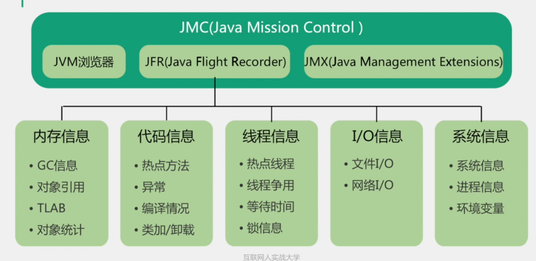

JMX主要是用于监控和管理

JFR主要用来对jvm进行周期性信息采集

### 七、btrace

通过字节码修改技术，可以在不重启jvm的情况下，检测系统运行情况

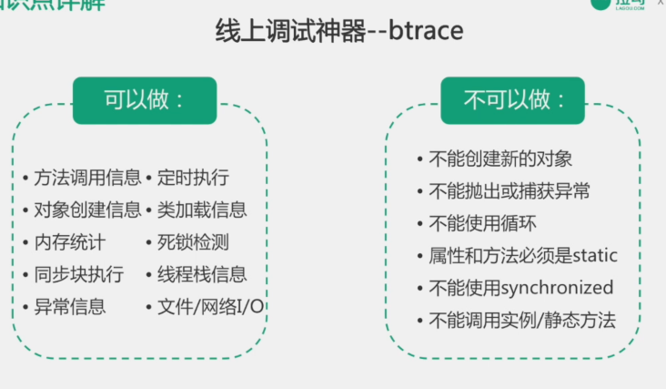

#### 总结

实际应用场景，排查线上问题时，

需要查看GC日志，jstat -gc，发现没有打印gc的详细日志，这时可以通过jinfo来开启jvm参数，printgcDetail来动态生效，

当分析内存泄漏风险时，通过jmap获取堆对象统计信息，来发现持续增长的可疑对象

当出现某一时刻所有服务都出现耗时较高的情况，可以通过jstat来观察gc回收状况，看看是不是gc停顿耗时过高了

当遇到jvm中某一个服务卡死，或是停止处理时，可以通过jstack来查看线程栈，看看是否有多个线程处于block状态产生的死锁

当服务上线后，性能达不到预期，可以使用jmc来分析jvm运行信息，看看哪些热点方法可以优化，哪些线程竞争可以避免

cpu负载较高，想要定位哪个线程导致的，通过top，结合jstack来分析

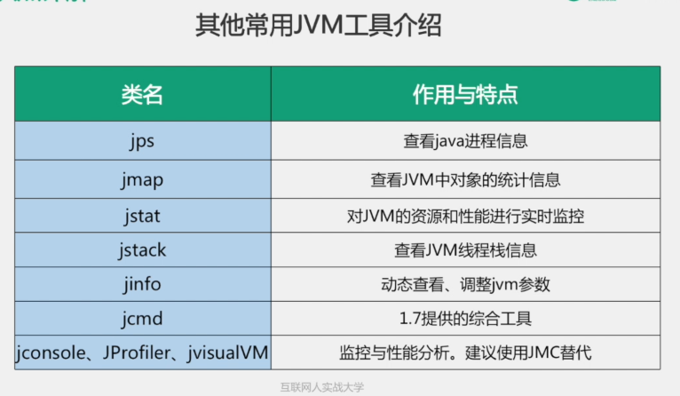


# GC

### 对象被判定为垃圾的标志

没有被其他对象引用

### 判定对象是否为垃圾的算法

#### 引用计数算法

通过判断对象的引用数量来决定是否可以被回收

任何引用数量为0的对象可以被当作垃圾

优势：执行效率高，程序执行受影响小

缺点：无法检测出循环引用的情况，导致内存泄漏

#### 可达性分析算法（主流）

通过判断对象的引用链是否可达来确定是否可以回收（图论）

**gc root**根集合

虚拟机中栈中引用的对象

方法区中常量

### 谈谈你了解的垃圾回收算法

#### 1、标记清除算法

标记：从根集合开始扫描，对存活的对象进行标记

清除：对堆内存从头到尾进行线性遍历，回收不可达的对象

缺点：内存碎片化

#### 2、复制算法

 内存划分为对象面和空闲面

对象主要是在对象面创建

当对象面的内存用完了，把存活的对象从对象面复制到空闲面

把对象面所有对象内存清除

适用于：对象存活率低的场景，比如年轻代

#### 3、标记整理算法

标记：从根集合开始扫描，对存活的对象进行标记

清除：移动所有存活的对象，且按照内存地址次序依次排列，然后将末端内存地址以后的内存全部回收。

备注：清除整理算法是标记清除算法上改进，解决了碎片化的问题，但效率不如标记清除算法，适用于老年代。

#### 4、分代收集算法

 包含了多种垃圾回收算法

按照对象生命周期的不同划分区域以采用不同的垃圾回收算法

目的：为了提高jvm的回收效率

jdk8以前 jdk堆内存可以分为年轻代，老年代和永久代

jdk8以后，永久代被去掉了

**分代收集算法的GC分为两种**

minor GC ：新生代的eden区填满后触发 采用复制算法

full GC：老年代 触发条件

1. 老年代空间不足
2. 永久代空间不足 jdk7
3. cms gc出现promotion failed，concurrent mode failure
4. system.gc()    提醒虚拟机希望执行full gc 

**年轻代“尽可能快速地收集那些生命周期短的对象**

eden区   8/10

两个survivor区   2/10

**对象如何晋升到老年代**

进过一定minor次数依然存活的对象   默认15次

survivor区中放不下的对象

新生成的大对象

**常用的调优参数**

-XX:SurvivorRatio  eden和survivor的比例 默认8：1

等

**老年代：存放生命周期较长的对象**

标记清理算法

标记整理算法

**名词 stop-the-world**

1、jvm由于要执行gc而停止了应用程序的执行

2、任何一种gc算法都会发生

3、多数gc优化通过减少stop-the-world发生的实际时间来提高程序性能

**名词 safePoint**

1、分析过程中对象引用关系不会发生变化的点

2、产生safePoint的地方:方法调用，循环，异常

### 常见的垃圾收集器

#### jvm运行模式

1、Server 启动慢，但稳定后速度快

2、Client 启动快，稳定后速度慢

查询 java -version 查询

#### 垃圾收集器之间的关系

##### 年轻代常见的垃圾收集器

**serial收集器 -XX:+useSerialGC 复制算法**

单线程收集，进行收集时，必须暂停其他所有的工作线程

简单高效，client模式下默认

**ParNew -XX:+useParNewGC 复制算法**

多线程收集，主要用于server模式，多用于又用户交互的程序

单核执行效率不如serial，多核下有优势

**Parallel Scavenge -XX：useParallelGC 负责算法**

吞吐量=（系统运行时间）/（系统运行时间+GC等待时间）

尽可能缩短线程停顿时间短，更关注吞吐量

server模式下，默认模式

+XX：useAdaptiveSizePolicy  自适应调节参数

##### 老年代常见收集器

**Serial old 收集器 -xx:+useSerialOldGC 标记整理算法**

单线程

client模式默认收集器

**Parallel Old 收集器（-XX:+UseParallelOldGC）标记整理算法 **

多线程，吞吐量优先

**CMS收集器  -XX：+UseConcMarkSweepGC 标记清除算法**

最常用  减少停顿时间  并发收集器

1、初始化标记：stop-the-world

2、并发标记：并发追溯标记，程序不会停顿

3、并发预清理：查找执行并发标记阶段从年轻代晋升到老年代的对象

4、重新标记：暂停虚拟机，扫描cms堆中剩余对象 stop-the-world

5、并发清理：清理垃圾对象，程序不会停顿

6、并发重置：重置cms收集器的数据结构


##### **Garbage Firsl收集器 复制+标记整理算法**

新生代和老年代通用

与用户线程并发执行

1、将整个java堆划分为多个大小相等的区域

2、新生代和老年代不再物理隔离


##### jdk11 ZGC 和 Epsilon GC （新的gc）

### GC 触发时间

我的回答：

gc主要是对堆内存进行回收，虚拟机堆又分为新生代和老年代，针对新生代主要是minor GC，其触发时间是新生代中的eden区满时，针对于老年代主要是full GC，它的触发时机是老年代空间不足，或是系统调用System.gc，但这个方法只是建议执行，并不会一定执行。

### GC的对象

我的回答：

gc的对象是被标记成垃圾的对象，主要有两个方式来确定一个对象是否需要被回收，第一种是引用计数法，第二种是可达性分析，即是一个对象没有和任何引用链相连，并且在第一次标记后，在finalize方法里没有把它添加进引用链。

### GC做了什么

主要是将对象的内存释放掉，但实现方式有很多种，在新生代主要用的算法是复制算法，年轻代常用的垃圾回收器有serial收集器，ParNew收集器，parallel Scanvage 收集器，老年代主要用的算法是标记清除算法，或是标记整理算法，主要的垃圾回收器有serial old收集器，parallel收集器，CMS收集器


### 谈谈CMS收集器

cms收集器是基于标记清除算法实现的，主要有四个步骤

1、初始标记

标记GC root能直接关联的对象，需要stop the world

2、并发标记

标记全部对象 GC roots tracing

3、重新标记

修正并发标记期间，因用户程序继续运作而导致标记变动的那一步分对象的标记部分

4、并发清除

优点：并发收集，低停顿

缺点：内存碎片化


### G1收集器

garbage first：优势

1、利用算法是标记整理算法，所以不会造成内存碎片化，分配大对象时候不会因为无法找到连续的空间而提前出发GC

2、可预测停顿

# 面试题

### object的finalize方法的作用是否与c++的析构函数作用相同

1、与c++的析构函数不同，析构函数调用确定，而它的是不确定的

2、将未被引用的对象放置于f-queue队列

3、方法执行随时可能会被终止

4、给与对象最后一次重生的机会

### java中的强引用，软引用，弱引用和虚引用有什么用

#### 1、强引用

最普遍的引用

Object obj = new Object();

通过将对象obj=null来使其回收

#### 2、软引用

对象处在有用但是非必须的状态

当内存空间不足时，gc会回收该引用的对象的内存

用来高速缓存

```java
String str = new String("demo");
SoftReference<String> softRef = new SoftReference<>();
```

#### 3、弱引用

比软引用还要弱一些

GC时会被回收

被回收的概率也不大，因为GC线程优先级比较低

WeakReference

#### 4、虚引用

不会决定对象的生命周期

任何时候都可能会被回收

主要作用是跟踪对象被回收的活动，起哨兵的作用

必须和引用队列ReferenceQueue联合使用

```java
ReferenceQueue queue = new ReferenceQueue();
PhantomReference ref = new PhantomReference(str,queue);
```

**引用队列**

存储被GC的软引用，弱引用，和虚引用