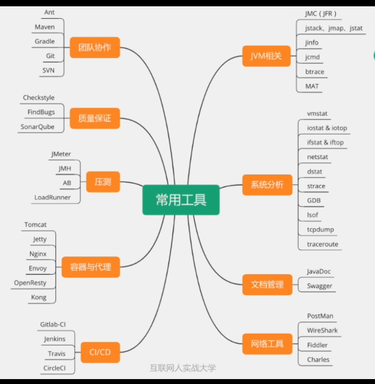
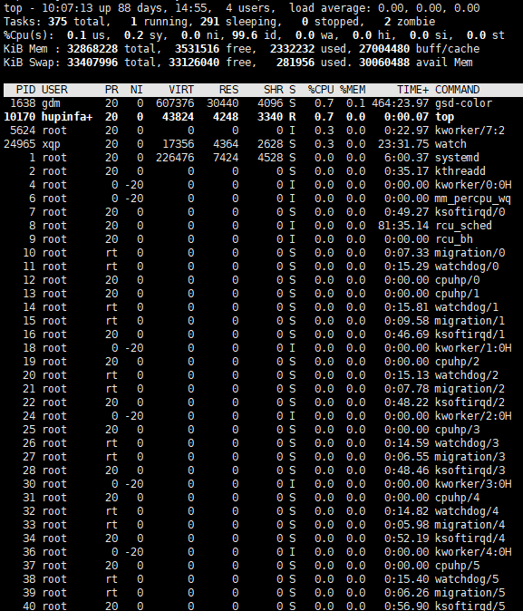
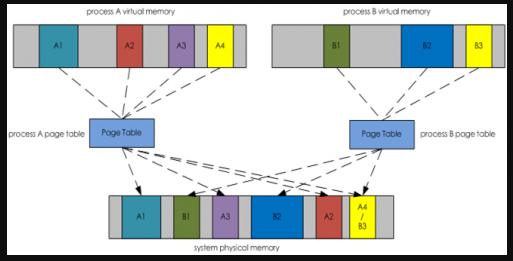
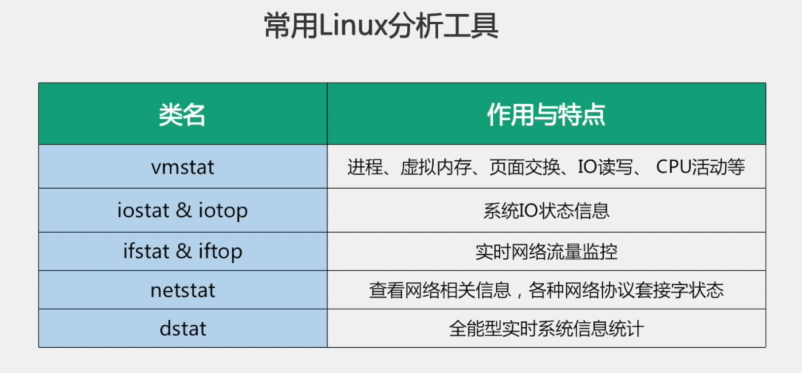
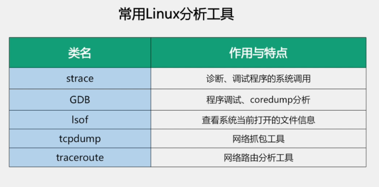
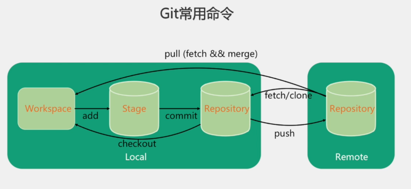
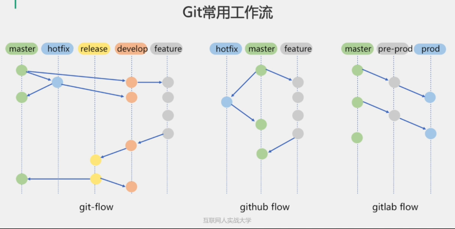

* [概念](#%E6%A6%82%E5%BF%B5)
* [linux](#linux)
    * [查看JAVA进程](#%E6%9F%A5%E7%9C%8Bjava%E8%BF%9B%E7%A8%8B)
    * [top命令](#top%E5%91%BD%E4%BB%A4)
      * [基本信息](#%E5%9F%BA%E6%9C%AC%E4%BF%A1%E6%81%AF)
      * [详细信息](#%E8%AF%A6%E7%BB%86%E4%BF%A1%E6%81%AF)
      * [top和ps的区别](#top%E5%92%8Cps%E7%9A%84%E5%8C%BA%E5%88%AB)
        * [ps常用用法](#ps%E5%B8%B8%E7%94%A8%E7%94%A8%E6%B3%95)
    * [进程的虚拟内存，物理内存，共享内存](#%E8%BF%9B%E7%A8%8B%E7%9A%84%E8%99%9A%E6%8B%9F%E5%86%85%E5%AD%98%E7%89%A9%E7%90%86%E5%86%85%E5%AD%98%E5%85%B1%E4%BA%AB%E5%86%85%E5%AD%98)
      * [虚拟内存 VIRT](#%E8%99%9A%E6%8B%9F%E5%86%85%E5%AD%98-virt)
      * [驻留内存 RES](#%E9%A9%BB%E7%95%99%E5%86%85%E5%AD%98-res)
      * [共享内存 SHR](#%E5%85%B1%E4%BA%AB%E5%86%85%E5%AD%98-shr)
    * [linux常用的分析工具](#linux%E5%B8%B8%E7%94%A8%E7%9A%84%E5%88%86%E6%9E%90%E5%B7%A5%E5%85%B7)
      * [ping](#ping)
* [Git](#git)
    * [fetch和pull区别](#fetch%E5%92%8Cpull%E5%8C%BA%E5%88%AB)
    * [git常用工作流](#git%E5%B8%B8%E7%94%A8%E5%B7%A5%E4%BD%9C%E6%B5%81)
      * [git\-flow](#git-flow)
      * [github flow](#github-flow)
      * [gitlab flow](#gitlab-flow)
    * [git merge 和 git rebase](#git-merge-%E5%92%8C-git-rebase)
    * [git fetch 和git pull 的差别](#git-fetch-%E5%92%8Cgit-pull-%E7%9A%84%E5%B7%AE%E5%88%AB)
      * [常用命令](#%E5%B8%B8%E7%94%A8%E5%91%BD%E4%BB%A4)

# 概念



# linux

### 查看JAVA进程

1、首先使用jps或是ps -ef |grep java查看到java程序的pid

2、使用ps -p ${pid} -o rss,vsz 可以查看java内存占用

VSZ是虚拟内存，RSS是实际使用的内存，单位KB

3、使用jstat等命令加上pid，可以跟踪详细的jvm内存信息

### top命令



包括两个部分，一是整体的基本信息，二是各个进程的详细信息

#### 基本信息

top 系统运行时间和平均负载

Tasks — 任务（进程），系统现在共有144个进程，其中处于运行中的有1个，143个在休眠（sleep），stoped状态的有0个，zombie状态（僵尸）的有0个。

cpu 这里显示不同模式下所占cpu时间百分比，这些不同的cpu时间表示：

内存使用 接下来两行显示内存使用率，有点像'free'命令。第一行是物理内存使用，第二行是虚拟内存使用(交换空间)。

#### 详细信息

**PID**：进程ID，进程的唯一标识符

**USER**：进程所有者的实际用户名。

**PR**：进程的调度优先级。这个字段的一些值是'rt'。这意味这这些进程运行在实时态。

**NI**：进程的nice值（优先级）。越小的值意味着越高的优先级。负值表示高优先级，正值表示低优先级

**VIRT**：进程使用的虚拟内存。进程使用的虚拟内存总量，单位kb。VIRT=SWAP+RES

**RES**：驻留内存大小。驻留内存是任务使用的非交换物理内存大小。进程使用的、未被换出的物理内存大小，单位kb。RES=CODE+DATA

**SHR：SHR**是进程使用的共享内存。共享内存大小，单位kb

**S**：这个是进程的状态。它有以下不同的值:

- D - 不可中断的睡眠态。
- R – 运行态
- S – 睡眠态
- T – 被跟踪或已停止
- Z – 僵尸态

**%CPU**：自从上一次更新时到现在任务所使用的CPU时间百分比。

**%MEM**：进程使用的可用物理内存百分比。

**TIME+**：任务启动后到现在所使用的全部CPU时间，精确到百分之一秒。

**COMMAND**：运行进程所使用的命令。进程名称（命令名/命令行）

#### top和ps的区别

\1. ps看到的是命令执行瞬间的进程信息,而top可以持续的监视

\2. ps只是查看进程,而top还可以监视系统性能,如平均负载,cpu和内存的消耗

##### ps常用用法

ps -ef | grep XXXX

### 进程的虚拟内存，物理内存，共享内存

#### 虚拟内存 VIRT

虚拟内存是操作系统内核为了对进程地址空间进行管理（process address space management）而精心设计的一个逻辑意义上的内存空间概念。

我们程序中的指针其实都是这个虚拟内存空间中的地址。比如我们在写完一段C++程序之后都需要采用g++进行编译，这时候编译器采用的地址其实就是虚拟内存空间的地址。因为这时候程序还没有运行，何谈物理内存空间地址？

内核会为系统中每一个进程维护一份相互独立的**页映射表**。。页映射表的基本原理是将程序运行过程中需要访问的一段虚拟内存空间通过页映射表映射到一段物理内存空间上，这样CPU访问对应虚拟内存地址的时候就可以通过这种查找页映射表的机制访问物理内存上的某个对应的地址。“页（page）”是虚拟内存空间向物理内存空间映射的基本单元。

#### 驻留内存 RES

驻留内存，顾名思义是指那些被映射到进程虚拟内存空间的物理内存。

#### 共享内存 SHR

虚拟内存通过映射表可能映射到驻留内存的同一段区域，这部分内存叫做共享内存

其实我们写的程序会依赖于很多外部的动态库（.so），比如libc.so、libld.so等等。这些动态库在内存中仅仅会保存/映射一份，如果某个进程运行时需要这个动态库，那么动态加载器会将这块内存映射到对应进程的虚拟内存空间中。多个进展之间通过共享内存的方式相互通信也会出现这样的情况。这么一来，就会出现不同进程的虚拟内存空间会映射到相同的物理内存空间。这部分物理内存空间其实是被多个进程所共享的，所以我们将他们称为共享内存，用SHR来表示。某个进程占用的内存除了和别的进程共享的内存之外就是自己的独占内存了。所以要**计算进程独占内存的大小只要用RES的值减去SHR值即可。**



### linux常用的分析工具






磁盘写入经常耗时较高，可以通过iostat来分析磁盘io情况，strace对文件写入的系统调用进行分析

#### ping

向指定的IP地址发送一定长度的数据包，按照约定，若指定IP地址存在的话，会返回同样大小的数据包，当然，若在特定的时间内没有返回，就是“超时”，就认为指定的IP不存在。

由于ping使用的是ICMP协议，有些防火墙会屏蔽ICMP协议，所以有时候ping的结果只能作为参考，ping不通并不一定说明对方IP不存在。

> *ICMP*（Internet Control Message Protocol）Internet控制报文协议。
>
> icmp协议是IP层的附属协议，是介于IP层和TCP层之间的协议，一般认为属于IP层协议。

# Git



git和svn区别，git是分布式版本管理

### fetch和pull区别

fetch是从远程仓库同步到本地仓库，但是并不会合并到工作区。

pull相当于执行的fetch+merge，先同步到本地仓库再merge到工作区

### git常用工作流



#### git-flow

master分支是版本发布状态

develop分支是最新的版本开发进度

hotfix是用来做线上的紧急bug修复

#### github flow

#### gitlab flow

pre-prod 作为预发管理

prod作为发布版本

### git merge 和 git rebase

在分支合并时，有两种方式：git merge 和git rebase。

git merge：将两个分支，合并提交为一个新提交，并且新提交有2个parent。

git rebase：会取消分支中的每个提交，并把他们临时存放，然后把当前分支更新到最新的origin分支，最后再吧所有提交应用到分支上。

### git fetch 和git pull 的差别

1. git fetch 相当于是从远程获取最新到本地，不会自动merge

2. git pull：相当于是从远程获取最新版本并merge到本地
3. 在实际使用中，git fetch更安全一些

#### 常用命令

```
git init
git add README.md
git commit -m "first commit"
git remote add origin https://github.com/lexiaoyao1995/test11.git
git push -u origin master
```

git checkout -b 分支名称

git rebase 将多次commit合并为一次commit