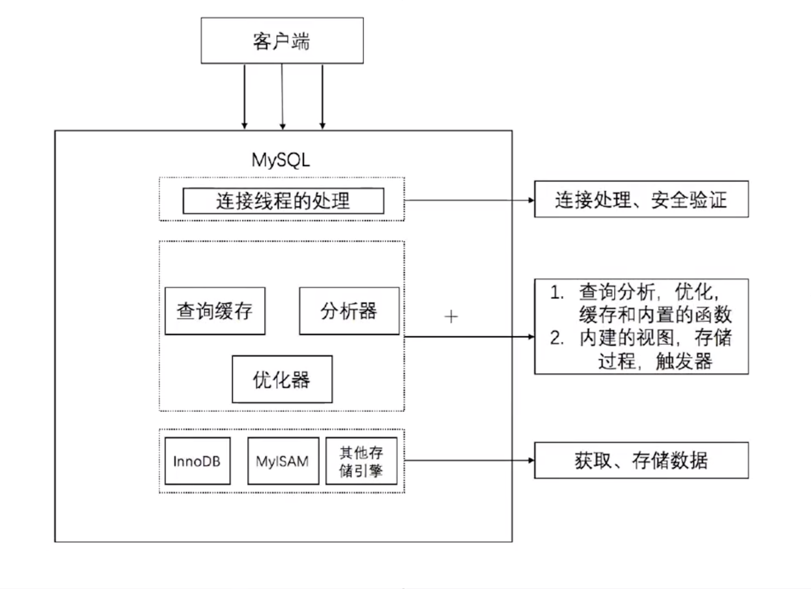
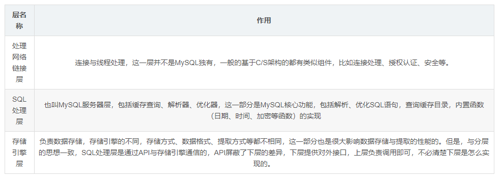
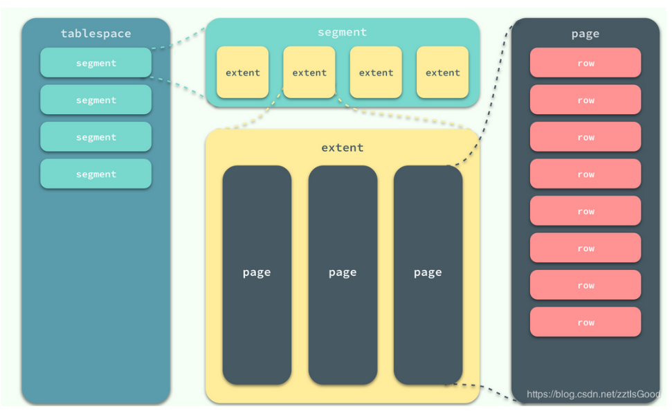
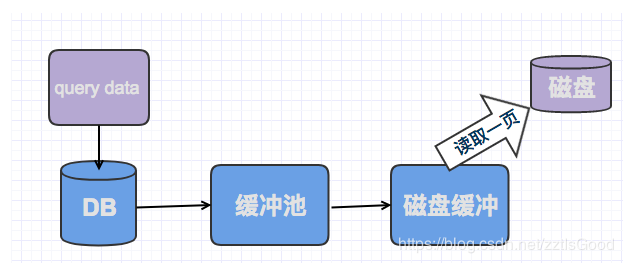
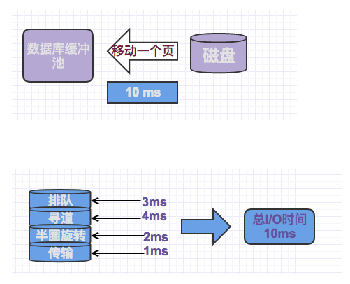
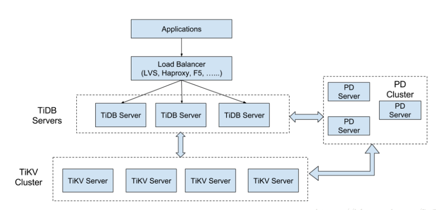

[toc]


# Mysql

## 基础

### 架构





### 理论范式

1、列不可再分

2、要有主键

3、所以数据直接依赖于主键，不允许简介依赖，去除传递依赖

### 数据类型

整数型，浮点型，字符串型，二级制，时间

##### BLOB 和 TEXT

BLOB 是一个二进制对象，可以容纳可变数量的数据。TEXT 是一个不区分大小写 的 BLOB。 

BLOB 和 TEXT 类型之间的唯一区别在于对 BLOB 值进行排序和比较时区分大小 写，对 TEXT 值不区分大小写。 

**行溢出数据**

一般认为BLOB，LOG这类的大对象类型的存储是存放在数据页面之外，也就是存放在uncompressed Blob page，但是这个理解其实有偏差，Blob可以不将数据放在溢出页面，而且即便是varchar类型，依然有可能被存放在行溢出数据。这个取决于这个字段具体的大小。

 

## 数据 磁盘 

在 InnoDB 存储引擎中，所有的数据都被逻辑地存放在表空间中，表空间（tablespace）是存储引擎中最高的存储逻辑单位，在表空间的下面又包括段（segment）、区（extent）、页（page）：



#### 读取流程



关系型数据库管理系统最重要的一个目标就是，确保表或者索引中的数据是随时可以用的。那么为了尽可能的实现这个目标，会使用内存中的缓冲池来最小化磁盘活动。

每一个缓冲池都足够大，大到可以存放许多页，可能是成千上万的页。

缓冲池管理器将尽力确保经常使用的数据被保存于池中，以避免一些不必要的磁盘读。如果一个索引或者表页在缓冲池中被找到，那么将会处理很快。

如果在缓冲池中，没有找到数据，会从磁盘服务器的缓冲区里面去读取。

磁盘服务器的缓冲区，如同数据库的缓冲池读取一样，磁盘服务器试图将频繁使用的数据保留在内存中，以降低高昂的磁盘读取成本。这个读取成本大概会在1ms左右。

如果磁盘服务器的缓冲池中依然没有找到数据，此时就必须要从磁盘读取了，此时读取又分区随机读取和顺序读取。

#### 顺序读取和随机读取



随机I/O
我们必须记住一个页包含了多条记录，我们可能需要该页上的所有行，也可能是其中一部分，或者是一行，但所花费的成本都是相同的，读取一个页，需要一次随机I/O,大约需要10ms的时间。

顺序读取
如果我们需要将多个页读取到缓冲池中，并按顺序处理它们，此时读取的速度回变的很快，具体的原理，在B树索引中也有过介绍，此时读取每个页面（4kb）所花费的时间大概为0.1ms左右，这个时间消耗对随机IO有很大的优势。

**以下几种情况，会对数据进行顺序读取。**

```
全表扫描
通过聚蔟索引扫描表行
```

**顺序读取有两个重要的优势：**

同时读取多个页意味着平均读取每个页的时间将会减少。在当前磁盘服务器条件下，对于4kb大小的页而言，这一值可能会低于0.1ms（40MB/s）
由于数据库引擎知道需要读取哪些页，所有可以在页被真正请求之前就提前将其读取进来，我们称为预读

## 数据库引擎

### MyISAM

设计简单，数据以紧密格式存储。对于只读数据，或者表比较小、可以容忍修复操作，则依然可以使用它。

提供了大量的特性，包括压缩表、空间数据索引等。

不支持事务。

不支持行级锁，只能对整张表加锁，读取时会对需要读到的所有表加共享锁，写入时则对表加排它锁。但在表有读取操作的同时，也可以往表中插入新的记录，这被称为并发插入（CONCURRENT INSERT）。

可以手工或者自动执行检查和修复操作，但是和事务恢复以及崩溃恢复不同，可能导致一些数据丢失，而且修复操作是非常慢的。

如果指定了 DELAY_KEY_WRITE 选项，在每次修改执行完成时，不会立即将修改的索引数据写入磁盘，而是会写到内存中的键缓冲区，只有在清理键缓冲区或者关闭表的时候才会将对应的索引块写入磁盘。这种方式可以极大的提升写入性能，但是在数据库或者主机崩溃时会造成索引损坏，需要执行修复操作。

**场景**

1、频繁执行全表count语句

2、对数据进行增删改的频率不高，查询非常频繁

3、没有事务

### InnoDB

是 MySQL 默认的事务型存储引擎，只有在需要它不支持的特性时，才考虑使用其它存储引擎。

实现了四个标准的隔离级别，默认级别是可重复读（REPEATABLE READ）。在可重复读隔离级别下，通过多版本并发控制（MVCC）+ Next-Key Locking 防止幻影读。

主索引是聚簇索引，在索引中保存了数据，从而避免直接读取磁盘，因此对查询性能有很大的提升。

内部做了很多优化，包括从磁盘读取数据时采用的可预测性读、能够加快读操作并且自动创建的自适应哈希索引、能够加速插入操作的插入缓冲区等。

支持真正的在线热备份。其它存储引擎不支持在线热备份，要获取一致性视图需要停止对所有表的写入，而在读写混合场景中，停止写入可能也意味着停止读取。

**场景**

1、增删改查都比较频繁

2、事务

#### InnoDB刷盘策略

通过参数 innodb_flush_method 控制


**fdatasync**

默认方式

调用fsync()去刷数据文件与redo log的buffer

写数据时，write这一步并不需要真正写到磁盘才算完成（可能写入到操作系统buffer中就会返回完成），真正完成是flush操作，buffer交给操作系统去flush,并且文件的元数据信息也都需要更新到磁盘。

**O_DSYNC**

innodb会使用O_SYNC方式打开和刷写redo log,使用fsync()刷写数据文件

写日志操作是在write这步完成，而数据文件的写入是在flush这步通过fsync完成

**O_DIRECT**

数据文件的写入操作是直接从mysql innodb buffer到磁盘的，并不用通过操作系统的缓冲，而真正的完成也是在flush这步,日志还是要经过OS缓冲。

> 首先文件的写操作包括三步：open,write,flush
> 上面最常提到的fsync(int fd)函数，该函数作用是flush时将与fd文件描述符所指文件有关的buffer刷写到磁盘，并且flush完元数据信息(比如修改日期、创建日期等)才算flush成功。
> 使用O_DSYNC方式打开redo文件表示当write日志时，数据都write到磁盘，并且元数据也需要更新，才返回成功。
> O_DIRECT则表示我们的write操作是从MySQL innodb buffer里直接向磁盘上写。

**比较**

1、在类unix操作系统中，文件的打开方式为O_DIRECT会最小化缓冲对io的影响，该文件的io是直接在用户空间的buffer上操作的，并且io操作是同步的，因此不管是read()系统调用还是write()系统调用，数据都保证是从磁盘上读取的；所以IO方面压力最小，对于CPU处理压力上也最小，对物理内存的占用也最小；但是由于没有操作系统缓冲的作用，对于数据写入磁盘的速度会降低明显（表现为写入响应时间的拉长），但不会明显造成整体SQL请求量的降低（这有赖于足够大的innodb_buffer_pool_size）。

2、O_DSYNC方式表示以同步io的方式打开文件，任何写操作都将阻塞到数据写入物理磁盘后才返回。这就造成CPU等待加长，SQL请求吞吐能力降低，insert时间拉长。

3、fsync(int filedes)函数只对由文件描述符filedes指定的单一文件起作用，并且等待写磁盘操作结束，然后返回。fdatasync(int filedes)函数类似于fsync，但它只影响文件的数据部分。而除数据外，fsync还会同步更新文件的元信息到磁盘。

O_DSYNC对CPU的压力最大，datasync次之，O_DIRECT最小；整体SQL语句处理性能和响应时间看，O_DSYNC较差；O_DIRECT在SQL吞吐能力上较好（仅次于datasync模式），但响应时间却是最长的。

默认datasync模式，整体表现较好，因为充分利用了操作系统buffer和innodb_buffer_pool的处理性能，但带来的负面效果是free内存降低过快，最后导致页交换频繁，磁盘IO压力大，这会严重影响大并发量数据写入的稳定性。

#### Innodb 关键特性

##### **insert buffer**

虽然名字是buffer，但是实际是一个数据页一样，是物理页的一个组成部分，其数据结构是一棵B+树，存放在ibdata1（共享表空间）中。

注：并不是所有的主键插入都是顺序的，若主键是UUID，则插入和辅助索引一样，同样是随机的。

对于非聚集索引的插入或更新操作，不是每一次直接插入到索引页中，而是先判断插入的非聚集索引页是否在缓冲池中，若在，则直接插入；若不在，则先放入一个insert buffer对象中，然后再以一定频率和情况进行insert buffer和辅助索引页子节点的merger(合并)操作。

**使用insert buffer的条件：**

**索引是辅助索引；**

**索引不是唯一的。**

##### **change buffer**

对于insert buffer的升级，可以对DML操作—insert、delete、update都进行缓冲，c**hange buffer使用的对象是非唯一的辅助索引，**可以通过innodb_change_buffer_max_size来控制 change buffer最大使用内存的数量，默认值为25即最多使用1/4的缓冲池内存空间，该参数最大有效值为50

##### doublewrite

doublewrite给innodb存储引擎带来了数据页的可靠。

使用场景：

当发生数据库宕机时，innodb存储引擎正在写某个页的一部分，如一个页只写了前4kb，之后就发生了宕机。出现这种情况后，是不可以通过redo log来实现的，因为redo log记录的是对页的物理操作，但是如果这一页本身就损坏了，则redo log是没有任何意义的。

> innodb存储引擎 P53

##### 自适应hash

innodb存储引擎会监控对表上各索引页的查询，如果建立哈希索引可以提升速度，则建立哈希索引（通过缓冲池的B+树页构造而来，**建造速度快且不需要对整张表构造哈希索引**。根据**访问的频率和模式**自动为某些热点页建立哈希索引）

##### 异步io

数据库系统采用异步IO（Async IO）的方式来处理磁盘操作来提高磁盘性能

AIO：用户可以发出一个IO请求后立即再发出另一个IO请求，当全部IO请求发送完毕后，等所有IO操作完成（优势：可以进行IO merge操作，即将多个IO合并为1个IO，提高了IOPS性能）

native AIO：内核级别的AIO支持

通过innodb_use_native_aio参数可以查看是否启动native AIO，默认为on

##### **刷新邻进页**

工作原理：当刷新一个脏页时，innodb会检测该页所在区的所有页，如果是脏页，则一起刷新

通过innodb_flush_neighbors参数可以控制是否启动该特性，建议传统机械硬盘建议启用该特性，对于固态硬盘将该参数设置为0，即关闭此特性


### 区别

1、MyISAM默认的是表级锁，不支持行级锁

2、InnoDB默认用的是行级所，也支持表级锁

3、MyISAM不支持事务，但是支持全文检索

现在的5.7版本MyISAM和Innodb都支持全文检索了

MySQL 5.7.6开始，MySQL内置了ngram全文解析器，用来支持中文、日文、韩文分词。

> 全文检索
>
> 只能在类型为CHAR、VARCHAR或者TEXT的字段上创建全文索引。
>
> 全文索引只支持InnoDB和MyISAM引擎。
>
> MATCH (columnName) AGAINST ('keywords')。MATCH()函数使用的字段名，必须要与创建全文索引时指定的字段名一致。如上面的示例，MATCH (title,body)使用的字段名与全文索引ft_articles(title,body)定义的字段名一致。如果要对title或者body字段分别进行查询，就需要在title和body字段上分别创建新的全文索引。
>
> MATCH()函数使用的字段名只能是同一个表的字段，因为全文索引不能够跨多个表进行检索。
>
> 如果要导入大数据集，使用先导入数据再在表上创建全文索引的方式要比先在表上创建全文索引再导入数据的方式快很多，所以全文索引是很影响TPS的。

4、MyISAM读的效率比较高，适合多读写少的情况

> **INNODB在做SELECT的时候，要维护的东西比MYISAM引擎多很多:**
> 1）数据块，INNODB要缓存，MYISAM只缓存索引块，  这中间还有换进换出的减少；
>  
>2）innodb寻址要映射到块，再到行，MYISAM记录的直接是文件的OFFSET，定位比INNODB要快
> 
>3）INNODB还需要维护MVCC一致；虽然你的场景没有，但他还是需要去检查和维护
> 
>MVCC (Multi-Version Concurrency Control)多版本并发控制 

锁分为读锁和写锁，读锁也叫共享锁（for update 可强行加排他锁），写锁也叫排他锁

innoDB在sql没有用到索引的时候，用的是表锁


## 索引

### 索引的存放

innodb是索引和数据放在一起的，myisam是索引和数据分开存放。

innodb索引和数据放一起的好处是，便于缓存，数据和索引都是以页的形式缓存到innodb_buffer_pool中

并且对于高频的搜索热词，innodb会采用hash作为索引的数据结构。

### 密集索引和稀疏索引的区别

密集索引文件中的每个搜索码值都对应一个索引值，密集索引存放了一行的**所有信息**。

稀疏索引文件只为索引码的某些值建立索引项，稀疏索引只是保存了**键位信息和主键id**

mysam存储引擎，不管是主键索引，唯一键索引还是普通索引都是稀疏索引

**InnoDB 有且仅有一个密集索引**

若一个主键被定义，该主键则作为密集索引

若没有主键被定义，该表的第一个唯一非空索引则作为密集索引

若不满足以上条件，innodb内部会生成一个隐藏主键（密集索引）

innodb 索引和数据放在一个文件里的   *MyISAM* 索引和数据是分开放的

**索引过程**


##### 回表

在innodb中，先通过辅助索引获取到主键，再通过聚簇索引获取行数据

##### 索引覆盖

索引覆盖是一种避免回表查询的优化策略。具体的做法就是将要查询的数据作为索引列建立普通索引（可以是单列索引，也可以一个索引语句定义所有要查询的列，即联合索引），这样的话就可以直接返回索引中的的数据，不需要再通过聚集索引去定位行记录，避免了回表的情况发生。

### 类型

- 普通索引：仅加速查询
- 唯一索引：加速查询 + 列值唯一（可以有null）
- 主键索引：加速查询 + 列值唯一（不可以有null）+ 表中只有一个
- 联合索引：多列值组成一个索引，专门用于组合搜索，其效率大于索引合并
- 压缩索引：MyISAM支持，通过压缩前缀索引来减少索引的大小，从而让更多的索引可以放入内存，比如对一个很长的字段进行压缩。

#### 联合索引 最左匹配原则

mysql会一直向右匹配直到遇到范围查询（< > between like）就停止匹配

> 联合索引的最左原则就是建立索引KEY union_index (a,b,c)时，**等于建立了(a)、(a,b)、(a,b,c)三个索引**，从形式上看就是索引向左侧聚集，所以叫做最左原则，因此最常用的条件应该放到联合索引的组左侧。
>
> 利用联合索引加速查询时，联合查询条件符合“交换律”，也就是where a = 1 and b = 1 等价于 where b = 1 and a = 1，这两种写法都能利用索引KEY union_index (a,b,c)。

比如a=3 and b=4 and c>5 and d=6 如果建立（a,b,c,d）顺序的索引，d是用不到索引的，如果建立的是（abdc）的索引则可以用到，、

其中=和in可以乱序

**原因**

mysql建立复合索引，先对第一个地段进行排序，再对第二个字段排序，以此构建B+tree，所以如果在中间有范围查询就拿不到最下面的数据，就不能走索引

### 数据结构

b+树

#### 为什么采用B+树

**hash索引**

缺点

仅仅满足“=”，不能使用范围查询

遇到hash值相等的情况，性能比较低下

**二叉树**

虽然从算法逻辑上来说，二叉查找树的查询速度和比较次数都是最小的，但需要考虑磁盘io，数据库索引是存储在磁盘上的，当数据量比较大的时候，索引的大小也很大。

利用索引查询的时候，只能逐一加载每一页磁盘，这里的磁盘页对应的就是索引树的节点。

磁盘的io次数由索引的高度决定，所以需要尽量把树的高度降下来，这就是b树的作用。

**特征**：（m阶B树）

1、根节点至少有两个子女

2、每个中间节点都包含k-1个元素和k个孩子，其中m/2<=k<=m

3、每个叶子节点都包含k-1个元素，其中m/2<=k<=m

4、所有的叶子节点都位于同一层

5、每个节点中的元素从小到大排序，节点当中k-1个元素正好是k个孩子包含的元素的值域划分。

b树主要应用于文件系统以及部分数据库索引

**b+树**

b+树和b树有一些共同点，但是b+树也具备一些新特特征

1、有k个子树的中间节点包含k个元素（b树中是k-1个元素），每个元素不保存数据，只用来做索引，**所有数据都保存在叶子节点中**。

2、所有的叶子节点中包含了全部元素的信息，及**指向含这些元素记录的指针**，且叶子节点本身依关键字的大小自小到大顺序连接

3、所有的中间节点元素都同时存在于子节点，**在子节点元素中最大或是最小元**素。

还有一个特性，就是**卫星数据**的位置

**卫星数据**，指的是索引元素所指向的数据记录，比如数据库中的一行。在B树中，无论是中间节点还是叶子节点都带有卫星数据，在b+树中，只有叶子节点带有卫星数据，其余中间节点仅仅是索引。

note：

在数据库的聚集索引中，叶子节点直接包含卫星数据，在非聚集索引中，叶子节点带有指向卫星数据的指针。

##### B+树对于B树的优势体现在查询性能上

1、因为对于B树和B+数来说，一个树节点都是对应操作系统的磁盘块，磁盘块大小一定，b+树的中间节点没有卫星数据，所以同样大小的磁盘页可以容纳更多的节点元素。就是数据量相同的情况下，b+树的结构更加矮胖

2、B+树的查询速度更加稳定，b-树只要匹配到元素就可以了，无论是匹配元素是中间节点还是叶子节点，但b+树查询必须要查找到叶子节点。

3、范围查询，b+树优势明显，只需要在链表上遍历即可。

### 索引的缺点

数据量小的表不需要索引，建立会增加额外的索引开销

变更数据需要维护索引，需要更多维护成本

需要更多空间

### 索引过程

##### Innodb的页结构

页结构，是innodb存储引擎管理数据库的最小磁盘单位

innodb数据页组成部分

1、file header（文件头）

file header中，有两个指针，表示当前页的上一页和下一页，由此可以看出叶子节点是双向链表串起来的

2、page header（页头）

3、Records user Records（行记录）

行记录中，有两行虚拟的行记录来限定行记录的边界（infimum，supremum）

4、free space（空闲空间）

5、page directory（页目录）

page directory页目录中存放了记录的相对位置，有些时候这些记录指针称为Slots，槽，与其他数据库不同的是，innodb并不是每一个记录都拥有一个槽，innodb中的槽是一个稀疏目录，即一个槽中可以属于多个记录。

槽中记录按照键顺序存放，这样可以利用二分查找快速找到记录的指针。

但由于并不是没个行数据都有槽，所以二分查找的结果只是一个粗略的结果，所以innodb必须通过行记录的recorder header中的next_record来继续查找相关记录。

6、file trailer（文件结尾信息）

##### 查询b+树索引的流程

首先通过b+树索引找到叶节点，找到相应的数据页，然后将数据页加载到内存中，通过二分查找Page directory中的槽，查找出一个相对粗略的位置，然后根据槽的指针指向链表的行数据，之后在链表中依次查找。

**需要注意的是**

b+树索引不能找到具体一条记录，而是只能找到对应的页，把页从磁盘装入内存中，再通过page directory进行二分查找，同时此二分查找也可能找不到具体的行记录，只是能找到一个接近的链表中的点，再从此点开始遍历链表进行查找。

### 索引失效

like 模糊查询 前模糊或者 全模糊不走索引

or 条件中只要有一个字段没有索引，改语句就不走索引

使用 union all 代替 or 这样的话有索引例的就会走索引

in 走索引

not in 不走索引

is null 走索引

is not null  不走索引

!=、<> 不走索引

隐式转换-不走索引（name 字段为 string类型，这里123为数值类型，进行了类型转换，所以不走索引,改为 '123' 则走索引）
explain select * from users u where u.name = 123

函数运算-不走索引

##### IS NULL`、`IS NOT NULL`、`!= 是否走索引

> 并不是完全不走，由成本决定。
>
> 成本组成主要有两个方面：
>
> - 读取二级索引记录的成本
> - 将二级索引记录执行回表操作，也就是到聚簇索引中找到完整的用户记录的操作所付出的成本。
>
> 要扫描的二级索引记录条数越多，那么需要执行的回表操作的次数也就越多，达到了某个比例时，使用二级索引执行查询的成本也就超过了全表扫描的成本（举一个极端的例子，比方说要扫描的全部的二级索引记录，那就要对每条记录执行一遍回表操作，自然不如直接扫描聚簇索引来的快）。
>
> 


## 事务

### 四大特性

CAID

**原子性 Atomic**

要么全部成功commit，要么全部rollback

**一致性 Consistency**

rollback后的数据和原来的一致

> 原子性和一致性底层：
>
> 在操作数据之前，首先将数据备份到一个地方（这个存储数据备份的地方称为Undo log）。然后进行数据的修改。如果出现了错误，系统利用undo log中的备份将数据恢复到事务开始之前的状态。

**隔离性 isolation**

事务和事务之间不干扰。一个事物必须与另一个事务的执行结果隔离开

> 通过数据库锁的机制实现

**持久性 durability**

执行成功。持久化数据

> 和Undo Log相反，Redo Log记录的是新数据的备份。在事务提交前，只要将Redo Log持久化即可，不需要将数据持久化。当系统崩溃时，虽然数据没有持久化，但是Redo Log已经持久化。系统可以根据Redo Log的内容，将所有数据恢复到最新的状态。

### 事务的分类


1、扁平化事务

所有的操作都在同一层次，平时使用最多的事务，不能提交或是回滚事务的某一部分，要么都成功，要么都回滚

2、带保存点的扁平事务

允许事务在执行过程中，回滚到较早的状态，而不是全部回滚，通过在事务中添加保存点，可选择事务在失败时，回滚到保存点处，

3、链事务

在事务提交时，会将上下文，隐式传递给下一个事务，当事务失败时，可以回滚到最近的事务，不过链事务只能回滚到最近一个保存点，而带保存点的事务可以回滚到任意一个保存点

4、嵌套事务

由顶层事务和子事务构成，类似于树的结构，一般顶层事务负责逻辑处理，子事务负责具体的工作，子事务可以提交，但真正的提交要等到父事务的提交，如果上层事务回滚，那么所有的子事务都会回滚

**5、分布式事务**

在分布式环境中的扁平化事务，常用的分布式事务解决方案

5.1 XA协议

XA协议是保证强一致性的刚性事务，实现方式有两段式提交和三段式提交

两段式提交需要一个事务协调者来保证第一阶段的事务参与者都完成了准备工作，如果协调者收到了所有参与者都准备好的消息，就会通知所有的事务执行第二阶段提交，但是两段式提交如果只有一个进程发生故障，也会导致系统有较长时间的阻塞。

三段式提交通过增加PreCommit阶段来减少两段式提交的系统阻塞时间

5.2 TCC

TCC是满足最终一致性的柔性事务方案，TCC采用补偿机制，核心思想是对每个操作都要注册确认和补偿操作，分为三个阶段，try阶段，主要对业务系统进行检测，即资源预留，confirm阶段进行确认提交，cancel阶段是在事务执行错误进行回滚，释放预留资源，

5.3 消息事务

将本地操作和发送消息封装在一个事务中，保证本地消息和发送消息的原子性，下游应有收到消息后执行相应的操作。

### 隔离级别

**未提交读（READ UNCOMMITTED）**

事务中的修改，即使没有提交，对其他事务也是可见的。

**提交读（READ COMMITTED）**

一个事务只能读取已经提交的事务所做的修改。换句话说，一个事务所做的修改在提交之前对其他事务是不可见的。

**可重复读（REPEATABLE READ）**

保证在同一个事务中多次读取同样数据的结果是一样的。

**可串行化（SERIALIZABLE）**

强制事务串行执行。

需要加锁实现，而其它隔离级别通常不需要。


#### 并发访问问题

脏读：一个事务读取了另一个事务未提交的数据

不可重复读：一个事务读取数据的前后，由于另一个事务对当前行的更改，对同一行读取的数据不同 

幻读：在事务A执行了一个当前读操作，事务B在事务A的影响区域执行了插入数据的操作，此时，事务A再执行一个当前读操作，就出现了幻行。

#### 实现原理

##### 锁机制

阻止其他事务对数据进行操作， 各个隔离级别主要体现在读取数据时加的锁的释放时机。

- RU：事务读取时不加锁
- RC：事务读取时加行级共享锁（读到才加锁），一旦读完，立刻释放（并不是事务结束）。
- RR：事务读取时加行级共享锁，直到事务结束时，才会释放。
- SE：事务读取时加表级共享锁，直到事务结束时，才会释放。

##### 多版本并发控制MVCC

实际就是『版本控制』加『读写分离』思想，主要用作于RC和RR级别。

多版本并发控制（Multi-Version Concurrency Control, MVCC）是 MySQL 的 InnoDB 存储引擎实现隔离级别的一种具体方式，用于实现提交读和可重复读这两种隔离级别。而未提交读隔离级别总是读取最新的数据行，无需使用 MVCC。可串行化隔离级别需要对所有读取的行都加锁，单纯使用 MVCC 无法实现。

> **版本号**
>
> - 系统版本号：是一个递增的数字，每开始一个新的事务，系统版本号就会自动递增。
> - 事务版本号：事务开始时的系统版本号。
>
> **隐藏的列**
>
> MVCC 在每行记录后面都保存着两个隐藏的列，用来存储两个版本号：
>
> - 创建版本号：指示创建一个数据行的快照时的系统版本号；
> - 删除版本号：如果该快照的删除版本号大于当前事务版本号表示该快照有效，否则表示该快照已经被删除了。
>
> **Undo 日志**
>
> MVCC 使用到的快照存储在 Undo 日志中，该日志通过回滚指针把一个数据行（Record）的所有快照连接起来。


> 主要过程就是比较版本来确定是否读取数据
>
> 把没有对一个数据行做修改的事务称为 T，T 所要读取的数据行快照的创建版本号必须小于等于 T 的版本号，因为如果大于 T 的版本号，那么表示该数据行快照是其它事务的最新修改，因此不能去读取它。除此之外，T 所要读取的数据行快照的删除版本号必须是未定义或者大于 T 的版本号，因为如果小于等于 T 的版本号，那么表示该数据行快照是已经被删除的，不应该去读取它。

##### 快照读和当前读

在可重复读级别中，通过MVCC机制，虽然让数据变得可重复读，但我们读到的数据可能是历史数据，是不及时的数据，不是数据库当前的数据！

对于这种读取历史数据的方式，我们叫它快照读 (snapshot read)，而读取数据库当前版本数据的方式，叫当前读 (current read)。很显然，在MVCC中：

快照读：就是select。

- select * from table ….;

当前读：特殊的读操作，插入/更新/删除操作，属于当前读，处理的都是当前的数据，需要加锁。

- select * from table where ? lock in share mode;
- select * from table where ? for update;
- insert;
- update ;
- delete;

##### InnoDB可重复读级别下如何避免幻读

通过MVCC和Next-Key Locks

Next-Key Locks是 行锁 和 Gap Locks 的结合，不仅锁定一个记录上的索引，也锁定索引之间的间隙。

**行锁防止别的事务修改或删除，GAP锁防止别的事务新增，行锁和GAP锁结合形成的的Next-Key锁共同解决了RR级别在写数据时的幻读问题。**

Gap Locks触发时机：

用在非唯一索引，或是不走索引，或是没有全部命中的主键索引，的当前读操作中

### 封锁协议

在运用排他锁和共享锁这两种基本封锁对数据库加锁的时候，还需要有一些规定，这些规定称为封锁协议。

通常使用三级封锁协议在不同程度上解决了更新丢失，不可重复读，以及幻读，脏读问题。

##### 一级封锁

事务A在修改数据R之前需要先加排他锁，直到事务结束，可以防止更新丢失。

**二级封锁**

在一级封锁的基础上，在读数据的时候加上共享锁，直到**读**完，可防止脏读

**三级封锁**

在一级封锁的基础上，在读数据的时候加上共享锁，直到**事务**完，可防止不可重复读

## 日志文件

### 重做日志（redo log）

**作用：**

　　确保事务的持久性。redo日志记录事务执行后的状态，用来恢复未写入data file的已成功事务更新的数据。防止在发生故障的时间点，尚有脏页未写入磁盘，在重启[mysql](https://www.2cto.com/database/MySQL/)服务的时候，根据redo log进行重做，从而达到事务的持久性这一特性。

**内容：**

　　物理格式的日志，记录的是物理数据页面的修改的信息，其redo log是顺序写入redo log file的物理文件中去的。

**什么时候产生：**

　　事务开始之后就产生redo log，redo log的落盘并不是随着事务的提交才写入的，而是在事务的执行过程中，便开始写入redo log文件中。

**什么时候释放：**

　　当对应事务的脏页写入到磁盘之后，redo log的使命也就完成了，重做日志占用的空间就可以重用（被覆盖）。

**对应的物理文件：**

　　默认情况下，对应的物理文件位于[数据库](https://www.2cto.com/database/)的data目录下的ib_logfile1&ib_logfile2

　　innodb_log_group_home_dir 指定日志文件组所在的路径，默认./ ，表示在数据库的数据目录下。

　　innodb_log_files_in_group 指定重做日志文件组中文件的数量，默认2

**关于文件的大小和数量，由以下两个参数配置：**

　　innodb_log_file_size 重做日志文件的大小。

　　innodb_mirrored_log_groups 指定了日志镜像文件组的数量，默认1

**其他：**

　　很重要一点，redo log是什么时候写盘的？前面说了是在事物开始之后逐步写盘的。

　　之所以说重做日志是在事务开始之后逐步写入重做日志文件，而不一定是事务提交才写入重做日志缓存，原因就是，重做日志有一个缓存区Innodb_log_buffer，Innodb_log_buffer的默认大小为8M(这里设置的16M),Innodb存储引擎先将重做日志写入innodb_log_buffer中。

　　然后会通过以下三种方式将innodb日志缓冲区的日志刷新到磁盘

* Master Thread 每秒一次执行刷新Innodb_log_buffer到重做日志文件。

* 每个事务提交时会将重做日志刷新到重做日志文件。

* 当重做日志缓存可用空间 少于一半时，重做日志缓存被刷新到重做日志文件

　　由此可以看出，重做日志通过不止一种方式写入到磁盘，尤其是对于第一种方式，Innodb_log_buffer到重做日志文件是Master Thread线程的定时任务。

　　因此重做日志的写盘，并不一定是随着事务的提交才写入重做日志文件的，而是随着事务的开始，逐步开始的。

另外引用《MySQL技术内幕 Innodb 存储引擎》（page37）上的原话：

　　即使某个事务还没有提交，Innodb存储引擎仍然每秒会将重做日志缓存刷新到重做日志文件。

　　这一点是必须要知道的，因为这可以很好地解释再大的事务的提交（commit）的时间也是很短暂的。

### 回滚日志（undo log）

**作用：**

　　保证数据的原子性，保存了事务发生之前的数据的一个版本，可以用于回滚，同时可以提供多版本并发控制下的读（MVCC），也即非锁定读

**内容：**

　　逻辑格式的日志，在执行undo的时候，仅仅是将数据从逻辑上恢复至事务之前的状态，而不是从物理页面上操作实现的，这一点是不同于redo log的。

这个回滚实质是执行和rollback之前相反的操作，比如insert的回滚是执行delete

**什么时候产生：**

　　事务开始之前，将当前是的版本生成undo log，undo 也会产生 redo 来保证undo log的可靠性

**什么时候释放：**

　　当事务提交之后，undo log并不能立马被删除，而是放入待清理的链表，由purge线程判断是否由其他事务在使用undo段中表的上一个事务之前的版本信息，决定是否可以清理undo log的日志空间。

**对应的物理文件：**

　　MySQL5.6之前，undo表空间位于共享表空间的回滚段中，共享表空间的默认的名称是ibdata，位于数据文件目录中。

　　MySQL5.6之后，undo表空间可以配置成独立的文件，但是提前需要在配置文件中配置，完成数据库初始化后生效且不可改变undo log文件的个数

　　如果初始化数据库之前没有进行相关配置，那么就无法配置成独立的表空间了。

### 二进制日志（binlog）

**作用：**

　　用于复制，在主从复制中，从库利用主库上的binlog进行重播，实现主从同步。

　　用于数据库的基于时间点的还原。

**内容：**

　　逻辑格式的日志，可以简单认为就是执行过的事务中的sql语句。

　　但又不完全是sql语句这么简单，而是包括了执行的sql语句（增删改）反向的信息，也就意味着delete对应着delete本身和其反向的insert；update对应着update执行前后的版本的信息；insert对应着delete和insert本身的信息。

　　在使用mysqlbinlog解析binlog之后一些都会真相大白。

　　因此可以基于binlog做到类似于oracle的闪回功能，其实都是依赖于binlog中的日志记录。

**什么时候产生：**

　　事务提交的时候，一次性将事务中的sql语句（一个事物可能对应多个sql语句）按照一定的格式记录到binlog中。

　　这里与redo log很明显的差异就是redo log并不一定是在事务提交的时候刷新到磁盘，redo log是在事务开始之后就开始逐步写入磁盘。

　　因此对于事务的提交，即便是较大的事务，提交（commit）都是很快的，但是在开启了bin_log的情况下，对于较大事务的提交，可能会变得比较慢一些。

　　这是因为binlog是在事务提交的时候一次性写入的造成的，这些可以通过测试验证。

**什么时候释放：**

　　binlog的默认是保持时间由参数expire_logs_days配置，也就是说对于非活动的日志文件，在生成时间超过expire_logs_days配置的天数之后，会被自动删除。

##### redo log和binlog区别

第一:redo log是在InnoDB存储引擎层产生，而binlog是MySQL数据库的上层产生的，并且二进制日志不仅仅针对INNODB存储引擎，MySQL数据库中的任何存储引擎对于数据库的更改都会产生二进制日志。

第二：两种日志记录的内容形式不同。MySQL的binlog是逻辑日志，其记录是对应的SQL语句。而innodb存储引擎层面的重做日志是物理日志。

第三：两种日志与记录写入磁盘的时间点不同，二进制日志只在事务提交完成后进行一次写入。而innodb存储引擎的重做日志在事务进行中不断地被写入，并日志不是随事务提交的顺序进行写入的。

二进制日志仅在事务提交时记录，并且对于每一个事务，仅在事务提交时记录，并且对于每一个事务，仅包含对应事务的一个日志。而对于innodb存储引擎的重做日志，由于其记录是物理操作日志，因此每个事务对应多个日志条目，并且事务的重做日志写入是并发的，并非在事务提交时写入，其在文件中记录的顺序并非是事务开始的顺序。

第四：binlog不是循环使用，在写满或者重启之后，会生成新的binlog文件，redo log是循环使用。

第五：binlog可以作为恢复数据使用，主从复制搭建，redo log作为异常宕机或者介质故障后的数据恢复使用。

## 锁

### 宏观

* 数据库锁
* * 数据库锁适用于集群

- * 粒度小，更方便控制

 代码锁

- * 需要复杂的处理，才能作用于集群
- * 粒度大

## 

### 锁的分类

按锁的粒度 分为  表级锁，行级锁，页级锁

> **只有「明确」指定主键，才会执行锁，否则将会执行表锁**

按锁级别划分  共享锁 排他锁

按加锁方式  自动锁 显式锁

按操作划分  DML锁 DDL锁

按使用方式分  乐观锁（sql可用version或是时间戳决定） 悲观锁

##### 行锁和表锁和页锁

**行锁**

劣势：开销大；加锁慢；会出现死锁

优势：锁的粒度小，发生锁冲突的概率低；处理并发的能力强

加锁的方式：自动加锁。对于UPDATE、DELETE和INSERT语句，InnoDB会自动给涉及数据集加排他锁；对于普通SELECT语句，InnoDB不会加任何锁；当然我们也可以显示的加锁：

**表锁**

优势：开销小；加锁快；无死锁

劣势：锁粒度大，发生锁冲突的概率高，并发处理能力低

加锁的方式：自动加锁。查询操作（SELECT），会自动给涉及的所有表加读锁，更新操作（UPDATE、DELETE、INSERT），会自动给涉及的表加写锁。也可以显示加锁：

**页锁**

引擎 BDB。

一次锁定相邻的一组记录，开销和加锁时间界于表锁和行锁之间；会出现死锁；锁定粒度界于表锁和行锁之间，并发度一般。

##### 实例

- 无锁

  ```
  # 明确指定主键，但不存在该主键的值(没有数据，当然不会有锁)
  SELECT * FROM products WHERE id=-1 FOR UPDATE;
  ```

- 行锁

  ```
  # 明确指定主键
  SELECT * FROM products WHERE id=3 FOR UPDATE;
  SELECT * FROM products WHERE id=3 AND type=1 FOR UPDATE;
  ```

- 表锁

  ```
  # 主键不明确
  SELECT * FROM products WHERE name='Mouse' FOR UPDATE;
  SELECT * FROM products WHERE id<>'3' FOR UPDATE;
  SELECT * FROM products WHERE id LIKE '3' FOR UPDATE;
  ```

### 锁的机制

#### 行锁算法

##### Record Lock（普通行锁）

- 对于键值在条件范围内，且存在的记录，使用" Record Lock "，即普通的行锁机制；

##### Gap Lock（间隙锁）

- 对于键值在条件范围内但并不存在的记录，叫做" 间隙（GAP) "，InnoDB会对这个“间隙”加锁，这种锁机制就是所谓的" Gap Lock "(间隙锁)；

##### Next-Key Lock（行 & 间隙）

- 对于存在于不存在的数据同时加锁，则称为" Next-Key Lock "；

- **Next-Key Lock包含Record Lock和Gap Lock；**

  ```
  # 假如user表中只有101条记录，empid的值是1,2,...,100,101
  # 范围条件的检索，会对值为101的记录加锁，也会对大于101（不存在）加锁
  # 由于两个锁同时存在，则此处为 Next-Key Lock
  select * from  user where user_id > 100 for update;
  ```

#### 表锁算法

##### 意向锁

- 当一个事务带着表锁去访问一个被加了行锁的资源，那么，此时，这个行锁就会升级为意向锁，将表锁住。
- 常用的意向锁有：意向共享锁，意向排它锁，共享意向排它锁

##### 自增锁

- 事务插入自增类型的列时获取自增锁

  > 如果一个事务正在往表中插入自增记录，所有其他事务的插入必须等待

#### 实现

##### 共享锁 & 排它锁

> 行锁和表锁是锁粒度的概念，共享锁和排它锁是他们的具体实现

##### 共享锁（S）：读锁

- 允许一个事务去读一行，阻止其他事务获取该行的排它锁。
- 多事务时，只能加共享读锁，不能加排他写锁；单事务时，可以加任何锁。
- 一般理解为：能读，不能写。

##### 排它锁（X）：写锁

- 允许持有排它锁的事务读写数据，阻止其他事物获取该数据的共享锁和排它锁。
- 其他事务不能获取该数据的任何锁，直到排它锁持有者释放。
- 不能获取任何锁，不代表不能无锁读取。

**注意**

- 排它锁指的是，在某个事务获取数据的排它锁后，其他事务不能获取该数据的任何锁， **并不代表其他事务不能无锁读取该数据。**
  - 无锁
    - **select ... from**
  - 共享锁
    - **select ... lock in share mode**
  - 排它锁
    - **update**
    - **delete**
    - **insert**
    - **select ... for update**
- MySQL8.0 中，使用 FOR SHARE 替代了 LOCK IN SHARE MODE，但仍然支持 LOCK IN SHARE MODE； 虽然是等价的，但是 FOR SHARE 支持 NOWAIT 、 SKIP LOCKED 等，配合自旋，可以实现高效的等待队列。

#### 乐观锁 & 悲观锁

> 不管是什么锁都需要增加，需加失败重试

##### 乐观锁

- 通过版本号来进行更新的操作属于乐观锁

  ```
  update tab set name = 'xxx' where id = 1 and version = xxx
  ```

##### 悲观锁

> 共享锁 & 排它锁都是悲观锁的具象实现

- 显示地控制行或表锁属于悲观锁

## 

### 锁的是什么

在MySQL中，**行级锁**并不是直接锁记录，**而是锁索引**。索引分为主键索引和非主键索引两种，如果一条sql语句操作了主键索引，MySQL就会锁定这条主键索引；如果一条语句操作了非主键索引，MySQL会先锁定该非主键索引，再锁定相关的主键索引。

### 死锁

#### **如何发现死锁**

查看innodb日志

show engine innodb status \G; 

#### 应对情况

**情况一**

​	一个用户A 访问表A(锁住了表A),然后又访问表B；另一个用户B 访问表B(锁住了表B)，然后企图访问表A；这时用户A由于用户B已经锁住表B，它必须等待用户B释放表B才能继续，同样用户B要等用户A释放表A才能继续，这就死锁就产生了。

> 解决方法：
>
> 这种死锁比较常见，是由于程序的BUG产生的，除了调整的程序的逻辑没有其它的办法。仔细分析程序的逻辑，对于数据库的多表操作时，尽量按照相同的顺序进 行处理，尽量避免同时锁定两个资源，如操作A和B两张表时，总是按先A后B的顺序处理， 必须同时锁定两个资源时，要保证在任何时刻都应该按照相同的顺序来锁定资源。

**情况二**

用户A查询一条纪录，然后修改该条纪录；这时用户B修改该条纪录，这时用户A的事务里锁的性质由查询的共享锁企图上升到独占锁，而用户B里的独占锁由于A 有共享锁存在所以必须等A释放掉共享锁，而A由于B的独占锁而无法上升的独占锁也就不可能释放共享锁，于是出现了死锁。这种死锁比较隐蔽，但在稍大点的项 目中经常发生。如在某项目中，页面上的按钮点击后，没有使按钮立刻失效，使得用户会多次快速点击同一按钮，这样同一段代码对数据库同一条记录进行多次操 作，很容易就出现这种死锁的情况。

> 解决方法：
>
> 1、对于按钮等控件，点击后使其立刻失效，不让用户重复点击，避免对同时对同一条记录操作。
> 2、使用乐观锁进行控制。乐观锁大多是基于数据版本（Version）记录机制实现。即为数据增加一个版本标识，在基于数据库表的版本解决方案中，一般是 通过为数据库表增加一个“version”字段来实现。读取出数据时，将此版本号一同读出，之后更新时，对此版本号加一。此时，将提交数据的版本数据与数 据库表对应记录的当前版本信息进行比对，如果提交的数据版本号大于数据库表当前版本号，则予以更新，否则认为是过期数据。乐观锁机制避免了长事务中的数据 库加锁开销（用户A和用户B操作过程中，都没有对数据库数据加锁），大大提升了大并发量下的系统整体性能表现。Hibernate 在其数据访问引擎中内置了乐观锁实现。需要注意的是，由于乐观锁机制是在我们的系统中实现，来自外部系统的用户更新操作不受我们系统的控制，因此可能会造 成脏数据被更新到数据库中。
> 3、使用悲观锁进行控制。悲观锁大多数情况下依靠数据库的锁机制实现，如Oracle的Select … for update语句，以保证操作最大程度的独占性。但随之而来的就是数据库性能的大量开销，特别是对长事务而言，这样的开销往往无法承受。如一个金融系统， 当某个操作员读取用户的数据，并在读出的用户数据的基础上进行修改时（如更改用户账户余额），如果采用悲观锁机制，也就意味着整个操作过程中（从操作员读 出数据、开始修改直至提交修改结果的全过程，甚至还包括操作员中途去煮咖啡的时间），数据库记录始终处于加锁状态，可以想见，如果面对成百上千个并发，这 样的情况将导致灾难性的后果。所以，采用悲观锁进行控制时一定要考虑清楚。

**情况三**

如果在事务中执行了一条不满足条件的update语句，则执行全表扫描，把行级锁上升为表级锁，多个这样的事务执行后，就很容易产生死锁和阻塞。类似的情 况还有当表中的数据量非常庞大而索引建的过少或不合适的时候，使得经常发生全表扫描，最终应用系统会越来越慢，最终发生阻塞或死锁。

> 解决方法：
>
> SQL语句中不要使用太复杂的关联多表的查询；使用“执行计划”对SQL语句进行分析，对于有全表扫描的SQL语句，建立相应的索引进行优化。

### 


## 外键

表的外键是另一表的主键, 外键可以有重复的, 可以是空值

表的关联，只是一种逻辑概念，本并**不需要进行物理上的“硬绑定”**，而且你所期望的关联，其实只是其数据上存在一定的联系而已，而这种联系实际上是在设计之初就定义好的固有逻辑。

所以在业务代码中实现的时候，只要按照设计之初的这种固有关联逻辑来“存/取”数据即可，并不需要在数据库层面进行“硬绑定”，因为在数据库层面通过使用外键的方式进行“硬绑定”，**会带来很多额外的资源消耗**来进行一致性和完整性校验，即使很多时候我们并不需要这个校验。

所以一般不建议在数据库中使用外键约束来保证数据的一致性和完整性。


## 视图

视图是虚拟的表，本身不包含数据，也就不能对其进行索引操作。

对视图的操作和对普通表的操作一样。

视图具有如下好处：

- 简化复杂的 SQL 操作，比如复杂的连接；
- 只使用实际表的一部分数据；
- 通过只给用户访问视图的权限，保证数据的安全性；
- 更改数据格式和表示。

## 存储过程

存储过程可以看成是对一系列 SQL 操作的批处理。

使用存储过程的好处：

- 代码封装，保证了一定的安全性；
- 代码复用；
- 由于是预先编译，因此具有很高的性能。

存储过程思想就是sql语言层面的封装和重用

## 后台线程


## 缓冲池

缓冲池设计的目的是为了协调CPU速度和磁盘速度的鸿沟，因此页的操作首先是在缓冲池中完成的。

（1）缓冲池(buffer pool)是一种**常见的降低磁盘访问的机制；**

（2）缓冲池通常**以页(page)为单位缓存数据；**

（3）缓冲池的**常见管理算法是LRU**，memcache，OS，InnoDB都使用了这种算法；

（4）InnoDB对普通LRU进行了优化：

- 将缓冲池分为**老生代和新生代**，入缓冲池的页，优先进入老生代，页被访问，才进入新生代，以解决预读失效的问题
- 页被访问，且在老生代**停留时间超过配置阈值**的，才进入新生代，以解决批量数据访问，大量热数据淘汰的问题

### 缓存的内容

索引页，数据页，undo页，insert buffer，自适应hash，锁信息等

### checkpoint

LRU列表是用来管理已经读取的页。

在LRU列表中的页被修改后，该页为脏页，即缓冲池中的页和磁盘上的数据不一致，这时数据库通过checkpoint机制将脏页刷新回磁盘。

数据库是通过master thread来异步将缓冲池中的数据刷新到磁盘中，并且由于redo log的作用，如果数据库宕机，也可以恢复数据。

checkpoint主要是为了解决以下几个问题：

* 缩短数据库恢复的时间
* 缓冲池不够用时，将脏页刷新回磁盘
* redo log不可用的时候，刷新脏页

> innodb技术内幕P33

## SQL语句

#### join

##### 外连接

包括左向外联接、右向外联接或完整外部联接

**left join**

包含左表的全部数据

左向外联接的结果集包括 LEFT OUTER 子句中指定的左表的所有行，而不仅仅是联接列所匹配的行。如果左表的某行在右表中没有匹配行，则在相关联的结果集行中右表的所有选择列表列均为空值 (null)。


**right join**

右向外联接是左向外联接的反向联接。将返回右表的所有行。如果右表的某行在左表中没有匹配行，则将为左表返回空值。

**full join**

完整外部联接返回左表和右表中的所有行。


**FULL OUTER JOIN** 

产生A表和B表没有交集的数据集。


##### 内连接

内联接是用比较运算符比较要联接列的值的联接

**inner join**

Inner join 产生的结果集中，是A和B的交集。


##### 交叉连接(完全)

没有 WHERE 子句的交叉联接将产生联接所涉及的表的笛卡尔积。

cross join

#### drop delete truncate

- **不再需要一张表的时候，用drop**
- **想删除部分数据行时候，用delete，并且带上where子句**
- **保留表而删除所有数据的时候用truncate**

#### 常用

group by

having

count sum max min avg

**group by** 

1、满足“select 子句中的列名必须为分组列或是列函数”

2、列函数对于group by子句定义的每个组各返回一个结果

**having**

1、通常和group by子句一起使用

2、where过滤行，having过滤组

3、出现在同一sql的顺序，where>group by>having


# MariaDB 

MariaDB数据库管理系统是MySQL的一个分支，主要由开源社区在维护，采用GPL授权许可。开发这个分支的原因之一是：甲骨文公司收购了MySQL后，有将MySQL闭源的潜在风险，因此社区采用分支的方式来避开这个风险。

MariaDB的目的是完全兼容MySQL，包括API和命令行，使之能轻松成为MySQL的代替品。

在存储引擎方面，10.0.9版起使用XtraDB（名称代号为Aria）来代替MySQL的InnoDB。

### 区别

**json支持**

从 5.7 版本开始，MySQL 支持由 RFC 7159 定义的原生 JSON 数据类型，可以高效地访问 JSON 文档中的数据。MariaDB不支持

**线程池**

MariaDB 支持连接线程池，这对于短查询和 CPU 密集型的工作负载（OLTP）来说非常有用。在 MySQL 的社区版本中，线程数是固定的，因而限制了这种灵活性。MySQL 计划在企业版中增加线程池功能。

# Tidb

我们的程序没有任何改动就完成了数据库从mysql到TiDb的转换，TiDB 是一个分布式 NewSQL 数据库

### 架构

１TiDB Server
　TiDB Server 负责接收 SQL 请求，处理 SQL 相关的逻辑，并通过 PD 找到存储计算所需数据的 TiKV 地址，与 TiKV 交互获取数据，最终返回结果。 TiDB Server是无状态的，其本身并不存储数据，只负责计算，可以无限水平扩展，可以通过负载均衡组件（如LVS、HAProxy 或F5）对外提供统一的接入地址。
２PD Server
　Placement Driver (简称 PD) 是整个集群的管理模块，其主要工作有三个： 一是存储集群的元信息（某个 Key 存储在哪个 TiKV 节点）；二是对 TiKV 集群进行调度和负载均衡（如数据的迁移、Raft group leader的迁移等）；三是分配全局唯一且递增的事务 ID。 　　
　PD 是一个集群，需要部署奇数个节点，一般线上推荐至少部署 3 个节点。
３TiKV Server
　TiKV Server 负责存储数据，从外部看 TiKV 是一个分布式的提供事务的 Key-Value 存储引擎。存储数据的基本单位是 Region，每个 Region 负责存储一个 Key Range （从 StartKey 到EndKey 的左闭右开区间）的数据，每个 TiKV 节点会负责多个 Region 。TiKV 使用 Raft协议做复制，保持数据的一致性和容灾。副本以 Region 为单位进行管理，不同节点上的多个 Region 构成一个 RaftGroup，互为副本。数据在多个 TiKV 之间的负载均衡由 PD 调度，这里也是以 Region 为单位进行调度。

# SQL 、 NoSQL 和 NewSQL 的优缺点比较

## SQL

SQL是关系型数据库管理系统（RDBMS），顾名思义，它是围绕关系代数和元组关系演算构建的。 70年代以来，它一直是主要的数据库解决方案，只是最近才有了其他产品的空间。 不管有些人说什么，这意味着它一直能出色地执行广泛的任务。 其主要优点如下：

- 不同的角色（开发者，用户，数据库管理员）使用相同的语言。
- 不同的RDBMS使用统一标准的语言。
- SQL使用一种高级的非结构化查询语言。.
- 它坚持 [ACID](http://searchsqlserver.techtarget.com/definition/ACID) 准则 (原子性，一致性，隔离性，持久性),，这些准则保证了数据库尤其是每个事务的稳定性，安全性和可预测性。

## NoSQL (Not Only SQL)

NoSQL越来越受欢迎，其中最重要的实现是Apache Cassandra，MongoDB等产品。 它主要用于解决SQL的可扩展性问题。 因此，它是没有架构的并且建立在分布式系统上，这使得它易于扩展和分片。

然而，这些好处是以放宽ACID原则为代价的：NoSQL采取最终一致性原则，而不是所有四个参数在每个事务中保持一致。 这意味着如果在特定时间段内没有特定数据项的更新，则最终对其所有的访问都将返回最后更新的值。 这就是这样的系统通常被描述为提供基本保证的原因（基本可用，软状态，最终一致性） — 而不是ACID。

虽然这个方案极大地增加了可用时间和伸缩性,它也会导致数据丢失----这个问题的严重程度取决于数据库服务器的支持情况和应用代码质量.在某些情况下,这个问题十分严重.

## NewSQL

比如Tidb

NewSQL是一种相对较新的形式，旨在使用现有的编程语言和以前不可用的技术来结合SQL和NoSQL中最好的部分。 NewSQL目标是将SQL的ACID保证与NoSQL的可扩展性和高性能相结合。

显然，因为结合了过去仅单独存在的优点，NewSQL看起来很有前途; 或许，在未来的某个时候，它将成为大多数人使用的标准。 不幸的是，目前大多数NewSQL数据库都是专有软件或仅适用于特定场景，这显然限制了新技术的普及和应用。

除此之外，NewSQL在每个方面比较均匀，每个解决方案都有自己的缺点和优势。 例如，SAP HANA可以轻松处理低到中等的事务性工作负载，但不使用本机集群，MemSQL对于集群分析很有用，但在ACID事务上表现出较差的一致性，等等。 因此，在这些解决方案变得真正普及之前，可能还需要一段时间。

# 新技术

## HybridDB for MySQL

HybridDB for MySQL（原名petadata）是面向在线事务（OLTP）和在线分析（OLAP）混合场景的关系型数据库。

HybridDB for MySQL是分布式数据库，摆脱单机硬件资源限制，提供横向扩展能力，容量和性能随节点数目增加而线性增加。

采用的数据库引擎是TokuDB

TokuDB是TokuTek公司（已被 Percona收购）研发的新引擎，支持事务/MVCC，有着出色的数据压缩功能，支持异步写入数据功能。

TokuDB索引结构采用fractal tree数据结构，是buffer tree的变种，写入性能优异，适合写多读少的场景。除此之外，TokuDB还支持在线加减字段，在线创建索引，锁表时间很短。

### TokuDB优势

**数据压缩**

TokuDB最显著的优势就是数据压缩，支持多种压缩算法，用户可按照实际的资源消耗修改压缩算法，生产环境下推荐使用zstd，实测的压缩比是4:1。

**在线增减字段**

TokuDB还支持在轻微阻塞DML情况下，增加或删除表中的字段或者扩展字段长度。

执行在线增减字段时表会锁一小段时间，一般是秒级锁表。锁表时间短得益于fractal tree的实现。TokuDB会把这些操作放到后台去做，具体实现是：往root块推送一个广播msg，通过逐层apply这个广播msg实现增减字段的操作。

**稳定高效写入性能**

TokuDB索引采用fractal tree结构，索引修改工作由后台线程异步完成。TokuDB会把每个索引更新转化成一个msg，在server层上下文只把msg加到root（或者某个internal）块msg buffer中便可返回；msg应用到leaf块的工作是由后台线程完成的，此后台线程被称作cleaner，负责逐级apply msg直至leaf块

DML语句被转化成FT*INSERT/FT*DELETE，此类msg只应用到leaf节点。

在线加索引/在线加字段被转化成广播msg，此类msg会被应用到每个数据块的每个数据项。

实际上，fractal tree是buffer tree的变种，在索引块内缓存更新操作，把随机请求转化成顺序请求，缩短server线程上下文的访问路径，缩短RT。所以，TokuDB在高并发大数据量场景下，可以提供稳定高效的写入性能。

除此之外，TokuDB实现了bulk fetch优化，range query性能也是不错的。

**在线增加索引**

TokuDB支持在线加索引不阻塞更新语句 (insert, update, delete) 的执行。可以通过变量 tokudb*create*index_online 来控制是否开启该特性, 不过遗憾的是目前只能通过 CREATE INDEX 语法实现在线创建；如果用ALTER TABLE创建索引还是会锁表的。

### 分形树

TokuDB中使用了一个称之为Fractal tree(分形树)的索引结构来解决随机IO的问题。它主要是能让随机IO变成顺序IO。因此获得很好的写入速度，也因为这个，有很好的数据压缩效果。但如果是顺序写入，性能不如BTree。

它适用于存档，以及大量随机插入的场景。


## Tidb

TiDB 是一个分布式 NewSQL (SQL 、 NoSQL 和 NewSQL 的优缺点比较 )数据库。它支持水平弹性扩展、ACID 事务、标准 SQL、MySQL 语法和 MySQL 协议，具有数据强一致的高可用特性，是一个不仅适合 OLTP 场景还适合 OLAP 场景的混合数据库。

> 当今的数据处理大致可以分成两大类：联机事务处理OLTP（on-line transaction processing）、联机分析处理OLAP（On-Line Analytical Processing）。
>
> OLTP是传统的关系型数据库的主要应用，主要是基本的、日常的事务处理，例如银行交易。
>
> OLAP是数据仓库系统的主要应用，支持复杂的分析操作，侧重决策支持，并且提供直观易懂的查询结果.

### 架构



TiDB 集群主要分为三个组件：
**１TiDB Server**
　TiDB Server 负责接收 SQL 请求，处理 SQL 相关的逻辑，并通过 PD 找到存储计算所需数据的 TiKV 地址，与 TiKV 交互获取数据，最终返回结果。 TiDB Server是无状态的，其本身并不存储数据，只负责计算，可以无限水平扩展，可以通过负载均衡组件（如LVS、HAProxy 或F5）对外提供统一的接入地址。
**２PD Server**
　Placement Driver (简称 PD) 是整个集群的管理模块，其主要工作有三个： 一是存储集群的元信息（某个 Key 存储在哪个 TiKV 节点）；二是对 TiKV 集群进行调度和负载均衡（如数据的迁移、Raft group leader的迁移等）；三是分配全局唯一且递增的事务 ID。 　　
　PD 是一个集群，需要部署奇数个节点，一般线上推荐至少部署 3 个节点。
**３TiKV Server**
　TiKV Server 负责存储数据，从外部看 TiKV 是一个分布式的提供事务的 Key-Value 存储引擎。存储数据的基本单位是 Region，每个 Region 负责存储一个 Key Range （从 StartKey 到EndKey 的左闭右开区间）的数据，每个 TiKV 节点会负责多个 Region 。TiKV 使用 Raft协议做复制，保持数据的一致性和容灾。副本以 Region 为单位进行管理，不同节点上的多个 Region 构成一个 RaftGroup，互为副本。数据在多个 TiKV 之间的负载均衡由 PD 调度，这里也是以 Region 为单位进行调度。

# 面试题

### 大量数据如何优化**DISTINCT** 

DISTINCT操作只需要找出所有不同的值就可以了。而GROUP BY操作还要为其他聚集函数进行准备工作。从这一点上将，GROUP BY操作做的工作应该比DISTINCT所做的工作要多一些。

但实际上，GROUP BY 效率会更高点，对于DISTINCT操作，它会读取了所有记录，而GROUP BY需要读取的记录数量与分组的组数量一样多，也就是说比实际存在的记录数目要少很多，因此单表查询时建议用group by替换distinct。

##### 多表查询使用EXISTS

用EXISTS代替DISTINCT。EXISTS 使查询更为迅速，因为RDBMS核心模块将在子查询的条件一旦满足后，立刻返回结果。

低效率：
select distinct userid,username from user,userinfo where user.userid=userinfo.userid
高效率：
select userid,username from user where exists (select 'T' from userinfo where userinfo.userid=user.userid)

其中T的意思是：
因为exists只是看子查询是否有结果返回，而并不关心返回的是什么内容，因此通常建议写一个常量，至少性能不可能比select 一个具体的字段出来差，而某些情况下，select具体的字段出来性能可能比select 一个常量出来要差得多。

你可以在大数据量的数据库里测试一下上面的sql。不过以上方案仅适合userid为唯一主键的情况。