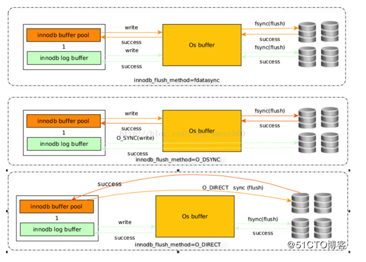
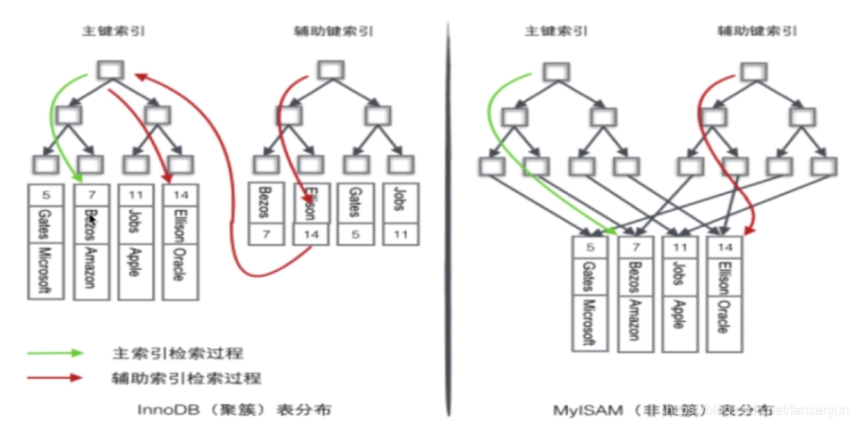

* [Mysql](#mysql)
  * [基础](#%E5%9F%BA%E7%A1%80)
    * [理论范式](#%E7%90%86%E8%AE%BA%E8%8C%83%E5%BC%8F)
    * [数据类型](#%E6%95%B0%E6%8D%AE%E7%B1%BB%E5%9E%8B)
  * [数据库引擎](#%E6%95%B0%E6%8D%AE%E5%BA%93%E5%BC%95%E6%93%8E)
    * [MyISAM](#myisam)
    * [InnoDB](#innodb)
      * [InnoDB刷盘策略](#innodb%E5%88%B7%E7%9B%98%E7%AD%96%E7%95%A5)
    * [区别](#%E5%8C%BA%E5%88%AB)
  * [索引](#%E7%B4%A2%E5%BC%95)
    * [密集索引和稀疏索引的区别](#%E5%AF%86%E9%9B%86%E7%B4%A2%E5%BC%95%E5%92%8C%E7%A8%80%E7%96%8F%E7%B4%A2%E5%BC%95%E7%9A%84%E5%8C%BA%E5%88%AB)
    * [类型](#%E7%B1%BB%E5%9E%8B)
      * [联合索引 最左匹配原则](#%E8%81%94%E5%90%88%E7%B4%A2%E5%BC%95-%E6%9C%80%E5%B7%A6%E5%8C%B9%E9%85%8D%E5%8E%9F%E5%88%99)
    * [数据结构](#%E6%95%B0%E6%8D%AE%E7%BB%93%E6%9E%84)
      * [为什么采用B\+树](#%E4%B8%BA%E4%BB%80%E4%B9%88%E9%87%87%E7%94%A8b%E6%A0%91)
        * [B\+树对于B树的优势体现在查询性能上](#b%E6%A0%91%E5%AF%B9%E4%BA%8Eb%E6%A0%91%E7%9A%84%E4%BC%98%E5%8A%BF%E4%BD%93%E7%8E%B0%E5%9C%A8%E6%9F%A5%E8%AF%A2%E6%80%A7%E8%83%BD%E4%B8%8A)
    * [索引的缺点](#%E7%B4%A2%E5%BC%95%E7%9A%84%E7%BC%BA%E7%82%B9)
    * [索引过程](#%E7%B4%A2%E5%BC%95%E8%BF%87%E7%A8%8B)
        * [Innodb的页结构](#innodb%E7%9A%84%E9%A1%B5%E7%BB%93%E6%9E%84)
        * [查询b\+树索引的流程](#%E6%9F%A5%E8%AF%A2b%E6%A0%91%E7%B4%A2%E5%BC%95%E7%9A%84%E6%B5%81%E7%A8%8B)
    * [索引失效](#%E7%B4%A2%E5%BC%95%E5%A4%B1%E6%95%88)
  * [事务](#%E4%BA%8B%E5%8A%A1)
    * [四大特性](#%E5%9B%9B%E5%A4%A7%E7%89%B9%E6%80%A7)
    * [事务的分类](#%E4%BA%8B%E5%8A%A1%E7%9A%84%E5%88%86%E7%B1%BB)
    * [事务隔离级别以及各个级别下的并发访问问题](#%E4%BA%8B%E5%8A%A1%E9%9A%94%E7%A6%BB%E7%BA%A7%E5%88%AB%E4%BB%A5%E5%8F%8A%E5%90%84%E4%B8%AA%E7%BA%A7%E5%88%AB%E4%B8%8B%E7%9A%84%E5%B9%B6%E5%8F%91%E8%AE%BF%E9%97%AE%E9%97%AE%E9%A2%98)
    * [封锁协议](#%E5%B0%81%E9%94%81%E5%8D%8F%E8%AE%AE)
        * [一级封锁](#%E4%B8%80%E7%BA%A7%E5%B0%81%E9%94%81)
    * [锁的分类](#%E9%94%81%E7%9A%84%E5%88%86%E7%B1%BB)
        * [行锁和表锁](#%E8%A1%8C%E9%94%81%E5%92%8C%E8%A1%A8%E9%94%81)
        * [死锁](#%E6%AD%BB%E9%94%81)
    * [当前读和快照读](#%E5%BD%93%E5%89%8D%E8%AF%BB%E5%92%8C%E5%BF%AB%E7%85%A7%E8%AF%BB)
    * [InnoDB可重复读级别下如何避免幻读](#innodb%E5%8F%AF%E9%87%8D%E5%A4%8D%E8%AF%BB%E7%BA%A7%E5%88%AB%E4%B8%8B%E5%A6%82%E4%BD%95%E9%81%BF%E5%85%8D%E5%B9%BB%E8%AF%BB)
    * [快照读的原理](#%E5%BF%AB%E7%85%A7%E8%AF%BB%E7%9A%84%E5%8E%9F%E7%90%86)
    * [死锁](#%E6%AD%BB%E9%94%81-1)
  * [视图](#%E8%A7%86%E5%9B%BE)
  * [存储过程](#%E5%AD%98%E5%82%A8%E8%BF%87%E7%A8%8B)
  * [优化](#%E4%BC%98%E5%8C%96)
  * [SQL语句](#sql%E8%AF%AD%E5%8F%A5)
      * [常用](#%E5%B8%B8%E7%94%A8)
* [MariaDB](#mariadb)
    * [区别](#%E5%8C%BA%E5%88%AB-1)
* [Tidb](#tidb)
    * [架构](#%E6%9E%B6%E6%9E%84)
* [SQL 、 NoSQL 和 NewSQL 的优缺点比较](#sql--nosql-%E5%92%8C-newsql-%E7%9A%84%E4%BC%98%E7%BC%BA%E7%82%B9%E6%AF%94%E8%BE%83)
  * [SQL](#sql)
  * [NoSQL (Not Only SQL)](#nosql-not-only-sql)
  * [NewSQL](#newsql)

# Mysql

## 基础

### 理论范式

1、列不可再分

2、要有主键

3、所以数据直接依赖于主键，不允许简介依赖，去除传递依赖

### 数据类型

整数型，浮点型，字符串型，二级制，时间

## 数据库引擎

### MyISAM

设计简单，数据以紧密格式存储。对于只读数据，或者表比较小、可以容忍修复操作，则依然可以使用它。

提供了大量的特性，包括压缩表、空间数据索引等。

不支持事务。

不支持行级锁，只能对整张表加锁，读取时会对需要读到的所有表加共享锁，写入时则对表加排它锁。但在表有读取操作的同时，也可以往表中插入新的记录，这被称为并发插入（CONCURRENT INSERT）。

可以手工或者自动执行检查和修复操作，但是和事务恢复以及崩溃恢复不同，可能导致一些数据丢失，而且修复操作是非常慢的。

如果指定了 DELAY_KEY_WRITE 选项，在每次修改执行完成时，不会立即将修改的索引数据写入磁盘，而是会写到内存中的键缓冲区，只有在清理键缓冲区或者关闭表的时候才会将对应的索引块写入磁盘。这种方式可以极大的提升写入性能，但是在数据库或者主机崩溃时会造成索引损坏，需要执行修复操作。

**场景**

1、频繁执行全表count语句

2、对数据进行增删改的频率不高，查询非常频繁

3、没有事务

### InnoDB

是 MySQL 默认的事务型存储引擎，只有在需要它不支持的特性时，才考虑使用其它存储引擎。

实现了四个标准的隔离级别，默认级别是可重复读（REPEATABLE READ）。在可重复读隔离级别下，通过多版本并发控制（MVCC）+ Next-Key Locking 防止幻影读。

主索引是聚簇索引，在索引中保存了数据，从而避免直接读取磁盘，因此对查询性能有很大的提升。

内部做了很多优化，包括从磁盘读取数据时采用的可预测性读、能够加快读操作并且自动创建的自适应哈希索引、能够加速插入操作的插入缓冲区等。

支持真正的在线热备份。其它存储引擎不支持在线热备份，要获取一致性视图需要停止对所有表的写入，而在读写混合场景中，停止写入可能也意味着停止读取。

**场景**

1、增删改查都比较频繁

2、事务

#### InnoDB刷盘策略

通过参数 innodb_flush_method 控制

**fdatasync**

默认方式

调用fsync()去刷数据文件与redo log的buffer

写数据时，write这一步并不需要真正写到磁盘才算完成（可能写入到操作系统buffer中就会返回完成），真正完成是flush操作，buffer交给操作系统去flush,并且文件的元数据信息也都需要更新到磁盘。

**O_DSYNC**

innodb会使用O_SYNC方式打开和刷写redo log,使用fsync()刷写数据文件

写日志操作是在write这步完成，而数据文件的写入是在flush这步通过fsync完成

**O_DIRECT**

数据文件的写入操作是直接从mysql innodb buffer到磁盘的，并不用通过操作系统的缓冲，而真正的完成也是在flush这步,日志还是要经过OS缓冲。

> 首先文件的写操作包括三步：open,write,flush
> 上面最常提到的fsync(int fd)函数，该函数作用是flush时将与fd文件描述符所指文件有关的buffer刷写到磁盘，并且flush完元数据信息(比如修改日期、创建日期等)才算flush成功。
> 使用O_DSYNC方式打开redo文件表示当write日志时，数据都write到磁盘，并且元数据也需要更新，才返回成功。
> O_DIRECT则表示我们的write操作是从MySQL innodb buffer里直接向磁盘上写。

**比较**

1、在类unix操作系统中，文件的打开方式为O_DIRECT会最小化缓冲对io的影响，该文件的io是直接在用户空间的buffer上操作的，并且io操作是同步的，因此不管是read()系统调用还是write()系统调用，数据都保证是从磁盘上读取的；所以IO方面压力最小，对于CPU处理压力上也最小，对物理内存的占用也最小；但是由于没有操作系统缓冲的作用，对于数据写入磁盘的速度会降低明显（表现为写入响应时间的拉长），但不会明显造成整体SQL请求量的降低（这有赖于足够大的innodb_buffer_pool_size）。

2、O_DSYNC方式表示以同步io的方式打开文件，任何写操作都将阻塞到数据写入物理磁盘后才返回。这就造成CPU等待加长，SQL请求吞吐能力降低，insert时间拉长。

3、fsync(int filedes)函数只对由文件描述符filedes指定的单一文件起作用，并且等待写磁盘操作结束，然后返回。fdatasync(int filedes)函数类似于fsync，但它只影响文件的数据部分。而除数据外，fsync还会同步更新文件的元信息到磁盘。

O_DSYNC对CPU的压力最大，datasync次之，O_DIRECT最小；整体SQL语句处理性能和响应时间看，O_DSYNC较差；O_DIRECT在SQL吞吐能力上较好（仅次于datasync模式），但响应时间却是最长的。

默认datasync模式，整体表现较好，因为充分利用了操作系统buffer和innodb_buffer_pool的处理性能，但带来的负面效果是free内存降低过快，最后导致页交换频繁，磁盘IO压力大，这会严重影响大并发量数据写入的稳定性。

### 区别

1、MyISAM默认的是表级锁，不支持行级锁

2、InnoDB默认用的是行级所，也支持表级锁

锁分为读锁和写锁，读锁也叫共享锁（for update 可强行加排他锁），写锁也叫排他锁

innoDB在sql没有用到索引的时候，用的是表锁

## 索引

### 密集索引和稀疏索引的区别

密集索引文件中的每个搜索码值都对应一个索引值，密集索引存放了一行的**所有信息**。

稀疏索引文件只为索引码的某些值建立索引项，稀疏索引只是保存了**键位信息和主键id**

mysam存储引擎，不管是主键索引，唯一键索引还是普通索引都是稀疏索引

**InnoDB 有且仅有一个密集索引**

若一个主键被定义，该主键则作为密集索引

若没有主键被定义，该表的第一个唯一非空索引则作为密集索引

若不满足以上条件，innodb内部会生成一个隐藏主键（密集索引）

innodb 索引和数据放在一个文件里的   *MyISAM* 索引和数据是分开放的

**索引过程**

### 类型

- 普通索引：仅加速查询
- 唯一索引：加速查询 + 列值唯一（可以有null）
- 主键索引：加速查询 + 列值唯一（不可以有null）+ 表中只有一个
- 联合索引：多列值组成一个索引，专门用于组合搜索，其效率大于索引合并

#### 联合索引 最左匹配原则

mysql会一直向右匹配直到遇到范围查询（< > between like）就停止匹配

比如a=3 and b=4 and c>5 and d=6 如果建立（a,b,c,d）顺序的索引，d是用不到索引的，如果建立的是（abdc）的索引则可以用到，、

其中=和in可以乱序

**原因**

mysql建立复合索引，先对第一个地段进行排序，再对第二个字段排序，以此构建B+tree，所以如果在中间有范围查询就拿不到最下面的数据，就不能走索引

### 数据结构

b+树

#### 为什么采用B+树

**hash索引**

缺点

仅仅满足“=”，不能使用范围查询

遇到hash值相等的情况，性能比较低下

**二叉树**

虽然从算法逻辑上来说，二叉查找树的查询速度和比较次数都是最小的，但需要考虑磁盘io，数据库索引是存储在磁盘上的，当数据量比较大的时候，索引的大小也很大。

利用索引查询的时候，只能逐一加载每一页磁盘，这里的磁盘页对应的就是索引树的节点。

磁盘的io次数由索引的高度决定，所以需要尽量把树的高度降下来，这就是b树的作用。

**特征**：（m阶B树）

1、根节点至少有两个子女

2、每个中间节点都包含k-1个元素和k个孩子，其中m/2<=k<=m

3、每个叶子节点都包含k-1个元素，其中m/2<=k<=m

4、所有的叶子节点都位于同一层

5、每个节点中的元素从小到大排序，节点当中k-1个元素正好是k个孩子包含的元素的值域划分。

b树主要应用于文件系统以及部分数据库索引

**b+树**

b+树和b树有一些共同点，但是b+树也具备一些新特特征

1、有k个子树的中间节点包含k个元素（b树中是k-1个元素），每个元素不保存数据，只用来做索引，**所有数据都保存在叶子节点中**。

2、所有的叶子节点中包含了全部元素的信息，及**指向含这些元素记录的指针**，且叶子节点本身依关键字的大小自小到大顺序连接

3、所有的中间节点元素都同时存在于子节点，**在子节点元素中最大或是最小元**素。

还有一个特性，就是**卫星数据**的位置

**卫星数据**，指的是索引元素所指向的数据记录，比如数据库中的一行。在B树中，无论是中间节点还是叶子节点都带有卫星数据，在b+树中，只有叶子节点带有卫星数据，其余中间节点仅仅是索引。

note：

在数据库的聚集索引中，叶子节点直接包含卫星数据，在非聚集索引中，叶子节点带有指向卫星数据的指针。

##### B+树对于B树的优势体现在查询性能上

1、b+树的中间节点没有卫星数据，所以同样大小的磁盘页可以容纳更多的节点元素。就是数据量相同的情况下，b+树的结构更加矮胖

2、B+树的查询速度更加稳定，b-树只要匹配到元素就可以了，无论是匹配元素是中间节点还是叶子节点，但b+树查询必须要查找到叶子节点。

3、范围查询，b+树优势明显，只需要在链表上遍历即可。

### 索引的缺点

数据量小的表不需要索引，建立会增加额外的索引开销

变更数据需要维护索引，需要更多维护成本

需要更多空间

### 索引过程

##### Innodb的页结构

页结构，是innodb存储引擎管理数据库的最小磁盘单位

innodb数据页组成部分

1、file header（文件头）

file header中，有两个指针，表示当前页的上一页和下一页，由此可以看出叶子节点是双向链表串起来的

2、page header（页头）

3、Records user Records（行记录）

行记录中，有两行虚拟的行记录来限定行记录的边界（infimum，supremum）

4、free space（空闲空间）

5、page directory（页目录）

page directory页目录中存放了记录的相对位置，有些时候这些记录指针称为Slots，槽，与其他数据库不同的是，innodb并不是每一个记录都拥有一个槽，innodb中的槽是一个稀疏目录，即一个槽中可以属于多个记录。

槽中记录按照键顺序存放，这样可以利用二分查找快速找到记录的指针。

但由于并不是没个行数据都有槽，所以二分查找的结果只是一个粗略的结果，所以innodb必须通过行记录的recorder header中的next_record来继续查找相关记录。

6、file trailer（文件结尾信息）

##### 查询b+树索引的流程

首先通过b+树索引找到叶节点，找到相应的数据页，然后将数据页加载到内存中，通过二分查找Page directory中的槽，查找出一个相对粗略的位置，然后根据槽的指针指向链表的行数据，之后在链表中依次查找。

**需要注意的是**

b+树索引不能找到具体一条记录，而是只能找到对应的页，把页从磁盘装入内存中，再通过page directory进行二分查找，同时此二分查找也可能找不到具体的行记录，只是能找到一个接近的链表中的点，再从此点开始遍历链表进行查找。

### 索引失效

like 模糊查询 前模糊或者 全模糊不走索引

or 条件中只要有一个字段没有索引，改语句就不走索引

使用 union all 代替 or 这样的话有索引例的就会走索引

in 走索引

not in 不走索引

is null 走索引

is not null  不走索引

!=、<> 不走索引

隐式转换-不走索引（name 字段为 string类型，这里123为数值类型，进行了类型转换，所以不走索引,改为 '123' 则走索引）
explain select * from users u where u.name = 123

函数运算-不走索引

## 事务

### 四大特性

CAID

**原子性 Atomic**

要么全部成功commit，要么全部rollback

**一致性 Consistency**

rollback后的数据和原来的一致

> 原子性和一致性底层：
>
> 在操作数据之前，首先将数据备份到一个地方（这个存储数据备份的地方称为Undo log）。然后进行数据的修改。如果出现了错误，系统利用undo log中的备份将数据恢复到事务开始之前的状态。

**隔离性 isolation**

事务和事务之间不干扰。一个事物必须与另一个事务的执行结果隔离开

> 通过数据库锁的机制实现

**持久性 durability**

执行成功。持久化数据

> 和Undo Log相反，Redo Log记录的是新数据的备份。在事务提交前，只要将Redo Log持久化即可，不需要将数据持久化。当系统崩溃时，虽然数据没有持久化，但是Redo Log已经持久化。系统可以根据Redo Log的内容，将所有数据恢复到最新的状态。

### 事务的分类

1、扁平化事务

所有的操作都在同一层次，平时使用最多的事务，不能提交或是回滚事务的某一部分，要么都成功，要么都回滚

2、带保存点的扁平事务

允许事务在执行过程中，回滚到较早的状态，而不是全部回滚，通过在事务中添加保存点，可选择事务在失败时，回滚到保存点处，

3、链事务

在事务提交时，会将上下文，隐式传递给下一个事务，当事务失败时，可以回滚到最近的事务，不过链事务只能回滚到最近一个保存点，而带保存点的事务可以回滚到任意一个保存点

4、嵌套事务

由顶层事务和子事务构成，类似于树的结构，一般顶层事务负责逻辑处理，子事务负责具体的工作，子事务可以提交，但真正的提交要等到父事务的提交，如果上层事务回滚，那么所有的子事务都会回滚

**5、分布式事务**

在分布式环境中的扁平化事务，常用的分布式事务解决方案

5.1 XA协议

XA协议是保证强一致性的刚性事务，实现方式有两段式提交和三段式提交

两段式提交需要一个事务协调者来保证第一阶段的事务参与者都完成了准备工作，如果协调者收到了所有参与者都准备好的消息，就会通知所有的事务执行第二阶段提交，但是两段式提交如果只有一个进程发生故障，也会导致系统有较长时间的阻塞。

三段式提交通过增加PreCommit阶段来减少两段式提交的系统阻塞时间

5.2 TCC

TCC是满足最终一致性的柔性事务方案，TCC采用补偿机制，核心思想是对每个操作都要注册确认和补偿操作，分为三个阶段，try阶段，主要对业务系统进行检测，即资源预留，confirm阶段进行确认提交，cancel阶段是在事务执行错误进行回滚，释放预留资源，

5.3 消息事务

将本地操作和发送消息封装在一个事务中，保证本地消息和发送消息的原子性，下游应有收到消息后执行相应的操作。

### 事务隔离级别以及各个级别下的并发访问问题

更新丢失  均可避免 包括 **read-uncommitted**

脏读  **Read-committed**及其以上

不可重复读  **repectable read**

幻读 **serializable**（串行化）

脏读：一个事务读取了另一个事务未提交的数据

不可重复读：一个事务读取数据的前后，由于另一个事务对当前行的更改，对同一行读取的数据不同 

幻读：在事务A执行了一个当前读操作，事务B在事务A的影响区域执行了插入数据的操作，此时，事务A再执行一个当前读操作，就出现了幻行。

### 封锁协议

在运用排他锁和共享锁这两种基本封锁对数据库加锁的时候，还需要有一些规定，这些规定称为封锁协议。

通常使用三级封锁协议在不同程度上解决了更新丢失，不可重复读，以及幻读，脏读问题。

##### 一级封锁

事务A在修改数据R之前需要先加排他锁，直到事务结束，可以防止更新丢失。

**二级封锁**

在一级封锁的基础上，在读数据的时候加上共享锁，直到**读**完，可防止脏读

**三级封锁**

在一级封锁的基础上，在读数据的时候加上共享锁，直到**事务**完，可防止不可重复读

### 锁的分类

按锁的粒度 分为  表级锁，行级锁，页级锁

按锁级别划分  共享锁 排他锁

按加锁方式  自动锁 显式锁

按操作划分  DML锁 DDL锁

按使用方式分  乐观锁（sql可用version或是时间戳决定） 悲观锁

##### 行锁和表锁

**行锁**

劣势：开销大；加锁慢；会出现死锁

优势：锁的粒度小，发生锁冲突的概率低；处理并发的能力强

加锁的方式：自动加锁。对于UPDATE、DELETE和INSERT语句，InnoDB会自动给涉及数据集加排他锁；对于普通SELECT语句，InnoDB不会加任何锁；当然我们也可以显示的加锁：

**表锁**

优势：开销小；加锁快；无死锁

劣势：锁粒度大，发生锁冲突的概率高，并发处理能力低

加锁的方式：自动加锁。查询操作（SELECT），会自动给涉及的所有表加读锁，更新操作（UPDATE、DELETE、INSERT），会自动给涉及的表加写锁。也可以显示加锁：

##### 死锁

**如何发现死锁**

查看innodb日志

show engine innodb status \G; 

**情况一**

​	一个用户A 访问表A(锁住了表A),然后又访问表B；另一个用户B 访问表B(锁住了表B)，然后企图访问表A；这时用户A由于用户B已经锁住表B，它必须等待用户B释放表B才能继续，同样用户B要等用户A释放表A才能继续，这就死锁就产生了。

> 解决方法：
>
> 这种死锁比较常见，是由于程序的BUG产生的，除了调整的程序的逻辑没有其它的办法。仔细分析程序的逻辑，对于数据库的多表操作时，尽量按照相同的顺序进 行处理，尽量避免同时锁定两个资源，如操作A和B两张表时，总是按先A后B的顺序处理， 必须同时锁定两个资源时，要保证在任何时刻都应该按照相同的顺序来锁定资源。

**情况二**

用户A查询一条纪录，然后修改该条纪录；这时用户B修改该条纪录，这时用户A的事务里锁的性质由查询的共享锁企图上升到独占锁，而用户B里的独占锁由于A 有共享锁存在所以必须等A释放掉共享锁，而A由于B的独占锁而无法上升的独占锁也就不可能释放共享锁，于是出现了死锁。这种死锁比较隐蔽，但在稍大点的项 目中经常发生。如在某项目中，页面上的按钮点击后，没有使按钮立刻失效，使得用户会多次快速点击同一按钮，这样同一段代码对数据库同一条记录进行多次操 作，很容易就出现这种死锁的情况。

> 解决方法：
>
> 1、对于按钮等控件，点击后使其立刻失效，不让用户重复点击，避免对同时对同一条记录操作。
> 2、使用乐观锁进行控制。乐观锁大多是基于数据版本（Version）记录机制实现。即为数据增加一个版本标识，在基于数据库表的版本解决方案中，一般是 通过为数据库表增加一个“version”字段来实现。读取出数据时，将此版本号一同读出，之后更新时，对此版本号加一。此时，将提交数据的版本数据与数 据库表对应记录的当前版本信息进行比对，如果提交的数据版本号大于数据库表当前版本号，则予以更新，否则认为是过期数据。乐观锁机制避免了长事务中的数据 库加锁开销（用户A和用户B操作过程中，都没有对数据库数据加锁），大大提升了大并发量下的系统整体性能表现。Hibernate 在其数据访问引擎中内置了乐观锁实现。需要注意的是，由于乐观锁机制是在我们的系统中实现，来自外部系统的用户更新操作不受我们系统的控制，因此可能会造 成脏数据被更新到数据库中。
> 3、使用悲观锁进行控制。悲观锁大多数情况下依靠数据库的锁机制实现，如Oracle的Select … for update语句，以保证操作最大程度的独占性。但随之而来的就是数据库性能的大量开销，特别是对长事务而言，这样的开销往往无法承受。如一个金融系统， 当某个操作员读取用户的数据，并在读出的用户数据的基础上进行修改时（如更改用户账户余额），如果采用悲观锁机制，也就意味着整个操作过程中（从操作员读 出数据、开始修改直至提交修改结果的全过程，甚至还包括操作员中途去煮咖啡的时间），数据库记录始终处于加锁状态，可以想见，如果面对成百上千个并发，这 样的情况将导致灾难性的后果。所以，采用悲观锁进行控制时一定要考虑清楚。

**情况三**

如果在事务中执行了一条不满足条件的update语句，则执行全表扫描，把行级锁上升为表级锁，多个这样的事务执行后，就很容易产生死锁和阻塞。类似的情 况还有当表中的数据量非常庞大而索引建的过少或不合适的时候，使得经常发生全表扫描，最终应用系统会越来越慢，最终发生阻塞或死锁。

> 解决方法：
>
> SQL语句中不要使用太复杂的关联多表的查询；使用“执行计划”对SQL语句进行分析，对于有全表扫描的SQL语句，建立相应的索引进行优化。

### 当前读和快照读

当前读：

select ..lock in share mode

select...for update

update

delete

insert

快照读

不加锁的非阻塞读，select（有可能会读到历史数据）

### InnoDB可重复读级别下如何避免幻读

**1、使用了快照读（非阻塞读），即伪MVCC**

mvcc是Multi-Version Concurrency Control，多版本并发控制 ，为什么是伪MVCC呢，因为mysql并没有把所有的版本记录下来，而是在undo日志里记录当前活跃的事务。

**2、实际上是next-key（行锁+gap锁）**

gap使用时机：

用在非唯一索引，或是不走索引，或是没有全部命中的主键索引，的当前读中

### 快照读的原理

1、利用了数据行的隐藏列  DB_TRX_ID  DB_ROLL_PTR  DB_ROW_ID

2、undo日志 undolog：对数据产生了变更操作时，就会产生undolog，存储的是历史数据

insert undolog

update undolog

3、read view

在RR级别下，第一条快照读，会创建一条快照，read view，将系统中其他的活跃的事务记录起来，以后再调用快照读时，还是同一条read view

### 死锁

## 视图

视图是虚拟的表，本身不包含数据，也就不能对其进行索引操作。

对视图的操作和对普通表的操作一样。

视图具有如下好处：

- 简化复杂的 SQL 操作，比如复杂的连接；
- 只使用实际表的一部分数据；
- 通过只给用户访问视图的权限，保证数据的安全性；
- 更改数据格式和表示。

## 存储过程

存储过程可以看成是对一系列 SQL 操作的批处理。

使用存储过程的好处：

- 代码封装，保证了一定的安全性；
- 代码复用；
- 由于是预先编译，因此具有很高的性能。

存储过程思想就是sql语言层面的封装和重用

## 优化

## SQL语句

#### 常用

group by

having

count sum max min avg

**group by** 

1、满足“select 子句中的列名必须为分组列或是列函数”

2、列函数对于group by子句定义的每个组各返回一个结果

**having**

1、通常和group by子句一起使用

2、where过滤行，having过滤组

3、出现在同一sql的顺序，where>group by>having

# MariaDB 

MariaDB数据库管理系统是MySQL的一个分支，主要由开源社区在维护，采用GPL授权许可。开发这个分支的原因之一是：甲骨文公司收购了MySQL后，有将MySQL闭源的潜在风险，因此社区采用分支的方式来避开这个风险。

MariaDB的目的是完全兼容MySQL，包括API和命令行，使之能轻松成为MySQL的代替品。

在存储引擎方面，10.0.9版起使用XtraDB（名称代号为Aria）来代替MySQL的InnoDB。

### 区别

**json支持**

从 5.7 版本开始，MySQL 支持由 RFC 7159 定义的原生 JSON 数据类型，可以高效地访问 JSON 文档中的数据。MariaDB不支持

**线程池**

MariaDB 支持连接线程池，这对于短查询和 CPU 密集型的工作负载（OLTP）来说非常有用。在 MySQL 的社区版本中，线程数是固定的，因而限制了这种灵活性。MySQL 计划在企业版中增加线程池功能。

# Tidb

我们的程序没有任何改动就完成了数据库从mysql到TiDb的转换，TiDB 是一个分布式 NewSQL 数据库

### 架构

１TiDB Server
　TiDB Server 负责接收 SQL 请求，处理 SQL 相关的逻辑，并通过 PD 找到存储计算所需数据的 TiKV 地址，与 TiKV 交互获取数据，最终返回结果。 TiDB Server是无状态的，其本身并不存储数据，只负责计算，可以无限水平扩展，可以通过负载均衡组件（如LVS、HAProxy 或F5）对外提供统一的接入地址。
２PD Server
　Placement Driver (简称 PD) 是整个集群的管理模块，其主要工作有三个： 一是存储集群的元信息（某个 Key 存储在哪个 TiKV 节点）；二是对 TiKV 集群进行调度和负载均衡（如数据的迁移、Raft group leader的迁移等）；三是分配全局唯一且递增的事务 ID。 　　
　PD 是一个集群，需要部署奇数个节点，一般线上推荐至少部署 3 个节点。
３TiKV Server
　TiKV Server 负责存储数据，从外部看 TiKV 是一个分布式的提供事务的 Key-Value 存储引擎。存储数据的基本单位是 Region，每个 Region 负责存储一个 Key Range （从 StartKey 到EndKey 的左闭右开区间）的数据，每个 TiKV 节点会负责多个 Region 。TiKV 使用 Raft协议做复制，保持数据的一致性和容灾。副本以 Region 为单位进行管理，不同节点上的多个 Region 构成一个 RaftGroup，互为副本。数据在多个 TiKV 之间的负载均衡由 PD 调度，这里也是以 Region 为单位进行调度。

# SQL 、 NoSQL 和 NewSQL 的优缺点比较

## SQL

SQL是关系型数据库管理系统（RDBMS），顾名思义，它是围绕关系代数和元组关系演算构建的。 70年代以来，它一直是主要的数据库解决方案，只是最近才有了其他产品的空间。 不管有些人说什么，这意味着它一直能出色地执行广泛的任务。 其主要优点如下：

- 不同的角色（开发者，用户，数据库管理员）使用相同的语言。
- 不同的RDBMS使用统一标准的语言。
- SQL使用一种高级的非结构化查询语言。.
- 它坚持 [ACID](http://searchsqlserver.techtarget.com/definition/ACID) 准则 (原子性，一致性，隔离性，持久性),，这些准则保证了数据库尤其是每个事务的稳定性，安全性和可预测性。

## NoSQL (Not Only SQL)

NoSQL越来越受欢迎，其中最重要的实现是Apache Cassandra，MongoDB等产品。 它主要用于解决SQL的可扩展性问题。 因此，它是没有架构的并且建立在分布式系统上，这使得它易于扩展和分片。

然而，这些好处是以放宽ACID原则为代价的：NoSQL采取最终一致性原则，而不是所有四个参数在每个事务中保持一致。 这意味着如果在特定时间段内没有特定数据项的更新，则最终对其所有的访问都将返回最后更新的值。 这就是这样的系统通常被描述为提供基本保证的原因（基本可用，软状态，最终一致性） — 而不是ACID。

虽然这个方案极大地增加了可用时间和伸缩性,它也会导致数据丢失----这个问题的严重程度取决于数据库服务器的支持情况和应用代码质量.在某些情况下,这个问题十分严重.

## NewSQL

NewSQL是一种相对较新的形式，旨在使用现有的编程语言和以前不可用的技术来结合SQL和NoSQL中最好的部分。 NewSQL目标是将SQL的ACID保证与NoSQL的可扩展性和高性能相结合。

显然，因为结合了过去仅单独存在的优点，NewSQL看起来很有前途; 或许，在未来的某个时候，它将成为大多数人使用的标准。 不幸的是，目前大多数NewSQL数据库都是专有软件或仅适用于特定场景，这显然限制了新技术的普及和应用。

除此之外，NewSQL在每个方面比较均匀，每个解决方案都有自己的缺点和优势。 例如，SAP HANA可以轻松处理低到中等的事务性工作负载，但不使用本机集群，MemSQL对于集群分析很有用，但在ACID事务上表现出较差的一致性，等等。 因此，在这些解决方案变得真正普及之前，可能还需要一段时间。

