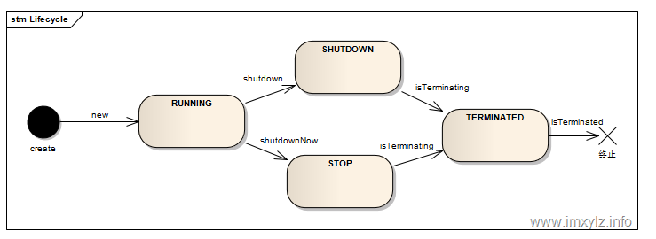

* [JMM](#jmm)
* [Thread](#thread)
  * [创建方法](#%E5%88%9B%E5%BB%BA%E6%96%B9%E6%B3%95)
  * [方法比较](#%E6%96%B9%E6%B3%95%E6%AF%94%E8%BE%83)
    * [wait和notify](#wait%E5%92%8Cnotify)
        * [实现消费者生产者模型](#%E5%AE%9E%E7%8E%B0%E6%B6%88%E8%B4%B9%E8%80%85%E7%94%9F%E4%BA%A7%E8%80%85%E6%A8%A1%E5%9E%8B)
    * [wait和sleep](#wait%E5%92%8Csleep)
    * [yield](#yield)
    * [interrupt](#interrupt)
    * [线程安全问题的主要诱因](#%E7%BA%BF%E7%A8%8B%E5%AE%89%E5%85%A8%E9%97%AE%E9%A2%98%E7%9A%84%E4%B8%BB%E8%A6%81%E8%AF%B1%E5%9B%A0)
  * [生命周期](#%E7%94%9F%E5%91%BD%E5%91%A8%E6%9C%9F)
  * [ThreadLocal](#threadlocal)
    * [实现机制](#%E5%AE%9E%E7%8E%B0%E6%9C%BA%E5%88%B6)
    * [ThreadLocal 如何保证Local属性？](#threadlocal-%E5%A6%82%E4%BD%95%E4%BF%9D%E8%AF%81local%E5%B1%9E%E6%80%A7)
    * [如何自己实现一个ThreadLocal](#%E5%A6%82%E4%BD%95%E8%87%AA%E5%B7%B1%E5%AE%9E%E7%8E%B0%E4%B8%80%E4%B8%AAthreadlocal)
* [并发关键字](#%E5%B9%B6%E5%8F%91%E5%85%B3%E9%94%AE%E5%AD%97)
  * [synchronized](#synchronized)
    * [特性](#%E7%89%B9%E6%80%A7)
    * [对象锁和类锁](#%E5%AF%B9%E8%B1%A1%E9%94%81%E5%92%8C%E7%B1%BB%E9%94%81)
    * [synchronized底层实现原理](#synchronized%E5%BA%95%E5%B1%82%E5%AE%9E%E7%8E%B0%E5%8E%9F%E7%90%86)
      * [对象头](#%E5%AF%B9%E8%B1%A1%E5%A4%B4)
      * [monitor](#monitor)
    * [synchronized是可重入锁](#synchronized%E6%98%AF%E5%8F%AF%E9%87%8D%E5%85%A5%E9%94%81)
    * [synchronized的优化](#synchronized%E7%9A%84%E4%BC%98%E5%8C%96)
      * [自旋锁   PreBlockSpin](#%E8%87%AA%E6%97%8B%E9%94%81---preblockspin)
      * [自适应自旋锁](#%E8%87%AA%E9%80%82%E5%BA%94%E8%87%AA%E6%97%8B%E9%94%81)
      * [锁消除](#%E9%94%81%E6%B6%88%E9%99%A4)
      * [锁粗化](#%E9%94%81%E7%B2%97%E5%8C%96)
    * [synchronized的四种状态](#synchronized%E7%9A%84%E5%9B%9B%E7%A7%8D%E7%8A%B6%E6%80%81)
        * [偏向锁](#%E5%81%8F%E5%90%91%E9%94%81)
        * [轻量锁](#%E8%BD%BB%E9%87%8F%E9%94%81)
        * [重量级锁](#%E9%87%8D%E9%87%8F%E7%BA%A7%E9%94%81)
  * [volatile](#volatile)
    * [volatile ：jvm提供的轻量级同步机制](#volatile-jvm%E6%8F%90%E4%BE%9B%E7%9A%84%E8%BD%BB%E9%87%8F%E7%BA%A7%E5%90%8C%E6%AD%A5%E6%9C%BA%E5%88%B6)
    * [可见性](#%E5%8F%AF%E8%A7%81%E6%80%A7)
    * [volatile如何禁止重排优化](#volatile%E5%A6%82%E4%BD%95%E7%A6%81%E6%AD%A2%E9%87%8D%E6%8E%92%E4%BC%98%E5%8C%96)
    * [指令重排序需要满足的条件](#%E6%8C%87%E4%BB%A4%E9%87%8D%E6%8E%92%E5%BA%8F%E9%9C%80%E8%A6%81%E6%BB%A1%E8%B6%B3%E7%9A%84%E6%9D%A1%E4%BB%B6)
      * [happens\-before](#happens-before)
* [JUC](#juc)
  * [ReentrantLock](#reentrantlock)
    * [常用方法](#%E5%B8%B8%E7%94%A8%E6%96%B9%E6%B3%95)
    * [公平性设置](#%E5%85%AC%E5%B9%B3%E6%80%A7%E8%AE%BE%E7%BD%AE)
    * [ReentrantLock将锁对象化](#reentrantlock%E5%B0%86%E9%94%81%E5%AF%B9%E8%B1%A1%E5%8C%96)
    * [ReentrantLock和synchronized的区别](#reentrantlock%E5%92%8Csynchronized%E7%9A%84%E5%8C%BA%E5%88%AB)
    * [AQS](#aqs)
      * [概念](#%E6%A6%82%E5%BF%B5)
      * [框架](#%E6%A1%86%E6%9E%B6)
      * [<strong>比较重要的内部方法</strong>](#%E6%AF%94%E8%BE%83%E9%87%8D%E8%A6%81%E7%9A%84%E5%86%85%E9%83%A8%E6%96%B9%E6%B3%95)
  * [原子类](#%E5%8E%9F%E5%AD%90%E7%B1%BB)
    * [AtomicInteger](#atomicinteger)
    * [LongAdder](#longadder)
    * [CAS](#cas)
      * [Unsafe类](#unsafe%E7%B1%BB)
      * [和CAS相关的API](#%E5%92%8Ccas%E7%9B%B8%E5%85%B3%E7%9A%84api)
      * [CAS的ABA问题及其解决方法](#cas%E7%9A%84aba%E9%97%AE%E9%A2%98%E5%8F%8A%E5%85%B6%E8%A7%A3%E5%86%B3%E6%96%B9%E6%B3%95)
  * [ReentrantReadWriteLock](#reentrantreadwritelock)
    * [线程进入读锁的前提条件：](#%E7%BA%BF%E7%A8%8B%E8%BF%9B%E5%85%A5%E8%AF%BB%E9%94%81%E7%9A%84%E5%89%8D%E6%8F%90%E6%9D%A1%E4%BB%B6)
    * [线程进入写锁的前提条件：](#%E7%BA%BF%E7%A8%8B%E8%BF%9B%E5%85%A5%E5%86%99%E9%94%81%E7%9A%84%E5%89%8D%E6%8F%90%E6%9D%A1%E4%BB%B6)
    * [特性：](#%E7%89%B9%E6%80%A7-1)
  * [线程池](#%E7%BA%BF%E7%A8%8B%E6%B1%A0)
    * [种类](#%E7%A7%8D%E7%B1%BB)
    * [优势](#%E4%BC%98%E5%8A%BF)
    * [线程池生命周期](#%E7%BA%BF%E7%A8%8B%E6%B1%A0%E7%94%9F%E5%91%BD%E5%91%A8%E6%9C%9F)
    * [任务生命周期](#%E4%BB%BB%E5%8A%A1%E7%94%9F%E5%91%BD%E5%91%A8%E6%9C%9F)
    * [juc的三个executor接口](#juc%E7%9A%84%E4%B8%89%E4%B8%AAexecutor%E6%8E%A5%E5%8F%A3)
    * [ThreadPoolExecutor](#threadpoolexecutor)
      * [构造函数](#%E6%9E%84%E9%80%A0%E5%87%BD%E6%95%B0)
      * [线程饱和策列](#%E7%BA%BF%E7%A8%8B%E9%A5%B1%E5%92%8C%E7%AD%96%E5%88%97)
      * [运行流程](#%E8%BF%90%E8%A1%8C%E6%B5%81%E7%A8%8B)
      * [线程池的状态](#%E7%BA%BF%E7%A8%8B%E6%B1%A0%E7%9A%84%E7%8A%B6%E6%80%81)
      * [线程池大小选择](#%E7%BA%BF%E7%A8%8B%E6%B1%A0%E5%A4%A7%E5%B0%8F%E9%80%89%E6%8B%A9)
      * [对于query的选择，以及排队的策略](#%E5%AF%B9%E4%BA%8Equery%E7%9A%84%E9%80%89%E6%8B%A9%E4%BB%A5%E5%8F%8A%E6%8E%92%E9%98%9F%E7%9A%84%E7%AD%96%E7%95%A5)
      * [拒绝服务策略](#%E6%8B%92%E7%BB%9D%E6%9C%8D%E5%8A%A1%E7%AD%96%E7%95%A5)
  * [并发工具类](#%E5%B9%B6%E5%8F%91%E5%B7%A5%E5%85%B7%E7%B1%BB)
    * [闭锁 CountDownLatch](#%E9%97%AD%E9%94%81-countdownlatch)
    * [栅栏 CyclicBarrier](#%E6%A0%85%E6%A0%8F-cyclicbarrier)
      * [<strong>CyclicBarrier 与 CountDownLatch 区别</strong>](#cyclicbarrier-%E4%B8%8E-countdownlatch-%E5%8C%BA%E5%88%AB)
    * [信号量 Semaphore](#%E4%BF%A1%E5%8F%B7%E9%87%8F-semaphore)
    * [交换器 Exchanger](#%E4%BA%A4%E6%8D%A2%E5%99%A8-exchanger)
* [死锁](#%E6%AD%BB%E9%94%81)
  * [四个基本条件](#%E5%9B%9B%E4%B8%AA%E5%9F%BA%E6%9C%AC%E6%9D%A1%E4%BB%B6)
  * [应对死锁](#%E5%BA%94%E5%AF%B9%E6%AD%BB%E9%94%81)
    * [死锁预防](#%E6%AD%BB%E9%94%81%E9%A2%84%E9%98%B2)
    * [避免死锁](#%E9%81%BF%E5%85%8D%E6%AD%BB%E9%94%81)
    * [死锁检测与解除](#%E6%AD%BB%E9%94%81%E6%A3%80%E6%B5%8B%E4%B8%8E%E8%A7%A3%E9%99%A4)

# JMM

jmm的主要目标是定义程序中变量的访问规则

由于指令重排序的存在，这个写读的顺序可能会被打乱，所有jmm需要提供可见性，原子性，有序性


# Thread

## 创建方法

* 继承Thread类创建线程

* 实现Runnable接口创建线程

* 使用Callable和Future创建线程

> 和Runnable接口不一样，Callable接口提供了一个call（）方法作为线程执行体，call()方法比run()方法功能要强大。
>
> call()方法可以有返回值
>
> call()方法可以声明抛出异常
>
> Java5提供了Future接口来代表Callable接口里call()方法的返回值，并且为Future接口提供了一个实现类FutureTask，这个实现类既实现了Future接口，还实现了Runnable接口，因此可以作为Thread类的target。在Future接口里定义了几个公共方法来控制它关联的Callable任务。

## 方法比较

### wait和notify

1、wait()、notify/notifyAll() 方法是Object的本地final方法，无法被重写。

2、wait()使当前线程阻塞，前提是 必须先获得锁，一般**配合synchronized 关键字使用**，即，一般在synchronized 同步代码块里使用 wait()、notify/notifyAll() 方法。

3、 由于 wait()、notify/notifyAll() 在synchronized 代码块执行，说明当前线程一定是获取了锁的。

当线程执行wait()方法时候，会释放当前的锁，然后让出CPU，进入等待状态。

只有当 notify/notifyAll() 被执行时候，才会唤醒一个或多个正处于等待状态的线程，然后继续往下执行，直到执行完synchronized 代码块的代码或是中途遇到wait() ，再次释放锁。

4、notify 和wait 的顺序不能错，如果A线程先执行notify方法，B线程在执行wait方法，那么B线程是无法被唤醒的。

5、**notify 和 notifyAll的区别**

notify方法只唤醒一个等待（对象的）线程并使该线程开始执行。所以如果有多个线程等待一个对象，这个方法只会唤醒其中一个线程，选择哪个线程取决于操作系统对多线程管理的实现。notifyAll 会唤醒所有等待(对象的)线程，尽管哪一个线程将会第一个处理取决于操作系统的实现。如果当前情况下有多个线程需要被唤醒，推荐使用notifyAll 方法。比如在生产者-消费者里面的使用，每次都需要唤醒所有的消费者或是生产者，以判断程序是否可以继续往下执行。

##### 实现消费者生产者模型

```java
public class Producer extends Thread{
    //每次生产的数量
    private int num ;

    //所属的仓库
    public AbstractStorage abstractStorage;

    public Producer(AbstractStorage abstractStorage){
        this.abstractStorage = abstractStorage;
    }

    public void setNum(int num){
        this.num = num;
    }

    // 线程run函数
    @Override
    public void run()
    {
        produce(num);
    }

    // 调用仓库Storage的生产函数
    public void produce(int num)
    {
        abstractStorage.produce(num);
    }
}
```

### wait和sleep

- 这两个方法来自不同的类分别是Thread和Object  
- 最主要是sleep方法没有释放锁，而wait方法释放了锁，使得其他线程可以使用同步控制块或者方法(锁代码块和方法锁)。
- wait，notify和notifyAll只能在同步控制方法或者同步控制块里面使用，而sleep可以在任何地方使用(使用范围)  
- sleep必须捕获异常，而wait，notify和notifyAll不需要捕获异常  

### yield

概念：

当调用Thread.yield()函数时，会给线程调度器一个当前线程愿意让出CPU使用的暗示，但是线程调度器可能会忽略这个暗示。

### interrupt

目前使用的方法

调用interrupt()，，通知线程应该中断了

1、如果线程处于被阻塞状态，那么线程将立即退出被阻塞状态，并抛出一个IntertuptedException异常

2、如果线程处于正常活动状态，那么会将该线程的中断标志设置为true，被设置中断标志的线程将继续正常运行。

3、需要被调用的线程配合中断

在正常运行任务时，经常检查本线程的中断标记位，如果被设置了中断标记就自动停止线程00000

### 线程安全问题的主要诱因

1、存在共享数据

2、存在多条线程共同操作这些共享数据

解决问题的根本方法：

同一时刻有且只有一个线程在操作共享数据，其他线程必须等到该线程处理完数据后再对共享数据进行操作。

## 生命周期


## ThreadLocal

线程独享的数据

**用法**

1、ThreadLocal.get: 获取ThreadLocal中当前线程共享变量的值。

2、ThreadLocal.set: 设置ThreadLocal中当前线程共享变量的值。

3、ThreadLocal.remove: 移除ThreadLocal中当前线程共享变量的值。

4、ThreadLocal.initialValue: ThreadLocal没有被当前线程赋值时或当前线程刚调用remove方法后调用get方法，返回此方法值。

### 实现机制

使用弱引用的threadlocalMap

```java
static class Entry extends WeakReference<ThreadLocal> {
            /** The value associated with this ThreadLocal. */
            Object value;

            Entry(ThreadLocal k, Object v) {
                super(k);
                value = v;
            }
        }

```

Entry 是一个包含 key 和 value 的一个对象，Entry的key为ThreadLocal，value为ThreadLocal对应的值，只不过是对这个Entry做了一些特殊处理，即 使用 `WeakReference<ThreadLocal>`将 `ThreadLocal`对象变成一个弱引用的对象，这样做的好处就是在线程销毁的时候，对应的实体就会被回收，不会出现内存泄漏。

### ThreadLocal 如何保证Local属性？

当需要使用多线程时，有个变量恰巧不需要共享，此时就不必使用synchronized这么麻烦的关键字来锁住，每个线程都相当于在堆内存中开辟一个空间，线程中带有对共享变量的缓冲区，通过缓冲区将堆内存中的共享变量进行读取和操作，ThreadLocal相当于线程内的内存，一个局部变量。每次可以对线程自身的数据读取和操作，并不需要通过缓冲区与 主内存中的变量进行交互。并不会像synchronized那样修改主内存的数据，再将主内存的数据复制到线程内的工作内存。ThreadLocal可以让线程独占资源，存储于线程内部，避免线程堵塞造成CPU吞吐下降。

在每个Thread中包含一个ThreadLocalMap，ThreadLocalMap的key是ThreadLocal的对象，value是独享数据。

### ThreadLocal内存泄漏

ThreadLocalMap的key为ThreadLocal实例，他是一个弱引用，我们知道弱引用有利于GC的回收，当key == null时，GC就会回收这部分空间，但**value不一定能被回收**，因为他和Current Thread之间还存在一个强引用的关系。由于这个强引用的关系，会导致value无法回收，如果线程对象不消除这个强引用的关系，就可能会出现OOM。有些时候，我们调用ThreadLocalMap的**remove()方法进行显式处理**。

### 如何自己实现一个ThreadLocal

用一个线程安全的map来模拟ThreadLocalMap

```java
public class SimpleThreadLocal<T>{
    /**
     * Key为线程对象，Value为传入的值对象
     */
    private Map<Thread, T> valueMap = Collections.synchronizedMap(new HashMap<Thread, T>());

    /**
     * 设值
     * @param value Map键值对的value
     */
    public void set(T value) {
        valueMap.put(Thread.currentThread(), value);
    }

    /**
     * 取值
     * @return
     */
    public T get() {
        Thread currentThread = Thread.currentThread();
        //返回当前线程对应的变量
        T t = valueMap.get(currentThread);
        //如果当前线程在Map中不存在，则将当前线程存储到Map中
        if (t == null && !valueMap.containsKey(currentThread)) {
            t = initialValue();
            valueMap.put(currentThread, t);
        }
        return t;
    }

    public void remove() {
        valueMap.remove(Thread.currentThread());
    }

    public T initialValue() {
        return null;
    }
```

# 并发关键字

## synchronized


synchronized是对对象进行加锁，在jvm中，对象在内存中分为三块区域，对象头，实例数据，和对齐填充，在对象头中保留了锁标志位和指向monitor对象的起始地址，当monitor被某个线程占用后，就会处于锁定状态，monitor中的owner部分会指向持有monitor的线程，monitor还有两个队列用于存放进入以及等待锁的线程

synchronized应用在方法上时，是通过字节码ACC_synchronized实现的

synchronized应用在同步块时，是通过字节码monitorenter和monitorexit实现的

针对synchronized获取锁的方式，jvm通过锁升级的方式优化锁，偏向锁，轻量锁，重量级锁

synchronized很强大，既可以保证可见性，又可以保证原子性，而volatile不能保证原子性！

### 特性

1、互斥性：即在同一时刻只允许一个线程持有某个对象锁，通过这种特性来实现多线程的协调机制，这样在同一时间只有一个线程对需要同步的代码块。互斥性页称作操作的原子性

2、可见性：必须确保在锁被释放之前，对共享变量所做的修改，对于随后获得该锁的另一个线程是可见的，否则另一个线程可能是本地缓存的某个副本上继续操作，从而引起不一致。

synchronized锁的不是代码，锁的都是对象。

### 对象锁和类锁

**获取对象锁**

1、同步代码块(synchronized(this)，synchronized(类实例对象))，锁是小括号()中的实例对象

2、同步非静态方法，锁是当前对象的实例对象

**获取类锁**

1、同步代码块(synchronized(类.class))，锁是小括号（）中的类对象（Class对象）

2、同步静态方法，（synchronized static method），锁是当前对象的类对象

**对象锁和类锁的总结**

1、有线程访问对象的同步代码块，另外的线程可以访问该对象的非同步代码块

2、若锁住的是同一个对象，一个线程在访问对象的同步代码块时，另一个访问对象的同步代码块的线程会被阻塞

3、若锁住的是同一个对象，一个线程在访问对象的同步方法时，另一个访问对象同步方法的线程会被阻塞

4、若锁住的是同一个对象，一个线程在访问对象的同步代码块时，另一个访问对象同步方法的线程会被阻塞，反之亦然

5、同一个类的不同对象的对象锁互不干扰

6、类锁由于也是一中特殊的对象锁，因此表现和上述1，2，3，4一致，而由于一个类只能有一个对象锁，所以同一个类的不同对象使用类锁将会是同步的

7、类锁和对象锁互补干扰

### synchronized底层实现原理

1、java对象头

2、Monitor

#### 对象头

对象在内存中的布局包括三个

1、对象头 ，

结构包括 Mark Word ， Class Metadata Address

Mark Word 包括hashCode，分代年龄，锁类型等信息，重量级锁（指针指向的是monitor的起始地址，synchronized锁）

Class Metadata Address  类型指针指向对象的类元数据，jvm通过这个指针确定该对象是哪个类的数据

2、实例数据

3、对齐填充

#### monitor

每个java对象天生自带一把看不见的锁

### synchronized是可重入锁

什么是重入

从互斥锁的设计上来说，当一个线程试图操作一个由其他线程持有的对象锁的临界资源时，将会处于阻塞状态，但是当一个线程再次请求自己持有对象锁的资源时，这种情况属于重入

### synchronized的优化

#### 自旋锁   PreBlockSpin

许多情况下，共享数据的锁定状态持续时间短，切换线程不值得

通过让线程执行忙循环等待锁的释放，不让出CPU

缺点：若锁被其他线程长时间占用，会带来许多性能上的开销

#### 自适应自旋锁

1、自旋的次数不再固定

2、由前一次在同一个锁上的自旋时间及锁的拥有者的状态来决定

#### 锁消除

**优化**

编译时，对上下文进行扫描，去除不可能存在竞争的锁

#### 锁粗化

**另一种极端**

扩大加锁的范围，避免反复加锁和解锁

### synchronized的四种状态

无锁  偏向锁 轻量级锁 重量级锁

**锁降级**

**锁膨胀**

##### 偏向锁

减少同一线程获取锁的代价

大多数情况下，锁不存在多线程竞争，总是同一个线程多次获得

核心思想：

如果一个线程获得了锁，那么锁就进入偏向模式，此时mark word的结构也变为偏向锁，当该线程再次请求锁时，无需再做任何同步操作，即获取锁的过程只需要检查mark word的锁标记以及当前线程id等于mark word的threadid即可，这样就省去了大量有关锁的申请操作

不适合锁竞争激烈的场合

##### 轻量锁

轻量级锁是偏向锁升级来的，偏向锁运行在一个线程进入同步块的情况下，当第二个线程加入锁争用的时候，偏向锁就会升级为轻量锁

适用的场景：线程交替执行同步块

若存在同一时间访问同一锁的情况，就会导致轻量锁膨胀为重量锁

##### 重量级锁

使用场景：同步块执行时间较长的场景

## volatile 

synchronized很强大，既可以保证可见性，又可以保证原子性，而volatile不能保证原子性！

### volatile ：jvm提供的轻量级同步机制

1、保证被volatile修饰的共享变量对所有线程总是可见的

2、禁止指令重排序优化

### 可见性

当写一个volatile变量时，jmm会把该线程对应的工作内存中的共享变量值刷新到主内存中

当读取一个volatile变量时，jmm会把该线程对应的工作内存设置为无效

### volatile如何禁止重排优化

利用内存屏障

1、保证特定操作的执行顺序

2、保证某些变量的内存可见性

通过插入内存屏障指令禁止在内存屏障前后的指令执行排序优化

> 程序在运行时内存实际的访问顺序和程序代码编写的访问顺序不一定一致，这就是内存乱序访问。内存乱序访问行为出现的理由是为了提升程序运行时的性能。内存乱序访问主要发生在两个阶段：
>
> 1. 编译时，编译器优化导致内存乱序访问（指令重排）
> 2. 运行时，多 CPU 间交互引起内存乱序访问
>
> Memory Barrier 能够让 CPU 或编译器在内存访问上有序。一个 Memory Barrier 之前的内存访问操作必定先于其之后的完成。Memory Barrier 包括两类：

### 指令重排序需要满足的条件

1、在单线程环境中不能改变程序运行的结果

2、存在数据依赖关系的不允许重排序

即是

**无法通过happens-before原则推导出来，才能进行指令的重排序**

#### happens-before

**用happens-before的概念来阐述操作之间的内存可见性。**

volatile变量规则是其中一条规则。

在Java内存模型中，happens-before 应该翻译成：前一个操作的结果可以被后续的操作获取。讲白点就是前面一个操作把变量a赋值为1，那后面一个操作肯定能知道a已经变成了1。 

> 程序次序规则：在一个线程内一段代码的执行结果是有序的。就是还会指令重排，但是随便它怎么排，结果是按照我们代码的顺序生成的不会变！
>
> 管程锁定规则：就是无论是在单线程环境还是多线程环境，对于同一个锁来说，一个线程对这个锁解锁之后，另一个线程获取了这个锁都能看到前一个线程的操作结果！(管程是一种通用的同步原语，synchronized就是管程的实现）
>
> volatile变量规则：就是如果一个线程先去写一个volatile变量，然后一个线程去读这个变量，那么这个写操作的结果一定对读的这个线程可见。
>
> 线程启动规则：在主线程A执行过程中，启动子线程B，那么线程A在启动子线程B之前对共享变量的修改结果对线程B可见。
>
> 线程终止规则：在主线程A执行过程中，子线程B终止，那么线程B在终止之前对共享变量的修改结果在线程A中可见。
>
> 线程中断规则：对线程interrupt()方法的调用先行发生于被中断线程代码检测到中断事件的发生，可以通过Thread.interrupted()检测到是否发生中断。
>
> 传递规则：这个简单的，就是happens-before原则具有传递性，即A happens-before B ， B happens-before C，那么A happens-before C。
>
> 对象终结规则：这个也简单的，就是一个对象的初始化的完成，也就是构造函数执行的结束一定 happens-before它的finalize()方法。

# JUC

## ReentrantLock

  位于java.util.concurrent.locks包

基于AQS实现

能够实现比synchronized更细粒度的控制，如fairness

调用lock后必须用unlock

性能未必比synchronized高，并且也是可重入的

### 常用方法

- lock： 调用后一直阻塞直到获得锁。
- tryLock:拿到锁返回true，否则false；带有时间限制的tryLock(long time, TimeUnit timeUnit),拿不到锁，就等待一段时间，超时返回false
- lockInterruptibly ：调用后如果没有获取到锁会一直阻塞，阻塞过程中会接受中断信号。

> lockInterruptibly  : 
>
> 假设A线程想去获取锁，但是锁被B线程持有，那么A就会发生堵塞。
> A堵塞的时候，可以有以下两种方法发生状态改变：
>
> 1. A获取锁资源
> 2. A被其他线程中断
>
> 这里只得被其他线程中断的意思是，C线程调用A线程的interrupt()。那么此时A线程就会被唤醒，处理中断信号。
>
> lockInterruptibly是被中断，就由阻塞状态被唤醒去处理中断信号。

### 公平性设置

ReentrantLock fair = new ReentrantLock(true)

参数为true时，倾向于将锁赋予等待时间最久的线程

公平锁，获取锁的顺序按先后调用lock方法的顺序

非公平锁：抢占顺序不一定

synchronized是非公平锁

### ReentrantLock将锁对象化

判断是否有线程在排队等待获取锁

带超时的获取锁的尝试

感知有没有成功获取锁 

### ReentrantLock和synchronized的区别

1、ReentrantLock是类，synchroized关键字

2、ReentrantLock可以对获取锁的等待时间设置，避免死锁

3、ReentrantLock可以获取各种锁的信息

4、ReentrantLock可以灵活实现多路通知

机制  	synchronized操作Mark word  

​			ReentrantLock调用unsafe类的park方法

### AQS  

AQS 是ReentantLock的底层


#### 概念

AQS  abstractQueuedSynchronizer    抽象队列 同步器

定义了一套多线程访问共享资源的同步器框架，许多同步器的实现都依赖于它，如常用的ReentrantLock Semaphore

#### 框架

它维护了一个volatile的int型变量state（代表共享资源）和一个fifo线程等待队列（多线程争用资源时会被阻塞进入此队列）。这里volatile是核心关键，保证了state的可见性

访问state的方式有三种

getState，setState以及compareAndSetState

AQS定义两种资源共享方式，Exclusive（独占，比如reentrantLock），和share（共享）

**自定义同步器在实现的时候只需要实现共享资源state的获取与释放方式即可，至于具体线程等待队列的维护，AQS已经在底层实现好了**

主要需要实现的方法有

1 isHeldExclusively

2 tryAcquire

3 tryRelease

4 tryAcquireShared

5 tryReleaseShared

以ReentrantLock为例，state的初始化为0，表示未锁定的状态，A线程Lock时，会调用tryAcquire独占该锁，并将state+1，此后，其他线程再tryAcquire时就会失败，直到A线程unlock到state=0,为止，其他线程才有机会获获取锁，当然在锁释放前，A线程自己是可以重复获取这个锁的，这就是可重入的概念，但要注意，获取多少次就要释放多少次，这样才能保证state是能回到零状态

#### **比较重要的内部方法**

acquire  其实就是lock真正执行的方法

独占模式下线程获取共享资源的顶层入口，如果获取到资源，线程直接返回，否则进入等待队列，直到获取资源位置。

Node addWaiter（Node mode）此方法用于将线程加入到等待队列队尾

Node结点是对每一个访问同步代码的线程封装，其包含了需要同步的线程本身以及线程的状态。

是否被阻塞，是否等待唤醒，是否已经被取消等

## 原子类

### AtomicInteger

两个主要的成员变量

```
private static final Unsafe unsafe = Unsafe.getUnsafe();
private volatile int value;
```

value被volatile修饰，用于提供线程之间的可见性。

Unsafe类用来执行CAS操作。

如果CAS更新失败，则会一直死循环等待，直到成功。

### LongAdder

内部维护一个Ceil数组，采用了分段锁的思想。

为什么LongAdder会比AtomicLong更高效了，唯一会制约AtomicLong高效的原因是高并发，高并发意味着CAS的失败几率更高， 重试次数更多，越多线程重试，CAS失败几率又越高，变成恶性循环，AtomicLong效率降低。 那怎么解决？** LongAdder给了我们一个非常容易想到的解决方案：减少并发，**将单一value的更新压力分担到多个value**中去，降低单个value的 “热度”，分段更新！！！**

 increment() 方法则是采用CAS的方式自增，如果更新失败，则会该线程相关的HashCode对象后，获取它的code变量 ，在Cells 数组中当先线程的HashCode对应的 索引位置，并将该位置的Cell 对象拿出来用CAS更新它的value值。

longValue()方法实际是sum方法，则是求所有ceil数组的和，取到累加值。  

### CAS

CAS是乐观锁的一种思路，假设对共享资源的访问没有冲突，线程可以不停执行，无需加锁，无需等待，一旦发现冲突，无锁策略则采用一种称为CAS的技术来保证线程执行的安全性，这项CAS技术就是无锁策略实现的关键。

Compare and Swap 即比较交换

工作流程：

包含三个参数，

V 表示要更新的变量

E 表示预期值

N 表示新值

如果V值等于E值，则将V的值设为N。若V和E不同，则说明已经有其他线程做了更新，则当前线程什么都不做，但可以选择重新读取该变量再尝试再次修改该变量，也可以放弃操作。

通俗的说，就是CAS操作需要我们提供一个期望值，当期望值和当前线程的变量值相同的时候，说明还没有线程修改该值，当前线程可以进行修改，也就是执行cas操作，但如果期望值与当前线程不符，则说明该值已经被其他线程修改了，此时不执行更新操作，但可以选择重新读取该变量再尝试其他修改该变量，也可以放弃操作、

由于无锁操作没有锁的存在，因此不可能出现死锁的情况，也就是说无锁操作天生免疫死锁。

#### Unsafe类

CAS的操作执行依赖于Unsafe类的方法，注意Unsafe类中的所有方法都是Native的，主要功能是：

1、内存管理

2、变量的操作

#### 和CAS相关的API

compareAndSwapObject

compareAndSwapInt

park

unpark

将一个线程挂起是通过park方法实现的，调用park后，线程将一直阻塞到超时或是中断等条件出现，

unpark则是终止一个线程的挂起。

Atomic系列内部就是基于下述方法实现的

**Atomic类的底层就是通过Unsafe实现的，思路是CAS**

#### CAS的ABA问题及其解决方法

当第一个线程执行CAS（V,E,U）操作，在获取到当前变量V，准备修改为新值U前，另外两个线程已连续修改了两次变量V的值，使得改值又恢复为旧值。

**解决方法**

AtomicStampedReference类是一个带有时间戳的对象引用，在每次修改后，不仅会设置新值而且会对记录更改的时间记录。当这个类要设置对象值时，对象值以及时间戳都必须满足期望值才能写入成功。

## ReentrantReadWriteLock

 现实中有这样一种场景：对共享资源有读和写的操作，且写操作没有读操作那么频繁。在没有写操作的时候，多个线程同时读一个资源没有任何问题，所以应该允许多个线程同时读取共享资源；但是如果一个线程想去写这些共享资源，就不应该允许其他线程对该资源进行读和写的操作了。

　针对这种场景，**JAVA的并发包提供了读写锁ReentrantReadWriteLock，它表示两个锁，一个是读操作相关的锁，称为共享锁；一个是写相关的锁，称为排他锁**，描述如下：

### 线程进入读锁的前提条件：

没有其他线程的写锁，

没有写请求或者**有写请求，但调用线程和持有锁的线程是同一个。**

### 线程进入写锁的前提条件：

没有其他线程的读锁

没有其他线程的写锁

### 特性：

（1）公平选择性：支持非公平（默认）和公平的锁获取方式，吞吐量还是非公平优于公平。

（2）重进入：读锁和写锁都支持线程重进入。

（3）锁降级：遵循获取写锁、获取读锁再释放写锁的次序，写锁能够降级成为读锁。

## 线程池

### 种类

**利用Executors创建不同的线程池满足不同场景的需求**


1、newFixedThreadPool（int n）

指定工作线程数量的线程池

2、newCachedThreadPool（）

处理大量短时间工作任务的线程池

（1）试图缓存线程并重用，当无缓存线程可用时，就会创建新的工作线程

（2）如果线程闲置的时间超过阈值，则会被终止并被移出缓存

（3）系统长时间闲置的时候，不会消耗资源

3、newSingleThreadExecutor（）

创建唯一的工作者线程来执行任务

4、newScheduledThreadPool

定时或周期性的工作调度

5、newWorkStealingPool

内部构建forkJoinPool，利用working-stealing算法，并行处理任务。

### 优势

1、降低资源消耗

2、提高线程的可管理性

### 线程池生命周期



1.线程池有运行、关闭、停止、结束四种状态，结束后就会释放所有资源

2.shutdown 与 shutdowNow 分别对应

平缓关闭：已经启动的任务全部执行完毕，同时不再接受新的任务 
立即关闭：取消所有正在执行和未执行的任务
3.检测线程池是否正处于关闭中，使用isShutdown()

描述的是非RUNNING状态，也就是SHUTDOWN/STOP/TERMINATED三种状态

4.检测线程池是否已经关闭使用isTerminated()

描述的是关闭状态，也就是TERMINATED三种状态

5.定时或者永久等待线程池关闭结束使用awaitTermination()操作

shutdown 与 shutdowNow不是阻塞操作，只是发起关闭任务，awaitTermination则是等待到线程isTerminated()

### 线程的生命周期

1.New(初始化状态)

在Java层面的线程被创建了，而在操作系统中的线程其实是还没被创建的，所以这个时候是不可能分配CPU执行这个线程的！所以这个状态是高级语言独有的，操作系统的线程没这个状态。我们New了一个线程，那时候它就是这个状态。

2.Runnable(可运行/运行状态)

这个状态下是可以分配CPU执行的，在New状态时候我们调用start()方法后线程就处于这个状态。

3.Blocked(阻塞状态)

这个状态下是不能分配CPU执行的，只有一种情况会导致线程阻塞，就是synchronized！我们知道被synchronized修饰的方法或者代码块同一时刻只能有一个线程执行，而其他竞争锁的线程就从Runnable到了Blocked状态！当某个线程竞争到锁了它就变成了Runnable状态。注意并发包中的Lock，是会让线程属于等待状态而不是阻塞，只有synchronized是阻塞。(感觉是历史遗留问题，没必要多一个阻塞状态和等待没差啊)。

4.Waiting(无时间限制的等待状态)

这个状态下也是不能分配CPU执行的。有三种情况会使得Runnable状态到waiting状态

调用无参的Object.wait()方法。等到notifyAll()或者notify()唤醒就会回到Runnable状态。调用无参的Thread.join()方法。也就是比如你在主线程里面建立了一个线程A，调用A.join()，那么你的主线程是得等A执行完了才会继续执行，这是你的主线程就是等待状态。调用LockSupport.park()方法。LockSupport是Java6引入的一个工具类Java并发包中的锁都是基于它实现的，再调用LocakSupport.unpark(Thread thread)，就会回到Runnable状态。

5.Timed_Waiting(有时间限制的等待状态)

6.Terminated(终止状态)

在我们的线程正常run结束之后或者run一半异常了就是终止状态！

### 任务生命周期

- NEW：新建
- COMPLETING：完成
- NORMAL：正常运行
- EXCEPTIONAL：异常退出
- CANCELLED：任务取消
- INTERRUPTING：线程中断中
- INTERRUPTED：线程已中断


### juc的三个executor接口

1、executor  运行新任务的简单接口，将任务提交和任务执行细节解耦

2、executorService  具备管理执行器和任务生命周期的方法，提交任务机制更完善

3、scheduledExecutorService  支持future和定期执行任务

### ThreadPoolExecutor

#### 构造函数

1、corePoolSize  核心线程数量

2、maximumPoolSize 线程不够用时能够创建的最大线程数

3、workQueue  任务等待队列

4、keepAliveTime 存活时间

5、threadAFactory 创建 新线程，默认的是，Executors.defaultThreadFac

会使创建的线程具有相同的优先级，并且不是守护线程

#### 线程饱和策列

1、AbortPolicy    直接抛出异常

2、CallerRunsPolicy   用调用者所在的线程来执行任务

3、DiscardOldestPolicy   丢弃队里中最靠前的任务，并执行当前任务

4、DiscardPolicy   直接丢弃任务

5、实现RejectedExecutionHandle接口的自定义handle

#### 运行流程

1、如果运行的线程少于corePoolSize，则创建新的线程来处理任务，即使线程池中的其他线程是空闲的

2、如果线程池中的线程数量大于等于corePoolSize且小于maximumPoolSize，则只有当workQueue满时才创建新的线程去处理任务

3、如果设置的corePooSize和maximun相同，则创建的线程池的大小是固定的，这时如果有新的任务提交，若workQueue未满，则将请求放入workQueue中，等待有空闲的线程去从workQueue中取任务并处理

4、如果运行的线程数量大于等于maximumPoolSize，这时如果workQueue已经满了，则通过handle所指定的策略来处理任务

#### 线程池的状态

running  能接受新提交的任务，并且也能处理阻塞队列中的任务

shutdown  不再接受新提交的任务，但可以处理存量的任务

stop  不再接受新提交的任务，也不处理存量的任务

tidying  所有任务都终止

terminated  terminated()方法执行完后进入改状态

#### 线程池大小选择

1、cpu密集（主要计算）  线程数=按照核数   （核数+1）

2、IO密集  线程数量 = CPU*（1+平均等待时间/平均工作时间）

#### 对于query的选择，以及排队的策略

1、使用直接提交策略，SynchronousQueue

在添加元素后必须等待其他线程取走后才可以继续添加

所以使用SynchronousQueue的时候通常要求maximunPoolSize是无界的

对于使用SynchronousQueue的作用，在jdk中写的很清楚

此策略可以避免在处理可以具有内部依赖性的请求集时出现锁。

2、使用无界队列策略，linkedBlockingQueue

超过corePoolSize的线程将添加进队列，无限添加，所以MaxiMumPoolSize失效，

3、使用有界队列，使用arrayBlockingQueue

即是，先超过corePoolsize的部分放入，指定了大小的queue，如果，还放不下就创新线程，超过了maxPoolSize就报异常

#### 拒绝服务策略

通过构造参数设置

当线程池的任务缓存队列已满并且线程池中的线程数目达到maximumPoolSize，如果还有任务到来就会采取任务拒绝策略，通常有四种策略

1、AbortPolicy

丢弃任务并抛出异常

2、DiscardPolicy

也是丢弃任务，但是不抛出异常

3、DiscardOldestPolicy

丢弃队列最前面的任务，然后重新尝试执行任务

4、CallerRunsPolicy

由调用线程处理该任务

## 并发工具类

### 闭锁 CountDownLatch

让主线程等待一组事件发生后继续执行

CountDownLatch是通过一个计数器来实现的，计数器的初始值为线程的数量。每当一个线程完成了自己的任务后，计数器的值就会减1。当计数器值到达0时，它表示所有的线程已经完成了任务，然后在闭锁上等待的线程就可以恢复执行任务。

```java
countDownLatch.countDown() //计数器减一
countDownLatch.await();  //线程等待，直到计数器为0
```

```java
package demo;

import java.util.concurrent.CountDownLatch;

public class Thread1 implements Runnable {

    private CountDownLatch countDownLatch;

    public Thread1(CountDownLatch countDownLatch) {
        this.countDownLatch = countDownLatch;
    }

    @Override
    public void run() {
        try {
            System.out.println("线程1执行");
            Thread.sleep(500);
        } catch (InterruptedException e) {
            e.printStackTrace();
        }finally {
            countDownLatch.countDown();
        }

    }
     public static void main(String[] args) throws InterruptedException {
        CountDownLatch countDownLatch = new CountDownLatch(2);
        ExecutorService executorService = Executors.newFixedThreadPool(2);
        executorService.execute(new Thread1(countDownLatch));
        executorService.execute(new Thread1(countDownLatch));
        countDownLatch.await();
        System.out.println("等待结束");

    }
}

```


### 栅栏 CyclicBarrier

阻塞当前线程，等待其他线程

等待其他线程，且会阻塞自己当前线程，所有线程必须同时达到栅栏位置后，才能继续执行

所有线程达到栅栏处，可以触发执行另外一个预先设置好的线程

```java
package demo;

import java.util.concurrent.CyclicBarrier;
import java.util.concurrent.ExecutorService;
import java.util.concurrent.Executors;

public class CyclicBarrierDemo {

    static class TaskThread extends Thread {

        CyclicBarrier cyclicBarrier;

        public TaskThread(CyclicBarrier cyclicBarrier) {
            this.cyclicBarrier = cyclicBarrier;
        }

        @Override
        public void run() {
            try {
                while (true){
                    System.out.println(getName() + "到达栅栏");
                    cyclicBarrier.await();//当参与线程的个数达到数量后，会继续执行
                }
//                Thread.sleep(2000);
            } catch (Exception e) {
                e.printStackTrace();
            }
        }
    }

    public static void main(String[] args) {
        int threadNum = 5;
        ExecutorService executorService = Executors.newCachedThreadPool();
        CyclicBarrier cyclicBarrier = new CyclicBarrier(threadNum, () -> {
            System.out.println("最后的任务");//这个参数的意思是最后一个到达线程要做的任务
        });
        for (int i = 0; i < threadNum; i++) {
            new TaskThread(cyclicBarrier).start();
        }
        executorService.shutdown();
    }

}

```

#### **CyclicBarrier 与 CountDownLatch 区别**

- CountDownLatch 是一次性的，CyclicBarrier 是可循环利用的
- CountDownLatch 参与的线程的职责是不一样的，有的在倒计时，有的在等待倒计时结束。CyclicBarrier 参与的线程职责是一样的。

### 信号量 Semaphore

控制某个资源可被同时访问的线程个数

```java
package demo;

import java.util.concurrent.ExecutorService;
import java.util.concurrent.Executors;
import java.util.concurrent.Semaphore;
import java.util.concurrent.TimeUnit;

public class SemaphoreDemo {

    private static Semaphore semaphore = new Semaphore(5, true);//最多五个线程获取到资源

    public static void main(String[] args) {
        ExecutorService service = Executors.newFixedThreadPool(10);
        // 10个学生
        for (int i = 0; i < 10; i++) {
            service.execute(() -> {
                try {
                    System.out.println(Thread.currentThread().getName() + " 同学想要拿到笔===");
                    semaphore.acquire();//获取
                    System.out.println(Thread.currentThread().getName() + " 同学拿到笔---");
                    System.out.println(Thread.currentThread().getName() + " 同学填写中...");
                    TimeUnit.SECONDS.sleep(2);
                    System.out.println(Thread.currentThread().getName() + " 同学填写完毕，马上归还笔。。。");
                } catch (InterruptedException e) {
                    e.printStackTrace();
                } finally {
                    semaphore.release();//释放
                }
            });
        }
        service.shutdown();
    }


}

```

### 交换器 Exchanger

两个线程到达同步点后，相互交换数据

用来支持**两个线程**之间交换数据,不支持更多线程 

```java
public class ExchangerDemo {

    public static void main(String[] args) {
        Exchanger<Object> exchanger = new Exchanger<>();

        new Thread(() -> {
            Object object = new Object();
            System.out.println(Thread.currentThread().getName() + "创建的对象是" + object);
            try {
                object = exchanger.exchange(object);//交换点，阻塞
                System.out.println(Thread.currentThread().getName() + "交换后得到的对象是" + object);
            } catch (InterruptedException e) {
                e.printStackTrace();
            }
        }, "线程1").start();

        new Thread(() -> {
            Object object = new Object();
            System.out.println(Thread.currentThread().getName() + "创建的对象是" + object);
            try {
                TimeUnit.SECONDS.sleep(2);
                object = exchanger.exchange(object);
                System.out.println(Thread.currentThread().getName() + "交换后得到的对象是" + object);
            } catch (InterruptedException e) {
                e.printStackTrace();
            }
        }, "线程2").start();
    }

}
```

# 死锁

## 四个基本条件

```
1、互斥：某种资源一次只允许一个进程访问，即该资源一旦分配给某个进程，其他进程就不能再访问，直到该进程访问结束。
2、占有且等待：一个进程本身占有资源（一种或多种），同时还有资源未得到满足，正在等待其他进程释放该资源。
3、不可抢占：别人已经占有了某项资源，你不能因为自己也需要该资源，就去把别人的资源抢过来。
4、循环等待：存在一个进程链，使得每个进程都占有下一个进程所需的至少一种资源。
   当以上四个条件均满足，必然会造成死锁，发生死锁的进程无法进行下去，它们所持有的资源也无法释放。这样会导致CPU的吞吐量下降。所以死锁情况是会浪费系统资源和影响计算机的使用性能的。那么，解决死锁问题就是相当有必要的了。
```

## 应对死锁

### 死锁预防

 产生死锁需要四个条件，那么，只要这四个条件中至少有一个条件得不到满足，就不可能发生死锁了。由于互斥条件是非共享资源所必须的，不仅不能改变，还应加以保证，所以，主要是破坏产生死锁的其他三个条件。

a、破坏“占有且等待”条件
     方法1：所有的进程在开始运行之前，必须一次性地申请其在整个运行过程中所需要的全部资源。
         优点：简单易实施且安全。
         缺点：因为某项资源不满足，进程无法启动，而其他已经满足了的资源也不会得到利用，严重降低了资源的利用率，造成资源浪费。使进程经常发生饥饿现象。
     方法2：该方法是对第一种方法的改进，允许进程只获得运行初期需要的资源，便开始运行，在运行过程中逐步释放掉分配到的已经使用完毕的资源，然后再去请求新的资源。这样的话，资源的利用率会得到提高，也会减少进程的饥饿问题。
b、破坏“不可抢占”条件
      当一个已经持有了一些资源的进程在提出新的资源请求没有得到满足时，它必须释放已经保持的所有资源，待以后需要使用的时候再重新申请。这就意味着进程已占有的资源会被短暂地释放或者说是被抢占了。
      该种方法实现起来比较复杂，且代价也比较大。释放已经保持的资源很有可能会导致进程之前的工作实效等，反复的申请和释放资源会导致进程的执行被无限的推迟，这不仅会延长进程的周转周期，还会影响系统的吞吐量。
c、破坏“循环等待”条件
     可以通过定义资源类型的线性顺序来预防，可将每个资源编号，当一个进程占有编号为i的资源时，那么它下一次申请资源只能申请编号大于i的资源。

### 避免死锁

死锁避免是利用额外的检验信息，在分配资源时判断是否会出现死锁，只在不会出现死锁的情况下才分配资源。

两种避免办法：

​    1、如果一个进程的请求会导致死锁，则不启动该进程

​    2、如果一个进程的增加资源请求会导致死锁 ，则拒绝该申请。

避免死锁的具体实现通常利用银行家算法

**银行家算法**通过对进程需求、占有和系统拥有资源的实时统计，确保系统在分配给进程资源不会造成死锁才会给与分配。
死锁避免的优点：不需要死锁预防中的抢占和重新运行进程，并且比死锁预防的限制要少。
死锁避免的限制：

* 必须事先声明每个进程请求的最大资源量
* 考虑的进程必须无关的，也就是说，它们执行的顺序必须没有任何同步要求的限制
* 分配的资源数目必须是固定的。
* 在占有资源时，进程不能退出

### 死锁检测与解除

如果利用死锁检测算法检测出系统已经出现了死锁 ，那么，此时就需要对系统采取相应的措施。常用的解除死锁的方法：

1、抢占资源：从一个或多个进程中抢占足够数量的资源分配给死锁进程，以解除死锁状态。

2、终止（或撤销）进程：终止或撤销系统中的一个或多个死锁进程，直至打破死锁状态。

# 问题

## 多个线程顺序打印

<https://www.jianshu.com/p/40078ed436b4>

~~~java
public class PrintABCUsingLock {
    private int times;
    private int state;
    private Lock lock = new ReentrantLock();

    public PrintABCUsingLock(int times) {
        this.times = times;
    }

    public static void main(String[] args) {
        PrintABCUsingLock printABC = new PrintABCUsingLock(10);
        new Thread(printABC::printA).start();
        new Thread(printABC::printB).start();
        new Thread(printABC::printC).start();
    }

    public void printA() {
        print("A", 0);
    }

    public void printB() {
        print("B", 1);
    }

    public void printC() {
        print("C", 2);
    }

    private void print(String name, int targetState) {
        for (int i = 0; i < times;) {
            lock.lock();
            if (state % 3 == targetState) {
                state++;
                i++;
                System.out.print(name);
            }
            lock.unlock();
        }
    }
}
~~~

