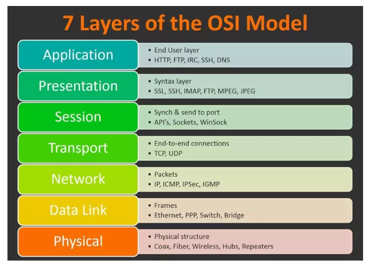

* [Spring](#spring)
    * [@PostConstruct](#postconstruct)
* [JavaSE](#javase)
  * [时间处理](#%E6%97%B6%E9%97%B4%E5%A4%84%E7%90%86)
  * [list和数组的相互转换](#list%E5%92%8C%E6%95%B0%E7%BB%84%E7%9A%84%E7%9B%B8%E4%BA%92%E8%BD%AC%E6%8D%A2)
      * [list  \-&gt; array](#list----array)
      * [array\-&gt; list](#array--list)

# Spring

### @PostConstruct

<https://www.jianshu.com/p/98cf7d8b9ec3>

~~~java
    public Class AAA{   
        @Autowired   
        private BBB b;    
        
        public AAA() {       
            System.out.println("此时b还未被注入: b = " + b);   
        }
           
        @PostConstruct   
        private void init () {       
            System.out.println("@PostConstruct将在依赖注入完成后被自动调用: b = " + b);
        }
    }
~~~

# JavaSE

## 时间处理

~~~java
Date date = new Date(0);//date可以传入时间戳构造


Calendar instance = Calendar.getInstance();//Calender可以方便地获取Date里的时间
instance.setTime(new Date());
int year = instance.get(Calendar.YEAR);
int date = instance.get(Calendar.DATE);


//获取指定时间的Date类型
DateFormat fmtDateTime = new SimpleDateFormat("yyyy-MM-dd HH:mm:ss");
String strDate = "1999-08-11 09:14:14";
Date date = fmtDateTime.parse(strDate);
~~~

## list和数组的相互转换

#### list  -> array

~~~java
//list 转数组
ArrayList<String> list=new ArrayList<String>(){
    {
        add("asd");
        add("aasd");
        add("asssd");

    }
};
String[] strings = new String[list.size()];
list.toArray(strings);
System.out.println(Arrays.toString(strings));
~~~

#### array-> list

~~~java
String[] s = {"a","b","c"};
List<String> strings = Arrays.asList(s);
System.out.println(strings);
~~~

# 跨域问题

CORS全称Cross-Origin Resource Sharing，意为跨域资源共享。当一个资源去访问另一个不同域名或者同域名不同端口的资源时，就会发出跨域请求。如果此时另一个资源不允许其进行跨域资源访问，那么访问的那个资源就会遇到跨域问题。

### 解决方案

覆盖默认的CorsFilter来解决该问题

~~~java
package com.macro.mall.config;

import org.springframework.context.annotation.Bean;
import org.springframework.context.annotation.Configuration;
import org.springframework.web.cors.CorsConfiguration;
import org.springframework.web.cors.UrlBasedCorsConfigurationSource;
import org.springframework.web.filter.CorsFilter;

/**
 * 全局跨域配置
 * Created by macro on 2019/7/27.
 */
@Configuration
public class GlobalCorsConfig {

    /**
     * 允许跨域调用的过滤器
     */
    @Bean
    public CorsFilter corsFilter() {
        CorsConfiguration config = new CorsConfiguration();
        //允许所有域名进行跨域调用
        config.addAllowedOrigin("*");
        //允许跨越发送cookie
        config.setAllowCredentials(true);
        //放行全部原始头信息
        config.addAllowedHeader("*");
        //允许所有请求方法跨域调用
        config.addAllowedMethod("*");
        UrlBasedCorsConfigurationSource source = new UrlBasedCorsConfigurationSource();
        source.registerCorsConfiguration("/**", config);
        return new CorsFilter(source);
    }
}


~~~

# 降级、熔断、限流

### 降级

降级也就是服务降级，当我们的服务器压力剧增为了**保证核心功能的可用性** ，而**选择性的降低一些功能的可用性，或者直接关闭该功能**。这就是典型的**丢车保帅**了。 就比如贴吧类型的网站，当服务器吃不消的时候，可以选择把发帖功能关闭，注册功能关闭，改密码，改头像这些都关了，为了确保登录和浏览帖子这种核心的功能。

一般而言都会建立一个独立的降级系统，可以灵活且批量的配置服务器的降级功能。当然也有用代码自动降级的，例如接口超时降级、失败重试多次降级等。具体失败几次，超时设置多久，由你们的业务等其他因素决定。开个小会，定个值，扔线上去看看情况。根据情况再调优。

### 熔断

**降级一般而言指的是我们自身的系统出现了故障而降级。而熔断一般是指依赖的外部接口出现故障的情况断绝和外部接口的关系。**

例如你的A服务里面的一个功能依赖B服务，这时候B服务出问题了，返回的很慢。这种情况可能会因为这么一个功能而拖慢了A服务里面的所有功能，因此我们这时候就需要熔断！即当发现A要调用这B时就直接返回错误(或者返回其他默认值啊啥的)，就不去请求B了。我这还是举了两个服务的调用，有些那真的是一环扣一环，出问题不熔断，那真的是会雪崩。

当然也有人认为熔断不就是降级的一种的，我觉得你非要说熔断也属于一种降级我也没法反驳，但是它们本质上的突出点和想表达的意思还是有一些不同的。

### 限流

上面说的两个算是请求过来我们都受理了，这个限流就更狠了，直接跟请求说对不起再见！也就是系统规定了多少承受能力，只允许这么些请求能过来，其他的请求就说再见了。

一般限制的指标有：**请求总量或某段时间内请求总量**。

# 负载均衡

负载均衡（Load Balance），意思是将负载（工作任务，访问请求）进行平衡、分摊到多个操作单元（服务器，组件）上进行执行。是解决高性能，单点故障（高可用），扩展性（水平伸缩）的终极解决方案。



**二层负载均衡** 

负载均衡服务器对外依然提供一个VIP（虚IP），集群中不同的机器采用相同IP地址，但是机器的MAC地址不一样。当负载均衡服务器接受到请求之后，通过改写报文的目标MAC地址的方式将请求转发到目标机器实现负载均衡。

**三层负载均衡**

和二层负载均衡类似，负载均衡服务器对外依然提供一个VIP（虚IP），但是集群中不同的机器采用不同的IP地址。当负载均衡服务器接受到请求之后，根据不同的负载均衡算法，通过IP将请求转发至不同的真实服务器。

**四层负载均衡** 

四层负载均衡工作在OSI模型的传输层，由于在传输层，只有TCP/UDP协议，这两种协议中除了包含源IP、目标IP以外，还包含源端口号及目的端口号。四层负载均衡服务器在接受到客户端请求后，以后通过修改数据包的地址信息（IP+端口号）将流量转发到应用服务器。

**七层负载均衡** 

七层负载均衡工作在OSI模型的应用层，应用层协议较多，常用http、radius、dns等。七层负载就可以基于这些协议来负载。这些应用层协议中会包含很多有意义的内容。比如同一个Web服务器的负载均衡，除了根据IP加端口进行负载外，还可根据七层的URL、浏览器类别、语言来决定是否要进行负载均衡。

### 负载均衡工具

**LVS**

 LVS（Linux Virtual Server），也就是Linux虚拟服务器, 是一个由章文嵩博士发起的自由软件项目。使用LVS技术要达到的目标是：通过LVS提供的负载均衡技术和Linux操作系统实现一个高性能、高可用的服务器群集，它具有良好可靠性、可扩展性和可操作性。从而以低廉的成本实现最优的服务性能。LVS主要用来做四层负载均衡。

**Nginx** 

Nginx（发音同engine x）是一个网页服务器，它能反向代理HTTP, HTTPS, SMTP, POP3, IMAP的协议链接，以及一个负载均衡器和一个HTTP缓存。Nginx主要用来做七层负载均衡。**HAProxy** 

HAProxy是一个使用C语言编写的自由及开放源代码软件，其提供高可用性、负载均衡，以及基于TCP和HTTP的应用程序代理。HAProxy主要用来做七层负载均衡。

### 负载均衡算法

负载均衡算法可以分为两类：静态负载均衡算法和动态负载均衡算法。

静态负载均衡算法包括：轮询，比率，优先权

动态负载均衡算法包括: 最少连接数,最快响应速度，观察方法，预测法，动态性能分配，动态服务器补充，服务质量，服务类型，规则模式。

- 轮询（Round Robin）：顺序循环将请求一次顺序循环地连接每个服务器。当其中某个服务器发生第二到第7 层的故障，BIG-IP 就把其从顺序循环队列中拿出，不参加下一次的轮询，直到其恢复正常。
- 比率（Ratio）：给每个服务器分配一个加权值为比例，根椐这个比例，把用户的请求分配到每个服务器。当其中某个服务器发生第二到第7 层的故障，BIG-IP 就把其从服务器队列中拿出，不参加下一次的用户请求的分配, 直到其恢复正常。
- 优先权（Priority）：给所有服务器分组,给每个组定义优先权，BIG-IP 用户的请求，分配给优先级最高的服务器组（在同一组内，采用轮询或比率算法，分配用户的请求）；当最高优先级中所有服务器出现故障，BIG-IP 才将请求送给次优先级的服务器组。这种方式，实际为用户提供一种热备份的方式。
- 最少的连接方式（Least Connection）：传递新的连接给那些进行最少连接处理的服务器。当其中某个服务器发生第二到第7 层的故障，BIG-IP 就把其从服务器队列中拿出，不参加下一次的用户请求的分配, 直到其恢复正常。
- 最快模式（Fastest）：传递连接给那些响应最快的服务器。当其中某个服务器发生第二到第7 层的故障，BIG-IP 就把其从服务器队列中拿出，不参加下一次的用户请求的分配，直到其恢复正常。
- 观察模式（Observed）：连接数目和响应时间以这两项的最佳平衡为依据为新的请求选择服务器。当其中某个服务器发生第二到第7 层的故障，BIG-IP就把其从服务器队列中拿出，不参加下一次的用户请求的分配，直到其恢复正常。
- 预测模式（Predictive）：BIG-IP利用收集到的服务器当前的性能指标，进行预测分析，选择一台服务器在下一个时间片内，其性能将达到最佳的服务器相应用户的请求。(被BIG-IP 进行检测)
- 动态性能分配(Dynamic Ratio-APM):BIG-IP 收集到的应用程序和应用服务器的各项性能参数，动态调整流量分配。
- 动态服务器补充(Dynamic Server Act.):当主服务器群中因故障导致数量减少时，动态地将备份服务器补充至主服务器群。
- 服务质量(QoS）:按不同的优先级对数据流进行分配。
- 服务类型(ToS): 按不同的服务类型（在Type of Field中标识）负载均衡对数据流进行分配。
- 规则模式：针对不同的数据流设置导向规则，用户可自行。

# 防止表单重复提交

### 前后端不分离

解决思路：

- 表单不能由HTML页面输出，须有程序生成输出
- 程序输出表单时需在表单里添加一个随机数打给浏览器
- 用户提交表单时把这个随机数带给服务器程序
- 用户带过来的随机数和服务器随机数进行比较，若一致则接受，否则不予接受

具体的做法：

> 在服务器端生成一个唯一的随机标识号，专业术语称为Token(令牌)，同时在当前用户的Session域中保存这个Token。然后将Token发送到客户端的Form表单中，在Form表单中使用隐藏域来存储这个Token，表单提交的时候连同这个Token一起提交到服务器端，然后在服务器端判断客户端提交上来的Token与服务器端生成的Token是否一致，如果不一致，那就是重复提交了，此时服务器端就可以不处理重复提交的表单。如果相同则处理表单提交，处理完后清除当前用户的Session域中存储的标识号。

在下列情况下，服务器程序将拒绝处理用户提交的表单请求：

- 存储Session域中的Token(令牌)与表单提交的Token(令牌)不同。
- 当前用户的Session中不存在Token(令牌)。
- 用户提交的表单数据中没有Token(令牌)。

> ```csharp
> public class FormServlet extends HttpServlet {
> 
>     public void doGet(HttpServletRequest request, HttpServletResponse response)
>             throws ServletException, IOException {
> 
>         response.setContentType("text/html;charset=UTF-8");
>         PrintWriter out = response.getWriter();
>         
>         String token = TokenProccessor.getInstance().makeToken();
>         request.getSession().setAttribute("token", token);  //在服务器端保存随机数
>         
>         out.println("<form action='/day07/servlet/DoFormServlet' method='post'>");
>             out.write("<input type='hidden' name='token' value='"+token+"'>");
>             out.println("用户名:<input type='text' name='username'>");
>             out.println("<input type='submit' value='提交'>");
>         out.println("</form>");
>     }
> 
>     public void doPost(HttpServletRequest request, HttpServletResponse response)
>             throws ServletException, IOException {
> 
>         doGet(request, response);
>     }
> }
> ```

### 前后端分离

全段发送表单信息的时候携带一个id，

后端在redis缓存，如果是id相同则是重复提交

可以采用拦截器的方式

