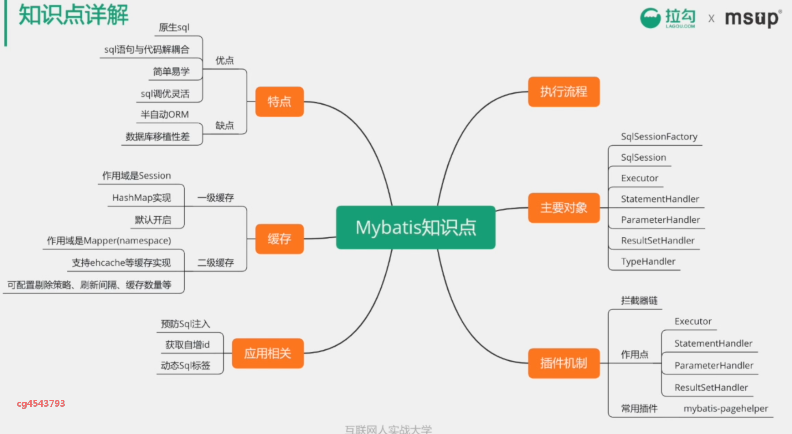

* [Mybatis](#mybatis)
  * [主要对象](#%E4%B8%BB%E8%A6%81%E5%AF%B9%E8%B1%A1)
  * [处理流程](#%E5%A4%84%E7%90%86%E6%B5%81%E7%A8%8B)
  * [一级二级缓存](#%E4%B8%80%E7%BA%A7%E4%BA%8C%E7%BA%A7%E7%BC%93%E5%AD%98)
# Mybatis

## 主要对象

sqlSessionFactory，sqlSession的工厂类对应一个sql配置文件

sqlSession，非线程安全，对数据库的操作都在sqlSession中完成

sqlSession通过Executor完成增删改查操作

StatementHandler用来处理sql语句的预编译

ParameterHandler用来处理预编译参数

ResultSetHandler用来处理结果集

TypeHandler用于数据库类型和java类的相互映射

插件机制

通过拦截器。组成责任链来对Executor，StatementHandler，ParameterHandler，ResultHandler这四个作用点来进行定制化处理。

## 处理流程

## 一级二级缓存

查找顺序是二级缓存》一级缓存》数据库

如果多个SqlSession之间需要共享缓存，则需要使用到二级缓存。开启二级缓存后，会使用CachingExecutor装饰Executor，进入一级缓存的查询流程前，先在CachingExecutor进行二级缓存的查询，具体的工作流程如下所示。