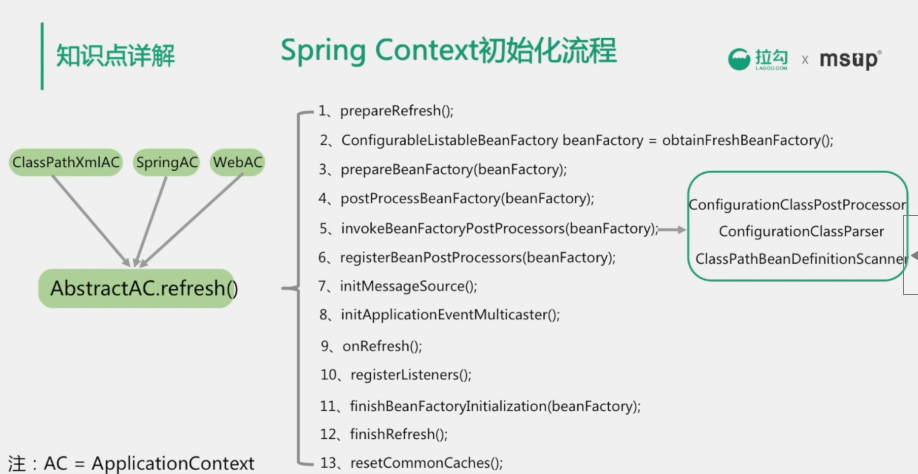

[TOC]

# spring

Spring诞生：

创建Spring的目的就是用来替代更加重量级的的企业级Java技术


简化Java的开发

基于POJO轻量级和最小侵入式开发

通过依赖注入和面向接口实现松耦合

基于切面和惯例进行声明式编程

通过切面和模板减少样板式代码

## IOC

对象的创建交给外部容器完成，这个就做控制反转。

ioc的思想最核心的地方在于，资源不由使用资源的双方管理，而由不使用资源的第三方管理，这可以带来很多好处。第一，资源集中管理，实现资源的可配置和易管理。第二，降低了使用资源双方的依赖程度，也就是我们说的耦合度。

#### 依赖注入方式

Setter

interface

constructor

**annotation**

#### ioc容器的优势

避免在各处使用new

创建实例的时候不需要了解其中的细节

### 核心接口

ApplicationContext保存ioc的整个应用上下文，可以通过BeanFactory获取到任意的bean

BeanFactory的主要作用是根据beanDefination的具体描述来创建具体的bean

BeanWrapper是对bean的包装，一般情况下是在springbIOC的内部使用，提供了访问bean的属性值，属性编辑器注册，类型转换等，方便ioc容器用统一的方式来访问bean的属性

FactoryBean通过getObject方法返回实际的bean对象

#### BeanFactory

1、提供ioc配置机制 

2、包含bean的各种定义，便于实例化bean

3、建立bean之间的依赖关系

4、bean的生命周期控制

##### getbean方法

1、转换beanName

2、从工厂中加载实例

3、实例化bean

4、检测parentBeanFactory

5、初始化依赖的bean

6、创建bean

#### applicationContext 

继承多个接口

1、beanfactory 能够管理，装备bean

2、resourceParrernResolver 能够加载资源文件

##### 生成bean的流程

1、读取bean的配置信息，填写bean的定义注册表

通过xml，或是@configuration

BeanDefinitionRegistry  向ioc容器组测接口。

DefaultListableBeanFactory 中beanDefinitionMap用于存放这些定义

```java
private final Map<String, BeanDefinition> beanDefinitionMap = new ConcurrentHashMap<>(256);
```

2、根据bean注册表实例化bean

3、将bean放到spring容器中

4、使用bean

##### refresh方法

为ioc容器以及bean的生命周期提供管理条件

刷新spring上下文，定义spring上下文加载流程

#### applicationContext 和 beanfactory 比较

applicationContext是面向spring开发者，功能更多

beanfactory是spring框架的基础设施，面向spring 

#### Spring Context初始化流程



1、对刷新进行准备，设置开始时间，设置激活状态，初始化context环境中的占位符，这个动作根据子类的需求由子类来执行，然后验证是否缺失必要的properties

2、刷新并获取内部的beanFactory

3、对beanFactory进行准备工作，比如设置类加载器，和后置处理器

4、对context的子类配置后置处理beanFactory的处理能力

5、执行后置处理器

6、按优先级顺序在beanFactory中注册后置处理器，bean的后置处理器可以在bean的初始化前后处理逻辑

7、初始化消息源，消息源用来支持消息的国际化

8、初始化应用事件广播器，广播器用来向applicationListener通知各种事件，是一个观察者模式

9、子类的扩展refresh，子类初始化其他的bean

10、把applicationListener的bean注册到事件广播器，早期没有广播的事件进行通知

11、冻结所有的bean描述信息的修改

12、完成上下文的刷新工作

13、在finally中重置公共的缓存

### Bean

#### spring bean的作用域（scope）

singleton ： spring的默认作用域，容器里唯一的bean实例

prototype：针对每个getBean请求，容器会创建一个bean实例

request：对于每个http请求，容器会创建一个bean实例

session：对于每个session，容器会创建一个bean实例

#### bean的生命周期

#### 创建过程

1、实例化bean

2、aware （注入bean id 等）

3、BeanPostProcessor接口  postProcessBeforeInitialization

4、InitializingBean的方法afterPropertiesSet

5、定制bean

6、BeanPostProcessor接口  postProcessAfterInitialization

7、完毕

#### 销毁过程

DisposableBean接口destroy方法

## AOP

关注点分离：不同问题交给不同的部分去解决

1、面向切面编程AOP正是这种技术的体现

2、通用化功能代码的实现，对应就是所谓的切面（Aspect）

3、业务功能代码和切面代码分开后，架构将变得高内聚低耦合

4、确保功能的完整性，切面最终需要被合并到业务中（织入Weave）

### aop的三种织入方式

编译时织入：需要特殊的java编译器  如AspectJ

类加载时织入：需要特殊的java编译器，如AspectJ和AspectWerkz

运行时织入：spring采用的方式，通过动态代理呃方式，实现简单。

### AOP主要名词概念

1、Aspect：通用功能的代码实现

2、Target：被织入Aspect的对象

3、Join Point ：可以作为切入点的机会，所有的方法都可以作为切入点

4、Pointcut：Aspect实际被应用在的Join Point，支持正则

5、Advice：类里面的方法以及这个方法如何织入到目标方法的方式

6、Weaving：aop的实现过程

### Advice的种类

1、前置通知（before）

2、后置通知（AfterReturning）

3、异常通知（AfterThrowing）

4、最终通知（After）

5、环绕通知（Around）

### aop的实现：jdkProxy和Cglib

由AopProxyFactory根据AdvisedSupport对象的配置来决定

默认策略是如果目标类是**接口**，则用**JDKProxy**来实现，否则用后者

JDKProxy的核心：InvocationHandler接口和Proxy类

**Cglib**：以继承的方式动态生成目标**类的代理**

注意，如果一个类是final则无法使用Cglib代理


JDKProxy：通过java的内部反射机制实现

Cglib：借助ASM实现，ASM是一个字节码修改的框架

反射机制在类生成的过程中比较高效

ASM在生成类之后的执行过程中比较高效


静态代码，编译时织入或是类加载时织入

比如aspectJ

### spring里代理模式的实现

1、真正实现类的逻辑包含在getBean方法li

2、getBean方法返回的实际是proxy的实例

3、proxy实例Spring采用JDK Proxy或CGLib动态实现

## 事务

### ACID

原子性 （atomicity）:强调事务的不可分割. 
一致性 （consistency）:事务的执行的前后数据的完整性保持一致. 
隔离性 （isolation）:一个事务执行的过程中,不应该受到其他事务的干扰 
持久性（durability） :事务一旦结束,数据就持久到数据库

### 隔离级别

**事务的隔离级别是由具体的数据库来实现的**

未提交读（read uncommited） :脏读，不可重复读，虚读都有可能发生 
已提交读 （read commited）:避免脏读。但是不可重复读和虚读有可能发生 
可重复读 （repeatable read） :避免脏读和不可重复读.但是虚读有可能发生. 
串行化的 （serializable） :避免以上所有读问题. 

### 事务传播

**PROPAGATION_REQUIRED** 支持当前事务，如果不存在 就新建一个(默认) 
**PROPAGATION_SUPPORTS** 支持当前事务，如果不存在，就不使用事务 
PROPAGATION_MANDATORY 支持当前事务，如果不存在，抛出异常 
PROPAGATION_REQUIRES_NEW 如果有事务存在，挂起当前事务，创建一个新的事务 
PROPAGATION_NOT_SUPPORTED 以非事务方式运行，如果有事务存在，挂起当前事务 
PROPAGATION_NEVER 以非事务方式运行，如果有事务存在，抛出异常 
PROPAGATION_NESTED 如果当前事务存在，则嵌套事务执行

## 设计模式

1. **工厂模式**

spring中的BeanFactory就是简单工厂模式的体现，根据传入一个唯一的标识来获得bean对象

2. **单例模式**

保证一个类仅有一个实例，并提供一个访问它的全局访问点。 bean的默认就是单例模式。

3. **代理模式和包装器模式**

在Spring的Aop中，使用的Advice（通知）来增强被代理类的功能。Spring实现这一AOP功能的原理就使用代理模式（1、JDK动态代理。2、CGLib字节码生成技术代理。）对类进行方法级别的切面增强，即，生成被代理类的代理类， 并在代理类的方法前，设置拦截器，通过执行拦截器重的内容增强了代理方法的功能，实现的面向切面编程。

4. **装饰器模式**

spring data中的sessionFactory根据客户的每次请求，将dataSource属性设置成不同的数据源，以到达切换数据源的目的。

spring中用到的包装器模式在类名上有两种表现：一种是类名中含有Wrapper，另一种是类名中含有Decorator。基本上都是动态地给一个对象添加一些额外的职责。 

## 其他

### PlaceHolder动态替换

替换发生的时间是在beanDefine创建完成后，bean初始化之前，通过实现beanFactoryPostProcessor接口实现，主要实现的方式有PropertyPlaceholderConfigurer和PropertySourcesPlaceholderConfigurer，这两个类实现逻辑不一样，springboot使用的是PropertySourcesPlaceholderConfigurer

### spring如何解决循环依赖

构造器循环依赖和setter循环依赖两部分，

##### 构造器依赖

无法解决，会抛出异常

Spring容器会将每一个正在创建的Bean 标识符放在一个“当前创建Bean池”中，Bean标识符在创建过程中将一直保持
在这个池中，因此如果在创建Bean过程中发现自己已经在“当前创建Bean池”里时将抛出
BeanCurrentlyInCreationException异常表示循环依赖；而对于创建完毕的Bean将从“当前创建Bean池”中清除掉。

##### 循环依赖

不会抛出异常

Spring先是用构造实例化Bean对象 ，此时Spring会将这个实例化结束的对象放到一个Map中，并且Spring提供了获取这个未设置属性的实例化对象引用的方法。   结合我们的实例来看，，当Spring实例化了StudentA、StudentB、StudentC后，紧接着会去设置对象的属性，此时StudentA依赖StudentB，就会去Map中取出存在里面的单例StudentB对象，以此类推，不会出来循环的问题喽、

# springMVC

## 核心组件

五大核心组件

　　1.DispatcherServlet　　请求入口

　　2.HandlerMapping　　  请求派发,负责请求和控制器建立一一对应的关系

　　3.Controller　　　　　  处理器

　　4.ModelAndView　　　  封装模型信息和视图信息

　　5.ViewResolver　　　　视图处理器,定位页面

## filter、interceptor的区别

从概念上来讲，filter是servlet规范定义的，而interceptor是spring定义的。

**执行顺序**，filter是在servlet之前执行，而springMVC是基于servlet的框架，所以filter的执行是在intercept之前。

**场合**，filter只能在servlet前后起作用，只能对HttpRequest和HttpResponse起作用，和intercept比filter适用范围更广，可以在方法前后拦截等。

**使用方法**(spring中)

1. filter 注册 FilterRegistrationBean，并实现filter接口
2. intercept 实现HandlerInterceptor接口，在WebMvcConfigurerAdapter中注册

# springboot

简化配置，开箱即用，约定大于配置

## 两种上下文

一种是bootstrap，另一种是spring的applicationContext

bootstrap是应用程序的父上下文，会先于application加载，bootstrap主要用于从额外的资源加载配置信息，还可以从本地web配置文件中获取属性，bootstrap获取的属性会优先加载，默认也不能被覆盖

## 自动配置原理

**@SpringBootApplication**

下面

@Target(ElementType.TYPE)
@Retention(RetentionPolicy.RUNTIME)
@Documented
@Inherited
@SpringBootConfiguration
**@EnableAutoConfiguration**
@ComponentScan(excludeFilters = {
		@Filter(type = FilterType.CUSTOM, classes = TypeExcludeFilter.class),
		@Filter(type = FilterType.CUSTOM, classes = AutoConfigurationExcludeFilter.class) })


@Target(ElementType.TYPE)
@Retention(RetentionPolicy.RUNTIME)
@Documented
@Inherited
@AutoConfigurationPackage
**@Import(AutoConfigurationImportSelector.class)**


```java
protected List<String> getCandidateConfigurations(AnnotationMetadata metadata,
			AnnotationAttributes attributes) {
		List<String> configurations = SpringFactoriesLoader.loadFactoryNames(
				getSpringFactoriesLoaderFactoryClass(), getBeanClassLoader());
		Assert.notEmpty(configurations,
				"No auto configuration classes found in META-INF/spring.factories. If you "
						+ "are using a custom packaging, make sure that file is correct.");
		return configurations;
	}
```

这个方法来扫描具有meta-inf/spring-factories文件的jar包，而我们的spring-boot-autoconfigure-1.3.0.x.jar里的spring.factories