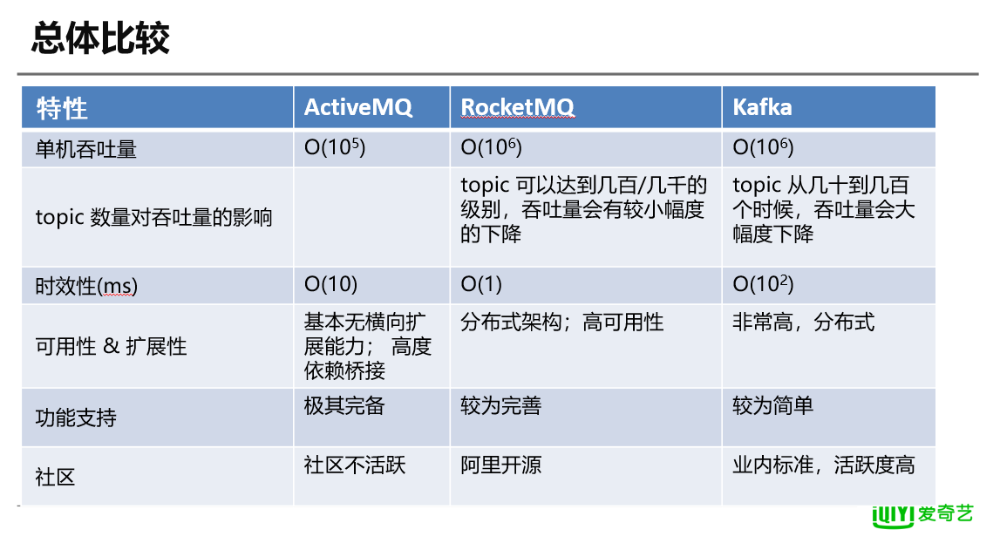

* [消息队列](#%E6%B6%88%E6%81%AF%E9%98%9F%E5%88%97)
  * [基本概念](#%E5%9F%BA%E6%9C%AC%E6%A6%82%E5%BF%B5)
    * [使用场景](#%E4%BD%BF%E7%94%A8%E5%9C%BA%E6%99%AF)
    * [消息协议](#%E6%B6%88%E6%81%AF%E5%8D%8F%E8%AE%AE)
        * [JMS](#jms)
        * [AMQP](#amqp)
  * [Kafka](#kafka)
      * [架构](#%E6%9E%B6%E6%9E%84)
      * [消息的发送三种方式](#%E6%B6%88%E6%81%AF%E7%9A%84%E5%8F%91%E9%80%81%E4%B8%89%E7%A7%8D%E6%96%B9%E5%BC%8F)
      * [消息的消费](#%E6%B6%88%E6%81%AF%E7%9A%84%E6%B6%88%E8%B4%B9)
      * [为kafka选择合适的partition](#%E4%B8%BAkafka%E9%80%89%E6%8B%A9%E5%90%88%E9%80%82%E7%9A%84partition)
      * [kafka高吞吐量的原因](#kafka%E9%AB%98%E5%90%9E%E5%90%90%E9%87%8F%E7%9A%84%E5%8E%9F%E5%9B%A0)
      * [kafka的三种ACK机制](#kafka%E7%9A%84%E4%B8%89%E7%A7%8Dack%E6%9C%BA%E5%88%B6)
  * [RocketMq](#rocketmq)
  * [RabbitMq](#rabbitmq)
  * [ActiveMQ](#activemq)
  * [比较](#%E6%AF%94%E8%BE%83)
# 消息队列

## 基本概念

### 使用场景

解耦合，服务通信，异步任务，削峰，广播

### 消息协议

##### JMS

java 消息服务，规定了java使用消息服务的api，spring提供了支持jms的组件

##### AMQP

amqp是高级消息队列协议，是应用层协议的一个开放标准，amqp直接定义网络数据的交换格式，因此支持跨语言的能力，例如rabbitMQ就使用了amqp实现

## Kafka

由scala开发的高性能跨语言消息队列，单机能够支撑十万级的吞吐量，消息延迟在毫秒级，kafka是完全的分布式系统，broker，consumer和producer都是原生自动支持分布式，依赖于zookeeper协调，支持一写多读，消息可以被多个客户端消费，消息可能会重复，但是不会被丢失

#### 架构

一个topic就是一个queue，在某个topic发送消息后，所有订阅了这个topic的消费方都可以订阅这条消息，为了提高并行能力，kafka为每个topic提供了多个partition分区，每个分区可以看做一份追加类型的日志，每个分区中的消息保证id唯一且有序，新消息不断追加在尾部，partition存储数据时，会按照大小进行分段，来保证总是对较小的文件进行写操作，提高性能，方便管理。partition分布于多个broker上，每个partition会被复制多分，存在于不同的broker上，这样可以保证主分区出现问题时，可以容灾，这种partition的副本叫做replication，kafka会从replication中选取leader角色和多个follower角色，如果leader节点宕机，则又kafka Controller节点，在follower节点中重新选取一个节点作为新的leader节点。如果kafka Controller宕机，则由ZK重新准备数据并选取一个kafka Controller节点，在这个kafka Controller的恢复过程中，整个kafka处于不可用状态。

每个broker可以保存多个topic的多个partition，kafka只保证一个分区内的消息有序。为了保证较高的效率，所有的消息读写都是在主partition上进行的，其他的副本分区只会从主分区复制数据。kafka会在zookeeper上，针对每个topic维护一个已同步副本集，如果某个主分区不可用了，kafka就会从已同步副本集选择一个副本作为新的分区。

kafka对消费方进行分组管理，支持消息一写多读，

生成方根据规则选择一个partition进行写入，默认规则是轮询策略，也可以由生产方指定partition，或者指定key来根据hash值指定partition。

#### 消息的发送三种方式

同步，异步，发送并忘记

同步模式下，后台线程发送消息时，同步获取结果，这也是默认的模式

异步模式，允许生产者批量发送数据，可以极大提高性能，但是会增加丢失数据的风险，

发送并忘记，只发送消息，不需要返回结果，消息可靠性最低，但是低延迟，高吞吐，适合用于对可靠性要求不高的场景

#### 消息的消费

consumer按照group来消费消息，消息中每一个topic可以被多个consumerGroup消费，kafka确保每个partition在一个group只能有一个consumer消费。

在zookeeper中保存了每个consumer消费的偏移量，offset，通过更新偏移量，保证每条消息都被消费

用多线程来读取消息时，一个线程相当于一个consumer实例，当consumer数量大于分区数量时，有的consumer线程会取不到数据。

#### 一条message包含什么

​	包含 header,body。  

   一个Kafka的Message由一个固定长度的header和一个变长的消息体body组成。  

   header部分由一个字节的magic(文件格式)和四个字节的CRC32(用于判断body消息体是否正常)构成。  

   当magic的值为1的时候，会在magic和crc32之间多一个字节的数据：attributes(保存一些相关属性，比如是否压缩、  

   压缩格式等等)；  

   如果magic的值为0，那么不存在attributes属性body是由N个字节构成的一个消息体，包含了具体的key/value消息

#### 为kafka选择合适的partition

1. **越多的分区可以提供更高的吞吐**

在kafka中，单个partition是kafka并行操作的最小单元。

在producer端，向每个分区写入数据是并行的，因此，可以通过加大硬件资源的利用率来提升系统的吞吐量。

在consumer端，kafka只允许单个partition的数据被一个consumer线程消费，因此，在consumer端，每个consumer group内部的consumer并行度完全依赖与被消费的分区数量。

经过测试，在producer端，单个partition的吞吐量通常是10MB/s。

2. **越多的分区需要打开更多的本地文件句柄**

在kafka中，一个topic在磁盘上对应一个目录，每个partition对应一个log文件，所以越多的分区需要越多的文件句柄。

3. **更多的partition会导致更高的不可用性**

当其中一个broker非计划的宕机后，所有1000个partition同时变的不可用。假设每个partition有5毫秒的时间恢复，1000个就要5秒的恢复时间，
如果更不幸的是宕机的broker是controller节点时，在这种情况下，新leader节点的选举在controller节点恢复之前是不会启动的，controller节点的错误恢复将会自动进行，但是新的controller节点需要从zookeeper中读取每个partition的元信息用户初始化数据。加入从zk读取一个partition要用2ms，有10000个partition的话，则controller的恢复将会增加约20s

所以最好将每个broker的partition的数据限制在2000到4000，每个kafka集群中partition的数量限制在10000以内。

#### kafka高吞吐量的原因

##### mmap

**内存映射文件**，即是mmap，保证了kafka的高速写，mmap空间可以把里面的数据直接映射到文件，并且此空间用户态程序和内核程序都可以直接访问，所以kafka往mmap里添加数据不需要进行中断和系统调用。

kafka使用mmap，**省去了用户空间到内核空间**复制的开销。

kafka的文件划分为段文件（segment），默认为1G，和mmap的默认大小1G相同。

但是采用mmap，一个很明显的缺陷——不可靠，**写到mmap中的数据并没有被真正的写到硬盘，操作系统会在程序主动调用flush的时候才把数据真正的写到硬盘。**Kafka提供了一个参数——producer.type来控制是不是主动flush，如果Kafka写入到mmap之后就立即flush然后再返回Producer叫**同步**(sync)；写入mmap之后立即返回Producer不调用flush叫**异步**(async)。

##### 顺序读写

kafka的消息是通过不断追加到文件中的，这个特性使kafka可以充分利用磁盘的顺序读写性能。

顺序读写不需要磁盘的寻道时间，只需要很少的扇区旋转时间，所以速度远快于随机读写。

##### **零拷贝**

零拷贝是kafka的高效读取。

利用了“零拷贝”系统调用机制，就是跳过“用户缓冲区”的拷贝，建立一个磁盘空间和内存的直接映射，数据不再复制到“用户态缓冲区”，。

采用sendfile系统调用，因为Kafka不需要再对这个消息进行加工，所以可以采用zero copy技术。

nginx里也有采用零拷贝。

##### **分区**

kafka中的topic中的内容可以被分为多分partition存在，每个partition又分为多个segment，每次操作都是针对一小部分做操作，增加并行能力 

##### **批量发送**

kafka允许进行批量发送消息

##### **数据压缩**

kafka支持对消息集合进行压缩，producer可以通过GZIP格式对消息集合进行压缩

压缩的好处就是减少传输的数据量，减轻对网络传输的压力

#### kafka的三种ACK机制

Kafka producer有三种ack机制  初始化producer时在config中进行配置

0 

意味着producer不等待broker同步完成的确认，继续发送下一条(批)信息

提供了最低的延迟。但是最弱的持久性，当服务器发生故障时，就很可能发生数据丢失。例如leader已经死亡，producer不知情，还会继续发送消息broker接收不到数据就会数据丢失

1

意味着producer要***等待leader***成功收到数据并得到确认，才发送下一条message。此选项提供了较好的持久性较低的延迟性。

Partition的Leader死亡，follwer尚未复制，数据就会丢失

-1

意味着producer***得到follwer确认***，才发送下一条数据

持久性最好，延时性最差。

三种机制性能递减，可靠性递增。

#### 如何保证消息不丢失

https://zhuanlan.zhihu.com/p/136576215

## RocketMq

阿里开源的消息中间件，单机能够支撑十万级的吞吐量，java开发，具有高吞吐量，高可用性的特点，适合在大规模系统中应用

## RabbitMq

使用erlang开发的开源消息队列，通过erlang的Actor模型，实现的数据的稳定可靠传输，支持amqp等协议，比较重量级，由于采用broker代理的架构，发送给客户端时，现在中心队列进行排队，rabbitMQ的单机吞吐量在万级，不算很高

> 在 Erlang 中，进程为**最小的单位**，也就是所谓的 Actor。注意 Erlang 的进程不是我们传统上的进程，它运行在 Erlang 虚拟机上，非常小，非常轻，**可以瞬间创建上万**，甚至几十万个，进程间完全是独立的，**不共享内存**。在进程运行时若出现错误，由于进程的轻量级，Erlang 采取的措施是“让其他进程修复”和“任其崩溃”。在 Erlang 上查看默认限制数量是26万多，可以进行修改。每个进程创建后都会有一个独一无二的 Pid，这些进程之间通过 Pid 来互相发送消息，**进程的唯一交互方式也是消息传递**，消息也许能被对方收到，也许不能，收到后可以处理该消息。如果想知道某个消息是否被进程收到，必须向该进程发送一个消息并等待回复。

## ActiveMQ

可以部署于代理模式和点对点模式，支持多种协议，单机吞吐量在万级，但是activeMQ不够轻巧，对于队列较多的情况支持不是很好，并且有较低概率丢失消息

## 比较

# 自己设计一个消息队列

<https://blog.csdn.net/weixin_41172473/article/details/84580334>

消息队列这个属于包含消息和队列两个关键词，消息是指应用间传递的数据，可以使简单的字符串，也可以是复杂的结构化对象定义格式；队列指消息的进和出，它包含一个容器，至少需实现消息的发送、接收和暂存功能。在生产环境中，消息队列还需解决诸如消息堆积、消息持久化、可靠投递、消息重复、严格有序、集群等各种问题。

Broker：消息处理中心，负责消息的接收、存储、转发
Producer：消息生产者，负责产生和发送消息到消息处理中心
Consumer：消息消费者，负责从消息中心获取消息，并进行相应的处理

### Broker

~~~java

package com.youzi.MQ;

import java.util.concurrent.ArrayBlockingQueue;

/**
 * 消息处理中心
 */
public class Broker {
    //设置存储消息的最大数量
    private final static int MAX_SIZE = 5;
    //保存消息的容器
    private static ArrayBlockingQueue<String> MassageQueue = new ArrayBlockingQueue<String>(MAX_SIZE);
    //生产消息
    public static void produce(String msg){
        if (MassageQueue.offer(msg)){
            System.out.println("成功向消息中心投递消息："+msg+"，当前暂存消息数目为"+MassageQueue.size());
        }else{
            System.out.println("消息中心已满，不能继续放入消息！");
        }
        System.out.println("==================================");
    }

    //消费消息
    public static String consume(){
        String msg = MassageQueue.poll();
        if(msg!=null){
            System.out.println("已经消费消息："+msg+"，当前暂存消息数目为"+MassageQueue.size());
        }else{
            System.out.println("消息处理中心已经没有消息可供消费！");
        }
        System.out.println("==================================");
        return msg;
    }
}

~~~

### BrokerServer

~~~java

package com.youzi.MQ;

import java.io.BufferedReader;
import java.io.IOException;
import java.io.InputStreamReader;
import java.io.PrintWriter;
import java.net.ServerSocket;
import java.net.Socket;

/**
 * 消息队列服务
 */
public class BrokerServer implements Runnable {
    public static int SERVICE_PORT = 9999;
    private final Socket socket ;

    public BrokerServer(Socket socket) {
        this.socket = socket;
    }

    @Override
    public void run() {
        try (
            BufferedReader in = new BufferedReader(new InputStreamReader(socket.getInputStream()));
            PrintWriter out = new PrintWriter(socket.getOutputStream());
            ){
            while (true){
                String str = in.readLine();
                if (str==null){
                    continue;
                }
                System.out.println("接收到的原始数据为："+str);
                if (str.equals("CONSUME")){//CONSUME表示要消费一条消息
                    String msg = Broker.consume();
                    out.println(msg);
                    out.flush();
                }else{//其他情况都表示要生产消息到消息队列中
                    Broker.produce(str);
                }
            }

        } catch (IOException e) {
            e.printStackTrace();
        }
    }

    public static void main(String[] args) throws IOException {
        ServerSocket server = new ServerSocket(BrokerServer.SERVICE_PORT);
        while(true){
            BrokerServer bs = new BrokerServer(server.accept());
            new Thread(bs).start();
        }
    }
}

~~~

### MQClient

~~~java
package com.youzi.MQ;

import org.omg.CORBA.portable.UnknownException;

import java.io.BufferedReader;
import java.io.InputStreamReader;
import java.io.PrintWriter;
import java.net.InetAddress;
import java.net.Socket;

public class MQClient {

    //生产消息
    public static void produce(String msg) throws Exception {
        Socket socket = new Socket(InetAddress.getLocalHost(),BrokerServer.SERVICE_PORT);
        try (
            PrintWriter out = new PrintWriter(socket.getOutputStream());
            ){
            out.println(msg);
            out.flush();
        }
    }

    //消费消息
    public static String consume() throws Exception {
        Socket socket = new Socket(InetAddress.getLocalHost(),BrokerServer.SERVICE_PORT);
        try(BufferedReader in = new BufferedReader(new InputStreamReader(socket.getInputStream()));
            PrintWriter out = new PrintWriter(socket.getOutputStream())){
            //先向消息队列发送CONSUME表示消费消息
            out.println("CONSUME");
            out.flush();
            //再从队列获取一条消息
            String message = in.readLine();
            return message;
        }
    }
}

~~~

