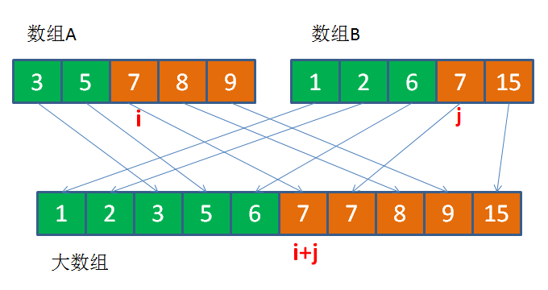

* [常用算法](#%E5%B8%B8%E7%94%A8%E7%AE%97%E6%B3%95)
    * [唯一id生成](#%E5%94%AF%E4%B8%80id%E7%94%9F%E6%88%90)
      * [UUID](#uuid)
      * [数据库自增主键](#%E6%95%B0%E6%8D%AE%E5%BA%93%E8%87%AA%E5%A2%9E%E4%B8%BB%E9%94%AE)
      * [雪花算法](#%E9%9B%AA%E8%8A%B1%E7%AE%97%E6%B3%95)
      * [借助Redis](#%E5%80%9F%E5%8A%A9redis)
      * [其他算法](#%E5%85%B6%E4%BB%96%E7%AE%97%E6%B3%95)
        * [1、计数器算法](#1%E8%AE%A1%E6%95%B0%E5%99%A8%E7%AE%97%E6%B3%95)
        * [2、令牌桶](#2%E4%BB%A4%E7%89%8C%E6%A1%B6)
        * [3、漏桶算法](#3%E6%BC%8F%E6%A1%B6%E7%AE%97%E6%B3%95)
    * [辗转相除法](#%E8%BE%97%E8%BD%AC%E7%9B%B8%E9%99%A4%E6%B3%95)
    * [二分查找](#%E4%BA%8C%E5%88%86%E6%9F%A5%E6%89%BE)
    * [背包问题](#%E8%83%8C%E5%8C%85%E9%97%AE%E9%A2%98)
    * [最长上升子序列](#%E6%9C%80%E9%95%BF%E4%B8%8A%E5%8D%87%E5%AD%90%E5%BA%8F%E5%88%97)
    * [汉诺塔](#%E6%B1%89%E8%AF%BA%E5%A1%94)
    * [键盘输入格式](#%E9%94%AE%E7%9B%98%E8%BE%93%E5%85%A5%E6%A0%BC%E5%BC%8F)
    * [全排列](#%E5%85%A8%E6%8E%92%E5%88%97)
    * [死锁](#%E6%AD%BB%E9%94%81)
    * [字符匹配问题](#%E5%AD%97%E7%AC%A6%E5%8C%B9%E9%85%8D%E9%97%AE%E9%A2%98)
        * [单模匹配](#%E5%8D%95%E6%A8%A1%E5%8C%B9%E9%85%8D)
* [算法题](#%E7%AE%97%E6%B3%95%E9%A2%98)
    * [去重](#%E5%8E%BB%E9%87%8D)
    * [最大连续子序列的和](#%E6%9C%80%E5%A4%A7%E8%BF%9E%E7%BB%AD%E5%AD%90%E5%BA%8F%E5%88%97%E7%9A%84%E5%92%8C)
    * [最小的K个数](#%E6%9C%80%E5%B0%8F%E7%9A%84k%E4%B8%AA%E6%95%B0)
    * [找寻缺失的整数](#%E6%89%BE%E5%AF%BB%E7%BC%BA%E5%A4%B1%E7%9A%84%E6%95%B4%E6%95%B0)
    * [判断一个数是否是2的乘方](#%E5%88%A4%E6%96%AD%E4%B8%80%E4%B8%AA%E6%95%B0%E6%98%AF%E5%90%A6%E6%98%AF2%E7%9A%84%E4%B9%98%E6%96%B9)
    * [判断一个链表是否有环](#%E5%88%A4%E6%96%AD%E4%B8%80%E4%B8%AA%E9%93%BE%E8%A1%A8%E6%98%AF%E5%90%A6%E6%9C%89%E7%8E%AF)
        * [如何找到环的入口点](#%E5%A6%82%E4%BD%95%E6%89%BE%E5%88%B0%E7%8E%AF%E7%9A%84%E5%85%A5%E5%8F%A3%E7%82%B9)
    * [最小栈的实现](#%E6%9C%80%E5%B0%8F%E6%A0%88%E7%9A%84%E5%AE%9E%E7%8E%B0)
    * [无序数组排序后的最大相邻差值](#%E6%97%A0%E5%BA%8F%E6%95%B0%E7%BB%84%E6%8E%92%E5%BA%8F%E5%90%8E%E7%9A%84%E6%9C%80%E5%A4%A7%E7%9B%B8%E9%82%BB%E5%B7%AE%E5%80%BC)
    * [如何查找一个单项链表的倒数第k个节点](#%E5%A6%82%E4%BD%95%E6%9F%A5%E6%89%BE%E4%B8%80%E4%B8%AA%E5%8D%95%E9%A1%B9%E9%93%BE%E8%A1%A8%E7%9A%84%E5%80%92%E6%95%B0%E7%AC%ACk%E4%B8%AA%E8%8A%82%E7%82%B9)
    * [旋转数组](#%E6%97%8B%E8%BD%AC%E6%95%B0%E7%BB%84)
    * [查找出现次数超过一半的数字](#%E6%9F%A5%E6%89%BE%E5%87%BA%E7%8E%B0%E6%AC%A1%E6%95%B0%E8%B6%85%E8%BF%87%E4%B8%80%E5%8D%8A%E7%9A%84%E6%95%B0%E5%AD%97)
    * [循环左移](#%E5%BE%AA%E7%8E%AF%E5%B7%A6%E7%A7%BB)
    * [删除重复的节点](#%E5%88%A0%E9%99%A4%E9%87%8D%E5%A4%8D%E7%9A%84%E8%8A%82%E7%82%B9)

# 常用算法

### 唯一id生成

#### UUID

> UUID保证对在同一时空中的所有机器都是唯一的。通常平台会提供生成的API。按照开放软件基金会(OSF)制定的标准计算，用到了以太网卡地址、纳秒级时间、芯片ID码和许多可能的数字
> UUID由以下几部分的组合：
> （1）当前日期和时间，UUID的第一个部分与时间有关，如果你在生成一个UUID之后，过几秒又生成一个UUID，则第一个部分不同，其余相同。
> （2）时钟序列。
> （3）全局唯一的IEEE机器识别号，如果有网卡，从网卡MAC地址获得，没有网卡以其他方式获得。
> UUID的唯一缺陷在于生成的结果串会比较长。关于UUID这个标准使用最普遍的是微软的GUID(Globals Unique Identifiers)。在ColdFusion中可以用CreateUUID()函数很简单地生成UUID，

UUID是通用唯一识别码 (Universally Unique Identifier)，在其他语言中也叫GUID，可以生成一个长度32位的全局唯一识别码。


为什么无序的UUID会导致入库性能变差呢？

这就涉及到 **B+树索引的分裂**：

> 众所周知，关系型数据库的索引大都是B+树的结构，拿ID字段来举例，索引树的每一个节点都存储着若干个ID。
>
> 如果我们的ID按递增的顺序来插入，比如陆续插入8，9，10，新的ID都只会插入到最后一个节点当中。当最后一个节点满了，会裂变出新的节点。这样的插入是性能比较高的插入，因为这样节点的分裂次数最少，而且充分利用了每一个节点的空间。
>
> 但是，如果我们的插入完全无序，不但会导致一些中间节点产生分裂，也会白白创造出很多不饱和的节点，这样大大降低了数据库插入的性能。

#### 数据库自增主键


#### 雪花算法

Twitter开源 


SnowFlake所生成的ID一共分成四部分：

1.第一位

占用1bit，其值始终是0，没有实际作用。

2.时间戳

占用41bit，精确到毫秒，总共可以容纳约140年的时间。

3.工作机器id

占用10bit，其中高位5bit是数据中心ID（datacenterId），低位5bit是工作节点ID（workerId），做多可以容纳1024个节点。

4.序列号

占用12bit，这个值在同一毫秒同一节点上从0开始不断累加，最多可以累加到4095。

**SnowFlake算法的优点：**

1.生成ID时不依赖于DB，完全在内存生成，高性能高可用。

2.ID呈趋势递增，后续插入索引树的时候性能较好。

**SnowFlake算法的缺点：**

依赖于系统时钟的一致性。如果某台机器的系统时钟回拨，有可能造成ID冲突，或者ID乱序。

#### 借助Redis

Redis实现了一个原子操作INCR和INCRBY实现递增的操作。当使用数据库性能不够时，可以采用Redis来代替，同时使用Redis集群来提高吞吐量。可以初始化每台Redis的初始值为1,2,3,4,5，然后步长为5。各个Redis生成的ID为： 

> ```
> A：1，6，11，16，21
> B：2，7，12，17，22
> C：3，8，13，18，23
> D：4，9，14，19，24
> E：5，10，15，20，25
> ```

**优点**

- 不依赖于数据库，灵活方便，且性能优于数据库。
- 数字ID天然排序，对分页或者需要排序的结果很有帮助。

#### 其他算法

##### 1、计数器算法

计数器算法是限流算法里最简单也是最容易实现的一种算法。比如我们规定，对于A接口来说，我们1分钟的访问次数不能超过100个。那么我们可以这么做：在一开 始的时候，我们可以设置一个计数器counter，每当一个请求过来的时候，counter就加1，如果counter的值大于100并且该请求与第一个 请求的间隔时间还在1分钟之内，那么说明请求数过多；如果该请求与第一个请求的间隔时间大于1分钟，且counter的值还在限流范围内，那么就重置 counter，具体算法的示意图如下：


这个算法虽然简单，但是有一个十分致命的问题，那就是临界问题，我们看下图：

从上图中我们可以看到，假设有一个恶意用户，他在0:59时，瞬间发送了100个请求，并且1:00又瞬间发送了100个请求，那么其实这个用户在 1秒里面，瞬间发送了200个请求。我们刚才规定的是1分钟最多100个请求，也就是每秒钟最多1.7个请求，用户通过在时间窗口的重置节点处突发请求， 可以瞬间超过我们的速率限制。用户有可能通过算法的这个漏洞，瞬间压垮我们的应用。

聪明的朋友可能已经看出来了，刚才的问题其实是因为我们统计的精度太低。那么如何很好地处理这个问题呢？或者说，如何将临界问题的影响降低呢？我们可以看下面的滑动窗口算法。

**滑动窗口**
滑动窗口，又称rolling window。为了解决这个问题，我们引入了滑动窗口算法。如果学过TCP网络协议的话，那么一定对滑动窗口这个名词不会陌生。下面这张图，很好地解释了滑动窗口算法：


在上图中，整个红色的矩形框表示一个时间窗口，在我们的例子中，一个时间窗口就是一分钟。然后我们将时间窗口进行划分，比如图中，我们就将滑动窗口 划成了6格，所以每格代表的是10秒钟。每过10秒钟，我们的时间窗口就会往右滑动一格。每一个格子都有自己独立的计数器counter，比如当一个请求 在0:35秒的时候到达，那么0:30~0:39对应的counter就会加1。

那么滑动窗口怎么解决刚才的临界问题的呢？我们可以看上图，0:59到达的100个请求会落在灰色的格子中，而1:00到达的请求会落在橘黄色的格 子中。当时间到达1:00时，我们的窗口会往右移动一格，那么此时时间窗口内的总请求数量一共是200个，超过了限定的100个，所以此时能够检测出来触 发了限流。

我再来回顾一下刚才的计数器算法，我们可以发现，计数器算法其实就是滑动窗口算法。只是它没有对时间窗口做进一步地划分，所以只有1格。

由此可见，当滑动窗口的格子划分的越多，那么滑动窗口的滚动就越平滑，限流的统计就会越精确。

##### 2、令牌桶

令牌桶算法是比较常见的限流算法之一，大概描述如下：
1）、所有的请求在处理之前都需要拿到一个可用的令牌才会被处理；
2）、根据限流大小，设置按照一定的速率往桶里添加令牌；
3）、桶设置最大的放置令牌限制，当桶满时、新添加的令牌就被丢弃或者拒绝；
4）、请求达到后首先要获取令牌桶中的令牌，拿着令牌才可以进行其他的业务逻辑，处理完业务逻辑之后，将令牌直接删除；
5）、令牌桶有最低限额，当桶中的令牌达到最低限额的时候，请求处理完之后将不会删除令牌，以此保证足够的限流；

##### 3、漏桶算法

漏桶算法其实很简单，可以粗略的认为就是注水漏水过程，往桶中以一定速率流出水，以任意速率流入水，当水超过桶流量则丢弃，因为桶容量是不变的，保证了整体的速率。


### 辗转相除法

```java
public static int gcd(int m, int n) 
{
     
while (true) 
    {
     
if ((m = m % n) == 0)
         
return n;
         
if ((n = n % m) == 0)
             
return m;
 
}
 
}
```

### 二分查找

```java
private static boolean Binarysearch(int[] a, int target) {

		int low = 0;
		int high = a.length - 1;
		int middle;
		while (low <= high) {
			middle = (low + high) / 2;
			if (a[middle] == target) {
				return true;
			} else if (a[middle] > target) {
				high = middle - 1;
			} else {
				low = middle + 1;
			}
		}
		return false;

	}
```

### 背包问题

```java
package demo;

import javax.swing.plaf.basic.BasicInternalFrameTitlePane.MaximizeAction;

public class MainTest {

	public static void main(String[] args) {

		int m = 10;
		int n = 3;
		int[] w = { 0, 3, 4, 5 };
		int[] p = { 0, 4, 5, 6 };

		int[][] c = solution(m, n, w, p);
		for (int i = 0; i < c.length; i++) {
			for (int j = 0; j < c[0].length; j++) {
				System.out.print(c[i][j] + "\t");
			}
			System.out.println();
		}

	}

	private static int[][] solution(int m, int n, int[] w, int[] p) {
		// TODO Auto-generated method stub
		int[][] c = new int[n + 1][m + 1];
		for (int i = 0; i < n + 1; i++) {
			c[i][0] = 0;
		}
		for (int j = 0; j < m + 1; j++) {
			c[0][j] = 0;
		}

		for (int i = 1; i < n + 1; i++) {
			for (int j = 1; j < m + 1; j++) {
				if (w[i] > j) {
					c[i][j] = c[i - 1][j];
				} else {
					c[i][j] = max(c[i - 1][j], c[i - 1][j - w[i]] + p[i]);
				}
			}
		}
		return c;
	}

	private static int max(int i, int j) {
		return i >= j ? i : j;
	}

}
```

### 最长上升子序列

```java
package demo;

public class MainTest {

	public static void main(String[] args) {

		int[] a = { 2, 7, 1, 5, 6, 4, 3, 8, 9 };

		int n = getLIS(a);

		System.out.println(n);

	}

	private static int getLIS(int[] a) {
		int[] d = new int[a.length];
		for (int i = 0; i < a.length; i++) {
			//初始化为1
			d[i] = 1;
			//遍历i之前比a[i]小的数，并以最大值更新d
			for (int j = 0; j < i; j++) {
				if (a[j] <= a[i] && d[i] <= d[j] + 1) {
					d[i] = d[j] + 1;
				}
			}
		}

		return d[d.length - 1];
	}

}
```

### 汉诺塔

```java
package demo;
//移动次数为2的n次方减1
public class Hanoi {

	public static void detail(int n,char x,char y,char z) {
		
		if (n==0) {
			return;
		}else {
			detail(n-1, x, z, y);
			System.out.println(x+"->"+y);
			detail(n-1, z, y, x);
		}
		
	}
	
	public static void main(String[] args) {
		char x= 'x',y='y',z='z';
		detail(3, x, y, z);
	}
	
}
```

### 键盘输入格式

```java
BufferedReader br = new BufferedReader(new InputStreamReader(System.in));
		String[] sa = br.readLine().split(" ");
		int[] arrays = new int[sa.length];
		int k = 0;
		for (String string : sa) {
			arrays[k++] = Integer.parseInt(string);
		}
		int ans = 0;
		for (int i : arrays) {
			ans += i;
		}
		System.out.println(ans);
```

### 全排列

```java
package demo5;

public class Test {

	public static void main(String[] args) {

		int[] a = { 1, 2, 3 };

		fullSort(a, 0, a.length - 1);

	}

	private static void fullSort(int[] a, int start, int end) {
		// TODO Auto-generated method stub
		if (start == end) {
			for (int i : a) {
				System.out.print(i);
			}
			System.out.println();
			return;
		}
		for (int i = start; i <= end; i++) {
			swap(a, i, start);
			fullSort(a, start + 1, end);
			swap(a, i, start);
		}

	}

	private static void swap(int[] a, int i, int j) {
		// TODO Auto-generated method stub
		int t = a[i];
		a[i] = a[j];
		a[j] = t;
	}

}
```

### 死锁

```java
package demo5;

public class Test {

	public static String obj1 = "obj1";

	public static String obj2 = "obj2";

	public static void main(String[] args) {

		Thread a = new Thread(new Runnable() {
			@Override
			public void run() {
				// TODO Auto-generated method stub
				System.out.println("a running");
				while (true) {
					synchronized (obj1) {
						System.out.println("get obj1");
						try {
							Thread.sleep(3000);
						} catch (InterruptedException e) {
							// TODO Auto-generated catch block
							e.printStackTrace();
						}
						synchronized (obj2) {
							System.out.println("get obj2");
						}
					}
				}
			}
		});

		Thread b = new Thread(new Runnable() {

			@Override
			public void run() {
				// TODO Auto-generated method stub
				System.out.println("b running");
				while (true) {
					synchronized (obj2) {
						System.out.println("get obj2");
						try {
							Thread.sleep(3000);
						} catch (InterruptedException e) {
							// TODO Auto-generated catch block
							e.printStackTrace();
						}
						synchronized (obj1) {
							System.out.println("get obj1");
						}
					}
				}
			}
		});

		a.start();
		b.start();

	}
}
```

### 字符匹配问题


##### 单模匹配


# 算法题

### 去重

1. set

2. map

3. 先排序，再去重

4. 遍历

   新建一个数组，遍历去要重的数组，当值不在新数组的时候（indexOf为-1）就加入该新数组中； 利用数组的indexOf下标属性来查询。

5.     public static void searchRepeatIndex(int[] arr){
              for (int i = 0; i < arr.length-1; i++) {
                  for (int j = i+1; j < arr.length; j++) {
                      if (arr[i]==arr[j]) {
                          System.out.println("第"+(i+1)+"个元素重复了");
                          break;//去掉这句可以查找重复次数
                      }
                  }
              }
          }

### 最大连续子序列的和

1、采用枚举法

一个长度为n的数组，一共有n(n+1)/2个子数组，时间复杂度O(n2)

```java
    /**
     * i 遍历 起始坐标
     * j 遍历 子数组长度
     * @param array
     * @return
     */
    private static int countMax(int[] array) {
        int max = Integer.MIN_VALUE;
        for (int i = 0; i < array.length; i++) {
            for (int j = 0; j <= array.length - i; j++) {
                int count = count(array, i, j);
                max = count > max ? count : max;
            }
        }
        return max;
    }

    /**
     *
     * @param array
     * @param index 计算的起始位置
     * @param length 计算的数组长度
     * @return
     */
    private static int count(int[] array, int index, int length) {
        int sum = 0;
        for (int i = index; i < index + length; i++) {
            sum += array[i];
        }
        return sum;
    }

```

2、分析规律

从头到尾依次逐个累加实例数组中的每个数字；

首先加上第一个数字，从第二个数字开始开始累加，依次将累加和保存到一个临时变量中

如果当前累加和小于0，那抛弃前面的子数组和，从下一个数字开始重新累加。

同步更新最大值。

```java
    public static int maxSunArray(int[] array) {
        int max = array[0];
        int temp = array[0];
        for (int i = 1; i < array.length; i++) {
            if (temp < 0) {
                temp = array[i];
            } else {
                temp += array[i];
            }
            if (temp > max) max = temp;
        }
        return max;
    }
```

### 最小的K个数

1、排序

```java
    private static int[] smallestNum(int[] array, int n) {
        Arrays.sort(array);
        int[] ans = Arrays.copyOf(array, n);
        return ans;
    }
```

2、使用最大堆，如果容器中已有的数字少于k个，则直接放入容器；如果容器中已有k个数字，也就是容器已满，此时我们不能再插入新的数字而只能替代已有的数字，找出这已有k个数字中的最大值。

3.采用快排的思路

 只需找到第k大的数，不必把所有的数排好序。我们借助快[速排序](http://blog.csdn.net/zhangxiangdavaid/article/details/25436609)中partition过程，一般情况下，在把所有数都排好序前，就可以找到第k大的数。我们依据的逻辑是，经过一次partition后，数组被pivot分成左右两部分：S左、S右。当S左的元素个数|S左|等于k-1时，pivot即是所找的数；当|S左|小于k-1，所找的数位于S右中；当|S左|>k-1，所找的数位于S左中。显然，后两种情况都会使搜索空间缩小。

算法的时间复杂度为：O(N)--详情参考算法导论。

```java
import java.util.Arrays;

public class Main {
    public static void main(String[] args) {
        int[] array = {1, 2, 3, 4, 5, 6, 7, 8, 9};
//        int i = quickSort(array, 0, array.length - 1);
        int k = find(array, 0, array.length - 1, 6);
        System.out.println(Arrays.toString(array));
        System.out.println(k);
    }

    private static int find(int[] array, int low, int high, int k) {
        int m = quickSort(array, low, high);
        if (k == m - low + 1) return array[m];
        else if (k < m - low + 1) return find(array, low, m - 1, k);
        else return find(array, m + 1, high, k - (m - low + 1));
    }

    //返回的是交换点的位置
    private static int quickSort(int[] array, int low, int high) {
        int i = low;
        int j = high;
        int stand = array[low];
        while (i < j) {
            while (i < j) {
                if (array[j] < stand) break;
                j--;
            }
            while (i < j) {
                if (array[i] > stand) break;
                i++;
            }
            if (i < j) {
                int t = array[i];
                array[i] = array[j];
                array[j] = t;
            }
        }
        array[low] = array[i];
        array[i] = stand;
        return i;
    }
}
```


### 找寻缺失的整数

**题目**：一个无序数组里有99个不重复正整数，范围从1到100，唯独缺少一个整数。如何找出这个缺失的整数？

**解法一：**

创建一个HashMap，以1到100为键，值都是0 。然后遍历整个数组，每读到一个整数，就找到HashMap当中对应的键，让其值加一。

由于数组中缺少一个整数，最终一定有99个键值等于1, 剩下一个键值等于0。遍历修改后的HashMap，找到这个值为0的键。

假设数组长度是N，那么该解法的时间复杂度是O（1），空间复杂度是O（N）。

**解法二：**

先把数组元素进行排序，然后遍历数组，要么有其中两个相邻元素之间的差不是1，要么缺失的整数是1或100。

假设数组长度是N，如果用时间复杂度为O（N*LogN）的排序算法进行排序，那么该解法的时间复杂度是O（N*LogN），空间复杂度是O（1）。

**解法三：**

很简单也很高效的方法，先算出1+2+3....+100的合，然后依次减去数组里的元素，最后得到的差，就是唯一缺失的整数。

假设数组长度是N，那么该解法的时间复杂度是O（N），空间复杂度是O（1）。

**题目扩展**：一个无序数组里有若干个正整数，范围从1到100，其中99个整数都出现了偶数次，只有一个整数出现了奇数次（比如1,1,2,2,3,3,4,5,5），如何找到这个出现奇数次的整数？

**解法：**

遍历整个数组，依次做异或运算。由于异或在位运算时相同为0，不同为1，因此所有出现偶数次的整数都会相互抵消变成0，只有唯一出现奇数次的整数会被留下。

假设数组长度N，那么该解法的时间复杂度是O（N），空间复杂度是O（1）。

**题目第二次扩展**：一个无序数组里有若干个正整数，范围从1到100，其中98个整数都出现了偶数次，只有**两个**整数出现了奇数次（比如1,1,2,2,3,4,5,5），如何找到这个出现奇数次的整数？

**解法：**

遍历整个数组，依次做异或运算。由于数组存在两个出现奇数次的整数，所以最终异或的结果，等同于这两个整数的异或结果。这个结果中，至少会有一个二进制位是1（如果都是0，说明两个数相等，和题目不符）。

举个例子，如果最终异或的结果是5，转换成二进制是00000101。此时我们可以选择任意一个是1的二进制位来分析，比如末位。把两个奇数次出现的整数命名为A和B，如果末位是1，说明A和B转为二进制的末位不同，必定其中一个整数的末位是1，另一个整数的末位是0。

根据这个结论，我们可以把原数组按照二进制的末位不同，分成两部分，一部分的末位是1，一部分的末位是0。由于A和B的末位不同，所以A在其中一部分，B在其中一部分，绝不会出现A和B在同一部分，另一部分没有的情况。

这样一来就简单了，我们的问题又回归到了上一题的情况，按照原先的异或解法，从每一部分中找出唯一的奇数次整数即可。

假设数组长度是N，那么该解法的时间复杂度是O（N）。把数组分成两部分，并不需要借助额外存储空间，完全可以在按二进制位分组的同时来做异或运算，所以空间复杂度仍然是O（1）。

### 判断一个数是否是2的乘方

**题目：**实现一个方法，判断一个正整数是否是2的乘方（比如16是2的4次方，返回True；18不是2的乘方，返回False）。要求性能尽可能高。

**解法一：**

创建一个中间变量Temp，初始值是1。然后进入一个循环，循环中每次让Temp和目标整数比较，如果相等，则说明目标整数是2的乘方；如果不相等，则让Temp增大一倍，继续循环比较。当Temp大于目标整数时，说明目标整数不是2的乘方。

如果目标整数的大小是N，则此方法的时间复杂度是O（LogN）。

**解法二：**

非常有趣也非常简单的解法。因为2的乘方都符合一个规律，即 N&N-1 等于 0，所以直接用这个规律判断即可。该算法时间复杂度是O（1）。

### 判断一个链表是否有环

**方法一：**首先从头节点开始，依次遍历单链表的每一个节点。每遍历到一个新节点，就从头节点重新遍历新节点之前的所有节点，用新节点ID和此节点之前所有节点ID依次作比较。如果发现新节点之前的所有节点当中存在相同节点ID，则说明该节点被遍历过两次，链表有环；如果之前的所有节点当中不存在相同的节点，就继续遍历下一个新节点，继续重复刚才的操作。

例如这样的链表：A->B->C->D->B->C->D， 当遍历到节点D的时候，我们需要比较的是之前的节点A、B、C，不存在相同节点。这时候要遍历的下一个新节点是B，B之前的节点A、B、C、D中恰好也存在B，因此B出现了两次，判断出链表有环。

假设从链表头节点到入环点的距离是D，链表的环长是S。那么算法的时间复杂度是0+1+2+3+....+(D+S-1) = (D+S-1)*(D+S)/2 ， 可以简单地理解成 O(N*N)。而此算法没有创建额外存储空间，空间复杂度可以简单地理解成为O(1)。

**方法二：**首先创建一个以节点ID为键的HashSet集合，用来存储曾经遍历过的节点。然后同样是从头节点开始，依次遍历单链表的每一个节点。每遍历到一个新节点，就用新节点和HashSet集合当中存储的节点作比较，如果发现HashSet当中存在相同节点ID，则说明链表有环，如果HashSet当中不存在相同的节点ID，就把这个新节点ID存入HashSet，之后进入下一节点，继续重复刚才的操作。

这个方法在流程上和方法一类似，本质的区别是使用了HashSet作为额外的缓存。

假设从链表头节点到入环点的距离是D，链表的环长是S。而每一次HashSet查找元素的时间复杂度是O(1), 所以总体的时间复杂度是1*(D+S)=D+S，可以简单理解为O(N)。而算法的空间复杂度还是D+S-1，可以简单地理解成O(N)。

**方法三：**首先创建两个指针1和2（在java里就是两个对象引用），同时指向这个链表的头节点。然后开始一个大循环，在循环体中，让指针1每次向下移动一个节点，让指针2每次向下移动两个节点，然后比较两个指针指向的节点是否相同。如果相同，则判断出链表有环，如果不同，则继续下一次循环。

例如链表A->B->C->D->B->C->D，两个指针最初都指向节点A，进入第一轮循环，指针1移动到了节点B，指针2移动到了C。第二轮循环，指针1移动到了节点C，指针2移动到了节点B。第三轮循环，指针1移动到了节点D，指针2移动到了节点D，此时两指针指向同一节点，判断出链表有环。

此方法也可以用一个更生动的例子来形容：在一个环形跑道上，两个运动员在同一地点起跑，一个运动员速度快，一个运动员速度慢。当两人跑了一段时间，速度快的运动员必然会从速度慢的运动员身后再次追上并超过，原因很简单，因为跑道是环形的。

##### 如何找到环的入口点

思路： 
如果单链表有环，当slow指针和fast指针相遇时，slow指针还没有遍历完链表，而fast指针已经在环内循环n（n>=1）圈了，假设此时slow指针走了s步，fast指针走了2s步，r为fast在环内转了一圈的步数，a为从链表头到入口点的步数，b为从入口点到相遇点的步数，c为从相遇点再走c步到达入口点，L为整个链表的长度。

**综上可得**：从链表头到环入口点等于(n - 1)循环内环 + 相遇点到环入口点，于是在链表头和环入口点分别设置一个指针，同时出发，每次各走一步，它们必定会相遇，且第一次相遇的点就是环入口点。

```java
public static Node findLoopPort(Node head) {
        Node slow = head;
        Node fast = head;
        //先判断该链表是否有环
        while(fast != null && fast.next !=null) {
            fast = fast.next.next;
            slow = slow.next;
            if(fast == slow) {
                break;
            }
        }
        if(fast == null || fast.next == null) {
            return null;
        }
        //如果链表有环，则将slow设置指向链表头，此时fast指向相遇点，然后同时开始移动，直到两个指针相遇
        slow = head;
        while(slow != fast) {
            slow = slow.next;
            fast = fast.next;
        }
        return slow;
    }
```


### 最小栈的实现

实现一个栈，带有出栈（pop），入栈（push），取最小元素（getMin）三个方法。要保证这三个方法的时间复杂度都是O（1）。


> **解法：**
>
> 1.设原有的栈叫做栈A，此时创建一个额外的栈B，用于辅助原栈A。
>
> 2.当第一个元素进入栈A的时候，让新元素的下标进入栈B。这个唯一的元素是栈A的当前最小值。（考虑到栈中元素可能不是类对象，所以B栈存储的是A栈元素的下标）
>
> 3.每当新元素进入栈A时，比较新元素和栈A当前最小值的大小，如果小于栈A当前最小值，则让新元素的下标进入栈B，此时栈B的栈顶元素就是栈A当前最小值的下标。
>
> 4.每当栈A有元素出栈时，如果出栈元素是栈A当前最小值，则让栈B的栈顶元素也出栈。此时栈B余下的栈顶元素所指向的，是栈A当中原本第二小的元素，代替刚才的出栈元素成为了栈A的当前最小值。（备胎转正）
>
> 5.当调用getMin方法的时候，直接返回栈B的栈顶所指向的栈A对应元素即可。

### 无序数组排序后的最大相邻差值

**题目**：有一个无序整型数组，如何求出这个数组排序后的任意两个相邻元素的最大差值？要求时间和空间复杂度尽可能低。（例如：无序数组 2,3,1,4,6，排序后是1,2,3,4,6，最大差值是6-4=2）

**解法一：**

用一种较快的稳定排序算法（比如归并算法，时间复杂度N*logN）给原数组排序，然后遍历排好序的数组，每两个相邻元素求差，最终得到最大差值。

该解法的时间复杂度是O（N*logN），在不改变原数组的情况下，空间复杂度是O（N）。

**解法二：**

1.利用计数排序的思想，先求出原数组的最大值Max与最小值Min的区间长度k（k=Max-Min+1）。

2.创建一个长度为k的新数组Array。

3.遍历原数组，把原数组每一个元素插入到新数组Array对应的位置，比如元素的值为n，则插入到Array[n-min]当中。此时Array的部分位置为空，部分位置填充了数值。

4.遍历新数组Array，统计出Array中最大连续出现空值的次数+1，即为相邻元素最大差值。

### 如何查找一个单项链表的倒数第k个节点

1、先将链表遍历一次，求出链表的长度，之后再进行查找，找出第n-k个节点就是倒数第k个节点。

2、设置一个指针，一次向后移动k次，如果最后一次指向空节点，说明链表已经结束，那么第一次指向的节点就是倒数第k个节点。

3、设置两个指针，中间差k-1，当第一个节点移动到末尾时，第二个节点指向的就是倒数第k个节点。

### 旋转数组

~~~java
package test;

import java.util.Arrays;

public class Main {
    public static void main(String[] args) {
        int[][] array = {{1, 2, 3}, {4, 5, 6}, {7, 8, 9}};
        for (int[] ints : array) {
            System.out.println(Arrays.toString(ints));
        }
        int[][] a = new int[3][3];
        for (int i = 0; i < array.length; i++) {
            for (int j = 0; j < array.length; j++) {
                a[i][j] = array[2 - j][i];  //顺时针旋转90度，核心算法
                //b[i][j]=a[2-i][2-j] 顺时针旋转180度，核心算法
                //b[i][j]=a[j][2-i]   顺时针旋转270度，核心算法
            }
        }
        for (int[] ints : a) {
            System.out.println(Arrays.toString(ints));
        }
    }
}
~~~

### 查找出现次数超过一半的数字

1、排序后找中位数

2、找第n/2大的数字

3、接下来我们从另外一个角度来解决这个问题。数组中有一个数字出现的次数超过数组长度的一半，也就是说它出现的次数比其他所有数字出现次数的和还要多。因此我们可以考虑在遍历数组的时候保存两个值：一个是数组中的一个数字，一个是次数。

* 当我们遍历到下一个数字的时候，如果下一个数字和我们之前保存的数字相同，则次数加1；
* 如果下一个数字和我们之前保存的数字不同，则次数减1。
* 如果次数为零，我们需要保存下一个数字，并把次数设为1。

~~~java
package test;

public class SingleTon {

    public static void main(String[] args) {

        int[] array = {1, 32, 123, 4, 2, 2, 3, 12, 1, 1, 1, 1, 1, 1, 1, 1, 1, 1, 1};
        int num = func(array);
        System.out.println(num);

    }

    private static int func(int[] array) {
        Integer currentNum = null;
        int count = 0;
        for (int i : array) {
            if (currentNum == null) {
                currentNum = i;
                count++;
            } else {
                if (currentNum.equals(i)) {
                    count++;
                } else {
                    if (count == 0) {
                        count = 1;
                        currentNum = i;
                    } else {
                        count--;
                    }
                }
            }
        }
        return currentNum;
    }
}

~~~

### 循环左移

三翻转，空间复杂度O(1)

~~~java
package test;

public class SingleTon {

    public static void main(String[] args) {

        String a = "abcXYZdef";
        String b = func(a, 2);
        System.out.println(b);

    }

    private static String func(String str, int k) {
        String substring = str.substring(0, k + 1);
        String substring1 = str.substring(k + 1);
        return new StringBuilder(new StringBuilder(substring).reverse().toString() + new StringBuilder(substring1).reverse().toString()).reverse().toString();
    }


}

~~~

### 删除重复的节点

方法1（粗暴）
我们采用最容易想到的方法，不用考虑时间效率与空间效率问题，就直接用遍历，用一个哈希表结构来记录每个节点对应的值在节点中出现了几次，统计完成后，然后通过哈希表中如果出现次数为大于等于2，再用两个指针一个前一个后开始找对应的值就行了，如果后一个指针指向的节点的值为哈希表中出现次数大于等于2的数，那么前一个指针指向后一个指针的next然后删除后一个指针所指向的节点，让后一个指针重新指向前一个指针的next，就这样就可以完成删除。

虽然这个方法可以，但是时间复杂度为O(N)， 空间复杂度为一个哈希表的结构，所以采用这种不是最佳选择。

方法2（三指针法）
采用三个指针来进行遍历，同时删除重复的节点，因为是有序的链表，我们就可以确定，重复的元素肯定是在一块链接，所以我们就可以，用三指针，我们这里就叫
pre、cur、nex 分别代表的是前中后三个指针，我们在考虑的情况中，如果头节点开始就重复，我们就处理很起来多了一种情况就需要额外处理，所以我们添加一个头节点，变成带头节点，保证了头节点开始不会重复，那么我们就可以开是让pre指向带头的节点，cur指向pre的next，nex指向cur的next。

接下来我们就可以看cur是否和nex相等，相等就让nex继续向下走，不相等然后再处理删除，cur开始到nex中间节点都是要删除的（包含cur指向，不包含nex指向）删除，就用到了pre，删除完成让pre指向cur就可以了。

如果cur值与nex值不相等，那么就可以三个指针各自往前移动一个。

### 求两个有序数组合并后的中位数

1、采用归并后再计算

2、采用二分的思路找临界点i



原始数组A和B，各自分成绿色和橙色两部分。其中数值较小的绿色元素组成了大数组的左半部分，数值较大的橙色元素组成了大数组的右半部分。

最重要的是，绿色元素和橙色元素的数量是相等的（偶数情况），而且最大的绿色元素小于最小的橙色元素。


假设数组A的长度是m，绿色和橙色元素的分界点是i，数组B的长度是n，绿色和橙色元素的分界点是j，那么为了让大数组的左右两部分长度相等，则i和j需要符合如下两个条件：


**i + j = （m+n+1）/2**

（之所以m+n后面要再加1，是为了应对大数组长度为奇数的情况）


**Max(A[i-1],B[j-1]) < Min(A[i], B[j])**

(直白的说，就是最大的绿色元素小于最小的橙色元素)


由于m+n的值是恒定的，所以我们只要确定一个合适的i，就可以确定j，从而找到大数组左半部分和右半部分的分界，也就找到了归并之后大数组的中位数。


**所以代码分为三种情况**

**1.B[j−1]≤A[i] && A[i−1]≤B[j]**

说明i和j左侧的元素都小于右侧，这一组i和j是我们想要的。

**2.A[i]<B[j−1]**

说明i对应的元素偏小了，i应该向右侧移动。

**3.A[i−1]>B[j]**

说明i-1对应的元素偏大了，i应该向左侧移动。


~~~java
package test;

public class SingleTon {

    public static void main(String[] args) {

    }

    /**
     * 时间复杂度O(log min(alen,blen))
     *
     * @param A
     * @param B
     * @return
     */
    public static double findMedianSortedArrays(int[] A, int[] B) {
        int alen = A.length;
        int blen = B.length;
        //保证A数组长度小于B数组长度,i从短的数组里面抽取，防止越界
        if (alen > blen) {
            int[] temp = A;
            A = B;
            B = temp;
            int tmp = alen;
            alen = blen;
            blen = tmp;
        }
        int iMin = 0, iMax = alen, halfLen = (alen + blen + 1) / 2;
        while (iMin <= iMax) {
            int i = (iMax + iMin) / 2;
            int j = halfLen - i;
            if (i < iMax && B[j - 1] > A[i]) {
                iMin = i + 1;//i小了
            } else if (i > iMin && A[i - 1] > B[j]) {
                iMax = i - 1;//i大了
            } else {
                int maxLeft = 0;
                //特殊情况，A中所有的元素都小于B
                if (i == 0) {
                    maxLeft = B[j - 1];
                } else if (j == 0) {
                    maxLeft = A[i - 1];
                } else {
                    maxLeft = Math.max(A[i - 1], B[j - 1]);
                }
                if ((alen + blen) % 2 == 1) return maxLeft;

                //如果数组长度和为偶数
                //处理特殊情况
                int minRight = 0;
                if (i == alen) {
                    minRight = B[j];
                } else if (j == blen) {
                    minRight = A[i];
                } else {
                    minRight = Math.min(B[j], A[i]);
                }
                return (maxLeft + minRight) / 2.0;
            }
        }
        return 0.0;
    }
}

~~~

