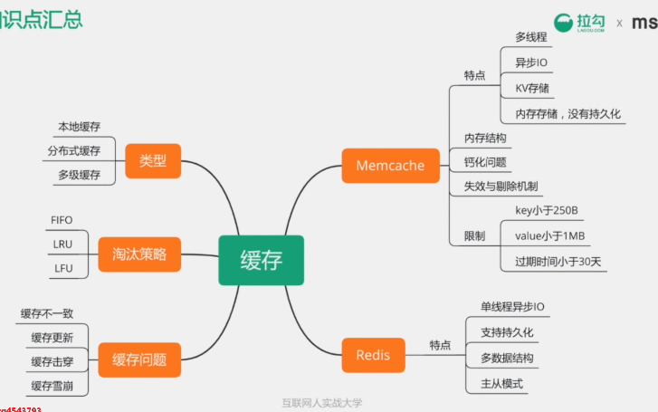
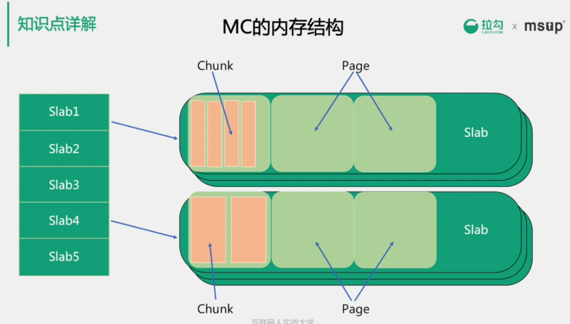
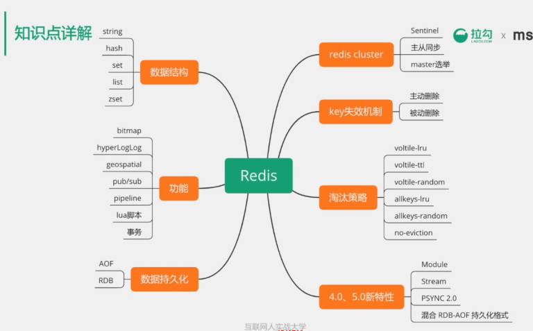
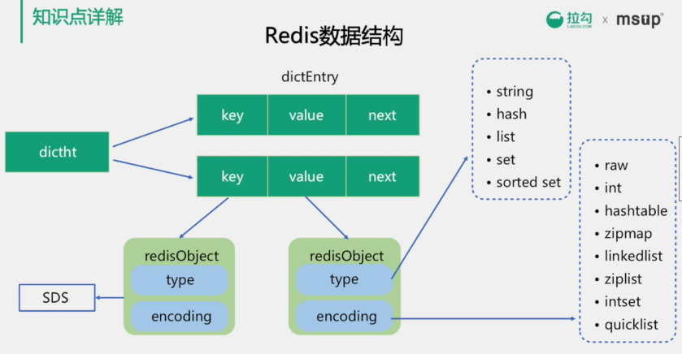
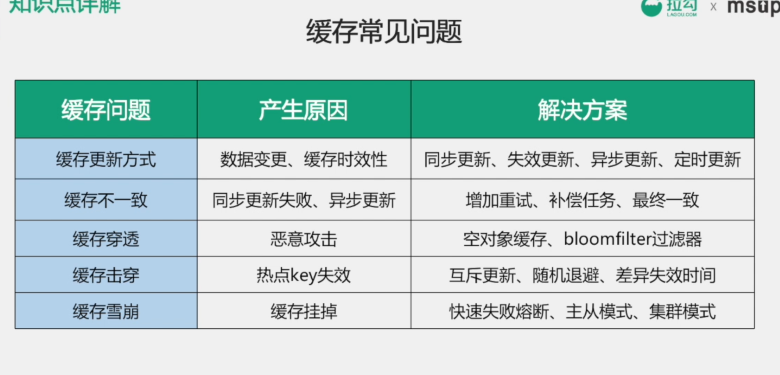
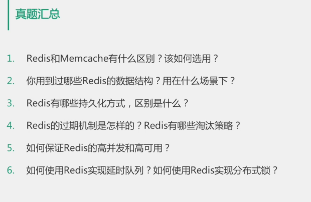

[TOC]
* [概念](#%E6%A6%82%E5%BF%B5)
    * [MC钙化问题](#mc%E9%92%99%E5%8C%96%E9%97%AE%E9%A2%98)
        * [解决钙化问题](#%E8%A7%A3%E5%86%B3%E9%92%99%E5%8C%96%E9%97%AE%E9%A2%98)
    * [redis事务](#redis%E4%BA%8B%E5%8A%A1)
    * [缓存穿透](#%E7%BC%93%E5%AD%98%E7%A9%BF%E9%80%8F)
    * [缓存击穿](#%E7%BC%93%E5%AD%98%E5%87%BB%E7%A9%BF)
* [缓存中间件\-Memcache和Redis的区别](#%E7%BC%93%E5%AD%98%E4%B8%AD%E9%97%B4%E4%BB%B6-memcache%E5%92%8Credis%E7%9A%84%E5%8C%BA%E5%88%AB)
      * [Memcache：代码层次类似Hash](#memcache%E4%BB%A3%E7%A0%81%E5%B1%82%E6%AC%A1%E7%B1%BB%E4%BC%BChash)
      * [Redis](#redis)
* [Redis](#redis-1)
    * [CAP](#cap)
    * [BASE理论](#base%E7%90%86%E8%AE%BA)
  * [为什么Redis能那么快](#%E4%B8%BA%E4%BB%80%E4%B9%88redis%E8%83%BD%E9%82%A3%E4%B9%88%E5%BF%AB)
      * [100000\+QPS（QPS query per second）](#100000qpsqps-query-per-second)
  * [说说你用过的Redis数据类型](#%E8%AF%B4%E8%AF%B4%E4%BD%A0%E7%94%A8%E8%BF%87%E7%9A%84redis%E6%95%B0%E6%8D%AE%E7%B1%BB%E5%9E%8B)
      * [供用户使用的数据类型](#%E4%BE%9B%E7%94%A8%E6%88%B7%E4%BD%BF%E7%94%A8%E7%9A%84%E6%95%B0%E6%8D%AE%E7%B1%BB%E5%9E%8B)
      * [底层数据类型基础](#%E5%BA%95%E5%B1%82%E6%95%B0%E6%8D%AE%E7%B1%BB%E5%9E%8B%E5%9F%BA%E7%A1%80)
  * [淘汰机制](#%E6%B7%98%E6%B1%B0%E6%9C%BA%E5%88%B6)
    * [淘汰算法](#%E6%B7%98%E6%B1%B0%E7%AE%97%E6%B3%95)
    * [redis的淘汰机制](#redis%E7%9A%84%E6%B7%98%E6%B1%B0%E6%9C%BA%E5%88%B6)
  * [从海量key里查询出某一固定前缀的key](#%E4%BB%8E%E6%B5%B7%E9%87%8Fkey%E9%87%8C%E6%9F%A5%E8%AF%A2%E5%87%BA%E6%9F%90%E4%B8%80%E5%9B%BA%E5%AE%9A%E5%89%8D%E7%BC%80%E7%9A%84key)
  * [如何保证与mysql的一致性](#%E5%A6%82%E4%BD%95%E4%BF%9D%E8%AF%81%E4%B8%8Emysql%E7%9A%84%E4%B8%80%E8%87%B4%E6%80%A7)
  * [如何通过redis实现分布式锁](#%E5%A6%82%E4%BD%95%E9%80%9A%E8%BF%87redis%E5%AE%9E%E7%8E%B0%E5%88%86%E5%B8%83%E5%BC%8F%E9%94%81)
    * [分布式锁需要解决的问题](#%E5%88%86%E5%B8%83%E5%BC%8F%E9%94%81%E9%9C%80%E8%A6%81%E8%A7%A3%E5%86%B3%E7%9A%84%E9%97%AE%E9%A2%98)
    * [SETNX key value ： 如果key不存在，则创建并赋值，原子性](#setnx-key-value--%E5%A6%82%E6%9E%9Ckey%E4%B8%8D%E5%AD%98%E5%9C%A8%E5%88%99%E5%88%9B%E5%BB%BA%E5%B9%B6%E8%B5%8B%E5%80%BC%E5%8E%9F%E5%AD%90%E6%80%A7)
    * [如何解决setnx长期有效的问题](#%E5%A6%82%E4%BD%95%E8%A7%A3%E5%86%B3setnx%E9%95%BF%E6%9C%9F%E6%9C%89%E6%95%88%E7%9A%84%E9%97%AE%E9%A2%98)
  * [大量的key需要同时过期](#%E5%A4%A7%E9%87%8F%E7%9A%84key%E9%9C%80%E8%A6%81%E5%90%8C%E6%97%B6%E8%BF%87%E6%9C%9F)
  * [如何使用Redis做异步队列](#%E5%A6%82%E4%BD%95%E4%BD%BF%E7%94%A8redis%E5%81%9A%E5%BC%82%E6%AD%A5%E9%98%9F%E5%88%97)
      * [使用list作为队列，rpush生产消息，lpop消费消息](#%E4%BD%BF%E7%94%A8list%E4%BD%9C%E4%B8%BA%E9%98%9F%E5%88%97rpush%E7%94%9F%E4%BA%A7%E6%B6%88%E6%81%AFlpop%E6%B6%88%E8%B4%B9%E6%B6%88%E6%81%AF)
      * [blpop key timeout ：阻塞直到队列有消息或者超时](#blpop-key-timeout-%E9%98%BB%E5%A1%9E%E7%9B%B4%E5%88%B0%E9%98%9F%E5%88%97%E6%9C%89%E6%B6%88%E6%81%AF%E6%88%96%E8%80%85%E8%B6%85%E6%97%B6)
      * [pub/sub：主题订阅模式](#pubsub%E4%B8%BB%E9%A2%98%E8%AE%A2%E9%98%85%E6%A8%A1%E5%BC%8F)
  * [持久化](#%E6%8C%81%E4%B9%85%E5%8C%96)
      * [RDB redis database （快照）持久化：保存某个时间点的全量数据快照](#rdb-redis-database-%E5%BF%AB%E7%85%A7%E6%8C%81%E4%B9%85%E5%8C%96%E4%BF%9D%E5%AD%98%E6%9F%90%E4%B8%AA%E6%97%B6%E9%97%B4%E7%82%B9%E7%9A%84%E5%85%A8%E9%87%8F%E6%95%B0%E6%8D%AE%E5%BF%AB%E7%85%A7)
      * [自动化触发rdb持久化的方式](#%E8%87%AA%E5%8A%A8%E5%8C%96%E8%A7%A6%E5%8F%91rdb%E6%8C%81%E4%B9%85%E5%8C%96%E7%9A%84%E6%96%B9%E5%BC%8F)
      * [bgsave原理](#bgsave%E5%8E%9F%E7%90%86)
    * [aof  append only file持久化：保存写操作](#aof--append-only-file%E6%8C%81%E4%B9%85%E5%8C%96%E4%BF%9D%E5%AD%98%E5%86%99%E6%93%8D%E4%BD%9C)
      * [日志重写解决aof文件大小不断增大的问题，原理如下：](#%E6%97%A5%E5%BF%97%E9%87%8D%E5%86%99%E8%A7%A3%E5%86%B3aof%E6%96%87%E4%BB%B6%E5%A4%A7%E5%B0%8F%E4%B8%8D%E6%96%AD%E5%A2%9E%E5%A4%A7%E7%9A%84%E9%97%AE%E9%A2%98%E5%8E%9F%E7%90%86%E5%A6%82%E4%B8%8B)
      * [rdb和aof文件共存情况下的恢复流程](#rdb%E5%92%8Caof%E6%96%87%E4%BB%B6%E5%85%B1%E5%AD%98%E6%83%85%E5%86%B5%E4%B8%8B%E7%9A%84%E6%81%A2%E5%A4%8D%E6%B5%81%E7%A8%8B)
      * [rdb和aof的优缺点](#rdb%E5%92%8Caof%E7%9A%84%E4%BC%98%E7%BC%BA%E7%82%B9)
      * [rdb\-aof混合持久化方式](#rdb-aof%E6%B7%B7%E5%90%88%E6%8C%81%E4%B9%85%E5%8C%96%E6%96%B9%E5%BC%8F)
  * [使用pipeline的好处](#%E4%BD%BF%E7%94%A8pipeline%E7%9A%84%E5%A5%BD%E5%A4%84)
  * [redis同步机制](#redis%E5%90%8C%E6%AD%A5%E6%9C%BA%E5%88%B6)
      * [主从同步原理](#%E4%B8%BB%E4%BB%8E%E5%90%8C%E6%AD%A5%E5%8E%9F%E7%90%86)
      * [全同步过程](#%E5%85%A8%E5%90%8C%E6%AD%A5%E8%BF%87%E7%A8%8B)
      * [增量同步过程](#%E5%A2%9E%E9%87%8F%E5%90%8C%E6%AD%A5%E8%BF%87%E7%A8%8B)
    * [Redis Sentinel（哨兵模式）](#redis-sentinel%E5%93%A8%E5%85%B5%E6%A8%A1%E5%BC%8F)
    * [redis集群原理](#redis%E9%9B%86%E7%BE%A4%E5%8E%9F%E7%90%86)
    * [一致性hash算法](#%E4%B8%80%E8%87%B4%E6%80%A7hash%E7%AE%97%E6%B3%95)
    * [hash环的数据倾斜问题](#hash%E7%8E%AF%E7%9A%84%E6%95%B0%E6%8D%AE%E5%80%BE%E6%96%9C%E9%97%AE%E9%A2%98)
    * [一致性Hash用java模拟](#%E4%B8%80%E8%87%B4%E6%80%A7hash%E7%94%A8java%E6%A8%A1%E6%8B%9F)
    * [redis cluster](#redis-cluster)
* [多路IO复用模型](#%E5%A4%9A%E8%B7%AFio%E5%A4%8D%E7%94%A8%E6%A8%A1%E5%9E%8B)
      * [FD：file descriptor 文件描述符](#fdfile-descriptor-%E6%96%87%E4%BB%B6%E6%8F%8F%E8%BF%B0%E7%AC%A6)
      * [Select系统调用](#select%E7%B3%BB%E7%BB%9F%E8%B0%83%E7%94%A8)
      * [Redis采用的IO多路复用函数：epoll   kqueue   evport    select？](#redis%E9%87%87%E7%94%A8%E7%9A%84io%E5%A4%9A%E8%B7%AF%E5%A4%8D%E7%94%A8%E5%87%BD%E6%95%B0epoll---kqueue---evport----select)

# 概念

MC内存分为多个slab，slab机制主要是为了避免频繁malloc和free产生内存碎片问题

每种类型的slab用来保存不同大小的对象，每个slab又多个page组成，page的默认大小为1M，所以MC的存储对象对象默认不能超过1M

每个page内分为多个chunk，chunk就是实际用来保存对象的空间

Slab Allocator创建slab的参数有三个，分别是chunk大小的增长因子，chunk大小的初始值，page大小，运行时根据要保存的对象大小来逐个创建slab

### MC钙化问题

使用MC来保存用户信息，比如单个对象大概是300byte，这是会产生大量384字节大小的slab，运行一段时间后，用户信息增加了一个属性，单个对象大小变成了500字节，这时，在保存对象时需要使用768字节的slab，而MC中的容量大部分都创建了384字节的slab，所以768的比较少，这时虽然384的slab内存大量空闲，但是768slab还是会更具LRU算法频繁地剔除缓存，导致MC的剔除率增高，命中率降低

##### 解决钙化问题

开启MC的auto-move机制，每10秒调整slab

### redis事务

并非严格的事务，保证串行执行事务，并保证严格执行，但是不会回滚

> redis cluster有固定的16384个hash slot，对每个key计算CRC16值，然后对16384取模，可以获取key对应的hash slot

### 缓存穿透

攻击者用不存在的信息频繁请求接口，导致查询缓存不命中，大量到达db层，在db层不命中，可用空对象标记，防止相同id再次访问，利用bloomfilter，bloomfilter是存在性检测，如果bloomfilter中不存在，那么数据一定不存在

### 缓存击穿

某个热点数据失效时，大量针对这个数据的请求会穿透到数据源

解决方法

互斥锁更新，同一个进程中针对同一个数据不会并发请求db，减小db压力

6、使用redis 的 sorted set，使用时间戳作为score，使用zrangebyscore来使用之前的数据

# 缓存中间件-Memcache和Redis的区别

#### Memcache：代码层次类似Hash

1、支持简单数据类型

2、不支持数据持久化

3、不支持主从

4、不支持分片

#### Redis

1、数据类型丰富

2、支持数据持久化

3、支持主从

4、支持分片

# Redis

### CAP

CAP理论就是说在分布式存储系统中，最多只能实现上面的两点。
而由于当前的网络硬件肯定会出现延迟丢包等问题，所以
**分区容忍性是我们必须需要实现的。**
所以我们只能在一致性和可用性之间进行权衡，没有NoSQL系统能同时保证这三点。
**C:强一致性 A：高可用性 P：分布式容忍性**
 CA 传统Oracle数据库
 AP 大多数网站架构的选择
 CP Redis、Mongodb
 注意：分布式架构的时候必须做出取舍。
一致性和可用性之间取一个平衡。多余大多数web应用，其实并不需要强一致性。
因此牺牲C换取P，这是目前分布式数据库产品的方向

**CAP理论的核心是：一个分布式系统不可能同时很好的满足一致性，可用性和分区容错性这三个需求，**
最多只能同时较好的满足两个。
因此，根据 CAP 原理将 NoSQL 数据库分成了满足 CA 原则、满足 CP 原则和满足 AP 原则三 大类：
CA - 单点集群，满足一致性，可用性的系统，通常在可扩展性上不太强大。
CP - 满足一致性，分区容忍必的系统，通常性能不是特别高。
AP - 满足可用性，分区容忍性的系统，通常可能对一致性要求低一些。

### BASE理论

BASE就是为了解决关系数据库强一致性引起的问题而引起的可用性降低而提出的解决方案。

BASE其实是下面三个术语的缩写：
    基本可用（Basically Available）
    软状态（Soft state）
    最终一致（Eventually consistent）

它的思想是通过让系统放松对某一时刻数据一致性的要求来换取系统整体伸缩性和性能上改观。为什么这么说呢，缘由就在于大型系统往往由于地域分布和极高性能的要求，不可能采用分布式事务来完成这些指标，要想获得这些指标，我们必须采用另外一种方式来完成，这里BASE就是解决这个问题的办法

## 为什么Redis能那么快

#### 100000+QPS（QPS query per second）

1、完全基于内存，大部分请求是纯粹的内存操作，执行效率高

2、数据结构简单，对数据操作也简单

3、采用单线程，单线程也能处理高并发请求（主线程是单线程，io处理），想多核也可以启动多实例，避免上下文切换和锁竞争

4、采用多路IO复用模型，非阻塞io

## 说说你用过的Redis数据类型

#### 供用户使用的数据类型

1、string 容量最大513M  jpg图片，序列化对象

底层是C语言  sdshdr 结构体  

2、Hash String元素组成的字典，适合存储对象

3、list   列表 按照String元素插入顺序排序

4、set String元素组成的无序集合，通过hash表通过hash表实现，不允许重复

5、Sorted Set 通过分数来为集合中的成员进行从小到大排序

6、高级类型    

用于计数的HyperLogLog ，用于支持存储地理位置信息的Geo

#### 底层数据类型基础

1、简单动态字符串

2、链表

3、字典

4、跳跃表

5、整数集合

6、压缩列表

7、对象

## 淘汰机制

redis内存数据集大小上升到一定大小的时候，就会施行数据淘汰策略。可以保证都是热点数据。

### 淘汰算法

* FIFO：First In First Out，先进先出。判断被存储的时间，离目前最远的数据优先被淘汰。
* LRU：Least Recently Used，最近最少使用。判断最近被使用的时间，目前最远的数据优先被淘汰。
* LFU：Least Frequently Used，最不经常使用。在一段时间内，数据被使用**次数**最少的，优先被淘汰。

> LRU是淘汰最长时间没有被使用的页面。
>
> LFU是淘汰一段时间内，使用次数最少的页面。

### redis的淘汰机制

* noeviction：当内存不足以容纳新写入数据时，新写入操作会报错。

* allkeys-lru：当内存不足以容纳新写入数据时，在键空间中，移除最近最少使用的key。

* allkeys-random：当内存不足以容纳新写入数据时，在键空间中，随机移除某个key。

* volatile-lru：当内存不足以容纳新写入数据时，在设置了过期时间的键空间中，移除最近最少使用的key。

* volatile-random：当内存不足以容纳新写入数据时，在设置了过期时间的键空间中，随机移除某个key。

* volatile-ttl：当内存不足以容纳新写入数据时，在设置了过期时间的键空间中，有更早过期时间的key优先移除。

## 从海量key里查询出某一固定前缀的key

留意细节   数据量

1、keys pattern：查找所有符合给定模式的pattern的key

keys一次性返回所有匹配的key

建的数量过大会使得内存卡顿

2、scan cursor 【Match pattern】【Count count】

基于**游标**cursor的迭代器，需要基于上一次的游标延续之前的迭代过程

以0左右游标开始一次新的迭代，直到命令返回游标0完成一次遍历

不保证每次执行都返回某个给定数量的元素，支持模糊查询

一次返回的数量不可控，只能是大概率符合count参数

## 如何保证与mysql的一致性

分为缓存删除和缓存更新两种情况。

首先是必须对缓存设置过期时间来保证最终一致性。

对于更新操作，一般是先更新数据库再更新缓存。

对于删除操作，先删除缓存，再删数据库。并且可以优化，采用延时双删除策略。

>  1）先删除缓存
>
>  2）再写数据库
>
>  3）休眠500毫秒（根据具体的业务时间来定）
>
>  4）再次删除缓存。

## 如何通过redis实现分布式锁

### 分布式锁需要解决的问题

1、互斥性

2、安全性

3、死锁

4、容错

### SETNX key value ： 如果key不存在，则创建并赋值，原子性

### 如何解决setnx长期有效的问题

expire key seconds 

设置key的生存时间，

先用setnx再用expire，不是原子性

set key value 【EX seconds】 【PX milliseseconds】 【NX|XX】

NX 只有在建不存在时才返回1 类似于setnx

解决了原子性

## 大量的key需要同时过期

集中过期，由于清除大量的key很耗时，会出现短暂的卡顿

解决方案：在设置key的过期时间的时候，给每一个key加上随机值，让其分散过期。

## 如何使用Redis做异步队列

#### 使用list作为队列，rpush生产消息，lpop消费消息

缺点：没有等待队列里有值就直接消费

弥补：可以通过在应用层引入sleep机智去调用lpop重试

#### blpop key timeout ：阻塞直到队列有消息或者超时

缺点：只能供一个消费者消费

#### pub/sub：主题订阅模式

发送者pub发送消息，订阅者sub接受消息

订阅者可以订阅任意数量的频道

缺点：消息的发布是无状态的，无法保证可达

## 持久化

#### RDB redis database （快照）持久化：保存某个时间点的全量数据快照

1、save：阻塞redis的服务器进程，直到rdb文件被创建完毕

2、bgsave：fork出一个子进程来创建rdb文件，不阻塞服务器进程，可用lastsave查看上一次rdb时间

#### 自动化触发rdb持久化的方式

1、根据redis.conf配置里的save m n定时触发

2、主从复制时，主节点自动触发

3、执行Debug reload

4、执行shutdown且没有开启aof持久化

#### bgsave原理

系统调用fork，创建进程，实现copy-on-write

### aof  append only file持久化：保存写操作

记录下除了查询以外的所有变更数据库状态的指令

以append的形式追加到aof文件中（增量）

#### 日志重写解决aof文件大小不断增大的问题，原理如下：

1、调用fork()，创建一个子进程

2、子进程把新的aof写到一个临时文件中，不依赖原理的aof

3、子进程持续把新的变动同时写到内存和原来的aof中

4、主进程获取子进程重写aof的完成信号，往新aof同步增量变动

5、使用新的aof文件替换掉旧的aof文件

#### rdb和aof文件共存情况下的恢复流程

优先使用aof

#### rdb和aof的优缺点

rdb优点：全量数据快照，文件小，恢复快

rdb缺点：无法保存最近一次快照之后的数据

aof优点：可读性高，适合保存增量数据，数据不易丢失

aof缺点：文件体积大，恢复时间长

#### rdb-aof混合持久化方式

先以rdb写入全量数据，再以aof写入增量数据

## 使用pipeline的好处

-pipe

pipeline和linux的管道类似

redis基于请求/相应模型，单个请求处理需要一一应答

pipeline批量执行指令，节省多次io往返时间

## redis同步机制

#### 主从同步原理

分为全同步过程和增量同步过程

#### 全同步过程

1、salve发送sync命令到master

2、master启动一个后台进程，将redis中的数据快照保存到文件中

3、master将保存数据快照期间接收到的写命令缓存起来

4、master完成写操作后，将该文件发送给salve

5、使用新的aof文件替换掉旧的aof文件

6、master将这期间收集的增量写命令发送给salve端

#### 增量同步过程

1、master接收到用户的操作指令，判断是否需要传播到slave中（增删改）

2、将操作记录追加到aof文件中

3、将操作传播到其他slave：对齐主从库，往相应缓存写入指令

4、将缓存中的数据发送给slave

### Redis Sentinel（哨兵模式）

目录下新建sentinel.conf文件

解决了主从同步master宕机后的主从切换问题

1、监控：检查主从服务器是否运行正常

2、提醒：通过api向管理员或者其他应用程序发送故障通知

3、自动故障迁移：主从切换

### redis集群原理

分片：按照某种规则去划分数据，分散存储在多个节点上，采用无中心结构，节点之间使用gosee协议，传播信息以及发现新的节点。

在解决分布式系统中负载均衡的问题时候可以使用Hash算法让固定的一部分请求落到同一台服务器上，这样每台服务器固定处理一部分请求（并维护这些请求的信息），起到负载均衡的作用。

### 一致性hash算法

对2^32取模，将hash值空间组织成虚拟的圆环

当用户在客户端进行请求时候，首先根据hash(用户id)计算路由规则（hash值），然后看hash值落到了hash环的那个地方，根据hash值在hash环上的位置顺时针找距离最近的ip作为路由ip.

### hash环的数据倾斜问题

引入虚拟节点解决数据倾斜问题

为每台服务器计算多次虚拟节点

### 一致性Hash用java模拟

用TreeMap存放hash值以及实际的ip

~~~java
public class Main {
    //待添加入Hash环的服务器列表
    private static String[] servers = {"192.168.0.0:111", "192.168.0.1:111",
            "192.168.0.2:111", "192.168.0.3:111", "192.168.0.4:111"};

    //key表示服务器的hash值，value表示服务器
    private static SortedMap<Integer, String> sortedMap = new TreeMap<Integer, String>();

    //程序初始化，将所有的服务器放入sortedMap中
    static {
        for (int i = 0; i < servers.length; i++) {
            int hash = getHash(servers[i]);
            System.out.println("[" + servers[i] + "]加入集合中, 其Hash值为" + hash);
            sortedMap.put(hash, servers[i]);
        }
        System.out.println();
    }

    //得到应当路由到的结点
    private static String getServer(String key) {
        //得到该key的hash值
        int hash = getHash(key);
        //得到大于该Hash值的所有Map
        SortedMap<Integer, String> subMap = sortedMap.tailMap(hash);
        if (subMap.isEmpty()) {
            //如果没有比该key的hash值大的，则从第一个node开始
            Integer i = sortedMap.firstKey();
            //返回对应的服务器
            return sortedMap.get(i);
        } else {
            //第一个Key就是顺时针过去离node最近的那个结点
            Integer i = subMap.firstKey();
            //返回对应的服务器
            return subMap.get(i);
        }
    }

    //使用FNV1_32_HASH算法计算服务器的Hash值,这里不使用重写hashCode的方法，最终效果没区别
    private static int getHash(String str) {
        final int p = 16777619;
        int hash = (int) 2166136261L;
        for (int i = 0; i < str.length(); i++)
            hash = (hash ^ str.charAt(i)) * p;
        hash += hash << 13;
        hash ^= hash >> 7;
        hash += hash << 3;
        hash ^= hash >> 17;
        hash += hash << 5;

        // 如果算出来的值为负数则取其绝对值
        if (hash < 0)
            hash = Math.abs(hash);
        return hash;
    }

    public static void main(String[] args) {
        String[] keys = {"太阳", "月亮", "星星"};
        for (int i = 0; i < keys.length; i++){
            int hash = getHash(keys[i]);
            String server = getServer(keys[i]);
        }
    }
}
~~~

### redis cluster

redis cluster有固定的16384个hash slot，对每个key计算CRC16值，然后对16384取模，可以获取key对应的hash slot

redis cluster中每个master都会持有部分slot，比如有3个master，那么可能每个master持有5000多个hash slot

hash slot让node的增加和移除很简单，增加一个master，就将其他master的hash slot移动部分过去，减少一个master，就将它的hash slot移动到其他master上去

移动hash slot的成本是非常低的

客户端的api，可以对指定的数据，让他们走同一个hash slot，通过hash tag来实现

# 多路IO复用模型

#### FD：file descriptor 文件描述符

#### Select系统调用

#### Redis采用的IO多路复用函数：epoll   kqueue   evport    select？

1、优先选择时间复杂度为O（1）的io多路复用函数作为底层实现

2、以时间复杂度为O(n)的select作为保底

