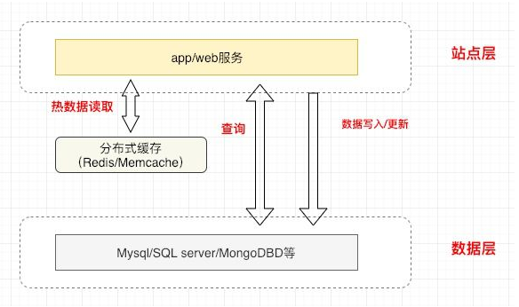
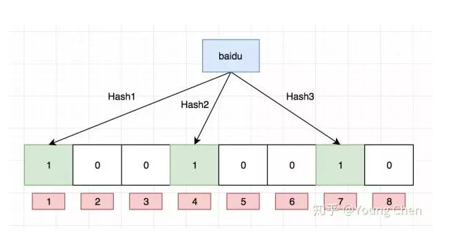
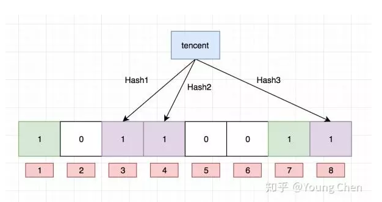
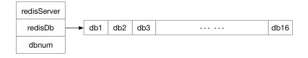
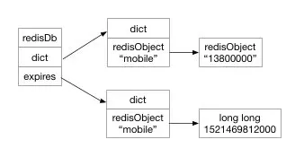
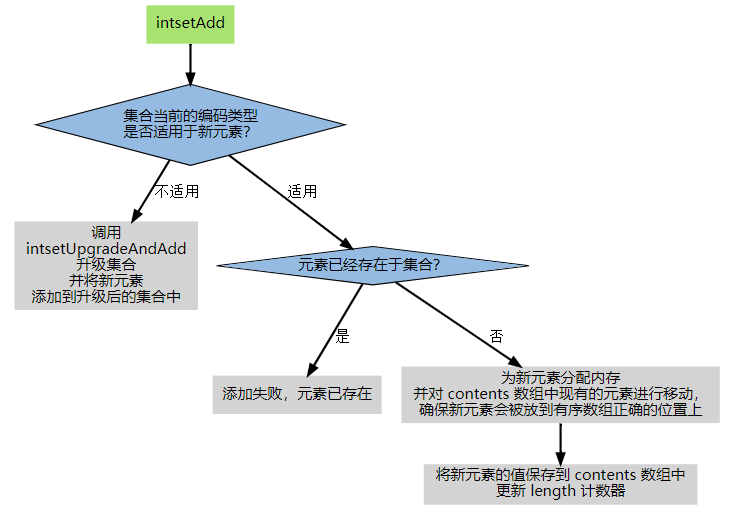
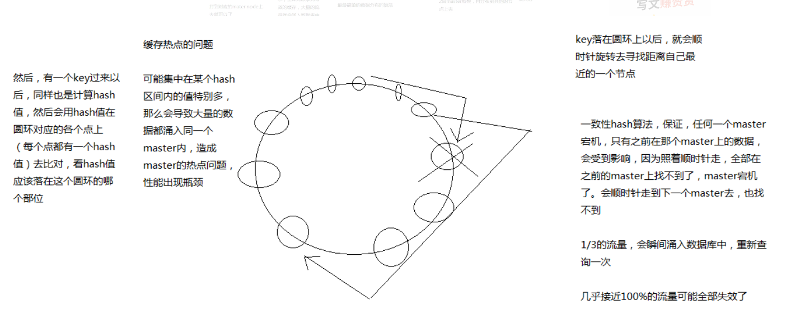
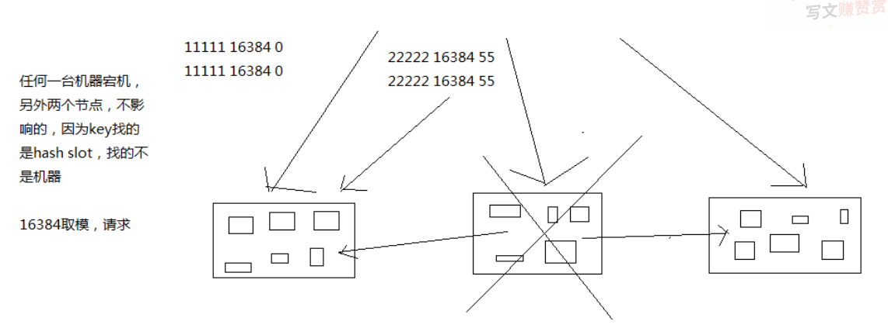

* [缓存](#%E7%BC%93%E5%AD%98)
  * [CAP](#cap)
  * [BASE理论](#base%E7%90%86%E8%AE%BA)
  * [缓存架构](#%E7%BC%93%E5%AD%98%E6%9E%B6%E6%9E%84)
  * [一致性](#%E4%B8%80%E8%87%B4%E6%80%A7)
    * [Cache Aside Pattern](#cache-aside-pattern)
      * [读请求](#%E8%AF%BB%E8%AF%B7%E6%B1%82)
      * [对于写请求](#%E5%AF%B9%E4%BA%8E%E5%86%99%E8%AF%B7%E6%B1%82)
      * [存在的问题](#%E5%AD%98%E5%9C%A8%E7%9A%84%E9%97%AE%E9%A2%98)
  * [常见问题](#%E5%B8%B8%E8%A7%81%E9%97%AE%E9%A2%98)
    * [缓存穿透](#%E7%BC%93%E5%AD%98%E7%A9%BF%E9%80%8F)
        * [bloomfilter](#bloomfilter)
    * [缓存击穿](#%E7%BC%93%E5%AD%98%E5%87%BB%E7%A9%BF)
* [Memcache](#memcache)
  * [内存结构](#%E5%86%85%E5%AD%98%E7%BB%93%E6%9E%84)
  * [MC钙化问题](#mc%E9%92%99%E5%8C%96%E9%97%AE%E9%A2%98)
    * [解决钙化问题](#%E8%A7%A3%E5%86%B3%E9%92%99%E5%8C%96%E9%97%AE%E9%A2%98)
* [Redis](#redis)
  * [为什么Redis能那么快](#%E4%B8%BA%E4%BB%80%E4%B9%88redis%E8%83%BD%E9%82%A3%E4%B9%88%E5%BF%AB)
  * [数据类型](#%E6%95%B0%E6%8D%AE%E7%B1%BB%E5%9E%8B)
    * [底层数据类型基础](#%E5%BA%95%E5%B1%82%E6%95%B0%E6%8D%AE%E7%B1%BB%E5%9E%8B%E5%9F%BA%E7%A1%80)
      * [内部数据结构](#%E5%86%85%E9%83%A8%E6%95%B0%E6%8D%AE%E7%BB%93%E6%9E%84)
        * [1、简单动态字符串](#1%E7%AE%80%E5%8D%95%E5%8A%A8%E6%80%81%E5%AD%97%E7%AC%A6%E4%B8%B2)
        * [2、双端链表](#2%E5%8F%8C%E7%AB%AF%E9%93%BE%E8%A1%A8)
        * [3、字典](#3%E5%AD%97%E5%85%B8)
        * [4、跳跃表](#4%E8%B7%B3%E8%B7%83%E8%A1%A8)
      * [内存映射数据结构](#%E5%86%85%E5%AD%98%E6%98%A0%E5%B0%84%E6%95%B0%E6%8D%AE%E7%BB%93%E6%9E%84)
        * [5、整数集合](#5%E6%95%B4%E6%95%B0%E9%9B%86%E5%90%88)
        * [6、压缩列表](#6%E5%8E%8B%E7%BC%A9%E5%88%97%E8%A1%A8)
  * [持久化](#%E6%8C%81%E4%B9%85%E5%8C%96)
    * [RDB](#rdb)
      * [执行命令](#%E6%89%A7%E8%A1%8C%E5%91%BD%E4%BB%A4)
      * [自动化触发rdb持久化的方式](#%E8%87%AA%E5%8A%A8%E5%8C%96%E8%A7%A6%E5%8F%91rdb%E6%8C%81%E4%B9%85%E5%8C%96%E7%9A%84%E6%96%B9%E5%BC%8F)
    * [AOF](#aof)
      * [日志重写解决aof文件大小不断增大的问题，原理如下：](#%E6%97%A5%E5%BF%97%E9%87%8D%E5%86%99%E8%A7%A3%E5%86%B3aof%E6%96%87%E4%BB%B6%E5%A4%A7%E5%B0%8F%E4%B8%8D%E6%96%AD%E5%A2%9E%E5%A4%A7%E7%9A%84%E9%97%AE%E9%A2%98%E5%8E%9F%E7%90%86%E5%A6%82%E4%B8%8B)
    * [区别](#%E5%8C%BA%E5%88%AB)
      * [rdb和aof文件共存情况下的恢复流程](#rdb%E5%92%8Caof%E6%96%87%E4%BB%B6%E5%85%B1%E5%AD%98%E6%83%85%E5%86%B5%E4%B8%8B%E7%9A%84%E6%81%A2%E5%A4%8D%E6%B5%81%E7%A8%8B)
      * [rdb和aof的优缺点](#rdb%E5%92%8Caof%E7%9A%84%E4%BC%98%E7%BC%BA%E7%82%B9)
      * [rdb\-aof混合持久化方式](#rdb-aof%E6%B7%B7%E5%90%88%E6%8C%81%E4%B9%85%E5%8C%96%E6%96%B9%E5%BC%8F)
  * [淘汰机制](#%E6%B7%98%E6%B1%B0%E6%9C%BA%E5%88%B6)
    * [淘汰算法](#%E6%B7%98%E6%B1%B0%E7%AE%97%E6%B3%95)
        * [LRU](#lru)
    * [redis的淘汰机制](#redis%E7%9A%84%E6%B7%98%E6%B1%B0%E6%9C%BA%E5%88%B6)
  * [集群](#%E9%9B%86%E7%BE%A4)
    * [同步机制](#%E5%90%8C%E6%AD%A5%E6%9C%BA%E5%88%B6)
      * [主从同步原理](#%E4%B8%BB%E4%BB%8E%E5%90%8C%E6%AD%A5%E5%8E%9F%E7%90%86)
      * [全同步过程](#%E5%85%A8%E5%90%8C%E6%AD%A5%E8%BF%87%E7%A8%8B)
      * [增量同步过程](#%E5%A2%9E%E9%87%8F%E5%90%8C%E6%AD%A5%E8%BF%87%E7%A8%8B)
    * [Redis Sentinel（哨兵模式）](#redis-sentinel%E5%93%A8%E5%85%B5%E6%A8%A1%E5%BC%8F)
    * [redis集群原理](#redis%E9%9B%86%E7%BE%A4%E5%8E%9F%E7%90%86)
    * [一致性hash算法](#%E4%B8%80%E8%87%B4%E6%80%A7hash%E7%AE%97%E6%B3%95)
      * [hash环的数据倾斜问题](#hash%E7%8E%AF%E7%9A%84%E6%95%B0%E6%8D%AE%E5%80%BE%E6%96%9C%E9%97%AE%E9%A2%98)
      * [一致性Hash用java模拟](#%E4%B8%80%E8%87%B4%E6%80%A7hash%E7%94%A8java%E6%A8%A1%E6%8B%9F)
    * [redis cluster](#redis-cluster)
  * [常见问题](#%E5%B8%B8%E8%A7%81%E9%97%AE%E9%A2%98-1)
    * [使用pipeline的好处](#%E4%BD%BF%E7%94%A8pipeline%E7%9A%84%E5%A5%BD%E5%A4%84)
    * [从海量key里查询出某一固定前缀的key](#%E4%BB%8E%E6%B5%B7%E9%87%8Fkey%E9%87%8C%E6%9F%A5%E8%AF%A2%E5%87%BA%E6%9F%90%E4%B8%80%E5%9B%BA%E5%AE%9A%E5%89%8D%E7%BC%80%E7%9A%84key)
    * [如何通过redis实现分布式锁](#%E5%A6%82%E4%BD%95%E9%80%9A%E8%BF%87redis%E5%AE%9E%E7%8E%B0%E5%88%86%E5%B8%83%E5%BC%8F%E9%94%81)
      * [SETNX key value ： 如果key不存在，则创建并赋值，原子性](#setnx-key-value--%E5%A6%82%E6%9E%9Ckey%E4%B8%8D%E5%AD%98%E5%9C%A8%E5%88%99%E5%88%9B%E5%BB%BA%E5%B9%B6%E8%B5%8B%E5%80%BC%E5%8E%9F%E5%AD%90%E6%80%A7)
    * [大量的key需要同时过期](#%E5%A4%A7%E9%87%8F%E7%9A%84key%E9%9C%80%E8%A6%81%E5%90%8C%E6%97%B6%E8%BF%87%E6%9C%9F)
  * [如何使用Redis做异步队列](#%E5%A6%82%E4%BD%95%E4%BD%BF%E7%94%A8redis%E5%81%9A%E5%BC%82%E6%AD%A5%E9%98%9F%E5%88%97)
      * [使用list作为队列，rpush生产消息，lpop消费消息](#%E4%BD%BF%E7%94%A8list%E4%BD%9C%E4%B8%BA%E9%98%9F%E5%88%97rpush%E7%94%9F%E4%BA%A7%E6%B6%88%E6%81%AFlpop%E6%B6%88%E8%B4%B9%E6%B6%88%E6%81%AF)
      * [blpop key timeout ：阻塞直到队列有消息或者超时](#blpop-key-timeout-%E9%98%BB%E5%A1%9E%E7%9B%B4%E5%88%B0%E9%98%9F%E5%88%97%E6%9C%89%E6%B6%88%E6%81%AF%E6%88%96%E8%80%85%E8%B6%85%E6%97%B6)
      * [pub/sub：主题订阅模式](#pubsub%E4%B8%BB%E9%A2%98%E8%AE%A2%E9%98%85%E6%A8%A1%E5%BC%8F)
* [Memcache和Redis的区别](#memcache%E5%92%8Credis%E7%9A%84%E5%8C%BA%E5%88%AB)
      * [Memcache](#memcache-1)
      * [Redis](#redis-1)


# 缓存

## CAP

CAP理论就是说在分布式存储系统中，最多只能实现上面的两点。
而由于当前的网络硬件肯定会出现延迟丢包等问题，所以
**分区容忍性是我们必须需要实现的。**
所以我们只能在一致性和可用性之间进行权衡，没有NoSQL系统能同时保证这三点。
**C:强一致性 A：高可用性 P：分布式容忍性**
 CA 传统Oracle数据库
 AP 大多数网站架构的选择
 CP Redis、Mongodb
 注意：分布式架构的时候必须做出取舍。
一致性和可用性之间取一个平衡。多余大多数web应用，其实并不需要强一致性。
因此牺牲C换取P，这是目前分布式数据库产品的方向

**CAP理论的核心是：一个分布式系统不可能同时很好的满足一致性，可用性和分区容错性这三个需求，**
最多只能同时较好的满足两个。
因此，根据 CAP 原理将 NoSQL 数据库分成了满足 CA 原则、满足 CP 原则和满足 AP 原则三 大类：
CA - 单点集群，满足一致性，可用性的系统，通常在可扩展性上不太强大。
CP - 满足一致性，分区容忍必的系统，通常性能不是特别高。
AP - 满足可用性，分区容忍性的系统，通常可能对一致性要求低一些。

## BASE理论

BASE就是为了解决关系数据库强一致性引起的问题而引起的可用性降低而提出的解决方案。

BASE其实是下面三个术语的缩写：
    基本可用（Basically Available）
    软状态（Soft state）
    最终一致（Eventually consistent）

它的思想是通过让系统放松对某一时刻数据一致性的要求来换取系统整体伸缩性和性能上改观。为什么这么说呢，缘由就在于大型系统往往由于地域分布和极高性能的要求，不可能采用分布式事务来完成这些指标，要想获得这些指标，我们必须采用另外一种方式来完成，这里BASE就是解决这个问题的办法

## 缓存架构



## 一致性

### Cache Aside Pattern

缓存旁路定理

#### 读请求

先读cache，再读db
如果，cache hit，则直接返回数据
如果，cache miss，则访问db，并将数据set回缓存

#### 对于写请求

先操作数据库，再淘汰缓存（淘汰缓存，而不是更新缓存）

#### 存在的问题

答：如果先操作数据库，再淘汰缓存，在原子性被破坏时：
 （1）修改数据库成功了
 （2）淘汰缓存失败了
 导致，数据库与缓存的数据不一致。

个人见解：这里个人觉得可以使用重试的方法，在淘汰缓存的时候，如果失败，则重试一定的次数。如果失败一定次数还不行，那就是其他原因了。比如说redis故障、内网出了问题。

也可以采用先修改缓存再修改数据库

也可以采用这用方式

通过数据库的binlog来异步淘汰key，以mysql为例 可以使用阿里的canal将binlog日志采集发送到MQ队列里面，然后通过ACK机制 确认处理 这条更新消息，删除缓存，保证数据缓存一致性。

> MySQL的二进制日志binlog可以说是MySQL最重要的日志，它记录了所有的DDL和DML语句（除了数据查询语句select）,以事件形式记录，还包含语句所执行的消耗的时间，MySQL的二进制日志是事务安全型的。

**先修改缓存再修改数据库**，**并且因为数据库主从的不一致导致的问题**

*选择性读主*
可以利用一个缓存记录必须读主的数据。

当写请求发生时：
（1）写主库
（2）将哪个库，哪个表，哪个主键三个信息拼装一个key设置到cache里，这条记录的超时时间，设置为“主从同步时延”
PS：key的格式为“db:table:PK”，假设主从延时为1s，这个key的cache超时时间也为1s。

### 最终一致性的三种其他方案

#### 方案一

通过key的过期时间，mysql更新时，redis不更新。 这种方式实现简单，但不一致的时间会很长。如果读请求非常频繁，且过期时间比较长，则会产生很多长期的脏数据。

优点：

- 开发成本低，易于实现；
- 管理成本低，出问题的概率会比较小。

不足

- 完全依赖过期时间，时间太短容易缓存频繁失效，太长容易有长时间更新延迟（不一致）

#### 方案二

在方案一的基础上扩展，通过key的过期时间兜底，并且，在更新mysql时，同时更新redis。

优点

- 相对方案一，更新延迟更小。

不足

- 如果更新mysql成功，更新redis却失败，就退化到了方案一；
- 在高并发场景，业务server需要和mysql,redis同时进行连接。这样是损耗双倍的连接资源，容易造成连接数过多的问题。

#### 方案三

针对方案二的同步写redis进行优化，增加消息队列，将redis更新操作交给kafka，由消息队列保证可靠性，再搭建一个消费服务，来异步更新redis。

优点

- 消息队列可以用一个句柄，很多消息队列客户端还支持本地缓存发送，有效解决了方案二连接数过多的问题；
- 使用消息队列，实现了逻辑上的解耦；
- 消息队列本身具有可靠性，通过手动提交等手段，可以至少一次消费到redis。

不足

- 依旧解决不了时序性问题，如果多台业务服务器分别处理针对同一行数据的两条请求，举个栗子，a = 1； a = 5;，如果mysql中是第一条先执行，而进入kafka的顺序是第二条先执行，那么数据就会产生不一致。
- 引入了消息队列，同时要增加服务消费消息，成本较高。


## 常见问题


### 缓存穿透

攻击者用不存在的信息频繁请求接口，导致查询缓存不命中，大量到达db层，在db层不命中，可用空对象标记，防止相同id再次访问，利用bloomfilter，bloomfilter是存在性检测，如果bloomfilter中不存在，那么数据一定不存在

##### bloomfilter

本质上布隆过滤器是一种数据结构，可以得到 “某样东西一定不存在或者可能存在”。

布隆过滤器是一个 bit 向量或者说 bit 数组

如果我们要映射一个值到布隆过滤器中，我们需要使用多个不同的哈希函数生成多个哈希值，并对每个生成的哈希值指向的 bit 位置 1，例如针对值 “baidu” 和三个不同的哈希函数分别生成了哈希值 1、4、7，则上图转变为：



我们现在再存一个值 “tencent”，如果哈希函数返回 3、4、8 的话，图继续变为：



值得注意的是，4 这个 bit 位由于两个值的哈希函数都返回了这个 bit 位，因此它被覆盖了。现在我们如果想查询 “dianping” 这个值是否存在，哈希函数返回了 1、5、8三个值，结果我们发现 5 这个 bit 位上的值为 0，说明没有任何一个值映射到这个 bit 位上，因此我们可以很确定地说 “dianping” 这个值不存在。而当我们需要查询 “baidu” 这个值是否存在的话，那么哈希函数必然会返回 1、4、7，然后我们检查发现这三个 bit 位上的值均为 1，那么我们可以说 “baidu” 存在了么？答案是不可以，只能是 “baidu” 这个值可能存在。

这是为什么呢？答案跟简单，因为随着增加的值越来越多，被置为 1 的 bit 位也会越来越多，这样某个值 “taobao” 即使没有被存储过，但是万一哈希函数返回的三个 bit 位都被其他值置位了 1 ，那么程序还是会判断 “taobao” 这个值存在。

### 缓存击穿

某个热点数据失效时，大量针对这个数据的请求会穿透到数据源

解决方法

互斥锁更新，同一个进程中针对同一个数据不会并发请求db，减小db压力

# Memcache

Memcached是一个自由开源的，高性能，分布式内存对象缓存系统。 

## 内存结构


MC内存分为多个slab，slab机制主要是为了避免频繁malloc和free产生内存碎片问题

每种类型的slab用来保存不同大小的对象，每个slab又多个page组成，page的默认大小为1M，所以MC的存储对象对象默认不能超过1M

每个page内分为多个chunk，chunk就是实际用来保存对象的空间

Slab Allocator创建slab的参数有三个，分别是chunk大小的增长因子，chunk大小的初始值，page大小，运行时根据要保存的对象大小来逐个创建slab

## MC钙化问题

使用MC来保存用户信息，比如单个对象大概是300byte，这是会产生大量384字节大小的slab，运行一段时间后，用户信息增加了一个属性，单个对象大小变成了500字节，这时，在保存对象时需要使用768字节的slab，而MC中的容量大部分都创建了384字节的slab，所以768的比较少，这时虽然384的slab内存大量空闲，但是768slab还是会更具LRU算法频繁地剔除缓存，导致MC的剔除率增高，命中率降低

### 解决钙化问题

开启MC的auto-move机制，每10秒调整slab

# Redis

## 为什么Redis能那么快

**100000+QPS**（QPS query per second）

1、完全基于内存，大部分请求是纯粹的内存操作，执行效率高

2、数据结构简单，对数据操作也简单

3、采用单线程，单线程也能处理高并发请求（主线程是单线程，io处理），想多核也可以启动多实例，避免上下文切换和锁竞争

4、采用多路IO复用模型，非阻塞io

## 数据库的实现

### redisServer

用来存储redisDB，默认有16个redisDB

~~~c++
struct redisServer{
    ...

    //保存 db 的数组
    redisDb *db;
    
    //db 的数量
    int dbnum;

    ...
}

~~~



### redisDB

redisDB就是redis里的数据库

~~~c++
typedef struct redisDb {
    dict *dict;                 /* The keyspace for this DB */
    dict *expires;              /* Timeout of keys with a timeout set */
    dict *blocking_keys;        /* Keys with clients waiting for data (BLPOP)*/
    dict *ready_keys;           /* Blocked keys that received a PUSH */
    dict *watched_keys;         /* WATCHED keys for MULTI/EXEC CAS */
    int id;                     /* Database ID */
    long long avg_ttl;          /* Average TTL, just for stats */
} redisDb;

~~~

 dict *dict;   就是类似于字典用于存放keyspace

读写其实就是从这个dict里取数据，此外还有一些额外操作

* 维护 hit 和 miss 两个计数器。用于统计 Redis 的缓存命中率。

* 更新键的 LRU 时间，记录键的最后活跃时间。

* 如果在读取的时候发现键已经过期，Redis 先删除这个过期的键然后再执行余下操作。

* 如果有客户对这个键执行了 WATCH 操作，会把这个键标记为 dirty，让事务注意到这个键已经被改过。

* 没修改一次 dirty 会增加1。

* 如果服务器开启了数据库通知功能，键被修改之后，会按照配置发送通知。

### 过期的实现

dict *expires; 用来存放所有间的过期时间



对于过期的判断逻辑就很简单：

1. 在 字典 expires 中 key 是否存在。
2. 如果 key 存在，value 的时间戳是否小于当前系统时间戳。


**key的删除有三种策略**：

1. 定时删除，Redis定时的删除内存里面所有过期的键值对，这样能够保证内存友好，过期的key都会被删除，但是如果key的数量很多，一次删除需要CPU运算，CPU不友好。
2. 惰性删除，只有 key 在被调用的时候才去检查键值对是否过期，但是会造成内存中存储大量的过期键值对，内存不友好，但是极大的减轻CPU 的负担。
3. 定时部分删除，Redis定时扫描过期键，但是只删除部分，至于删除多少键，根据当前 Redis 的状态决定。

这三种策略就是对时间和空间有不同的倾向。Redis为了平衡时间和空间，采用了后两种策略 惰性删除和定时部分删除。

## 数据类型

1、string 容量最大513M  jpg图片，序列化对象

底层是C语言  sdshdr 结构体  

2、Hash String元素组成的字典，适合存储对象

3、list   列表 按照String元素插入顺序排序

4、set String元素组成的无序集合，通过hash表通过hash表实现，不允许重复

5、Sorted Set 通过分数来为集合中的成员进行从小到大排序，可以进行排行榜计算

6、高级类型    

用于计数的HyperLogLog ，用于支持存储地理位置信息的Geo，Redis位图（bitmap）实现布隆过滤器，可以实现垃圾邮件处理系统

### 底层数据类型基础

#### 内部数据结构

##### 1、简单动态字符串 

Sds （Simple Dynamic String，简单动态字符串）是 Redis 底层所使用的字符串表示， 几乎所有的 Redis 模块中都用了 sds。

**用途**

Sds 在 Redis 中的主要作用有以下两个：

1. 实现字符串对象（StringObject）；
2. 在 Redis 程序内部用作 `char*` 类型的替代品；

~~~c
struct sdshdr {

    // buf 已占用长度
    int len;

    // buf 剩余可用长度
    int free;

    // 实际保存字符串数据的地方
    char buf[];
};
~~~

而在执行 [APPEND](http://redis.readthedocs.org/en/latest/string/append.html#append) 之后， Redis 为 `buf` 创建了多于所需空间一倍的大小。

在这个例子中， 保存 `"hello world again!"` 共需要 `18 + 1` 个字节， 但程序却为我们分配了 `18 + 18 + 1 = 37` 个字节 —— 这样一来， 如果将来再次对同一个 `sdshdr` 进行追加操作， 只要追加内容的长度不超过 `free` 属性的值， 那么就不需要对 `buf` 进行内存重分配。

**小节**

* Redis 的字符串表示为 `sds` ，而不是 C 字符串（以 `\0` 结尾的 `char*`）。
* 对比 C 字符串，sds有以下特性：
  - 可以高效地执行长度计算（`strlen`）；
  - 可以高效地执行追加操作（`append`）；
  - 二进制安全；
* sds 会为追加操作进行优化：加快追加操作的速度，并降低内存分配的次数，代价是多占用了一些内存，而且这些内存不会被主动释放。

##### 2、双端链表

**应用**

双端链表还是 Redis 列表类型的底层实现之一， 当对列表类型的键进行操作 —— 比如执行 [RPUSH](http://redis.readthedocs.org/en/latest/list/rpush.html#rpush) 、 [LPOP](http://redis.readthedocs.org/en/latest/list/lpop.html#lpop) 或 [LLEN](http://redis.readthedocs.org/en/latest/list/llen.html#llen) 等命令时， 程序在底层操作的可能就是双端链表。

**实现**

双端链表的实现由 `listNode` 和 `list` 两个数据结构构成。

其中， `listNode` 是双端链表的节点：

```
typedef struct listNode {

    // 前驱节点
    struct listNode *prev;

    // 后继节点
    struct listNode *next;

    // 值
    void *value;

} listNode;
```

而 `list` 则是双端链表本身：

```
typedef struct list {

    // 表头指针
    listNode *head;

    // 表尾指针
    listNode *tail;

    // 节点数量
    unsigned long len;

    // 复制函数
    void *(*dup)(void *ptr);
    // 释放函数
    void (*free)(void *ptr);
    // 比对函数
    int (*match)(void *ptr, void *key);
} list;
```

**小节**

- Redis 实现了自己的双端链表结构。
- 双端链表主要有两个作用：
  - 作为 Redis 列表类型的底层实现之一；
  - 作为通用数据结构，被其他功能模块所使用；
- 双端链表及其节点的性能特性如下：
  - 节点带有前驱和后继指针，访问前驱节点和后继节点的复杂度为 O(1)O(1) ，并且对链表的迭代可以在从表头到表尾和从表尾到表头两个方向进行；
  - 链表带有指向表头和表尾的指针，因此对表头和表尾进行处理的复杂度为 O(1)O(1) ；
  - 链表带有记录节点数量的属性，所以可以在 O(1)O(1) 复杂度内返回链表的节点数量（长度）；

##### 3、字典

和java的hashMap类似，

~~~c
/*
 * 字典
 *
 * 每个字典使用两个哈希表，用于实现渐进式 rehash
 */
typedef struct dict {

    // 特定于类型的处理函数
    dictType *type;

    // 类型处理函数的私有数据
    void *privdata;

    // 哈希表（2 个）
    dictht ht[2];

    // 记录 rehash 进度的标志，值为 -1 表示 rehash 未进行
    int rehashidx;

    // 当前正在运作的安全迭代器数量
    int iterators;

} dict;
~~~


**应用**

字典的主要用途有以下两个：

1. 实现数据库键空间（key space）；
2. 用作 Hash 类型键的底层实现之一；

**rehash**

为了在字典的键值对不断增多的情况下保持良好的性能， 字典需要对所使用的哈希表（`ht[0]`）进行 rehash 操作： 在不修改任何键值对的情况下，对哈希表进行扩容， 尽量将比率维持在 1:1 左右。

通过两个hash表实现渐进式hash。

rehash 程序并不是在激活之后，就马上执行直到完成的， 而是分多次、渐进式地完成的。

为了解决这个问题， Redis 使用了渐进式（incremental）的 rehash 方式： 通过将 rehash 分散到多个步骤中进行， 从而避免了集中式的计算。

渐进式 rehash 主要由 `_dictRehashStep` 和 `dictRehashMilliseconds` 两个函数进行：

- `_dictRehashStep` 用于对数据库字典、以及哈希键的字典进行**被动 rehash** ；
- `dictRehashMilliseconds` 则由 Redis 服务器**常规任务程序**（server cron job）执行，用于对数据库字典进行主动 rehash ；

**收缩**

如果哈希表的可用节点数比已用节点数大很多的话， 那么也可以通过对哈希表进行 rehash 来收缩（shrink）字典。收缩 rehash 和上面展示的扩展 rehash 的操作几乎一样。

##### 4、跳跃表

跳跃表将指向有序集的 `score` 值和 `member` 域的指针作为元素， 并以 `score` 值为索引， 对有序集元素进行排序。

#### 内存映射数据结构

内存映射数据结构是一系列经过特殊编码的字节序列， 创建它们所消耗的内存通常比作用类似的内部数据结构要少得多， 如果使用得当， 内存映射数据结构可以为用户节省大量的内存。

不过， 因为内存映射数据结构的编码和操作方式要比内部数据结构要复杂得多， 所以内存映射数据结构所占用的 CPU 时间会比作用类似的内部数据结构要多。

##### 5、整数集合

整数集合（intset）用于有序、无重复地保存多个整数值， 根据元素的值， 自动选择该用什么长度的整数类型来保存元素。

**应用**

Intset 是集合键的底层实现之一，如果一个集合：

1. 只保存着整数元素；
2. 元素的数量不多；

那么 Redis 就会使用 intset 来保存集合元素。

如果数量太多，就会转化为map




##### 6、压缩列表

Ziplist 是由一系列特殊编码的内存块构成的列表， 一个 ziplist 可以包含多个节点（entry）， 每个节点可以保存一个长度受限的字符数组（不以 `\0` 结尾的 `char` 数组）或者整数， 包括。

**应用**

当一个列表键只包含少量列表项，并且每个列表项要么就是小整数，要么就是长度比较短的字符串，redis就会使用压缩列表来做列表键的底层实现

## 持久化

### RDB

保存某个时间点的全量数据快照

#### 执行命令

1、save：阻塞redis的服务器进程，直到rdb文件被创建完毕

2、bgsave：fork出一个子进程来创建rdb文件，不阻塞服务器进程，可用lastsave查看上一次rdb时间

> bgsave原理
>
> 系统调用fork，创建进程，实现copy-on-write

#### 自动化触发rdb持久化的方式

1、根据redis.conf配置里的save m n定时触发

2、主从复制时，主节点自动触发

3、执行Debug reload

4、执行shutdown且没有开启aof持久化

### AOF

保存写操作

记录下除了查询以外的所有变更数据库状态的指令

以append的形式追加到aof文件中（增量）

#### 日志重写解决aof文件大小不断增大的问题，原理如下：

1、调用fork()，创建一个子进程

2、子进程把新的aof写到一个临时文件中，不依赖原理的aof

3、子进程持续把新的变动同时写到内存和原来的aof中

4、主进程获取子进程重写aof的完成信号，往新aof同步增量变动

5、使用新的aof文件替换掉旧的aof文件

### 区别

#### rdb和aof文件共存情况下的恢复流程

优先使用aof

#### rdb和aof的优缺点

rdb优点：全量数据快照，文件小，恢复快

rdb缺点：无法保存最近一次快照之后的数据

aof优点：可读性高，适合保存增量数据，数据不易丢失

aof缺点：文件体积大，恢复时间长

#### rdb-aof混合持久化方式

先以rdb写入全量数据，再以aof写入增量数据

## 淘汰机制

redis内存数据集大小上升到一定大小的时候，就会施行数据淘汰策略。可以保证都是热点数据。

### 淘汰算法

- FIFO：First In First Out，先进先出。判断被存储的时间，离目前最远的数据优先被淘汰。
- LRU：Least Recently Used，最近最少使用。判断最近被使用的时间，目前最远的数据优先被淘汰。
- LFU：Least Frequently Used，最不经常使用。在一段时间内，数据被使用**次数**最少的，优先被淘汰。

> LRU是淘汰最长时间没有被使用的页面。
>
> LFU是淘汰一段时间内，使用次数最少的页面。
>
> **区别**
>
> LRU是最近最少使用页面置换算法(Least Recently Used),也就是首先淘汰最长时间未被使用的页面!
>
> LFU是最近最不常用页面置换算法(Least Frequently Used),也就是淘汰一定时期内被访问次数最少的页!
>
> 比如,第二种方法的时期T为10分钟,如果每分钟进行一次调页,主存块为3,若所需页面走向为2 1 2 1 2 3 4
>
> 注意,当调页面4时会发生缺页中断
>
> 若按LRU算法,应换页面1(1页面最久未被使用) 但按LFU算法应换页面3(十分钟内,页面3只使用了一次)
>
> 可见LRU关键是看页面最后一次被使用到发生调度的时间长短,
>
> 而LFU关键是看一定时间段内页面被使用的频率!

##### LRU

~~~java
package LinkedHashMap实现LRU;
 
import java.util.ArrayList;
import java.util.Collection;
import java.util.LinkedHashMap;
import java.util.Map;
import java.util.Map.Entry;
 
public class LRULinkedMap<K, V> {
 
	/**
     * 最大缓存大小
     */
	private int cacheSize;
	
	private LinkedHashMap<K, V> cacheMap;
	
	public LRULinkedMap(int cacheSize){
		this.cacheSize = cacheSize;
		
		cacheMap = new LinkedHashMap(16, 0.75F, true){
 
			@Override
			protected boolean removeEldestEntry(Entry eldest) {
				if(cacheSize + 1 == cacheMap.size()){
					return true;
				}else{
					return false;
				}
			}
		};
	}
	
	public void put(K key, V value){
		cacheMap.put(key, value);
	}
	
	public V get(K key){
		return cacheMap.get(key);
	}
	
	public Collection<Map.Entry<K, V>> getAll(){
		return new ArrayList<Map.Entry<K, V>>(cacheMap.entrySet());
	}
	
	public static void main(String[] args) {
		LRULinkedMap<String, Integer> map = new LRULinkedMap<>(3);
		map.put("key1", 1);
		map.put("key2", 2);
		map.put("key3", 3);
		
		for (Map.Entry<String, Integer> e : map.getAll()){
			System.out.println(e.getKey()+"====>"+e.getValue());
		}
		System.out.println("\n");
		map.put("key4", 4);
		for (Map.Entry<String, Integer> e : map.getAll()){
			System.out.println(e.getKey()+"====>"+e.getValue());
		}
		
	}
	 
}
~~~


### redis的淘汰机制

- noeviction：当内存不足以容纳新写入数据时，新写入操作会报错。
- allkeys-lru：当内存不足以容纳新写入数据时，在键空间中，移除最近最少使用的key。
- allkeys-random：当内存不足以容纳新写入数据时，在键空间中，随机移除某个key。
- volatile-lru：当内存不足以容纳新写入数据时，在设置了过期时间的键空间中，移除最近最少使用的key。
- volatile-random：当内存不足以容纳新写入数据时，在设置了过期时间的键空间中，随机移除某个key。
- volatile-ttl：当内存不足以容纳新写入数据时，在设置了过期时间的键空间中，有更早过期时间的key优先移除。

## 集群

### 同步机制

#### 主从同步原理

分为全同步过程和增量同步过程

#### 全同步过程

1、salve发送sync命令到master

2、master启动一个后台进程，将redis中的数据快照保存到文件中

3、master将保存数据快照期间接收到的写命令缓存起来

4、master完成写操作后，将该文件发送给salve

5、使用新的aof文件替换掉旧的aof文件

6、master将这期间收集的增量写命令发送给salve端

#### 增量同步过程

1、master接收到用户的操作指令，判断是否需要传播到slave中（增删改）

2、将操作记录追加到aof文件中

3、将操作传播到其他slave：对齐主从库，往相应缓存写入指令

4、将缓存中的数据发送给slave


### Redis Sentinel（哨兵模式）

目录下新建sentinel.conf文件

解决了主从同步master宕机后的主从切换问题

1、监控：检查主从服务器是否运行正常

2、提醒：通过api向管理员或者其他应用程序发送故障通知

3、自动故障迁移：主从切换


### redis集群原理

分片：按照某种规则去划分数据，分散存储在多个节点上，采用无中心结构，节点之间使用gosee协议，传播信息以及发现新的节点。

在解决分布式系统中负载均衡的问题时候可以使用Hash算法让固定的一部分请求落到同一台服务器上，这样每台服务器固定处理一部分请求（并维护这些请求的信息），起到负载均衡的作用。

### 一致性hash算法




对2^32取模，将hash值空间组织成虚拟的圆环

当用户在客户端进行请求时候，首先根据hash(用户id)计算路由规则（hash值），然后看hash值落到了hash环的那个地方，根据hash值在hash环上的位置顺时针找距离最近的ip作为路由ip.

#### hash环的数据倾斜问题

引入虚拟节点解决数据倾斜问题

为每台服务器计算多次虚拟节点

#### 一致性Hash用java模拟

用TreeMap存放hash值以及实际的ip

```java
public class Main {
    //待添加入Hash环的服务器列表
    private static String[] servers = {"192.168.0.0:111", "192.168.0.1:111",
            "192.168.0.2:111", "192.168.0.3:111", "192.168.0.4:111"};

    //key表示服务器的hash值，value表示服务器
    private static SortedMap<Integer, String> sortedMap = new TreeMap<Integer, String>();

    //程序初始化，将所有的服务器放入sortedMap中
    static {
        for (int i = 0; i < servers.length; i++) {
            int hash = getHash(servers[i]);
            System.out.println("[" + servers[i] + "]加入集合中, 其Hash值为" + hash);
            sortedMap.put(hash, servers[i]);
        }
        System.out.println();
    }

    //得到应当路由到的结点
    private static String getServer(String key) {
        //得到该key的hash值
        int hash = getHash(key);
        //得到大于该Hash值的所有Map
        SortedMap<Integer, String> subMap = sortedMap.tailMap(hash);
        if (subMap.isEmpty()) {
            //如果没有比该key的hash值大的，则从第一个node开始
            Integer i = sortedMap.firstKey();
            //返回对应的服务器
            return sortedMap.get(i);
        } else {
            //第一个Key就是顺时针过去离node最近的那个结点
            Integer i = subMap.firstKey();
            //返回对应的服务器
            return subMap.get(i);
        }
    }

    //使用FNV1_32_HASH算法计算服务器的Hash值,这里不使用重写hashCode的方法，最终效果没区别
    private static int getHash(String str) {
        final int p = 16777619;
        int hash = (int) 2166136261L;
        for (int i = 0; i < str.length(); i++)
            hash = (hash ^ str.charAt(i)) * p;
        hash += hash << 13;
        hash ^= hash >> 7;
        hash += hash << 3;
        hash ^= hash >> 17;
        hash += hash << 5;

        // 如果算出来的值为负数则取其绝对值
        if (hash < 0)
            hash = Math.abs(hash);
        return hash;
    }

    public static void main(String[] args) {
        String[] keys = {"太阳", "月亮", "星星"};
        for (int i = 0; i < keys.length; i++){
            int hash = getHash(keys[i]);
            String server = getServer(keys[i]);
        }
    }
}
```

### redis cluster



redis cluster有固定的16384个hash slot，对每个key计算CRC16值，然后对16384取模，可以获取key对应的hash slot

redis cluster中每个master都会持有部分slot，比如有3个master，那么可能每个master持有5000多个hash slot

hash slot让node的增加和移除很简单，增加一个master，就将其他master的hash slot移动部分过去，减少一个master，就将它的hash slot移动到其他master上去

移动hash slot的成本是非常低的

客户端的api，可以对指定的数据，让他们走同一个hash slot，通过hash tag来实现


## 常见问题

### 使用pipeline的好处

-pipe

pipeline和linux的管道类似

redis基于请求/相应模型，单个请求处理需要一一应答

pipeline批量执行指令，节省多次io往返时间

### 从海量key里查询出某一固定前缀的key

留意细节   数据量

1、keys pattern：查找所有符合给定模式的pattern的key

keys一次性返回所有匹配的key

建的数量过大会使得内存卡顿

2、scan cursor 【Match pattern】【Count count】

基于**游标**cursor的迭代器，需要基于上一次的游标延续之前的迭代过程

以0左右游标开始一次新的迭代，直到命令返回游标0完成一次遍历

不保证每次执行都返回某个给定数量的元素，支持模糊查询

一次返回的数量不可控，只能是大概率符合count参数

### 如何通过redis实现分布式锁

分布式锁需要解决的问题

1、互斥性

2、安全性

3、死锁

4、容错

#### SETNX key value ： 如果key不存在，则创建并赋值，原子性

如何解决setnx长期有效的问题

expire key seconds 

设置key的生存时间，

先用setnx再用expire，不是原子性

**set key value 【EX seconds】 【PX milliseseconds】 【NX|XX】**

NX 只有在建不存在时才返回1 类似于setnx

解决了原子性

#### 分布式锁延期

一般可以采用redis客户端redission

redission实现的分布式锁，内部提供了一个监控锁的看门狗，不断延长锁的有效期。

#### Redis分布式锁缺点


这个就是redis cluster，或者是redis master-slave架构的**主从异步复制**导致的redis分布式锁的最大缺陷：在redis master实例宕机的时候，可能导致多个客户端同时完成加锁。


如果你对某个redis master实例，写入了myLock这种锁key的value，此时会异步复制给对应的master slave实例。

但是这个过程中一旦发生redis master宕机，主备切换，redis slave变为了redis master。

接着就会导致，客户端2来尝试加锁的时候，在新的redis master上完成了加锁，而客户端1也以为自己成功加了锁。

此时就会导致多个客户端对一个分布式锁完成了加锁。

这时系统在业务语义上一定会出现问题，**导致各种脏数据的产生**。

### 大量的key需要同时过期

集中过期，由于清除大量的key很耗时，会出现短暂的卡顿

解决方案：在设置key的过期时间的时候，给每一个key加上随机值，让其分散过期。


## 如何使用Redis做异步队列

#### 使用list作为队列，rpush生产消息，lpop消费消息

缺点：没有等待队列里有值就直接消费

弥补：可以通过在应用层引入sleep机智去调用lpop重试

#### blpop key timeout ：阻塞直到队列有消息或者超时

缺点：只能供一个消费者消费

#### pub/sub：主题订阅模式

发送者pub发送消息，订阅者sub接受消息

订阅者可以订阅任意数量的频道

缺点：消息的发布是无状态的，无法保证可达

# Memcache和Redis的区别

#### Memcache

代码层次类似Hash

1、支持简单数据类型

2、不支持数据持久化

3、不支持主从

4、不支持分片

#### Redis

1、数据类型丰富

2、支持数据持久化

3、支持主从

4、支持分片

# 新技术

## KeyDB

KeyDB项目是从redis fork出来的分支。众所周知redis是一个单线程的kv内存存储系统，而KeyDB在100%兼容redis API的情况下将redis改造成多线程。


需要加锁