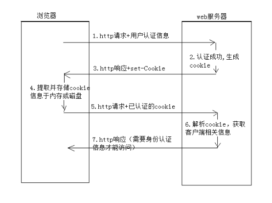
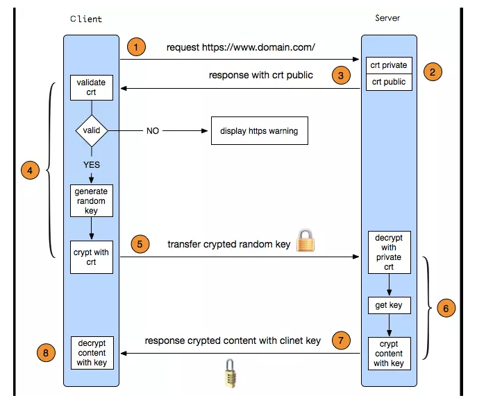

* [HTTP](#http)
  * [主要特点](#%E4%B8%BB%E8%A6%81%E7%89%B9%E7%82%B9)
  * [http请求](#http%E8%AF%B7%E6%B1%82)
  * [http响应](#http%E5%93%8D%E5%BA%94)
  * [请求方式](#%E8%AF%B7%E6%B1%82%E6%96%B9%E5%BC%8F)
      * [get](#get)
      * [post](#post)
        * [get和post区别](#get%E5%92%8Cpost%E5%8C%BA%E5%88%AB)
      * [PUT PATCH](#put-patch)
      * [delete](#delete)
  * [header](#header)
  * [状态码](#%E7%8A%B6%E6%80%81%E7%A0%81)
    * [206断点续传](#206%E6%96%AD%E7%82%B9%E7%BB%AD%E4%BC%A0)
      * [Range](#range)
      * [Content\-Range](#content-range)
      * [ETag](#etag)
      * [<strong>If\-Match  If\-Modified\-Since</strong>](#if-match--if-modified-since)
      * [多线程下载：](#%E5%A4%9A%E7%BA%BF%E7%A8%8B%E4%B8%8B%E8%BD%BD)
      * [单线程和多线程下载速度比较](#%E5%8D%95%E7%BA%BF%E7%A8%8B%E5%92%8C%E5%A4%9A%E7%BA%BF%E7%A8%8B%E4%B8%8B%E8%BD%BD%E9%80%9F%E5%BA%A6%E6%AF%94%E8%BE%83)
  * [Session和Cookies](#session%E5%92%8Ccookies)
    * [cookie](#cookie)
        * [缺点](#%E7%BC%BA%E7%82%B9)
        * [Http中的相关字段](#http%E4%B8%AD%E7%9A%84%E7%9B%B8%E5%85%B3%E5%AD%97%E6%AE%B5)
        * [cookies字段](#cookies%E5%AD%97%E6%AE%B5)
    * [session](#session)
        * [session实现方式](#session%E5%AE%9E%E7%8E%B0%E6%96%B9%E5%BC%8F)
        * [session 共享](#session-%E5%85%B1%E4%BA%AB)
    * [区别](#%E5%8C%BA%E5%88%AB)
* [http2](#http2)
  * [主要特点](#%E4%B8%BB%E8%A6%81%E7%89%B9%E7%82%B9-1)
      * [多路复用](#%E5%A4%9A%E8%B7%AF%E5%A4%8D%E7%94%A8)
      * [stream流式交互](#stream%E6%B5%81%E5%BC%8F%E4%BA%A4%E4%BA%92)
      * [流量控制](#%E6%B5%81%E9%87%8F%E6%8E%A7%E5%88%B6)
      * [服务器推送](#%E6%9C%8D%E5%8A%A1%E5%99%A8%E6%8E%A8%E9%80%81)
      * [头部压缩](#%E5%A4%B4%E9%83%A8%E5%8E%8B%E7%BC%A9)
* [http3（Quic）](#http3quic)
* [https](#https)
  * [对称加密和非对称加密](#%E5%AF%B9%E7%A7%B0%E5%8A%A0%E5%AF%86%E5%92%8C%E9%9D%9E%E5%AF%B9%E7%A7%B0%E5%8A%A0%E5%AF%86)
  * [https和http区别](#https%E5%92%8Chttp%E5%8C%BA%E5%88%AB)

# HTTP

超文本传输协议

## 主要特点

1、支持客户/服务器模式

2、简单快速

3、无连接  完成一次请求后关闭连接

4、无状态  对事物没有记忆信息

## http请求

请求行

（请求方法   url   协议版本）   

请求头

（键值对，多种信息）

请求体

## http响应

状态行

（协议版本 状态码  状态码描述）

响应头

（键值对）

响应体

## 请求方式

共9种，GET、POST ，HEAD，OPTIONS、PUT、PATCH、DELETE、TRACE 和 CONNECT

restful常用4种

#### get

GET 方法的首要目的是 **获取资源**

> 方法特点
>
> a) 参数可见
>
> GET 方法的参数是明文可见的包含在 URL 当中，所以说敏感信息不建议使用 GET 方法
>
> 不过也正是因此，所以 GET 方法允许被保存书签
>
> b) 数据类型只允许 ASCII
>
> GET 方法的数据类型只允许是 ASCII 字符，所以说传递 二进制 文件就不可以用 GET 方法了哦
>
> c) 可以保存书签
>
> 当我们访问某一个网站的频率特别高的时候，肯定添加到书签，那其实书签就是依靠 GET 方法来保存的
>
> d) 可以被缓存
>
> GET 方法支持缓存，当本次请求允许被缓存时，会将资源存值本地 cache ，在未过期的情况下直接取本地 cache；缓存过期后视情况而定
>
> e) 参数会保留在浏览器历史记录
>
> 比较直观的感受就是，我们可以在浏览器的历史记录中查看到曾经搜索过的关键字信息
>
> f) 请求长度会受限于所使用的浏览器与服务器
>
> 不同的浏览器对于 GET 请求长度的限制也是不同的，注意这是 浏览器 / 服务器（IE、Chrome、Apache、IIS等） 对于长度的限制，而不是 HTTP 协议

**urlEncode**

> 对于Url来说，之所以要进行编码，是因为Url中有些字符会引起歧义。
>
> Url编码的原则就是使用安全的字符（没有特殊用途或者特殊意义的可打印字符）去表示那些不安全的字符。

#### post

POST 方法的首要目的是 **提交**，POST 方法一般用于添加资源

> 方法特点
> 
> a) 参数不可见，也不会被保存
>
> 所以说 POST 方法是不可以被保存书签的
>
> b) 不能收藏为书签
>
> 理由如上
>
> c) 不可以被缓存
>
> 我要提交的数据被缓存在本地 cache 中想想其实也是没道理的
>
> d) 不会被保存在浏览器历史中
>
> 同样是因为参数不可见
>
> e) 不限制请求长度
>
> 对于 POST 方法这种以 提交 为首要目的的方法，肯定是不可以限制请求长度的
>
> f) 数据类型
>
> 不限，所以说 POST 是可以 提交文件 到服务器的
>
> g) 请求方式
>
> POST 请求与 GET 请求不同，他会首先提交 HEAD 信息，待得到 100 响应后，才会再次将 DATA 提交

**post的四种提交数据的方式**

对应http，header中的Content-Types

| 值                                | 描述                                                         |
| --------------------------------- | ------------------------------------------------------------ |
| application/x-www-form-urlencoded | 在发送前编码所有字符（默认）                                 |
| multipart/form-data               | 不对字符编码。在使用包含文件上传控件的表单时，必须使用该值。 |
| application/json                  |                                                              |
| text/plain                        | 空格转换为 “+” 加号，但不对特殊字符编码。                    |

##### get和post区别

get将请求信息放在url，post放在请求体

 get一般做查询，post一般会改变数据库信息

get幂等性，安全性，post没有

get可以被缓存，被存储，post不行

#### PUT PATCH 

**更新资源**

PUT 对后台来说 PUT 方法的参数是一个完整的资源对象，它包含了对象的所有字段

PATCH 对后台来说 PATCH 方法的参数只包含我们需要修改的资源对象的字段

#### delete

删除资源

## header

| 协议头        | 说明                                                         |
| ------------- | ------------------------------------------------------------ |
| Accept        | 可接受的响应内容类型（`Content-Types`）。                    |
| Cookie        | 由之前服务器通过`Set-Cookie`（见下文）设置的一个HTTP协议Cookie |
| Authorization | 用于表示HTTP协议中需要认证资源的认证信息                     |

## 状态码

| 1**  | 信息，服务器收到请求，需要请求者继续执行操作   |
| ---- | ---------------------------------------------- |
| 2**  | 成功，操作被成功接收并处理                     |
| 3**  | 重定向，需要进一步的操作以完成请求             |
| 4**  | 客户端错误，请求包含语法错误或无法完成请求     |
| 5**  | 服务器错误，服务器在处理请求的过程中发生了错误 |

| 100  | Continue                        | 继续。[客户端](http://www.dreamdu.com/webbuild/client_vs_server/)应继续其请求 |
| ---- | ------------------------------- | ------------------------------------------------------------ |
| 101  | Switching Protocols             | 切换协议。服务器根据客户端的请求切换协议。只能切换到更高级的协议，例如，切换到HTTP的新版本协议 |
|      |                                 |                                                              |
| 200  | OK                              | 请求成功。一般用于GET与POST请求                              |
| 201  | Created                         | 已创建。成功请求并创建了新的资源                             |
| 202  | Accepted                        | 已接受。已经接受请求，但未处理完成                           |
| 203  | Non-Authoritative Information   | 非授权信息。请求成功。但返回的meta信息不在原始的服务器，而是一个副本 |
| 204  | No Content                      | 无内容。服务器成功处理，但未返回内容。在未更新网页的情况下，可确保浏览器继续显示当前文档 |
| 205  | Reset Content                   | 重置内容。服务器处理成功，用户终端（例如：浏览器）应重置文档视图。可通过此返回码清除浏览器的表单域 |
| 206  | Partial Content                 | 部分内容。服务器成功处理了部分GET请求                        |
|      |                                 |                                                              |
| 300  | Multiple Choices                | 多种选择。请求的资源可包括多个位置，相应可返回一个资源特征与地址的列表用于用户终端（例如：浏览器）选择 |
| 301  | Moved Permanently               | 永久移动。请求的资源已被永久的移动到新URI，返回信息会包括新的URI，浏览器会自动定向到新URI。今后任何新的请求都应使用新的URI代替 |
| 302  | Found                           | 临时移动。与301类似。但资源只是临时被移动。客户端应继续使用原有URI |
| 303  | See Other                       | 查看其它地址。与301类似。使用GET和POST请求查看               |
| 304  | Not Modified                    | 未修改。所请求的资源未修改，服务器返回此状态码时，不会返回任何资源。客户端通常会缓存访问过的资源，通过提供一个头信息指出客户端希望只返回在指定日期之后修改的资源 |
| 305  | Use Proxy                       | 使用代理。所请求的资源必须通过代理访问                       |
| 306  | Unused                          | 已经被废弃的HTTP状态码                                       |
| 307  | Temporary Redirect              | 临时重定向。与302类似。使用GET请求重定向                     |
|      |                                 |                                                              |
| 400  | Bad Request                     | 客户端请求的语法错误，服务器无法理解                         |
| 401  | Unauthorized                    | 请求要求用户的身份认证                                       |
| 402  | Payment Required                | 保留，将来使用                                               |
| 403  | Forbidden                       | 服务器理解请求客户端的请求，但是拒绝执行此请求               |
| 404  | Not Found                       | 服务器无法根据客户端的请求找到资源（网页）。通过此代码，网站设计人员可设置"您所请求的资源无法找到"的个性页面 |
| 405  | Method Not Allowed              | 客户端请求中的方法被禁止                                     |
| 406  | Not Acceptable                  | 服务器无法根据客户端请求的内容特性完成请求                   |
| 407  | Proxy Authentication Required   | 请求要求代理的身份认证，与401类似，但请求者应当使用代理进行授权 |
| 408  | Request Time-out                | 服务器等待客户端发送的请求时间过长，超时                     |
| 409  | Conflict                        | 服务器完成客户端的 PUT 请求时可能返回此代码，服务器处理请求时发生了冲突 |
| 410  | Gone                            | 客户端请求的资源已经不存在。410不同于404，如果资源以前有现在被永久删除了可使用410代码，网站设计人员可通过301代码指定资源的新位置 |
| 411  | Length Required                 | 服务器无法处理客户端发送的不带Content-Length的请求信息       |
| 412  | Precondition Failed             | 客户端请求信息的先决条件错误                                 |
| 413  | Request Entity Too Large        | 由于请求的实体过大，服务器无法处理，因此拒绝请求。为防止客户端的连续请求，服务器可能会关闭连接。如果只是服务器暂时无法处理，则会包含一个Retry-After的响应信息 |
| 414  | Request-URI Too Large           | 请求的URI过长（URI通常为网址），服务器无法处理               |
| 415  | Unsupported Media Type          | 服务器无法处理请求附带的媒体格式                             |
| 416  | Requested range not satisfiable | 客户端请求的范围无效                                         |
| 417  | Expectation Failed              | 服务器无法满足Expect的请求头信息                             |
|      |                                 |                                                              |
| 500  | Internal Server Error           | 服务器内部错误，无法完成请求                                 |
| 501  | Not Implemented                 | 服务器不支持请求的功能，无法完成请求                         |
| 502  | Bad Gateway                     | 作为网关或者代理工作的服务器尝试执行请求时，从远程服务器接收到了一个无效的响应 |
| 503  | Service Unavailable             | 由于超载或系统维护，服务器暂时的无法处理客户端的请求。延时的长度可包含在服务器的Retry-After头信息中 |
| 504  | Gateway Time-out                | 充当网关或代理的服务器，未及时从远端服务器获取请求           |
| 505  | HTTP Version not supported      | 服务器不支持请求的HTTP协议的版本，无法完成处理               |

### 206断点续传

HTTP断点续传

  请求头 Range：客户端发请求的范围

  响应头 Content-Range：服务端返回当前请求范围和文件总大小

  续传成功返回206 

  文件又变动，返回200和新文件内容

> HTTP1.1 协议（RFC2616）开始支持获取文件的部分内容，这为并行下载以及断点续传提供了技术支持。它**通过在 Header 里两个参数实现的，客户端发请求时对应的是 Range ，服务器端响应时对应的是 Content-Range。**

#### Range

用于请求头中，指定第一个字节的位置和最后一个字节的位置，一般格式：

Range:(unit=first byte pos)-[last byte pos]

#### Content-Range

用于响应头中，在发出带 Range 的请求后，服务器会在 Content-Range 头部**返回当前接受的范围和文件总大小。**一般格式：

Content-Range: bytes (unit first byte pos) - [last byte pos]/**[entity legth]**

#### ETag

但是在实际场景中，会出现一种情况，即在终端发起续传请求时，URL对应的文件内容在服务端已经发生变化，此时续传的数据肯定是错误的。如何解决这个问题了？显然此时我们需要有一个标识文件唯一性的方法。在RFC2616中也有相应的定义，比如实现Last-Modified来标识文件的最后修改时间，这样即可判断出续传文件时是否已经发生过改动。同时RFC2616中还定义有一个ETag的头，可以使用ETag头来放置文件的唯一标识，比如文件的MD5值。

#### **If-Match  If-Modified-Since**

终端在发起续传请求时应该在HTTP头中申明**If-Match 或者If-Modified-Since** 字段，帮助服务端判别文件变化。 

#### 多线程下载：

主要就是在请求头里加上range

#### 单线程和多线程下载速度比较

如果客户端和服务器某一方网速达到了极限，用什么都一样，并且这时多线程还会有上下文切换的开销，所以还不如单线程

如果客户端没有达到瓶颈，服务端又限制了单线程的速度且可以使用多线程的情况下，多线程下载当然会快．  

## Session和Cookies

**理念**

让Http有状态

### cookie

1、cookie是由服务器发送给服务器的特殊信息，以文本的信息存放在客户端

2、服务器再次请求的时候，会把cookie回发

3、服务器收到后，会解析cookie生成与客户端相对性的内容

##### 缺点

- cookie会被附加在每个HTTP请求中，所以无形中增加了流量。
- 由于在HTTP请求中的cookie是明文传递的，所以安全性成问题。（除非用HTTPS)
- Cookie的大小限制在4KB左右。对于复杂的存储需求来说是不够用的。

##### Http中的相关字段

Set-Cookie

##### cookies字段

> COOKIE主要有哪些字段呢：
>
> 1、name  COOKIE的名字
>
> 2、value  COOKIE对应的值
>
> 3、domain   域名   就是说这个COOKIE对应哪一个域名有效
>
> 4、path     路径 ， COOKIE对应的哪一个路径才会有效
>
> 5、expires/Max-Age 字段为此cookie超时时间。若设置其值为一个时间，那么当到达此时间后，此cookie失效。不设置的话默认值是Session，意思是cookie会和session一起失效。当浏览器关闭(不是浏览器标签页，而是整个浏览器) 后，此cookie失效。

### session

1、服务器端的机制，在服务器上保存信息

2、解析客户端请求并操作sessionid，按需保存状态信息

##### session实现方式

1、使用cookie  jsessionid

2、使用url回写来实现

##### session 共享

1. 基于NFS的Session共享

　　NFS是Net FileSystem的简称，最早由Sun公司为解决Unix网络主机间的目录共享而研发。

　　这个方案实现最为简单，无需做过多的二次开发，仅需将共享目录服务器mount到各频道服务器的本地session目录即可，缺点是NFS依托 于复 杂的安全机制和文件系统，因此并发效率不高，尤其对于session这类高并发读写的小文件， 会由于共享目录服务器的io-wait过高，最终拖累前端WEB应用程序的执行效率。

2. 基于数据库的Session共享

　　首选当然是大名鼎鼎的Mysql数据库，并且建议使用内存表Heap，提高session操作的读写效率。这个方案的实用性比较强，相信大家普 遍在 使用，它的缺点在于session的并发读写能力取决于Mysql数据库的性能，同时需要自己实现session淘汰逻辑，以便定时从数据表中更新、删除 session记录，当并发过高时容易出现表锁，虽然我们可以选择行级锁的表引擎，但不得不否认使用数据库存储Session还是有些杀鸡用牛刀的架势。

3. 基于Cookie的Session共享

　　这个方案我们可能比较陌生，但它在大型网站中还是比较普遍被使用。原理是将全站用户的Session信息加密、序列化后以Cookie的方式， 统一 种植在根域名下（如：.host.com），利用浏览器访问该根域名下的所有二级域名站点时，会传递与之域名对应的所有Cookie内容的特性，从而实现 用户的Cookie化Session 在多服务间的共享访问。

　　这个方案的优点无需额外的服务器资源；缺点是由于受http协议头信心长度的限制，仅能够存储小部分的用户信息，同时Cookie化的 Session内容需要进行安全加解密（如：采用DES、RSA等进行明文加解密；再由MD5、SHA-1等算法进行防伪认证），另外它也会占用一定的带 宽资源，因为浏览器会在请求当前域名下任何资源时将本地Cookie附加在http头中传递到服务器。

4. 基于Memcache的Session共享

　　Memcache由于是一款基于Libevent多路异步I/O技术的内存共享系统，简单的Key + Value数据存储模式使得代码逻辑小巧高效，因此在并发处理能力上占据了绝对优势，目前本人所经历的项目达到2000/秒 平均查询，并且服务器CPU消耗依然不到10%。

　　另外值得一提的是Memcache的内存hash表所特有的Expires数据过期淘汰机制，正好和Session的过期机制不谋而合，降低了 过期Session数据删除的代码复杂度，对比“基于数据库的存储方案”，仅这块逻辑就给数据表产生巨大的查询压力。

### 区别

cookie在客户端  session服务器上

session更安全

session会让服务器负担加重

# http2

## 主要特点

#### 多路复用

> 在HTTP/1.x中,用户想要多个并行的请求来提高性能,但是这样必须得使用多个TCP连接.这样的操作是属于HTTP/1.x 发送模型的直接序列.它能保证在每次连接中在一个时间点只有一个响应被发送出去.更糟糕的是,它使得队头阻塞和重要TCP连接的低效使用.
>  在HTTP/2中,新的二进制帧层,解除了这个限制.使得所有的请求和响应多路复用.通过允许客户端和服务端把HTTP消息分解成独立的帧,交错传输,然后在另一端组装.

#### stream流式交互

#### 流量控制

#### 服务器推送

> HTTP / 2的另一个强大的新功能是服务器为单个客户端请求发送多个响应的能力。也就是说，除了对原始请求的响应之外，服务器还可以向客户端推送额外的资源（图12-5），而不需要客户端明确请求每一个资源！

#### 头部压缩

> 每个HTTP传输都包含一组描述传输资源及其属性的标题。在HTTP / 1.x中，此元数据始终以纯文本形式发送，并且每次传输的开销都会在任何位置增加500-800字节，如果使用HTTP Cookie，则会增加数千字节。为了减少这种开销并提高性能，HTTP / 2使用两种简单但强大的技术使用HPACK压缩格式(要了解这个算法,可以参考这篇文章[https://imququ.com/post/header-compression-in-http2.html](https://link.jianshu.com?t=https%3A%2F%2Fimququ.com%2Fpost%2Fheader-compression-in-http2.html))来压缩请求和响应头元数据：
>
> - 它允许通过静态霍夫曼编码对传输的头部字段进行编码，从而减少它们各自的传输大小。
> - 它要求客户端和服务器都维护和更新先前看到的标题字段的索引列表（即，建立共享压缩上下文），然后将其用作参考以高效编码先前传输的值。

# http3（Quic）

基于udp协议，但是提供可靠保障和流量控制

避免http2协议的前序包阻塞（hol阻塞）

零rtt建连

fec前向纠错

# https

http被广泛应用于web通信中，但是是以明文形式传输数据，若被拦截截取数据，可直接读取用户信息，因此需要对一些敏感的信息进行加密。

因此http协议基础上加入ssl协议，ssl依靠证书对客户端进行验证，并对数据进行加密。

## 流程

**HTTPS在传输的过程中会涉及到三个密钥：**

服务器端的公钥和私钥，用来进行非对称加密

客户端生成的随机密钥，用来进行对称加密

一个HTTPS请求实际上包含了两次HTTP传输，可以细分为8步。
 1.客户端向服务器发起HTTPS请求，连接到服务器的443端口

2.服务器端有一个密钥对，即公钥和私钥，是用来进行非对称加密使用的，服务器端保存着私钥，不能将其泄露，公钥可以发送给任何人。

3.服务器将自己的公钥发送给客户端。

4.客户端收到服务器端的公钥之后，会对公钥进行检查，验证其合法性，如果发现发现公钥有问题，那么HTTPS传输就无法继续。严格的说，这里应该是验证服务器发送的数字证书的合法性，关于客户端如何验证数字证书的合法性，下文会进行说明。如果公钥合格，那么客户端会生成一个随机值，这个随机值就是用于进行对称加密的密钥，我们将该密钥称之为client key，即客户端密钥，这样在概念上和服务器端的密钥容易进行区分。然后用服务器的公钥对客户端密钥进行非对称加密，这样客户端密钥就变成密文了，至此，HTTPS中的第一次HTTP请求结束。

5.客户端会发起HTTPS中的第二个HTTP请求，将加密之后的客户端密钥发送给服务器。

6.服务器接收到客户端发来的密文之后，会用自己的私钥对其进行非对称解密，解密之后的明文就是客户端密钥，然后用客户端密钥对数据进行对称加密，这样数据就变成了密文。

7.然后服务器将加密后的密文发送给客户端。

8.客户端收到服务器发送来的密文，用客户端密钥对其进行对称解密，得到服务器发送的数据。这样HTTPS中的第二个HTTP请求结束，整个HTTPS传输完成。

## 对称加密和非对称加密

- 对称加密
  - 即加密的密钥和解密的密钥相同,
- 非对称加密
  - 非对称加密将密钥分为公钥和私钥,公钥可以公开,私钥需要保密,客户端公钥加密的数据,服务端可以通过私钥来解密

## https和http区别

1、https需要到ca申请证书

2、http是通过超文本传输协议是明文形式，https通过ssl对数据进行加密

3、默认端口：https 443   http 80