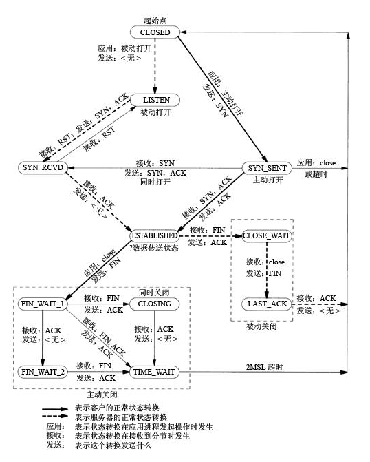

[TOC]

# TCP

## TCP整体介绍

tcp是面向连接的，可靠的连接。

tcp是传输层协议，对应osi网络模型的传输层第四层；

基于链接，传输数据前需要先建立好链接，然后再进行数据传输，tcp链接一旦建立，就可以进行双向通信；

tcp的传输是基于字节流而不是报文，将数据按照字节大小进行编号，接收端通过ack来确认收到的数据编号，通过这种机制保证接受数据的有序性和完整性，因此tcp能够提供可靠性传输

tcp还能提供流量控制，通过滑动窗口来控制数据的发送速率，

> 该协议允许发送方在停止并等待确认前发送多个数据分组。由于发送方不必每发一个分组就停下来等待确认，因此该协议可以加速数据的传输，提高网络吞吐量。

滑动窗口的本质是动态缓冲区，接收端根据自己的处理能力在tcp的header中动态调整窗口大小，通过ack应答包通知给发送端，发送端通过窗口的大小调整发送的速度

tcp考虑到处理网络问题导致大量重传导致网络恶化，tcp提供了拥塞控制，防止过多的数据注入到网络当中，这样可以使网络中的路由器或链路不致过载。主要用到了慢启动，拥塞避免，快启动，快速回复，四个算法。

> **TCP通过一个定时器（timer）采样了RTT并计算RTO(Retransmission TimeOut 重传超时时间)，但是，如果网络上的延时突然增加，那么，TCP对这个事做出的应对只有重传数据，然而重传会导致网络的负担更重，于是会导致更大的延迟以及更多的丢包**，这就导致了恶性循环，最终形成“网络风暴” —— TCP的拥塞控制机制就是用于应对这种情况。 
>
> (RTT(Round Trip Time)由三部分组成：链路的传播时间（propagation delay),末端系统的处理时间，路由器缓存中的排队和处理时间（queuing delay）。)
>
> **为了在发送端调节所要发送的数据量，定义了一个“拥塞窗口”（Congestion Window），在发送数据时，将拥塞窗口的大小与接收端ack的窗口大小做比较，取较小者作为发送数据量的上限。**
>
> 1.慢启动：意思是刚刚加入网络的连接，一点一点地提速，不要一上来就把路占满。 
> 连接建好的开始先初始化cwnd = 1，表明可以传一个MSS大小的数据。 
> 每当收到一个ACK，cwnd++; 呈线性上升 
> 每当过了一个RTT，cwnd = cwnd*2; 呈指数让升 
> 阈值ssthresh（slow start threshold），是一个上限，当cwnd >= ssthresh时，就会进入“拥塞避免算法” 
> 2.拥塞避免：当拥塞窗口 cwnd 达到一个阈值时，窗口大小不再呈指数上升，而是以线性上升，避免增长过快导致网络拥塞。 
> 每当收到一个ACK，cwnd = cwnd + 1/cwnd 
> 每当过了一个RTT，cwnd = cwnd + 1 
> 拥塞发生：当发生丢包进行数据包重传时，表示网络已经拥塞。分两种情况进行处理： 
> 等到RTO超时，重传数据包 
> sshthresh = cwnd /2 
> cwnd 重置为 1 
> 3.进入慢启动过程 
> 在收到3个duplicate ACK时就开启重传，而不用等到RTO超时 
> sshthresh = cwnd = cwnd /2 
> 进入快速恢复算法——Fast Recovery 
> 4.快速恢复：至少收到了3个Duplicated Acks，说明网络也不那么糟糕，可以快速恢复。 
> cwnd = sshthresh + 3 * MSS （3的意思是确认有3个数据包被收到了） 
> 重传Duplicated ACKs指定的数据包 
> 如果再收到 duplicated Acks，那么cwnd = cwnd +1 
> 如果收到了新的Ack，那么，cwnd = sshthresh ，然后就进入了拥塞避免的算法了

## 三次握手


### 为什么不是四次和两次

##### 不是四次的原因

Server段的SYN和ACK合并为一次发送，断开链接时，两个方向的数据，发送的停止时间可能是不同的，所以无法合并fin和ack发送

##### 不是两次的原因

为了实现可靠传输，发送方和接收方始终需要同步( SYNchronize )序号。 需要注意的是， 序号并不是从 0 开始的， 而是由发送方随机选择的初始序列号 ( Initial Sequence Number, ISN )开始 。 由于 TCP 是一个双向通信协议， 通信双方都有能力发送信息， 并接收响应。 因此， 通信双方都需要随机产生一个初始的序列号， 并且把这个起始值告诉对方。
于是， 这个过程就变成了下面这样。

### syn洪水攻击发生原因

server端收到client端的链接请求后，发送了SYN和ACK，但是Client端不进行回复，导致Server端大量链接处在SYN_RCVD状态，进而影响其他正常请求的建连

可以通过设置linux的参数SYN_ACK_reTrys =0 来加快半链接的回收速度

## 四次挥手


msl最大报文段生存时间

client端收到fin后，向Server发送ack，进入time_wait状态，等待2MSL后进入closed状态

### CloseWait

 在被动关闭连接情况下，在已经接收到FIN，但是还没有发送自己的FIN的时刻，连接处于CLOSE_WAIT状态。

出现大量close_wait的现象，主要原因是某种情况下对方关闭了socket链接，但是**我方忙与读或者写**，没有关闭连接。

代码需要判断socket，一旦读到0，断开连接，read返回负，检查一下errno，如果不是AGAIN，就断开连接。  

### 为什么需要等待2MSL后才能关闭链接

1、保证tcp协议的全双工链接能够有效关闭

 *MSL确保有足够的时间让被动方收到了ACK或主动方收到了被动发超时重传的FIN*。即，如果被动方没有收到Ack，就会触发被动方重传FIN，发送Ack+接收FIN正好2个MSL，`TIME_WAIT`状态的连接收到重传的FIN后，重传Ack，再等待2 * MSL时间

2、保证这次链接中，重复的数据段能够从网络中消失，防止端口被重用的时候，可能会产生数据混淆

Nagel算法与ACK延迟

解决小包问题，提高数据载荷比，对延迟比较敏感且发送频率较低的场景可以关闭nagel算法

特定情况下，nagel和ack延迟机制配合使用，可能出现延迟超时后才能回复ack包的问题

> \1. Nagle算法：
>
> 是为了减少广域网的小分组数目，从而减小网络拥塞的出现；
>
> 该算法要求一个tcp连接上最多只能有一个未被确认的未完成的小分组，在该分组ack到达之前不能发送其他的小分组，tcp需要收集这些少量的分组，并在ack到来时以一个分组的方式发送出去；其中小分组的定义是小于MSS的任何分组；
>
> 该算法的优越之处在于它是自适应的，确认到达的越快，数据也就发哦送的越快；而在希望减少微小分组数目的低速广域网上，则会发送更少的分组；
>
> 
>
> \2. 延迟ACK：
>
> 如果tcp对每个数据包都发送一个ack确认，那么只是一个单独的数据包为了发送一个ack代价比较高，所以tcp会延迟一段时间，如果这段时间内有数据发送到对端，则捎带发送ack，如果在延迟ack定时器触发时候，发现ack尚未发送，则立即单独发送；
>
> 延迟ACK好处：
>
> (1) 避免糊涂窗口综合症；
>
> 当发送端应用进程产生数据很慢、或接收端应用进程处理接收缓冲区数据很慢，或二者兼而有之；就会使应用进程间传送的报文段很小，特别是有效载荷很小。 极端情况下，有效载荷可能只有1个字节；而传输开销有40字节(20字节的IP头+20字节的TCP头) 这种现象就叫糊涂窗口综合症
>
> (2) 发送数据的时候将ack捎带发送，不必单独发送ack；
>
> (3) 如果延迟时间内有多个数据段到达，那么允许协议栈发送一个ack确认多个报文段；

## Keepalive

长时间没有数据发送的场景下，tcp保持长期可用的机制

TCP是无感知的虚拟连接，中间断开两端不会立刻得到通知。一般在使用长连接的环境下，需要心跳保活机制可以勉强感知其存活。业务层面有心跳机制，TCP协议也提供了心跳保活机制。

当客户端端等待超过一定时间后自动给服务端发送一个空的报文，如果对方回复了这个报文证明连接还存活着，如果对方没有报文返回且进行了多次尝试都是一样，那么就认为连接已经丢失，客户端就没必要继续保持连接了。如果没有这种机制就会有很多空闲的连接占用着系统资源。

#### 使用的场景

一般我们使用KeepAlive时会修改空闲时长，避免资源浪费，系统内核会为每一个TCP连接
建立一个保护记录，相对于应用层面效率更高。

常见的几种使用场景：

1. 检测挂掉的连接（导致连接挂掉的原因很多，如服务停止、网络波动、宕机、应用重启等）
2. 防止因为网络不活动而断连（使用NAT代理或者防火墙的时候，经常会出现这种问题）
3. TCP层面的心跳检测

## 滑动窗口

tcp提供流量控制，通过滑动窗口来控制数据的发送速率。

TCP头里有一个字段叫Window（或Advertised Window），*用于接收方通知发送方自己还有多少缓冲区可以接收数据*。**发送方根据接收方的处理能力来发送数据，不会导致接收方处理不过来，是谓流量控制**。

该协议允许发送方在停止并等待确认前发送多个数据分组。由于发送方不必每发一个分组就停下来等待确认，因此该协议可以加速数据的传输，提高网络吞吐量。

滑动窗口的本质是动态缓冲区，接收端根据自己的处理能力在tcp的header中动态调整窗口大小，通过ack应答包通知给发送端，发送端通过窗口的大小调整发送的速度

## Nagel算法与ACK延迟

解决小包问题，提高数据载荷比，对延迟比较敏感且发送频率较低的场景可以关闭nagel算法

特定情况下，nagel和ack延迟机制配合使用，可能出现延迟超时后才能回复ack包的问题

> \1. Nagle算法：
>
> 是为了减少广域网的小分组数目，从而减小网络拥塞的出现；
>
> 该算法要求一个tcp连接上最多只能有一个未被确认的未完成的小分组，在该分组ack到达之前不能发送其他的小分组，tcp需要收集这些少量的分组，并在ack到来时以一个分组的方式发送出去；其中小分组的定义是小于MSS的任何分组；
>
> 该算法的优越之处在于它是自适应的，确认到达的越快，数据也就发哦送的越快；而在希望减少微小分组数目的低速广域网上，则会发送更少的分组；
>
> 
>
> \2. 延迟ACK：
>
> 如果tcp对每个数据包都发送一个ack确认，那么只是一个单独的数据包为了发送一个ack代价比较高，所以tcp会延迟一段时间，如果这段时间内有数据发送到对端，则捎带发送ack，如果在延迟ack定时器触发时候，发现ack尚未发送，则立即单独发送；
>
> 延迟ACK好处：
>
> (1) 避免糊涂窗口综合症；
>
> 当发送端应用进程产生数据很慢、或接收端应用进程处理接收缓冲区数据很慢，或二者兼而有之；就会使应用进程间传送的报文段很小，特别是有效载荷很小。 极端情况下，有效载荷可能只有1个字节；而传输开销有40字节(20字节的IP头+20字节的TCP头) 这种现象就叫糊涂窗口综合症
>
> (2) 发送数据的时候将ack捎带发送，不必单独发送ack；
>
> (3) 如果延迟时间内有多个数据段到达，那么允许协议栈发送一个ack确认多个报文段；

## 拥塞控制

tcp考虑到处理网络问题导致大量重传导致网络恶化，tcp提供了拥塞控制，防止过多的数据注入到网络当中，这样可以使网络中的路由器或链路不致过载。主要用到了慢启动，拥塞避免，快启动，快速回复，四个算法。

> **TCP通过一个定时器（timer）采样了RTT并计算RTO(Retransmission TimeOut 重传超时时间)，但是，如果网络上的延时突然增加，那么，TCP对这个事做出的应对只有重传数据，然而重传会导致网络的负担更重，于是会导致更大的延迟以及更多的丢包**，这就导致了恶性循环，最终形成“网络风暴” —— TCP的拥塞控制机制就是用于应对这种情况。 
>
> (RTT(Round Trip Time)
>
> 一个数据包从发出去到回来的时间
>
> 由三部分组成：链路的传播时间（propagation delay),末端系统的处理时间，路由器缓存中的排队和处理时间（queuing delay）。)
>
> **为了在发送端调节所要发送的数据量，定义了一个“拥塞窗口”（Congestion Window），在发送数据时，将拥塞窗口的大小与接收端ack的窗口大小做比较，取较小者作为发送数据量的上限。**
>
> * 慢启动：意思是刚刚加入网络的连接，一点一点地提速，不要一上来就把路占满。 
> 连接建好的开始先初始化cwnd = 1，表明可以传一个MSS大小的数据。 
> 每当收到一个ACK，cwnd++; 呈线性上升 
> 每当过了一个RTT，cwnd = cwnd*2; 呈指数让升 
> 阈值ssthresh（slow start threshold），是一个上限，当cwnd >= ssthresh时，就会进入“拥塞避免算法” 
>
> * 拥塞避免：当拥塞窗口 cwnd 达到一个阈值时，窗口大小不再呈指数上升，而是以线性上升，避免增长过快导致网络拥塞。 
>   每当收到一个ACK，cwnd = cwnd + 1/cwnd 
>   每当过了一个RTT，cwnd = cwnd + 1 
>   拥塞发生：当发生丢包进行数据包重传时，表示网络已经拥塞。分两种情况进行处理： 
>   等到RTO超时，重传数据包 
>   sshthresh = cwnd /2 
>   cwnd 重置为 1 
>
>   **慢启动算法主要呈指数增长，粗犷型，速度快（“慢”是相对于一步到位而言的）；而拥塞避免算法主要呈线性增长，精细型，速度慢，但更容易在不导致拥塞的情况下，找到网络环境的cwnd最优值。**
>
> * 拥塞发生时的算法
>
>   慢启动与拥塞避免算法作用在拥塞发生前，采取不同的策略增大cwnd；如果已经发生拥塞，则需要采取策略减小cwnd。那么，TCP如何判断当前网络拥塞了呢？很简单，如果发送方发现有Seq发送失败（表现为“丢包”），就认为网络拥塞了。
>   丢包后，有两种重传方式，对应不同的网络情况，也就对应着两种拥塞发生时的控制算法：
>
>   1. 超时重传。TCP认为这种情况太糟糕，调整力度比较大：
>
>   ​         ssthresh =  cwnd /2
>   ​         cwnd = 1，重新进入慢启动过程（网络糟糕，要慢慢调整）
>
>   2. 快速重传。TCP认为这种情况通常比RTO超时好一些，主流实现TCP Reno的调整力度更柔和（TCP Tahoe的实现和RTO超时一样暴躁）：
>
>   ​       ssthresh =  cwnd /2
>   ​       cwnd = cwnd /2，进入快速恢复算法
>
>   
>
> * 快速恢复：至少收到了3个相同的ack，说明网络也不那么糟糕，可以快速恢复。 
>   cwnd = sshthresh + 3 * MSS （3的意思是确认有3个数据包被收到了） 
>   重传Duplicated ACKs指定的数据包 
>   如果再收到 duplicated Acks，那么cwnd = cwnd +1 
>   如果收到了新的Ack，那么，cwnd = sshthresh ，然后就进入了拥塞避免的算法了

## TCP状态转化



客户端独有的：（1）SYN_SENT （2）FIN_WAIT1 （3）FIN_WAIT2 （4）CLOSING （5）TIME_WAIT 。

服务器独有的：（1）LISTEN （2）SYN_RCVD （3）CLOSE_WAIT （4）LAST_ACK 。

共有的：（1）CLOSED （2）ESTABLISHED 。

## 重传机制

**TCP协议通过重传机制保证所有的数据报都可以到达对端，通过滑动窗口允许一定程度的乱序和丢包**（滑动窗口还具有流量控制等作用，暂不讨论）。

### 超时重传机制

*当发送方发现等待Seq 3的Ack（即Ack 4）**超时**后，会认为Seq 3发送“失败”，重传Seq 3*。一旦接收方收到Seq 3，会立即回Ack 4。

超时重传机制面临“**重传一个还是重传所有**”的问题，即：

- 重传一个：仅重传timeout的包（即Seq 3），后续包等超时后再重传。节省资源，但效率略低。
- 重传所有：每次都重传timeout包及之后所有的数据（即Seq 3、4、5）。效率更高（如果带宽未打满），但浪费资源。

可知，两种方法都属于`超时重传机制`，各有利弊，但二者都需要等待timeout，是**基于时间驱动**的，性能与timeout的长度密切相关。如果timeout很长（普遍情况），则两种方法的性能都会受到较大影响。

### 快速重传机制

最理想的方案是：在超时之前，通过某种机制要求发送方尽快重传timeout的包（即Seq 3），如`快速重传机制`（Fast Retransmit）。这种方案浪费资源（浪费多少取决于“重传一个还是重传所有”，见下），但效率非常高（因为不需要等待timeout了）。

快速重传机制不基于时间驱动，而`基于数据驱动`：*如果包没有连续到达，就Ack最后那个可能被丢了的包；如果发送方连续收到3次相同的Ack，就重传对应的Seq*。

## 粘包问题

TCP是一个"流"协议，没有边界的一段数据。像打开自来水管一样，连成一片，没有边界。 TCP协议并不了解上层的业务在做什么东西,有什么含义，它会根据自己的缓冲区的实际情况进行数据包的划分。所以，**一个完整的数据包可能会被拆分成多个数据包包进行发送**，也有可能将很多个数据包变成一个大的数据包发送。这就是TCP的粘包和拆包问题。

#### 出现粘包的情况

```
1：当连续发送数据时，由于tcp协议的nagle算法，会将较小的内容拼接成大的内容，一次性发送到服务器端，因此造成粘包

2：当发送内容较大时，由于服务器端的recv（buffer_size）方法中的buffer_size较小，不能一次性完全接收全部内容，因此在下一次请求到达时，接收的内容依然是上一次没有完全接收完的内容，因此造成粘包现象。
```

#### 解决方法

对于第一种情况，对于第一种粘包产生方式可以在两次send（）直接使用recv（）来阻止连续发送的情况发生。代码就不用展示了。

对于第二种情况，由于产生粘包的原因是接收方的无边界接收，因此发送端可以在发送数据之前向接收端告知发送内容的大小即可。

# UDP

UDP是User Datagram Protocol的简称，中文名是用户数据报协议，是OSI参考模型中的传输层协议，它是一种无连接的传输层协议，提供面向事务的简单不可靠信息传送服务。 

## 应用场景

由于缺乏可靠性且属于非连接导向协议，UDP的应用一般必须允许一定量的丢包、出错和复制粘贴。但有些应用，比如TFTP，需要可靠性保证，则必须在应用层增加根本的可靠机制。但是绝大多数UDP应用都不需要可靠机制，甚至可能因为引入可靠机制而降低性能。流媒体、即时多媒体游戏和IP电话（VoIP）就是典型的UDP应用。如果某个应用需要很高的可靠性，那么可以用传输控制协议（即TCP协议）来代替UDP。

使用UDP协议的应用有：域名系统（DNS）、简单网络管理协议（SNMP）、动态主机配置协议（DHCP）、路由信息协议（RIP）等等。因为UDP不属于连接型协议，因而具有资源消耗小，处理速度快的优点，所以通常音频、视频和普通数据在传送时使用UDP较多，因为它们即使偶尔丢失几个数据包，也不会对接收结果产生太大影响。

## 分类

单播、多播、广播、组播

> 1 -> 1 就是单播；
> 1 -> M 就是多播；
> 1 -> A 就是广播；
> 1 -> G 就是组播；
> 当M=A时，多播就是广播；
> 当M=G时，多播就是组播；

## DNS和UDP

基于UDP的DNS协议只要一个请求、一个应答就好了

而使用基于TCP的DNS协议要三次握手、发送数据以及应答、四次挥手

明显基于TCP协议的DNS更浪费网络资源！

当然以上只是从数据包的数量以及占有网络资源的层面来进行的分析，那数据一致性层面呢？

DNS数据包不是那种大数据包，所以使用UDP不需要考虑分包，如果丢包那么就是全部丢包，如果收到了数据，那就是收到了全部数据！所以只需要考虑丢包的情况，那就算是丢包了，重新请求一次就好了。而且DNS的报文允许填入序号字段，对于请求报文和其对应的应答报文，这个字段是相同的，通过它可以区分DNS应答是对应的哪个请求

> DNS通常是基于UDP的，但当数据长度大于512字节的时候，为了保证传输质量，就会使用基于TCP的实现方式

# TCP和UDP区别

| 特征点     | TCP          | UDP            |
| ---------- | ------------ | -------------- |
| 是否连接   | 面向连接     | 面向非连接     |
| 传输可靠性 | 可靠         | 会丢包，不可靠 |
| 应用场景   | 传输数据量大 | 传输量小       |
| 速度       | 慢           | 快             |