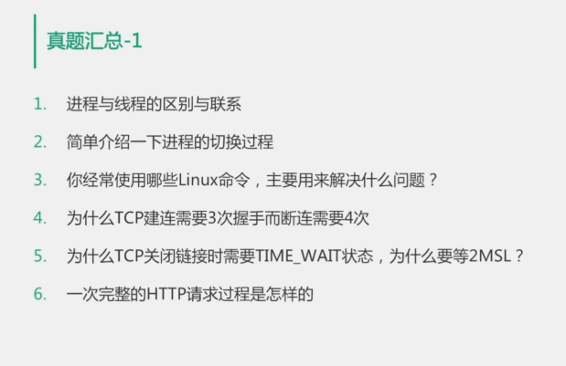
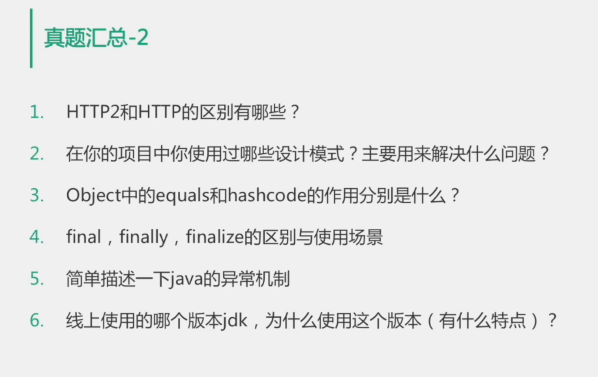

# 设计模式

<https://blog.csdn.net/programmer_at/article/details/85053187#2__22>

* [设计模式](#%E8%AE%BE%E8%AE%A1%E6%A8%A1%E5%BC%8F)
    * [设计模式之六大原则](#%E8%AE%BE%E8%AE%A1%E6%A8%A1%E5%BC%8F%E4%B9%8B%E5%85%AD%E5%A4%A7%E5%8E%9F%E5%88%99)
      * [单例模式](#%E5%8D%95%E4%BE%8B%E6%A8%A1%E5%BC%8F)
        * [主要优点：](#%E4%B8%BB%E8%A6%81%E4%BC%98%E7%82%B9)
        * [主要缺点：](#%E4%B8%BB%E8%A6%81%E7%BC%BA%E7%82%B9)
        * [java实现](#java%E5%AE%9E%E7%8E%B0)
      * [工厂模式](#%E5%B7%A5%E5%8E%82%E6%A8%A1%E5%BC%8F)
        * [优点：](#%E4%BC%98%E7%82%B9)
        * [缺点：](#%E7%BC%BA%E7%82%B9)
      * [抽象工厂模式](#%E6%8A%BD%E8%B1%A1%E5%B7%A5%E5%8E%82%E6%A8%A1%E5%BC%8F)
        * [优点：](#%E4%BC%98%E7%82%B9-1)
        * [缺点：](#%E7%BC%BA%E7%82%B9-1)
      * [代理模式](#%E4%BB%A3%E7%90%86%E6%A8%A1%E5%BC%8F)
      * [构造者模式](#%E6%9E%84%E9%80%A0%E8%80%85%E6%A8%A1%E5%BC%8F)
      * [责任链模式](#%E8%B4%A3%E4%BB%BB%E9%93%BE%E6%A8%A1%E5%BC%8F)
      * [适配器模式](#%E9%80%82%E9%85%8D%E5%99%A8%E6%A8%A1%E5%BC%8F)
      * [观察者模式](#%E8%A7%82%E5%AF%9F%E8%80%85%E6%A8%A1%E5%BC%8F)
        * [优点：](#%E4%BC%98%E7%82%B9-2)
        * [缺点：](#%E7%BC%BA%E7%82%B9-2)
    * [常用设计模式与应用场景](#%E5%B8%B8%E7%94%A8%E8%AE%BE%E8%AE%A1%E6%A8%A1%E5%BC%8F%E4%B8%8E%E5%BA%94%E7%94%A8%E5%9C%BA%E6%99%AF)
  * [消费者生产者模型](#%E6%B6%88%E8%B4%B9%E8%80%85%E7%94%9F%E4%BA%A7%E8%80%85%E6%A8%A1%E5%9E%8B)
        * [真题](#%E7%9C%9F%E9%A2%98)

### 设计模式之六大原则

**1、单一职责原则(SRP：Single responsibility principle)**

就一个类而言，应该仅有一个引起它变化的原因； 通俗的说，即一个类只负责一项职责

**2、开放-封闭原则（OCP：Open Closed Principle）**

　　　　  是说软件实体（类、模块、函数等等）应该可以扩展，但是不可以修改；

　　　　　　特征1：对于扩展是开放的（Open for extension）；

　　　　　　特征2：对于更改是封闭的（Closed for modification）。

　　**3、依赖倒转原则（）**

　　　　　A.高层模块不应该依赖低层模块。两个都应该依赖抽象

　　　　　B.抽象不应该依赖细节，细节应该依赖抽象

　**4、里氏代换原则（）**

　　　　　子类型必须能够替换掉它们的父类型

　　　　　 既：一个软件实体如果使用的是一个父类的话，那么一定适用于其子类，而其它察觉不出父类对象和子类对象的区别。

　　　　　　　　也就是说，在软件里面，把父类都替换成它都替换成它的子类，程序的行为没有变化。

**5、迪米特法则（LKP：Least Knowledge Principle，又叫最少知识原则）**

　　　　  如果两个类不必彼此直接通信，那么这两个类就不应当直接的相互作用；如果其中一个类需要调用另一个类的某一个方法的话，可以通过第三者转发这个调用。

6、合成/聚合复用原则

　　　　　尽量使用合成/聚合,尽量不要使用类继承

　　　　　优先使用对象的合成/聚合将有助于你保持每个类被封装，并被集中在单个任务上；

　　　　　这样类和类继承层次会保持较小规模，并且不太可能增长为不可能控制的庞然大物。

#### 单例模式

线程安全实现

1、静态初始化（饿汉式）

在程序启动或单件模式类被加载的时候，单件模式实例就已经被创建

2、双重检查（懒汉式）

当程序第一次访问单件模式实例时才进行创建

3、单例注册表

> 如何选择：如果单例模式实例在系统中经常会被用到，饿汉式是一个不错的选择。
>     反之如果单件模式在系统中会很少用到或者几乎不会用到，那么懒汉式是一个不错的选择。

##### 主要优点：

1、提供了对唯一实例的受控访问。

2、由于在系统内存中只存在一个对象，因此可以节约系统资源，对于一些需要频繁创建和销毁的对象单例模式无疑可以提高系统的性能。

##### 主要缺点：

1、由于单利模式中没有抽象层，因此单例类的扩展有很大的困难。

2、单例类的职责过重，在一定程度上违背了“单一职责原则”。

3、滥用单例将带来一些负面问题，如为了节省资源将数据库连接池对象设计为的单例类，可能会导致共享连接池对象的程序过多而出现连接池溢出；如果实例化的对象长时间不被利用，系统会认为是垃圾而被回收，这将导致对象状态的丢失

##### java实现

**懒汉**

保证线程安全

1、在getInstance方法上加同步

2、双重检查锁定

需要在类前**volatile**，负责在多线程的情况下，由于指令重拍出现bug

3、静态内部类

> 可以看到使用这种方式我们没有显式的进行任何同步操作，那他是如何保证线程安全呢？和饿汉模式一样，是靠JVM保证类的静态成员只能被加载一次的特点，这样就从JVM层面保证了只会有一个实例对象。那么问题来了，这种方式和饿汉模式又有什么区别呢？不也是立即加载么？实则不然，加载一个类时，其内部类不会同时被加载。一个类被加载，当且仅当其某个静态成员（静态域、构造器、静态方法等）被调用时发生。

**饿汉**

**枚举**

利用java语法糖，杜绝反射攻击

#### 工厂模式

简单工厂模式（Simple Factory Pattern）属于类的创新型模式，又叫静态工厂方法模式（Static FactoryMethod Pattern）,是通过专门定义一个类来负责创建其他类的实例，被创建的实例通常都具有共同的父类。

##### 优点：

工厂类是整个模式的关键所在。它包含必要的判断逻辑，能够根据外界给定的信息，决定究竟应该创建哪个具体类的对象。用户在使用时可以直接根据工厂类去创建所需的实例，而无需了解这些对象是如何创建以及如何组织的。有利于整个软件体系结构的优化。

##### 缺点：

由于工厂类集中了所有实例的创建逻辑，这就直接导致一旦这个工厂出了问题，所有的客户端都会受到牵连；而且由于简单工厂模式的产品室基于一个共同的抽象类或者接口，这样一来，但产品的种类增加的时候，即有不同的产品接口或者抽象类的时候，工厂类就需要判断何时创建何种种类的产品，这就和创建何种种类产品的产品相互混淆在了一起，违背了单一职责，导致系统丧失灵活性和可维护性。而且更重要的是，简单工厂模式违背了“开放封闭原则”，就是违背了“系统对扩展开放，对修改关闭”的原则，因为当我新增加一个产品的时候必须修改工厂类，相应的工厂类就需要重新编译一遍。

总结一下：简单工厂模式分离产品的创建者和消费者，有利于软件系统结构的优化；但是由于一切逻辑都集中在一个工厂类中，导致了没有很高的内聚性，同时也违背了“开放封闭原则”。另外，简单工厂模式的方法一般都是静态的，而静态工厂方法是无法让子类继承的，因此，简单工厂模式无法形成基于基类的继承树结构。

#### 抽象工厂模式

##### 优点：

1、抽象工厂模式隔离了具体类的生产，使得客户并不需要知道什么被创建。

2、当一个产品族中的多个对象被设计成一起工作时，它能保证客户端始终只使用同一个产品族中的对象。

3、增加新的具体工厂和产品族很方便，无须修改已有系统，符合“开闭原则”。

##### 缺点：

增加新的产品等级结构很复杂，需要修改抽象工厂和所有的具体工厂类，对“开闭原则”的支持呈现倾斜性。

#### 代理模式

#### 构造者模式

#### 责任链模式

#### 适配器模式

#### 观察者模式

设计原则

1、为了交互对象之间的松耦合设计而努力。

##### 优点：

1、当两个对象之间送耦合，他们依然可以交互，但是不太清楚彼此的细节。观察者模式提供了一种对象设计，让主题和观察者之间送耦合。主题所知道只是一个具体的观察者列表，每一个具体观察者都符合一个抽象观察者的接口。主题并不认识任何一个具体的观察者，它只知道他们都有一个共同的接口。

2、观察者模式支持“广播通信”。主题会向所有的观察者发出通知。

3、观察者模式符合“开闭原则”的要求。

##### 缺点：

1、如果一个被观察者对象有很多的直接和间接的观察者的话，将所有的观察者都通知到会花费很多时间。

2、如果在观察者和观察目标之间有循环依赖的话，观察目标会触发它们之间进  行循环调用，可能导致系统崩溃。

3、观察者模式没有相应的机制让观察者知道所观察的目标对象是怎么发生变化的，而仅仅只是知道观察目标发生了变化。

### 常用设计模式与应用场景

1、工程模式：spring如何创建bean

2、代理模式：motan服务的动态代理

jdk的动态代理

cglib动态代理

3、责任链模式：Netty消息处理的方式

4、适配器模式：slf4j如何支持log4j

5、观察者模式：GRPC是如何支持流式请求

6、构造者模式：PB序列化中的builder

## 消费者生产者模型

生产者消费者问题是线程模型中的经典问题：生产者和消费者在同一时间段内共用同一存储空间，生产者向空间里生产数据，而消费者取走数据。

~~~java

import java.util.concurrent.BlockingQueue;
import java.util.concurrent.LinkedBlockingQueue;
 
public class ProducerConsumer {
	public static void main(String[] args) {
		BlockingQueue sharedQueue = new LinkedBlockingQueue();
		
		Thread prodThread = new Thread(new Producer(sharedQueue));
		Thread consThread = new Thread(new Consumer(sharedQueue));
		
		prodThread.start();
		consThread.start();
	}
}
 
class Producer implements Runnable {
	private final BlockingQueue sharedQueue;
	public Producer (BlockingQueue sharedQueue) {
		this.sharedQueue = sharedQueue;
	}
	@Override
	public void run() {
		for(int i = 0; i < 10; i++) {
			try {
				System.out.println("Produced: "+ i);
				sharedQueue.put(i);
			} catch (InterruptedException ex) {
				ex.printStackTrace();
			}
		}
	}
}
 
class Consumer implements Runnable {
	private final BlockingQueue sharedQueue;
	public Consumer (BlockingQueue sharedQueue) {
		this.sharedQueue = sharedQueue;
	}
	@Override
	public void run() {
		for(int i = 0; i < 10; i++) {
			try {
				System.out.println("Consumerd: "+ i);
				sharedQueue.take();
			} catch (InterruptedException ex) {
				ex.printStackTrace();
			}
		}
	}
}

~~~

##### 真题

2、

线程上下文的切换代价

切换会保存寄存器，栈等线程相关的现场，需要由用户态切换到内核态

可以用*vmstat*命令查看线程上下文的切换状态

6、

dns解析，tcp建连，http请求，http响应

